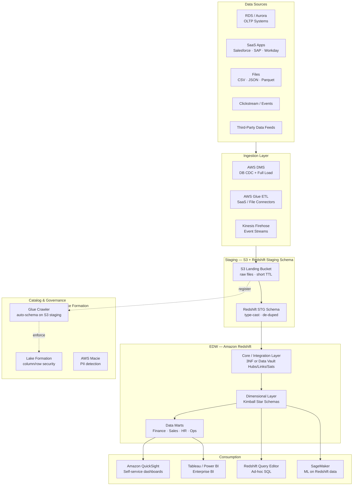
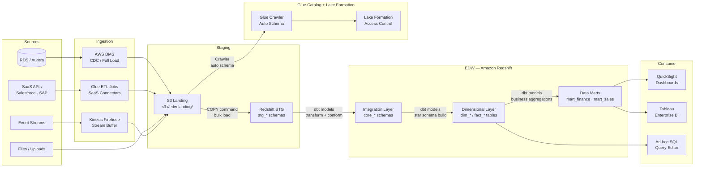
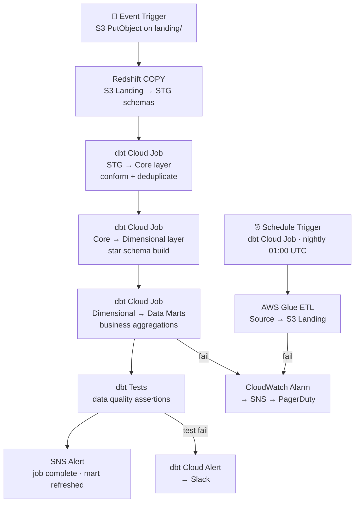

# 1.1 — Enterprise Data Warehouse · AWS Fully Managed

**Stack:** Redshift · AWS Glue · dbt Cloud · QuickSight · Tableau
**Processing:** Batch-first · Schema-on-Write
**Buy vs Build:** Buy (fully managed, no infra to operate)

---

## Architecture Overview



---

## Data Flow



---

## Zone Design

```
Redshift Database: edw_prod
│
├── stg_{source}/             -- Staging schemas (raw ingest, minimal transform)
│   ├── stg_salesforce__accounts
│   ├── stg_rds__orders
│   └── stg_sap__gl_entries
│
├── core/                     -- Integration layer (3NF or Data Vault)
│   ├── hub_customer
│   ├── hub_product
│   ├── lnk_order_customer
│   └── sat_customer_details
│
├── mart_finance/             -- Finance data mart
│   ├── dim_date
│   ├── dim_cost_center
│   └── fact_gl_transactions
│
├── mart_sales/               -- Sales data mart
│   ├── dim_customer
│   ├── dim_product
│   └── fact_orders
│
└── mart_hr/                  -- HR data mart
    ├── dim_employee
    └── fact_headcount

S3: s3://<company>-edw-landing/
└── {source}/{table}/year=YYYY/month=MM/day=DD/
    └── raw files as-received (CSV, JSON, Parquet)
```

---

## Security Model

```
┌──────────────────────────────────────────────────────────┐
│         Redshift + Lake Formation Access Control          │
│                                                           │
│  IAM / DB Role      Access Level        Schema Scope      │
│  ────────────────   ────────────        ─────────────     │
│  data-engineer      Read + Write        All schemas       │
│  dbt-runner         Read + Write        stg + core + mart │
│  bi-analyst         Read only           mart_* only       │
│  finance-analyst    Read only           mart_finance       │
│  sales-analyst      Read only           mart_sales         │
│  data-scientist     Read only           core + mart_*      │
│  redshift-admin     Full admin          All               │
│                                                           │
│  Column masking  → PII via Lake Formation (S3 layer)      │
│  Row filtering   → Redshift RLS policies per role         │
│  Encryption      → AWS KMS (SSE-KMS) + Redshift TDE       │
│  AWS Macie       → PII auto-tag on S3 landing             │
└──────────────────────────────────────────────────────────┘
```

---

## Orchestration



---

## Component Map

| Component | AWS Service / Tool | Notes |
|-----------|-------------------|-------|
| Data Warehouse | Amazon Redshift | RA3 nodes with managed storage; auto WLM |
| DB Ingestion | AWS DMS | Full load + CDC from RDS/Oracle/SQL Server |
| SaaS Ingestion | AWS Glue ETL | Built-in Salesforce/SAP connectors |
| Stream Ingestion | Kinesis Firehose | Buffers events → S3 landing in Parquet |
| Staging Storage | Amazon S3 | COPY into Redshift; lifecycle to Glacier |
| Schema Registry | AWS Glue Data Catalog | Hive-compatible; crawls S3 landing |
| Access Control | Lake Formation + Redshift RLS | Column/row security at catalog + DB layers |
| PII Detection | AWS Macie | Auto-classify S3 objects before COPY |
| Transformation | dbt Cloud | Staging → Core → Dimensional → Marts |
| Orchestration | dbt Cloud Jobs + Airflow (MWAA) | dbt native for dbt jobs; MWAA for complex DAGs |
| BI / Dashboards | Amazon QuickSight | SPICE cache + direct Redshift query |
| Enterprise BI | Tableau / Power BI | Direct Redshift connection |
| Encryption | AWS KMS | SSE-KMS on S3 + Redshift TDE |
| Monitoring | CloudWatch + CloudTrail + dbt Cloud | Job metrics + query audit + dbt test results |

---

## Comparison vs 1.2 (AWS OSS)

| Dimension | 1.1 AWS Managed (Buy) | 1.2 AWS OSS (Build) |
|-----------|----------------------|---------------------|
| Warehouse | Redshift (managed) | Redshift + Airbyte OSS connectors |
| Ingestion | AWS DMS + Glue (managed) | Airbyte (self-hosted on EKS) |
| Transform | dbt Cloud (managed) | dbt Core + Airflow (self-managed) |
| Orchestration | dbt Cloud Jobs | Apache Airflow on MWAA |
| BI | QuickSight + Tableau | Apache Superset (self-hosted) |
| Ops burden | Low — AWS manages compute | Medium — manage Airbyte + Airflow |
| Cost model | Higher per-unit, lower ops | Lower per-unit, higher ops cost |
| Connector breadth | AWS ecosystem-first | 300+ Airbyte connectors |

---

## When to Choose This Implementation

✅ AWS is primary cloud
✅ Want zero infrastructure management
✅ Structured reporting and BI are primary workloads
✅ Finance, HR, Sales analytics with strict governance
✅ dbt Cloud manages all transformation logic

❌ Need schema-on-read flexibility → use Pattern 2 (Data Lake)
❌ Need ACID on large-scale unstructured data → use Pattern 3 (Lakehouse)
❌ Sub-second latency required → use Pattern 4 (Streaming)
❌ Budget-constrained; prefer OSS → use 1.2 (AWS OSS)
