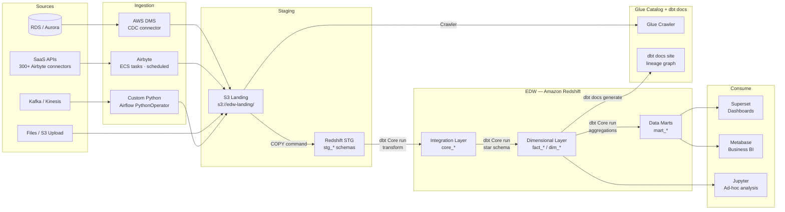
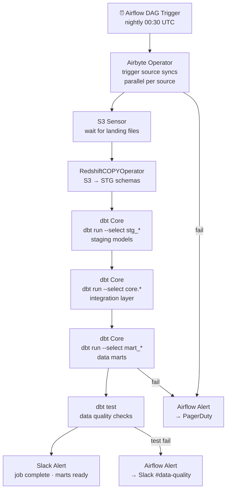

# 1.2 — Enterprise Data Warehouse · AWS OSS on Cloud

**Stack:** Redshift · Airbyte · dbt Core · Apache Airflow (MWAA) · Apache Superset
**Processing:** Batch-first · Schema-on-Write
**Buy vs Build:** Build (OSS tools on AWS managed infrastructure)

---

## Architecture Overview

```mermaid
flowchart TD
    subgraph SRC["Data Sources"]
        S1[RDS / Aurora\nOLTP Systems]
        S2[SaaS Apps\nSalesforce · HubSpot · Stripe]
        S3[Files\nCSV · JSON · Parquet]
        S4[Event Streams\nKafka / Kinesis]
        S5[REST APIs\nThird-Party]
    end

    subgraph INGEST["Ingestion Layer"]
        I1[Airbyte\n300+ source connectors\nECS / EKS hosted]
        I2[AWS DMS\nDB CDC Fast Path]
        I3[Custom Python\nAPI / File ingestion]
    end

    subgraph STAGING["Staging — S3 + Redshift STG"]
        ST1[S3 Landing Bucket\nRaw files · short TTL]
        ST2[Redshift STG Schemas\nstg_{source} · raw copy]
    end

    subgraph EDW["EDW — Amazon Redshift"]
        E1[Integration Layer\ncore_* · Data Vault or 3NF]
        E2[Dimensional Layer\nfact_* · dim_* tables]
        E3[Data Marts\nFinance · Sales · HR · Ops]
    end

    subgraph CATALOG["Catalog & Governance\nApache Atlas / AWS Glue Catalog"]
        C1[Glue Crawler\nS3 schema discovery]
        C2[dbt docs\nlineage + schema docs]
        C3[OpenMetadata\nenterprise catalog]
    end

    subgraph CONSUME["Consumption"]
        F1[Apache Superset\nSelf-service dashboards]
        F2[Jupyter / SageMaker\nML / ad-hoc analysis]
        F3[Redshift Query Editor\nSQL access]
        F4[Metabase\nBusiness user BI]
    end

    SRC --> INGEST
    INGEST --> ST1 --> ST2
    ST2 -->|dbt Core| E1 --> E2 --> E3
    ST1 -. register .-> C1
    C2 -. lineage .-> E2
    E3 --> F1
    E3 --> F4
    E2 --> F2
    E2 --> F3
```

---

## Data Flow



---

## Zone Design

```
Redshift Database: edw_prod
│
├── stg_{source}/             -- Staging schemas (Airbyte raw destination)
│   ├── stg_salesforce__accounts
│   ├── stg_hubspot__contacts
│   └── stg_stripe__charges
│
├── core/                     -- Integration layer (Data Vault 2.0)
│   ├── hub_customer
│   ├── hub_product
│   ├── lnk_order_product
│   └── sat_customer_crm
│
├── mart_finance/             -- Finance data mart
│   ├── dim_date
│   ├── dim_account
│   └── fact_revenue
│
├── mart_sales/               -- Sales data mart
│   ├── dim_customer
│   ├── dim_opportunity
│   └── fact_pipeline
│
└── mart_product/             -- Product data mart
    ├── dim_feature
    └── fact_usage_events

S3: s3://<company>-edw-landing/
└── {source}/{table}/year=YYYY/month=MM/day=DD/
    └── Airbyte raw output (JSON / Parquet)
```

---

## Security Model

```
┌──────────────────────────────────────────────────────────┐
│     Redshift Native RBAC + IAM Role Policies              │
│                                                           │
│  DB Role / IAM         Access Level     Schema Scope      │
│  ──────────────────    ────────────     ─────────────     │
│  data-engineer         Read + Write     All schemas       │
│  dbt-runner (IAM role) Read + Write     stg + core + mart │
│  airbyte-runner        Write only       stg_* schemas     │
│  bi-analyst            Read only        mart_* only       │
│  finance-team          Read only        mart_finance       │
│  data-scientist        Read only        core + mart_*      │
│                                                           │
│  Column masking  → Redshift dynamic data masking          │
│  Row security    → Redshift RLS policies per role         │
│  Encryption      → AWS KMS on S3 + Redshift TDE           │
│  Audit           → CloudTrail + Redshift audit logging    │
└──────────────────────────────────────────────────────────┘
```

---

## Orchestration



---

## Component Map

| Component | Tool / Service | Notes |
|-----------|---------------|-------|
| Data Warehouse | Amazon Redshift | RA3 nodes; Airbyte writes to STG schemas |
| DB Ingestion | AWS DMS | CDC from RDS/Oracle; lands in S3 |
| SaaS Ingestion | Airbyte (ECS/EKS) | 300+ connectors; JSON destination to S3 |
| Staging Storage | Amazon S3 | COPY into Redshift; lifecycle policy to Glacier |
| Transformation | dbt Core | Git-managed models; STG → Core → Marts |
| Orchestration | Apache Airflow (MWAA) | Airbyte + dbt operators; DAG-per-domain |
| Schema Catalog | AWS Glue Data Catalog | S3 schema discovery |
| Lineage / Docs | dbt docs | Auto-generated lineage from dbt manifest |
| Enterprise Catalog | OpenMetadata (optional) | Ingests from dbt + Redshift + Glue |
| BI / Dashboards | Apache Superset | Open-source; deployed on ECS |
| Business BI | Metabase | Self-serve; direct Redshift connection |
| Encryption | AWS KMS | SSE-KMS on S3 + Redshift TDE |
| Monitoring | CloudWatch + Airflow UI | Job metrics + DAG health |

---

## Comparison vs 1.1 (AWS Managed)

| Dimension | 1.2 AWS OSS (Build) | 1.1 AWS Managed (Buy) |
|-----------|---------------------|----------------------|
| Ingestion | Airbyte OSS (self-managed on ECS) | AWS DMS + Glue (fully managed) |
| Connectors | 300+ Airbyte community connectors | AWS DMS sources + Glue built-ins |
| Transformation | dbt Core + Airflow (self-managed) | dbt Cloud (managed SaaS) |
| Orchestration | MWAA / Airflow (semi-managed) | dbt Cloud Jobs (fully managed) |
| BI layer | Superset + Metabase (self-hosted) | QuickSight (managed) + Tableau |
| Ops burden | Medium — manage Airbyte + Superset | Low — AWS manages all services |
| License cost | Lower (OSS) + EC2/ECS runtime | Higher (managed service pricing) |
| Customization | High — full code control | Medium — constrained by managed APIs |

---

## When to Choose This Implementation

✅ AWS is primary cloud
✅ Need 300+ data source connectors (Airbyte breadth)
✅ Team has dbt + Airflow expertise
✅ Cost optimization is a priority over operational simplicity
✅ Need full control over transformation code in Git

❌ Want zero infra management → use 1.1 (AWS Managed)
❌ Need schema-on-read flexibility → use Pattern 2 (Data Lake)
❌ Sub-second latency required → use Pattern 4 (Streaming)
