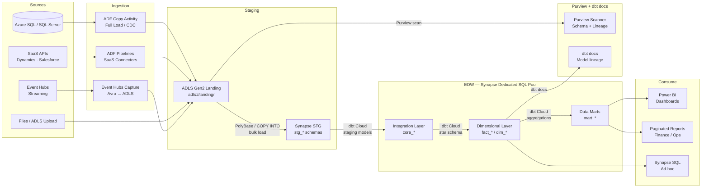
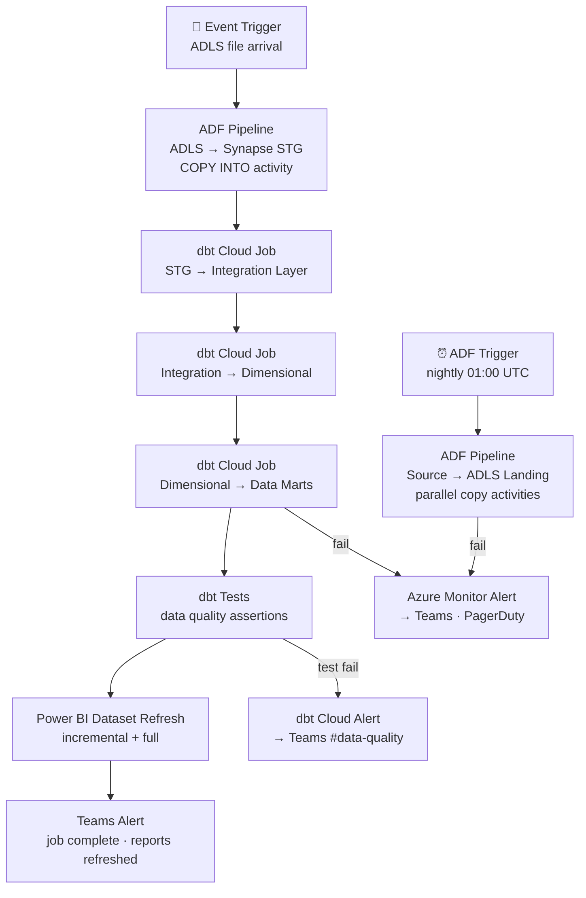

# 1.3 — Enterprise Data Warehouse · Azure Fully Managed

**Stack:** Azure Synapse Analytics · Azure Data Factory · dbt Cloud · Power BI
**Processing:** Batch-first · Schema-on-Write
**Buy vs Build:** Buy (fully managed, no infra to operate)

---

## Architecture Overview

```mermaid
flowchart TD
    subgraph SRC["Data Sources"]
        S1[Azure SQL / SQL Server\nOLTP Systems]
        S2[SaaS Apps\nDynamics 365 · Salesforce · SAP]
        S3[Files\nCSV · JSON · Parquet · Excel]
        S4[Event Streams\nEvent Hubs]
        S5[On-Prem Systems\nvia Self-Hosted IR]
    end

    subgraph INGEST["Ingestion Layer"]
        I1[Azure Data Factory\nPipelines · Copy Activity · CDC]
        I2[ADF Self-Hosted IR\nOn-prem connectivity]
        I3[Event Hubs Capture\nStream → ADLS]
    end

    subgraph STAGING["Staging — ADLS Gen2 + Synapse STG"]
        ST1[ADLS Gen2 Landing\nRaw files · short TTL]
        ST2[Synapse STG Schemas\nstg_{source} · raw copy]
    end

    subgraph EDW["EDW — Azure Synapse Dedicated SQL Pool"]
        E1[Integration Layer\ncore_* · 3NF or Data Vault]
        E2[Dimensional Layer\nfact_* · dim_* tables]
        E3[Data Marts\nFinance · Sales · HR · Ops]
    end

    subgraph CATALOG["Catalog & Governance\nMicrosoft Purview"]
        C1[Purview Scanner\nauto-discovers schema + lineage]
        C2[Purview Policies\ncolumn masking · access control]
        C3[Sensitivity Labels\nMicrosoft Information Protection]
    end

    subgraph CONSUME["Consumption"]
        F1[Power BI Service\nEnterprise dashboards]
        F2[Power BI Premium\nPaginated reports · DirectQuery]
        F3[Synapse SQL\nAd-hoc query]
        F4[Azure ML\nML training on EDW data]
    end

    SRC --> INGEST
    INGEST --> ST1 --> ST2
    ST2 -->|dbt Cloud| E1 --> E2 --> E3
    ST1 -. scan .-> C1
    C1 -. enforce .-> C2
    E3 --> F1
    E3 --> F2
    E2 --> F3
    E2 --> F4
```

---

## Data Flow



---

## Zone Design

```
Synapse Dedicated SQL Pool: edw_prod
│
├── stg_{source}/             -- Staging schemas (ADF raw destination)
│   ├── stg_dynamics__accounts
│   ├── stg_sqlserver__orders
│   └── stg_sap__gl_entries
│
├── core/                     -- Integration layer (3NF or Data Vault)
│   ├── hub_customer
│   ├── hub_product
│   ├── lnk_order_customer
│   └── sat_customer_crm
│
├── mart_finance/             -- Finance data mart
│   ├── dim_date
│   ├── dim_cost_center
│   └── fact_gl_transactions
│
├── mart_sales/               -- Sales data mart
│   ├── dim_customer
│   ├── dim_territory
│   └── fact_opportunities
│
└── mart_hr/                  -- HR data mart
    ├── dim_employee
    └── fact_headcount

ADLS Gen2: abfss://landing@<account>.dfs.core.windows.net/
└── {source}/{table}/year=YYYY/month=MM/day=DD/
    └── raw files as-received (CSV, JSON, Parquet)
```

---

## Security Model

```
┌──────────────────────────────────────────────────────────┐
│     Synapse + Purview + Azure AD Access Control           │
│                                                           │
│  AAD Group / Service Principal  Access Level  Scope       │
│  ──────────────────────────     ────────────  ────────    │
│  data-engineers                 Read+Write    All schemas  │
│  dbt-runner (SP)                Read+Write    stg+core+mart│
│  adf-runner (MI)                Write only    stg_* schemas│
│  bi-analysts                    Read only     mart_* only  │
│  finance-team                   Read only     mart_finance  │
│  data-scientists                Read only     core + mart_*│
│                                                           │
│  Column masking  → Purview data policies + Synapse DDM    │
│  Row security    → Synapse Row-Level Security             │
│  Encryption      → Azure KMS (CMK) + TDE on Synapse       │
│  Audit           → Azure Monitor + Synapse Audit Logs     │
│  PII labeling    → Microsoft Information Protection labels│
└──────────────────────────────────────────────────────────┘
```

---

## Orchestration



---

## Component Map

| Component | Azure Service / Tool | Notes |
|-----------|---------------------|-------|
| Data Warehouse | Azure Synapse Dedicated SQL Pool | DWU-based scaling; PolyBase + COPY INTO |
| DB Ingestion | ADF Copy Activity + CDC | Full load + incremental CDC from Azure SQL |
| SaaS Ingestion | ADF Managed Connectors | Dynamics 365, Salesforce, SAP connectors built-in |
| On-Prem Ingestion | ADF Self-Hosted Integration Runtime | Connects on-prem SQL Server / Oracle |
| Stream Ingestion | Event Hubs Capture | Avro/Parquet → ADLS Gen2 |
| Staging Storage | ADLS Gen2 | PolyBase external tables + COPY INTO Synapse |
| Schema Catalog | Microsoft Purview | Auto-scan + lineage across ADF + Synapse |
| Access Control | Azure AD + Synapse RLS + Purview Policies | AAD groups + column/row security |
| PII Detection | Purview Data Map + MIP Labels | Sensitivity classification on ADLS + Synapse |
| Transformation | dbt Cloud | Git-managed models; STG → Core → Marts |
| Orchestration | ADF Triggers + dbt Cloud Jobs | ADF for ingestion; dbt Cloud for transforms |
| BI / Dashboards | Power BI Service | DirectQuery + Import mode |
| Paginated Reports | Power BI Premium | Pixel-perfect finance/ops reports |
| Encryption | Azure Key Vault (CMK) + TDE | Customer-managed keys on Synapse + ADLS |
| Monitoring | Azure Monitor + Log Analytics | Pipeline metrics + query performance |

---

## Comparison vs 1.4 (Azure OSS)

| Dimension | 1.3 Azure Managed (Buy) | 1.4 Azure OSS (Build) |
|-----------|------------------------|----------------------|
| Warehouse | Synapse Dedicated SQL (managed) | Synapse + Airbyte OSS connectors |
| Ingestion | ADF managed connectors | Airbyte on AKS |
| Transformation | dbt Cloud (managed SaaS) | dbt Core + Airflow on AKS |
| BI layer | Power BI (managed) | Apache Superset (self-hosted) |
| Governance | Microsoft Purview (managed) | OpenMetadata (self-hosted) |
| Ops burden | Low — Azure manages all | Medium — manage Airbyte + Airflow |
| Azure integration | Deep — AAD, Defender, MIP | Partial — IAM only |
| Cost model | Higher per-unit, lower ops | Lower per-unit, higher ops cost |

---

## When to Choose This Implementation

✅ Azure is primary cloud
✅ Microsoft 365 / Teams / Power BI already in use
✅ On-prem SQL Server sources via Self-Hosted IR
✅ SAP or Dynamics 365 are key source systems
✅ Compliance requires Microsoft Purview governance

❌ Need OSS flexibility or cost optimization → use 1.4 (Azure OSS)
❌ Need schema-on-read flexibility → use Pattern 2 (Data Lake)
❌ Sub-second latency required → use Pattern 4 (Streaming)
