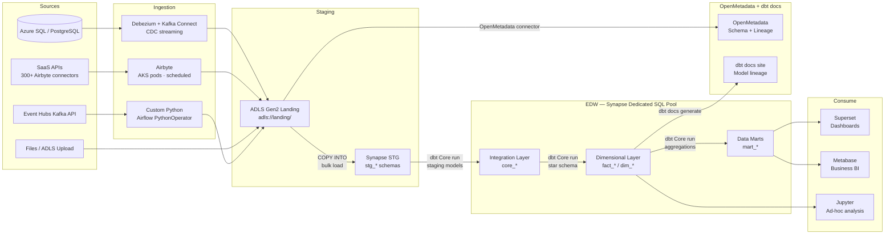
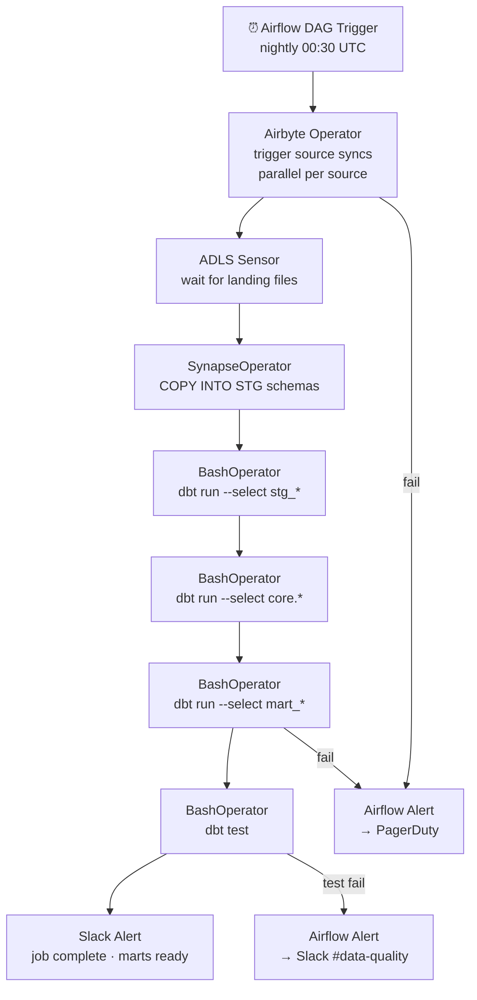

# 1.4 — Enterprise Data Warehouse · Azure OSS on Cloud

**Stack:** Azure Synapse Analytics · Airbyte · dbt Core · Apache Airflow · Apache Superset
**Processing:** Batch-first · Schema-on-Write
**Buy vs Build:** Build (OSS tools on Azure managed infrastructure)

---

## Architecture Overview

```mermaid
flowchart TD
    subgraph SRC["Data Sources"]
        S1[Azure SQL / PostgreSQL\nOLTP Systems]
        S2[SaaS Apps\nSalesforce · HubSpot · Stripe]
        S3[Files\nCSV · JSON · Parquet]
        S4[Event Streams\nEvent Hubs Kafka API]
        S5[REST APIs\nThird-Party]
    end

    subgraph INGEST["Ingestion Layer"]
        I1[Airbyte\n300+ connectors · AKS hosted]
        I2[Debezium / Kafka Connect\nCDC from Postgres/SQL Server]
        I3[Custom Python Workers\nAPI / File ingestion]
    end

    subgraph STAGING["Staging — ADLS Gen2 + Synapse STG"]
        ST1[ADLS Gen2 Landing\nRaw files · short TTL]
        ST2[Synapse STG Schemas\nstg_{source} · raw copy]
    end

    subgraph EDW["EDW — Azure Synapse Dedicated SQL Pool"]
        E1[Integration Layer\ncore_* · Data Vault 2.0]
        E2[Dimensional Layer\nfact_* · dim_* tables]
        E3[Data Marts\nFinance · Sales · HR · Ops]
    end

    subgraph CATALOG["Catalog & Governance\nOpenMetadata + dbt docs"]
        C1[OpenMetadata\nschema discovery + lineage]
        C2[dbt docs\nmodel lineage + column docs]
        C3[Apache Ranger (optional)\ncolumn/row policies]
    end

    subgraph CONSUME["Consumption"]
        F1[Apache Superset\nSelf-service dashboards]
        F2[Jupyter / Azure ML\nML / ad-hoc analysis]
        F3[Synapse SQL\nAd-hoc query]
        F4[Metabase\nBusiness user BI]
    end

    SRC --> INGEST
    INGEST --> ST1 --> ST2
    ST2 -->|dbt Core| E1 --> E2 --> E3
    C1 -. scan .-> ST1
    C2 -. lineage .-> E2
    E3 --> F1
    E3 --> F4
    E2 --> F2
    E2 --> F3
```

---

## Data Flow



---

## Zone Design

```
Synapse Dedicated SQL Pool: edw_prod
│
├── stg_{source}/             -- Staging schemas (Airbyte raw destination)
│   ├── stg_salesforce__accounts
│   ├── stg_hubspot__contacts
│   └── stg_stripe__charges
│
├── core/                     -- Integration layer (Data Vault 2.0)
│   ├── hub_customer
│   ├── hub_product
│   ├── lnk_order_product
│   └── sat_customer_salesforce
│
├── mart_finance/             -- Finance data mart
│   ├── dim_date
│   ├── dim_cost_center
│   └── fact_revenue
│
├── mart_sales/               -- Sales data mart
│   ├── dim_customer
│   ├── dim_territory
│   └── fact_pipeline
│
└── mart_product/             -- Product data mart
    ├── dim_feature
    └── fact_usage_events

ADLS Gen2: abfss://landing@<account>.dfs.core.windows.net/
└── {source}/{table}/year=YYYY/month=MM/day=DD/
    └── Airbyte raw output (JSON / Parquet)
```

---

## Security Model

```
┌──────────────────────────────────────────────────────────┐
│     Synapse Native RBAC + Azure AD + ADLS ACLs            │
│                                                           │
│  AAD Group / SP          Access Level      Schema Scope   │
│  ──────────────────      ────────────      ────────────   │
│  data-engineers          Read + Write      All schemas    │
│  dbt-runner (SP)         Read + Write      stg+core+mart  │
│  airbyte-runner (SP)     Write only        stg_* schemas  │
│  bi-analysts             Read only         mart_* only    │
│  finance-team            Read only         mart_finance    │
│  data-scientists         Read only         core + mart_*  │
│                                                           │
│  Column masking  → Synapse Dynamic Data Masking           │
│  Row security    → Synapse Row-Level Security             │
│  Encryption      → Azure Key Vault + ADLS encryption      │
│  Audit           → Azure Monitor + Synapse Audit Logs     │
└──────────────────────────────────────────────────────────┘
```

---

## Orchestration



---

## Component Map

| Component | Tool / Azure Service | Notes |
|-----------|---------------------|-------|
| Data Warehouse | Azure Synapse Dedicated SQL Pool | COPY INTO from ADLS; DWU scaling |
| DB Ingestion | Debezium + Kafka Connect on AKS | CDC from PostgreSQL / SQL Server |
| SaaS Ingestion | Airbyte (AKS) | 300+ connectors; Parquet destination to ADLS |
| Staging Storage | ADLS Gen2 | COPY INTO Synapse; lifecycle to Cool tier |
| Transformation | dbt Core | Git-managed; STG → Core → Marts |
| Orchestration | Apache Airflow (AKS) | Airbyte + dbt operators; DAG-per-domain |
| Schema Catalog | OpenMetadata (AKS) | Ingests from dbt + Synapse + ADLS |
| Lineage / Docs | dbt docs | Auto-generated from dbt manifest |
| BI / Dashboards | Apache Superset (AKS) | Open-source; direct Synapse connection |
| Business BI | Metabase (AKS) | Self-serve; direct Synapse connection |
| Encryption | Azure Key Vault | CMK on ADLS + Synapse TDE |
| Monitoring | Azure Monitor + Airflow UI | Pipeline metrics + DAG health |

---

## Comparison vs 1.3 (Azure Managed)

| Dimension | 1.4 Azure OSS (Build) | 1.3 Azure Managed (Buy) |
|-----------|----------------------|------------------------|
| Ingestion | Airbyte OSS on AKS | ADF managed connectors |
| Transformation | dbt Core + Airflow on AKS | dbt Cloud (managed SaaS) |
| BI layer | Superset + Metabase (self-hosted) | Power BI (managed) |
| Governance | OpenMetadata (self-hosted) | Microsoft Purview (managed) |
| Ops burden | Medium — manage Airbyte + Airflow + Superset | Low — Azure manages all |
| License cost | Lower (OSS) + AKS runtime | Higher (managed service pricing) |
| Connector breadth | 300+ Airbyte connectors | ADF ~100 managed connectors |
| Azure AD integration | Partial | Deep — AAD groups, Defender, MIP |

---

## When to Choose This Implementation

✅ Azure is primary cloud
✅ Need 300+ data source connectors (Airbyte breadth)
✅ Team has dbt + Airflow expertise
✅ Cost optimization over operational simplicity
✅ Want full OSS stack with no vendor lock-in

❌ Want zero infra management → use 1.3 (Azure Managed)
❌ Microsoft Power BI is a hard requirement → use 1.3
❌ Sub-second latency required → use Pattern 4 (Streaming)
