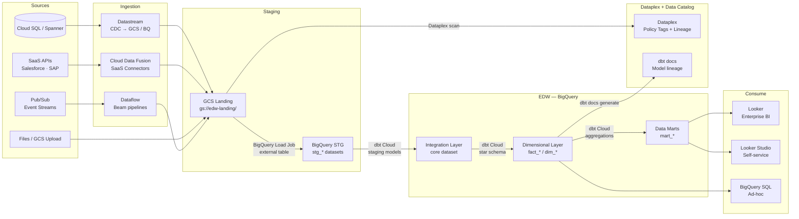
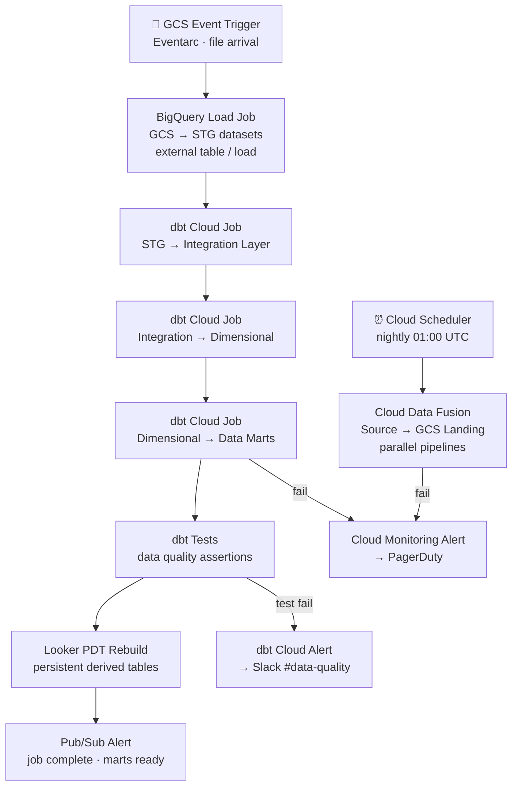

# 1.5 — Enterprise Data Warehouse · GCP Fully Managed

**Stack:** BigQuery · Datastream · dbt Cloud · Looker
**Processing:** Batch-first · Schema-on-Write
**Buy vs Build:** Buy (fully managed, no infra to operate)

---

## Architecture Overview

```mermaid
flowchart TD
    subgraph SRC["Data Sources"]
        S1[Cloud SQL / Spanner\nOLTP Systems]
        S2[SaaS Apps\nSalesforce · SAP · Workday]
        S3[Files\nCSV · JSON · Parquet · Avro]
        S4[Event Streams\nPub/Sub]
        S5[On-Prem / Hybrid\nvia Datastream]
    end

    subgraph INGEST["Ingestion Layer"]
        I1[Datastream\nDB CDC → GCS · BigQuery]
        I2[Cloud Data Fusion\nSaaS / File Pipelines]
        I3[Pub/Sub + Dataflow\nEvent Streams]
    end

    subgraph STAGING["Staging — GCS + BigQuery STG"]
        ST1[GCS Landing Bucket\nRaw files · short TTL]
        ST2[BigQuery STG Dataset\nstg_{source} · raw tables]
    end

    subgraph EDW["EDW — BigQuery"]
        E1[Integration Layer\ncore dataset · 3NF or Data Vault]
        E2[Dimensional Layer\nfact_* · dim_* tables]
        E3[Data Marts\nFinance · Sales · HR · Ops]
    end

    subgraph CATALOG["Catalog & Governance\nData Catalog + Dataplex"]
        C1[Dataplex\nauto-schema + policy tags]
        C2[Data Catalog\ndiscovery + lineage]
        C3[DLP API\nPII detection + masking]
    end

    subgraph CONSUME["Consumption"]
        F1[Looker\nEnterprise BI + LookML semantic layer]
        F2[Looker Studio\nSelf-service dashboards]
        F3[BigQuery SQL\nAd-hoc query]
        F4[Vertex AI\nML training on BQ data]
    end

    SRC --> INGEST
    INGEST --> ST1 --> ST2
    ST2 -->|dbt Cloud| E1 --> E2 --> E3
    ST1 -. scan .-> C1
    C1 -. policy tags .-> C2
    E3 --> F1
    E3 --> F2
    E2 --> F3
    E2 --> F4
```

---

## Data Flow



---

## Zone Design

```
BigQuery Project: edw-prod
│
├── stg_{source}/             -- Staging datasets (Datastream / Data Fusion raw destination)
│   ├── stg_salesforce__accounts
│   ├── stg_cloudsql__orders
│   └── stg_sap__gl_entries
│
├── core/                     -- Integration dataset (3NF or Data Vault)
│   ├── hub_customer
│   ├── hub_product
│   ├── lnk_order_customer
│   └── sat_customer_crm
│
├── mart_finance/             -- Finance data mart
│   ├── dim_date
│   ├── dim_cost_center
│   └── fact_gl_transactions
│
├── mart_sales/               -- Sales data mart
│   ├── dim_customer
│   ├── dim_territory
│   └── fact_opportunities
│
└── mart_hr/                  -- HR data mart
    ├── dim_employee
    └── fact_headcount

GCS: gs://<company>-edw-landing/
└── {source}/{table}/year=YYYY/month=MM/day=DD/
    └── raw files as-received (CSV, JSON, Avro, Parquet)
```

---

## Security Model

```
┌──────────────────────────────────────────────────────────┐
│     BigQuery IAM + Dataplex Policy Tags                   │
│                                                           │
│  IAM / Google Group        Access Level    Dataset Scope  │
│  ─────────────────────     ────────────    ───────────    │
│  data-engineers@           Read + Write    All datasets   │
│  dbt-runner (SA)           Read + Write    stg+core+mart  │
│  datastream-runner (SA)    Write only      stg_* datasets │
│  bi-analysts@              Read only       mart_* only    │
│  finance-team@             Read only       mart_finance    │
│  data-scientists@          Read only       core + mart_*  │
│                                                           │
│  Column masking  → BigQuery column-level security + DLP   │
│  Row security    → BigQuery row-level access policies     │
│  Encryption      → CMEK (Cloud KMS) on BQ + GCS          │
│  PII detection   → Cloud DLP auto-classify GCS + BQ       │
│  Audit           → Cloud Audit Logs + BQ audit views      │
└──────────────────────────────────────────────────────────┘
```

---

## Orchestration



---

## Component Map

| Component | GCP Service / Tool | Notes |
|-----------|-------------------|-------|
| Data Warehouse | BigQuery | Serverless; per-query or slot-based pricing |
| DB Ingestion | Datastream | CDC from Cloud SQL, Oracle, PostgreSQL, MySQL |
| SaaS Ingestion | Cloud Data Fusion | Managed Spark pipelines; 200+ connectors |
| Stream Ingestion | Pub/Sub + Dataflow | Beam pipeline; streaming insert or GCS sink |
| Staging Storage | GCS | Load jobs to BigQuery; lifecycle to Nearline |
| Schema Catalog | Google Data Catalog | Auto-discovery of BQ + GCS schemas |
| Governance | Dataplex | Policy tags, data zones, quality scans |
| PII Detection | Cloud DLP API | Auto-classify + mask PII in GCS + BQ |
| Transformation | dbt Cloud | Git-managed; STG → Core → Marts |
| Orchestration | Cloud Composer (Airflow) + dbt Cloud | Composer for ingestion; dbt Cloud for transforms |
| Semantic Layer | Looker LookML | Metrics, dimensions, explore definitions |
| BI / Dashboards | Looker + Looker Studio | Looker for governed BI; Studio for self-serve |
| ML Consumption | Vertex AI | BigQuery ML + Vertex Pipelines on mart data |
| Encryption | Cloud KMS (CMEK) | Customer-managed keys on BQ + GCS |
| Monitoring | Cloud Monitoring + Cloud Audit Logs | Pipeline SLOs + data access audit |

---

## Comparison vs 1.6 (GCP OSS)

| Dimension | 1.5 GCP Managed (Buy) | 1.6 GCP OSS (Build) |
|-----------|----------------------|---------------------|
| Warehouse | BigQuery (serverless) | BigQuery + Airbyte connectors |
| Ingestion | Datastream + Data Fusion (managed) | Airbyte on GKE |
| Transformation | dbt Cloud (managed SaaS) | dbt Core + Airflow on Composer/GKE |
| BI layer | Looker + Looker Studio | Apache Superset (self-hosted) |
| Semantic layer | Looker LookML (managed) | Cube.js (self-hosted) |
| Ops burden | Low — GCP manages all | Medium — manage Airbyte + Superset |
| Cost model | Higher per-unit, lower ops | Lower per-unit, higher ops cost |
| GCP integration | Deep — Data Catalog, DLP, Dataplex | Partial — IAM + GCS only |

---

## When to Choose This Implementation

✅ GCP is primary cloud
✅ BigQuery is already the primary analytical store
✅ Looker / LookML semantic layer is a requirement
✅ Serverless economics preferred over reserved capacity
✅ Datastream CDC from Cloud SQL or Oracle sources

❌ Need OSS flexibility or cost optimization → use 1.6 (GCP OSS)
❌ Need schema-on-read flexibility → use Pattern 2 (Data Lake)
❌ Sub-second latency required → use Pattern 4 (Streaming)
