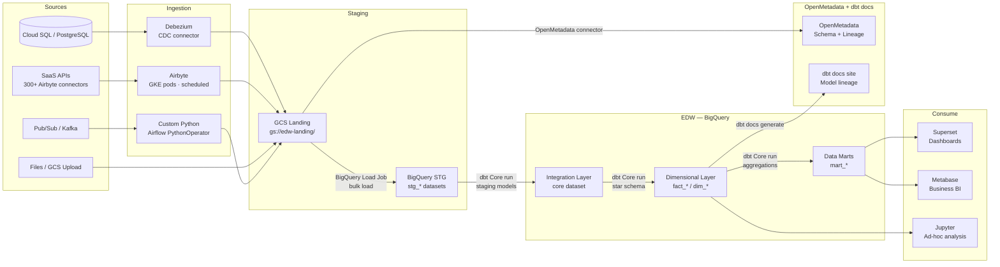
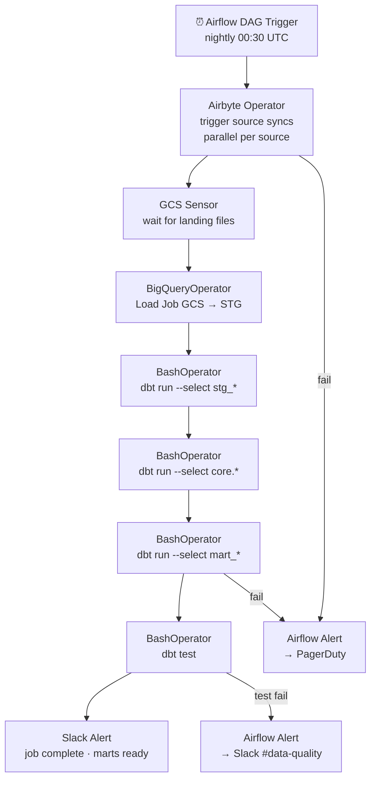

# 1.6 — Enterprise Data Warehouse · GCP OSS on Cloud

**Stack:** BigQuery · Airbyte · dbt Core · Apache Airflow (Cloud Composer) · Apache Superset
**Processing:** Batch-first · Schema-on-Write
**Buy vs Build:** Build (OSS tools on GCP managed infrastructure)

---

## Architecture Overview

```mermaid
flowchart TD
    subgraph SRC["Data Sources"]
        S1[Cloud SQL / PostgreSQL\nOLTP Systems]
        S2[SaaS Apps\nSalesforce · HubSpot · Stripe]
        S3[Files\nCSV · JSON · Parquet]
        S4[Event Streams\nPub/Sub · Kafka]
        S5[REST APIs\nThird-Party]
    end

    subgraph INGEST["Ingestion Layer"]
        I1[Airbyte\n300+ connectors · GKE hosted]
        I2[Debezium + Kafka Connect\nCDC from Postgres]
        I3[Custom Python Workers\nAPI / File ingestion]
    end

    subgraph STAGING["Staging — GCS + BigQuery STG"]
        ST1[GCS Landing Bucket\nRaw files · short TTL]
        ST2[BigQuery STG Datasets\nstg_{source} · raw tables]
    end

    subgraph EDW["EDW — BigQuery"]
        E1[Integration Layer\ncore dataset · Data Vault 2.0]
        E2[Dimensional Layer\nfact_* · dim_* tables]
        E3[Data Marts\nFinance · Sales · HR · Ops]
    end

    subgraph CATALOG["Catalog & Governance\nOpenMetadata + dbt docs"]
        C1[OpenMetadata\nschema discovery + lineage]
        C2[dbt docs\nmodel lineage + column docs]
    end

    subgraph CONSUME["Consumption"]
        F1[Apache Superset\nSelf-service dashboards]
        F2[Jupyter / Vertex AI\nML / ad-hoc analysis]
        F3[BigQuery SQL\nAd-hoc query]
        F4[Metabase\nBusiness user BI]
    end

    SRC --> INGEST
    INGEST --> ST1 --> ST2
    ST2 -->|dbt Core| E1 --> E2 --> E3
    C1 -. scan .-> ST1
    C2 -. lineage .-> E2
    E3 --> F1
    E3 --> F4
    E2 --> F2
    E2 --> F3
```

---

## Data Flow



---

## Zone Design

```
BigQuery Project: edw-prod
│
├── stg_{source}/             -- Staging datasets (Airbyte raw destination)
│   ├── stg_salesforce__accounts
│   ├── stg_hubspot__contacts
│   └── stg_stripe__charges
│
├── core/                     -- Integration dataset (Data Vault 2.0)
│   ├── hub_customer
│   ├── hub_product
│   ├── lnk_order_product
│   └── sat_customer_salesforce
│
├── mart_finance/             -- Finance data mart
│   ├── dim_date
│   ├── dim_account
│   └── fact_revenue
│
├── mart_sales/               -- Sales data mart
│   ├── dim_customer
│   ├── dim_opportunity
│   └── fact_pipeline
│
└── mart_product/             -- Product data mart
    ├── dim_feature
    └── fact_usage_events

GCS: gs://<company>-edw-landing/
└── {source}/{table}/year=YYYY/month=MM/day=DD/
    └── Airbyte raw output (JSON / Parquet)
```

---

## Security Model

```
┌──────────────────────────────────────────────────────────┐
│     BigQuery IAM + Column-Level Security                  │
│                                                           │
│  IAM / Google Group        Access Level    Dataset Scope  │
│  ─────────────────────     ────────────    ───────────    │
│  data-engineers@           Read + Write    All datasets   │
│  dbt-runner (SA)           Read + Write    stg+core+mart  │
│  airbyte-runner (SA)       Write only      stg_* datasets │
│  bi-analysts@              Read only       mart_* only    │
│  finance-team@             Read only       mart_finance    │
│  data-scientists@          Read only       core + mart_*  │
│                                                           │
│  Column masking  → BigQuery column-level access policy    │
│  Row security    → BigQuery row-level access policies     │
│  Encryption      → CMEK (Cloud KMS) on BQ + GCS          │
│  Audit           → Cloud Audit Logs + BQ audit views      │
└──────────────────────────────────────────────────────────┘
```

---

## Orchestration



---

## Component Map

| Component | Tool / GCP Service | Notes |
|-----------|-------------------|-------|
| Data Warehouse | BigQuery | Serverless; on-demand or flat-rate slots |
| DB Ingestion | Debezium + Kafka Connect on GKE | CDC from PostgreSQL / MySQL |
| SaaS Ingestion | Airbyte (GKE) | 300+ connectors; Parquet destination to GCS |
| Staging Storage | GCS | Load jobs to BigQuery; lifecycle to Nearline |
| Transformation | dbt Core | Git-managed; STG → Core → Marts |
| Orchestration | Cloud Composer (Airflow) | Managed Airflow; Airbyte + dbt operators |
| Schema Catalog | OpenMetadata (GKE) | Ingests from dbt + BigQuery + GCS |
| Lineage / Docs | dbt docs | Auto-generated from dbt manifest |
| BI / Dashboards | Apache Superset (GKE) | Open-source; BigQuery connector |
| Business BI | Metabase (GKE) | Self-serve; BigQuery connection |
| Encryption | Cloud KMS (CMEK) | CMK on GCS + BigQuery |
| Monitoring | Cloud Monitoring + Airflow UI | Pipeline metrics + DAG health |

---

## Comparison vs 1.5 (GCP Managed)

| Dimension | 1.6 GCP OSS (Build) | 1.5 GCP Managed (Buy) |
|-----------|---------------------|----------------------|
| Ingestion | Airbyte OSS on GKE | Datastream + Data Fusion (managed) |
| Transformation | dbt Core + Airflow (Cloud Composer) | dbt Cloud (managed SaaS) |
| BI layer | Superset + Metabase (self-hosted) | Looker + Looker Studio (managed) |
| Semantic layer | None / Cube.js optional | Looker LookML (managed) |
| Governance | OpenMetadata (self-hosted) | Dataplex + Data Catalog (managed) |
| Ops burden | Medium — manage Airbyte + Superset | Low — GCP manages all |
| License cost | Lower (OSS) + GKE runtime | Higher (managed service pricing) |
| Connector breadth | 300+ Airbyte connectors | ~150 Data Fusion connectors |

---

## When to Choose This Implementation

✅ GCP is primary cloud with BigQuery as warehouse
✅ Need 300+ data source connectors (Airbyte breadth)
✅ Team has dbt + Airflow expertise
✅ Cost optimization over operational simplicity
✅ Want full OSS stack; Looker not required

❌ Want zero infra management → use 1.5 (GCP Managed)
❌ Looker LookML is a requirement → use 1.5
❌ Sub-second latency required → use Pattern 4 (Streaming)
