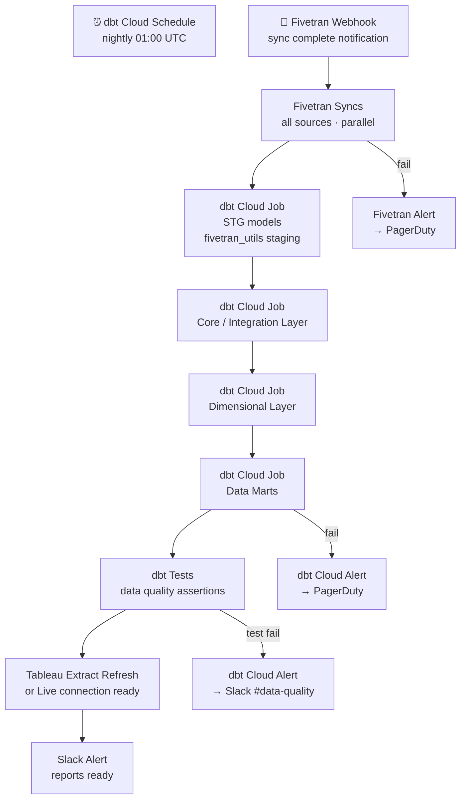

# 1.7 — Enterprise Data Warehouse · Multi-Cloud Fully Managed

**Stack:** Snowflake · Fivetran · dbt Cloud · Tableau
**Processing:** Batch-first · Schema-on-Write
**Buy vs Build:** Buy (fully managed SaaS, cloud-portable)

---

## Architecture Overview

```mermaid
flowchart TD
    subgraph SRC["Data Sources (Any Cloud / On-Prem)"]
        S1[RDBMS\nPostgres · MySQL · Oracle · SQL Server]
        S2[SaaS Apps\nSalesforce · Marketo · NetSuite · Zendesk]
        S3[Files\nCSV · JSON · Parquet · Avro]
        S4[Event Streams\nKafka · Kinesis · Event Hubs]
        S5[Cloud Data\nS3 · ADLS · GCS]
    end

    subgraph INGEST["Ingestion Layer"]
        I1[Fivetran\n500+ managed connectors\nfully-hosted sync engine]
        I2[Fivetran HVR\nhigh-volume DB replication]
        I3[Snowpipe\nauto-ingest from cloud storage]
    end

    subgraph STAGING["Staging — Snowflake STG"]
        ST1[Snowflake STG Schema\nstg_{source} · raw tables]
        ST2[Snowflake Internal Stage\ntemp file buffer]
    end

    subgraph EDW["EDW — Snowflake"]
        E1[Integration Layer\ncore schema · 3NF or Data Vault]
        E2[Dimensional Layer\nfact_* · dim_* tables]
        E3[Data Marts\nFinance · Sales · HR · Ops]
    end

    subgraph CATALOG["Catalog & Governance\nSnowflake Access Control + Alation / Collibra"]
        C1[Alation / Collibra\nenterprise data catalog]
        C2[Snowflake RBAC\nrole-based access control]
        C3[Snowflake Dynamic Masking\nPII policies]
    end

    subgraph CONSUME["Consumption"]
        F1[Tableau\nEnterprise BI + Live connection]
        F2[Tableau Server\nPublished dashboards]
        F3[Snowflake Snowsight\nAd-hoc SQL]
        F4[Any Cloud ML\nSageMaker · Vertex · Azure ML]
    end

    SRC --> INGEST
    INGEST --> ST1
    ST2 --> ST1
    ST1 -->|dbt Cloud| E1 --> E2 --> E3
    C1 -. catalog .-> E2
    C2 -. RBAC .-> E3
    E3 --> F1
    E3 --> F2
    E2 --> F3
    E2 --> F4
```

---

## Data Flow

```mermaid
flowchart LR
    subgraph Sources
        A1[(Any RDBMS\nPostgres · MySQL · Oracle)]
        A2[SaaS\nSalesforce · NetSuite · HubSpot]
        A3[Files\nS3 · ADLS · GCS]
        A4[Events\nKafka · Kinesis]
    end

    subgraph Ingestion
        B1[Fivetran\nmanaged sync engine]
        B2[Fivetran HVR\nhigh-volume CDC]
        B3[Snowpipe\nauto-ingest]
    end

    subgraph Staging["Staging — Snowflake"]
        C1[STG Schema\nstg_{source} raw tables]
    end

    subgraph EDW_Layers["EDW — Snowflake"]
        D1[Integration Layer\ncore schema]
        D2[Dimensional Layer\nfact_* / dim_*]
        D3[Data Marts\nmart_*]
    end

    subgraph Catalog["Alation / Collibra + dbt docs"]
        E1[Enterprise Catalog\nlineage + glossary]
        E2[dbt docs\nmodel lineage]
    end

    subgraph Consume
        F1[Tableau\nEnterprise BI]
        F2[Snowsight\nAd-hoc SQL]
        F3[Cloud ML\ntraining data]
    end

    A1 --> B2 --> C1
    A2 --> B1 --> C1
    A3 --> B3 --> C1
    A4 --> B1 --> C1

    C1 -->|dbt Cloud\nstaging models| D1
    D1 -->|dbt Cloud\nstar schema| D2
    D2 -->|dbt Cloud\naggregations| D3

    D2 -->|catalog ingestion| E1
    D2 -->|dbt docs generate| E2

    D3 --> F1
    D2 --> F2
    D2 --> F3
```

---

## Zone Design

```
Snowflake Database: EDW_PROD
│
├── STG_{SOURCE}/             -- Staging schemas (Fivetran raw destination)
│   ├── STG_SALESFORCE__ACCOUNTS
│   ├── STG_NETSUITE__TRANSACTIONS
│   └── STG_POSTGRES__ORDERS
│
├── CORE/                     -- Integration schema (Data Vault 2.0)
│   ├── HUB_CUSTOMER
│   ├── HUB_PRODUCT
│   ├── LNK_ORDER_PRODUCT
│   └── SAT_CUSTOMER_CRM
│
├── MART_FINANCE/             -- Finance data mart
│   ├── DIM_DATE
│   ├── DIM_COST_CENTER
│   └── FACT_GL_TRANSACTIONS
│
├── MART_SALES/               -- Sales data mart
│   ├── DIM_CUSTOMER
│   ├── DIM_TERRITORY
│   └── FACT_OPPORTUNITIES
│
└── MART_HR/                  -- HR data mart
    ├── DIM_EMPLOYEE
    └── FACT_HEADCOUNT

Snowflake Internal Stage: @EDW_PROD.PUBLIC.%{table}
└── temp buffer for Snowpipe auto-ingest from cloud storage
```

---

## Security Model

```
┌──────────────────────────────────────────────────────────┐
│     Snowflake RBAC + Dynamic Data Masking                 │
│                                                           │
│  Role                   Access Level     Schema Scope     │
│  ───────────────────    ────────────     ─────────────    │
│  DATA_ENGINEER          Read + Write     All schemas      │
│  DBT_RUNNER             Read + Write     STG + CORE + MART│
│  FIVETRAN_LOADER        Write only       STG_* schemas    │
│  BI_ANALYST             Read only        MART_* only      │
│  FINANCE_TEAM           Read only        MART_FINANCE      │
│  DATA_SCIENTIST         Read only        CORE + MART_*    │
│  SYSADMIN               Full admin       All              │
│                                                           │
│  Column masking  → Snowflake Dynamic Data Masking policies│
│  Row security    → Snowflake Row Access Policies          │
│  Encryption      → Tri-Secret Secure (customer-managed)   │
│  Network policy  → IP allowlist per role                  │
│  Audit           → Snowflake ACCESS_HISTORY view          │
└──────────────────────────────────────────────────────────┘
```

---

## Orchestration



---

## Component Map

| Component | Tool / Service | Notes |
|-----------|---------------|-------|
| Data Warehouse | Snowflake | Multi-cloud (AWS/Azure/GCP); virtual warehouses auto-scale |
| DB Ingestion | Fivetran HVR | High-volume CDC; zero-latency replication |
| SaaS Ingestion | Fivetran | 500+ managed connectors; auto-schema migration |
| Cloud Storage Ingest | Snowpipe | Auto-ingest from S3/ADLS/GCS via event notifications |
| Transformation | dbt Cloud | fivetran_utils + dbt_utils packages; full lineage |
| Orchestration | dbt Cloud Jobs + Fivetran Webhooks | Fivetran triggers dbt on sync complete |
| Enterprise Catalog | Alation or Collibra | Full lineage from Fivetran → dbt → Snowflake |
| Access Control | Snowflake RBAC + Row/Column Policies | Native; no separate IAM service needed |
| BI / Dashboards | Tableau (Live or Extract) | Tableau Server / Cloud; Snowflake connector |
| Monitoring | Snowflake Query History + dbt Cloud | Query cost + dbt test results |
| Encryption | Snowflake Tri-Secret Secure | Customer-managed key in cloud KMS |

---

## Comparison vs 1.8 (Multi-Cloud OSS)

| Dimension | 1.7 Multi-Cloud Managed (Buy) | 1.8 Multi-Cloud OSS (Build) |
|-----------|------------------------------|----------------------------|
| Warehouse | Snowflake (same) | Snowflake (same) |
| Ingestion | Fivetran (500+ managed) | Airbyte OSS (300+ connectors) |
| Transformation | dbt Cloud (managed SaaS) | dbt Core + Airflow (self-managed) |
| BI layer | Tableau (managed SaaS) | Metabase (self-hosted) |
| Catalog | Alation / Collibra (enterprise SaaS) | OpenMetadata (self-hosted) |
| Ops burden | Very low — Fivetran + dbt Cloud | Medium — manage Airbyte + Airflow |
| License cost | Highest (Fivetran + dbt Cloud + Tableau) | Lower (OSS) + runtime costs |
| Schema drift handling | Fivetran auto-handles schema changes | Manual Airbyte config updates |

---

## When to Choose This Implementation

✅ Multi-cloud or cloud-agnostic requirement
✅ Snowflake already mandated or preferred
✅ Want zero connector maintenance (Fivetran manages schema drift)
✅ Tableau is the enterprise BI standard
✅ Minimizing engineering ops is the top priority

❌ Budget-constrained; OSS preferred → use 1.8 (Multi-Cloud OSS)
❌ Need schema-on-read flexibility → use Pattern 2 (Data Lake)
❌ Sub-second latency required → use Pattern 4 (Streaming)
