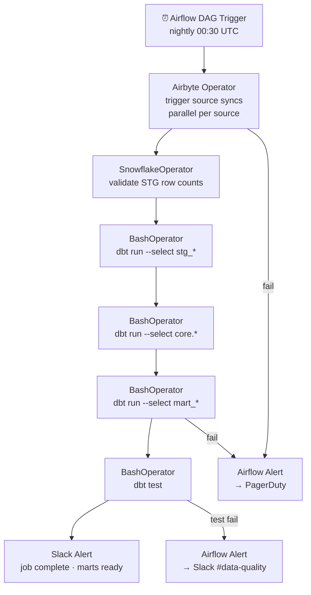

# 1.8 — Enterprise Data Warehouse · Multi-Cloud OSS on Cloud

**Stack:** Snowflake · Airbyte · dbt Core · Apache Airflow · Metabase
**Processing:** Batch-first · Schema-on-Write
**Buy vs Build:** Build (OSS tools; Snowflake as the portable warehouse)

---

## Architecture Overview

```mermaid
flowchart TD
    subgraph SRC["Data Sources (Any Cloud / On-Prem)"]
        S1[RDBMS\nPostgres · MySQL · Oracle · SQL Server]
        S2[SaaS Apps\nSalesforce · HubSpot · Stripe · Zendesk]
        S3[Files\nCSV · JSON · Parquet]
        S4[Event Streams\nKafka · Kinesis · Pub/Sub]
        S5[Cloud Storage\nS3 · ADLS · GCS]
    end

    subgraph INGEST["Ingestion Layer"]
        I1[Airbyte\n300+ OSS connectors\nKubernetes hosted]
        I2[Debezium + Kafka Connect\nCDC from Postgres/MySQL]
        I3[Snowpipe\nauto-ingest from cloud storage]
    end

    subgraph STAGING["Staging — Snowflake STG"]
        ST1[Snowflake STG Schema\nstg_{source} · raw tables]
        ST2[Cloud Object Storage\nS3 / ADLS / GCS stage]
    end

    subgraph EDW["EDW — Snowflake"]
        E1[Integration Layer\ncore schema · Data Vault 2.0]
        E2[Dimensional Layer\nfact_* · dim_* tables]
        E3[Data Marts\nFinance · Sales · HR · Ops]
    end

    subgraph CATALOG["Catalog & Governance\nOpenMetadata + dbt docs"]
        C1[OpenMetadata\nschema discovery + lineage]
        C2[dbt docs\nmodel lineage + column docs]
    end

    subgraph CONSUME["Consumption"]
        F1[Metabase\nSelf-service BI]
        F2[Apache Superset\nAdvanced dashboards]
        F3[Snowflake Snowsight\nAd-hoc SQL]
        F4[Jupyter / MLflow\nML / ad-hoc analysis]
    end

    SRC --> INGEST
    INGEST --> ST1
    ST2 --> ST1
    ST1 -->|dbt Core| E1 --> E2 --> E3
    C1 -. scan .-> ST1
    C2 -. lineage .-> E2
    E3 --> F1
    E3 --> F2
    E2 --> F3
    E2 --> F4
```

---

## Data Flow

```mermaid
flowchart LR
    subgraph Sources
        A1[(Any RDBMS)]
        A2[SaaS APIs\n300+ Airbyte connectors]
        A3[Cloud Storage\nS3 · ADLS · GCS]
        A4[Events\nKafka · Kinesis]
    end

    subgraph Ingestion
        B1[Airbyte\nK8s pods · scheduled]
        B2[Debezium\nCDC streaming]
        B3[Snowpipe\nauto-ingest]
    end

    subgraph Staging["Staging — Snowflake"]
        C1[STG Schema\nstg_{source} raw tables]
    end

    subgraph EDW_Layers["EDW — Snowflake"]
        D1[Integration Layer\ncore schema]
        D2[Dimensional Layer\nfact_* / dim_*]
        D3[Data Marts\nmart_*]
    end

    subgraph Catalog["OpenMetadata + dbt docs"]
        E1[OpenMetadata\nSchema + Lineage]
        E2[dbt docs site\nModel lineage]
    end

    subgraph Consume
        F1[Metabase\nBusiness BI]
        F2[Superset\nDashboards]
        F3[Snowsight\nAd-hoc SQL]
    end

    A1 --> B2 --> C1
    A2 --> B1 --> C1
    A3 --> B3 --> C1
    A4 --> B1 --> C1

    C1 -->|dbt Core run\nstaging models| D1
    D1 -->|dbt Core run\nstar schema| D2
    D2 -->|dbt Core run\naggregations| D3

    D2 -->|OpenMetadata connector| E1
    D2 -->|dbt docs generate| E2

    D3 --> F1
    D3 --> F2
    D2 --> F3
```

---

## Zone Design

```
Snowflake Database: EDW_PROD
│
├── STG_{SOURCE}/             -- Staging schemas (Airbyte raw destination)
│   ├── STG_SALESFORCE__ACCOUNTS
│   ├── STG_HUBSPOT__CONTACTS
│   └── STG_STRIPE__CHARGES
│
├── CORE/                     -- Integration schema (Data Vault 2.0)
│   ├── HUB_CUSTOMER
│   ├── HUB_PRODUCT
│   ├── LNK_ORDER_PRODUCT
│   └── SAT_CUSTOMER_CRM
│
├── MART_FINANCE/             -- Finance data mart
│   ├── DIM_DATE
│   ├── DIM_ACCOUNT
│   └── FACT_REVENUE
│
├── MART_SALES/               -- Sales data mart
│   ├── DIM_CUSTOMER
│   ├── DIM_OPPORTUNITY
│   └── FACT_PIPELINE
│
└── MART_PRODUCT/             -- Product data mart
    ├── DIM_FEATURE
    └── FACT_USAGE_EVENTS

Cloud Storage Stage: @EDW_PROD.PUBLIC.%{table}
└── S3 / ADLS / GCS · auto-ingest via Snowpipe event notifications
```

---

## Security Model

```
┌──────────────────────────────────────────────────────────┐
│     Snowflake RBAC + Dynamic Data Masking                 │
│                                                           │
│  Role                   Access Level     Schema Scope     │
│  ───────────────────    ────────────     ─────────────    │
│  DATA_ENGINEER          Read + Write     All schemas      │
│  DBT_RUNNER             Read + Write     STG + CORE + MART│
│  AIRBYTE_LOADER         Write only       STG_* schemas    │
│  BI_ANALYST             Read only        MART_* only      │
│  FINANCE_TEAM           Read only        MART_FINANCE      │
│  DATA_SCIENTIST         Read only        CORE + MART_*    │
│                                                           │
│  Column masking  → Snowflake Dynamic Data Masking         │
│  Row security    → Snowflake Row Access Policies          │
│  Encryption      → Snowflake default AES-256 + CMEK opt.  │
│  Audit           → Snowflake ACCESS_HISTORY view          │
└──────────────────────────────────────────────────────────┘
```

---

## Orchestration



---

## Component Map

| Component | Tool / Service | Notes |
|-----------|---------------|-------|
| Data Warehouse | Snowflake | Multi-cloud (AWS/Azure/GCP); virtual warehouses |
| DB Ingestion | Debezium + Kafka Connect (K8s) | CDC from PostgreSQL / MySQL |
| SaaS Ingestion | Airbyte (Kubernetes) | 300+ connectors; JSON/Parquet to Snowflake |
| Cloud Storage Ingest | Snowpipe | Auto-ingest from S3/ADLS/GCS |
| Transformation | dbt Core | Git-managed; STG → Core → Marts |
| Orchestration | Apache Airflow (K8s / cloud-managed) | Airbyte + dbt operators; DAG-per-domain |
| Schema Catalog | OpenMetadata (K8s) | Ingests from dbt + Snowflake |
| Lineage / Docs | dbt docs | Auto-generated from dbt manifest |
| BI / Dashboards | Metabase (K8s) | Self-serve; Snowflake connector |
| Advanced Dashboards | Apache Superset (K8s) | Power users; Snowflake connection |
| Monitoring | Airflow UI + Snowflake Query History | DAG health + query cost |
| Encryption | Snowflake default + optional CMEK | AES-256 at rest |

---

## Comparison vs 1.7 (Multi-Cloud Managed)

| Dimension | 1.8 Multi-Cloud OSS (Build) | 1.7 Multi-Cloud Managed (Buy) |
|-----------|-----------------------------|-----------------------------|
| Warehouse | Snowflake (same) | Snowflake (same) |
| Ingestion | Airbyte OSS on K8s | Fivetran (500+ managed) |
| Transformation | dbt Core + Airflow (self-managed) | dbt Cloud (managed SaaS) |
| BI layer | Metabase + Superset (self-hosted) | Tableau (managed SaaS) |
| Catalog | OpenMetadata (self-hosted) | Alation / Collibra (enterprise SaaS) |
| Schema drift | Manual Airbyte config updates | Fivetran auto-handles |
| Ops burden | Medium — manage Airbyte + Airflow | Very low — fully managed |
| License cost | Lower (OSS) + K8s runtime | Highest (Fivetran + dbt Cloud + Tableau) |

---

## When to Choose This Implementation

✅ Multi-cloud or cloud-agnostic requirement
✅ Snowflake already mandated
✅ Need 300+ connectors at lower cost than Fivetran
✅ Team has dbt + Airflow expertise in-house
✅ Want Tableau-free BI stack

❌ Want zero infra management → use 1.7 (Multi-Cloud Managed)
❌ Tableau is a hard requirement → use 1.7
❌ Sub-second latency required → use Pattern 4 (Streaming)
