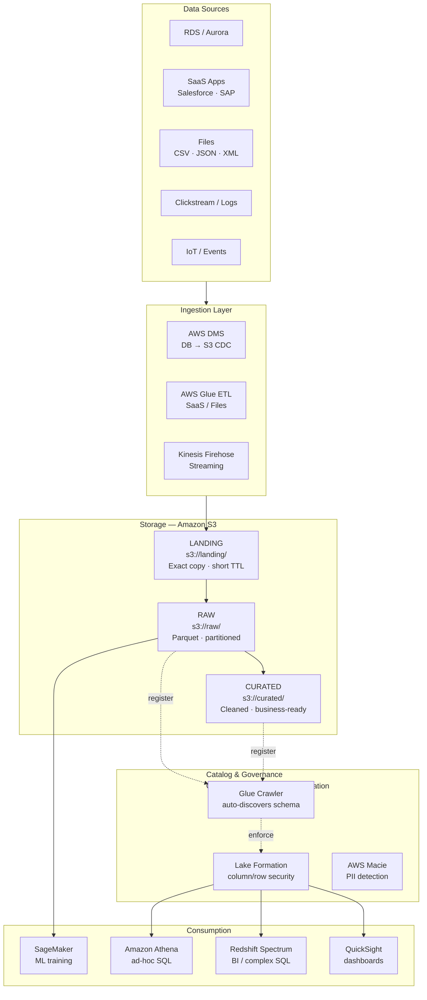
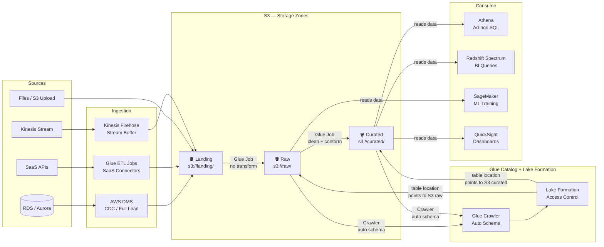
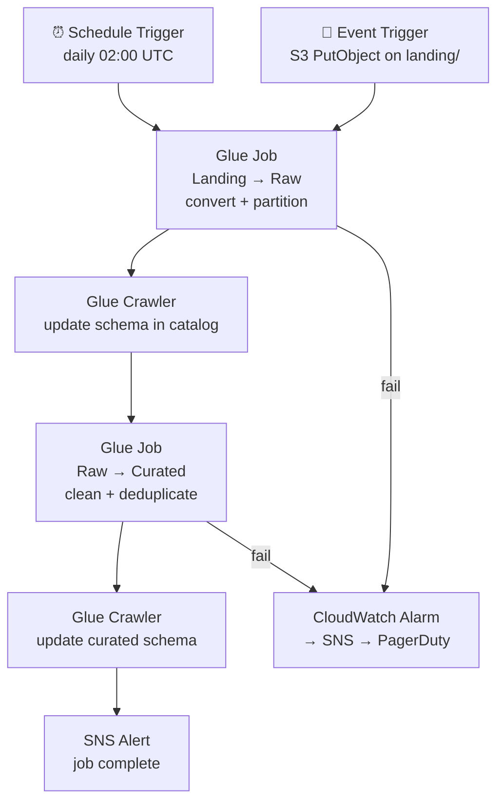

# 2.1 — Data Lake · AWS Fully Managed

**Stack:** S3 · AWS Glue · Lake Formation · Athena · Glue Data Catalog
**Processing:** Batch-first · Schema-on-Read
**Buy vs Build:** Buy (fully managed, no infra to operate)

---

## Architecture Overview


        │             │             │              │             │
        ▼             ▼             ▼              ▼             ▼
┌─────────────────────────────────────────────────────────────────────────────┐
│  INGESTION LAYER                                                            │
│                                                                             │
│  ┌─────────────────┐   ┌─────────────────┐   ┌─────────────────┐          │
│  │  AWS DMS        │   │  AWS Glue        │   │  Kinesis        │          │
│  │  (DB → S3 CDC)  │   │  ETL Jobs        │   │  Firehose       │          │
│  │                 │   │  (SaaS / Files)  │   │  (Streaming)    │          │
│  └────────┬────────┘   └────────┬─────────┘   └────────┬────────┘          │
└───────────┼────────────────────┼────────────────────────┼───────────────────┘
            │                    │                        │
            └────────────────────┼────────────────────────┘
                                 ▼
┌─────────────────────────────────────────────────────────────────────────────┐
│  STORAGE — Amazon S3                                                        │
│                                                                             │
│  ┌─────────────────┐   ┌─────────────────┐   ┌─────────────────┐          │
│  │  LANDING ZONE   │   │   RAW ZONE      │   │  CURATED ZONE   │          │
│  │  s3://landing/  │──▶│  s3://raw/      │──▶│  s3://curated/  │          │
│  │                 │   │                 │   │                 │          │
│  │ • Exact copy    │   │ • Partitioned   │   │ • Cleaned       │          │
│  │   from source   │   │   by date       │   │ • Deduplicated  │          │
│  │ • No transforms │   │ • Parquet/ORC   │   │ • Parquet       │          │
│  │ • Short TTL     │   │ • Compressed    │   │ • Business-ready│          │
│  └─────────────────┘   └─────────────────┘   └─────────────────┘          │
└─────────────────────────────────────────────────────────────────────────────┘
            │                    │                        │
            ▼                    ▼                        ▼
┌─────────────────────────────────────────────────────────────────────────────┐
│  CATALOG & GOVERNANCE — AWS Glue Data Catalog + Lake Formation              │
│                                                                             │
│  ┌──────────────────────────────────────────────────────────────┐          │
│  │  Glue Crawler → auto-discovers schema → registers tables     │          │
│  │  Lake Formation → column/row security · data classification  │          │
│  │  AWS Macie → PII detection · sensitivity tagging             │          │
│  └──────────────────────────────────────────────────────────────┘          │
└─────────────────────────────────────────────────────────────────────────────┘
                                 │
                                 ▼
┌─────────────────────────────────────────────────────────────────────────────┐
│  PROCESSING — AWS Glue / EMR (optional for heavy transforms)                │
│                                                                             │
│  ┌─────────────────┐                        ┌─────────────────┐           │
│  │  Glue Jobs      │                        │  EMR (Spark)    │           │
│  │  (PySpark/SQL)  │                        │  Heavy workloads│           │
│  │  Raw → Curated  │                        │  ML prep        │           │
│  └────────┬────────┘                        └────────┬────────┘           │
└───────────┼──────────────────────────────────────────┼─────────────────────┘
            └──────────────────────┬───────────────────┘
                                   │
┌──────────────────────────────────▼──────────────────────────────────────────┐
│  CATALOG LAYER  —  Glue Data Catalog + Lake Formation                       │
│                                                                             │
│  • Registers table schemas, partitions, locations pointing to S3            │
│  • Lake Formation enforces column/row access per IAM role                   │
│  • Glue Crawler keeps schemas in sync as new partitions land                │
│                                                                             │
│  ┌──────────────────────┐          ┌──────────────────────┐                │
│  │  raw_db              │          │  curated_db          │                │
│  │  tables → s3://raw/  │          │  tables → s3://cur/  │                │
│  └──────────────────────┘          └──────────────────────┘                │
└──────────┬──────────────────────────────────────┬──────────────────────────┘
           │  schema lookup + access check         │  schema lookup + access check
           ▼                                       ▼
┌─────────────────────────┐           ┌────────────────────────────────────────┐
│  s3://raw/              │           │  s3://curated/                         │
│  (physical data files)  │           │  (physical data files)                 │
└──────────┬──────────────┘           └──────────────┬─────────────────────────┘
           │                                         │
           │  reads via catalog                      │  reads via catalog
           ▼                                         ▼
┌─────────────────────────┐           ┌────────────────────────────────────────┐
│  CONSUMPTION — Raw      │           │  CONSUMPTION — Curated                 │
│                         │           │                                        │
│  SageMaker              │           │  Athena          → ad-hoc SQL          │
│  (ML training,          │           │  Redshift Spectrum → BI / complex SQL  │
│   full grain needed)    │           │  QuickSight      → dashboards          │
│                         │           │  EMR / Glue      → further processing  │
└─────────────────────────┘           └────────────────────────────────────────┘
```

---

## Data Flow



---

## Zone Design

```
s3://<company>-data-lake/
│
├── landing/
│   └── {source}/{table}/year=YYYY/month=MM/day=DD/
│       └── raw file as-received (CSV, JSON, Parquet)
│
├── raw/
│   └── {source}/{table}/year=YYYY/month=MM/day=DD/
│       └── converted to Parquet + Snappy compressed
│
└── curated/
    └── {domain}/{entity}/year=YYYY/month=MM/
        └── deduplicated · type-cast · Parquet + Snappy
```

---

## Security Model

```
┌─────────────────────────────────────────────────┐
│             Lake Formation                       │
│                                                  │
│  IAM Role         Access Level     Zone          │
│  ─────────────    ────────────     ──────────    │
│  data-engineer    Read + Write     All zones     │
│  data-analyst     Read only        Curated only  │
│  data-scientist   Read only        Raw + Curated │
│  bi-consumer      Read only        Curated only  │
│  ml-pipeline      Read + Write     Raw + Curated │
│                                                  │
│  Column masking → PII columns (via Lake Formation│
│  Row filtering  → per team / region              │
│  AWS Macie      → auto-tag PII on landing        │
└─────────────────────────────────────────────────┘
```

---

## Orchestration



---

## Component → AWS Service Map

| Component | AWS Service | Notes |
|-----------|-------------|-------|
| Object Storage | S3 | Standard + Intelligent-Tiering for cold data |
| DB Ingestion | AWS DMS | Full load + ongoing CDC from RDS/Oracle/SQL Server |
| SaaS / File Ingestion | AWS Glue ETL | Built-in connectors; custom via Python shell jobs |
| Stream Ingestion | Kinesis Firehose | Buffers stream → S3 in Parquet |
| Schema Catalog | AWS Glue Data Catalog | Hive-compatible; shared with Athena, EMR, Redshift |
| Access Control | AWS Lake Formation | Column/row security on top of IAM |
| PII Detection | AWS Macie | Auto-classify S3 objects |
| Processing | AWS Glue Jobs (Spark) | Serverless Spark; pay per DPU-hour |
| Heavy Processing | Amazon EMR | For large-scale Spark workloads |
| Ad-hoc Query | Amazon Athena | Serverless SQL on S3; pay per TB scanned |
| BI Query Engine | Redshift Spectrum | Query S3 from Redshift without loading |
| ML Consumption | SageMaker | Training datasets pulled from Raw/Curated |
| BI / Dashboards | QuickSight | SPICE in-memory or direct Athena queries |
| Orchestration | AWS Glue Workflows / MWAA | Glue native for simple; MWAA (Airflow) for complex |
| Encryption | AWS KMS | SSE-KMS on all S3 buckets |
| Monitoring | CloudWatch + CloudTrail | Job metrics + data access audit |

---

## Cost Drivers

| Item | Pricing Model | Optimization |
|------|--------------|--------------|
| S3 Storage | per GB/month | Lifecycle policies → Glacier for Landing after 30 days |
| Athena Queries | per TB scanned | Partition pruning + Parquet reduces scan cost 10–100× |
| Glue Jobs | per DPU-hour | Right-size DPUs; use G.1X for memory-intensive jobs |
| DMS Replication | per instance-hour | Use replication instance only during load windows |
| Kinesis Firehose | per GB ingested | Buffer size tuning reduces PUT requests |

---

## When to Choose This Implementation

✅ AWS is primary cloud
✅ Want zero infrastructure management
✅ Data science and ML are primary consumers
✅ Ad-hoc exploration is a key use case
✅ Budget allows managed service pricing

❌ Need ACID transactions or UPDATE/DELETE on lake data → use Pattern 3 (Lakehouse)
❌ Sub-second latency required → use Pattern 4 (Streaming)
❌ Heavy BI/reporting with complex joins → add EDW on top (Pattern 1)
