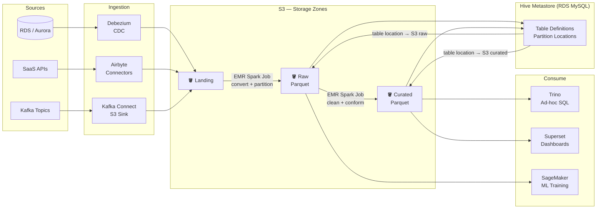
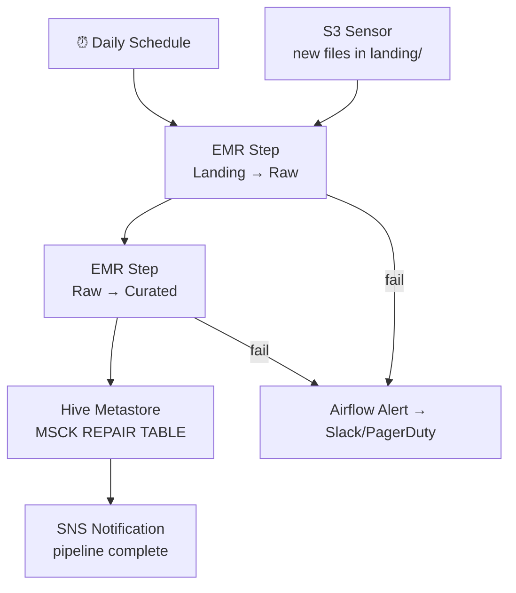

# 2.2 — Data Lake · AWS OSS on Cloud

**Stack:** S3 · Spark on EMR · Hive Metastore · Trino · Airflow · Superset
**Processing:** Batch-first · Schema-on-Read
**Buy vs Build:** Build (OSS on AWS managed infra — no vendor lock-in, higher ops overhead)

---

## Architecture Overview

```
┌─────────────────────────────────────────────────────────────────────────────┐
│  DATA SOURCES                                                               │
│  ┌──────────┐  ┌──────────┐  ┌──────────┐  ┌──────────┐  ┌──────────┐   │
│  │ RDS /    │  │ SaaS APIs│  │  Files   │  │  Kafka   │  │   IoT /  │   │
│  │ Aurora   │  │          │  │          │  │  Topics  │  │  Events  │   │
│  └────┬─────┘  └────┬─────┘  └────┬─────┘  └────┬─────┘  └────┬─────┘   │
└───────┼─────────────┼─────────────┼──────────────┼─────────────┼──────────┘
        ▼             ▼             ▼              ▼             ▼
┌─────────────────────────────────────────────────────────────────────────────┐
│  INGESTION LAYER                                                            │
│  ┌─────────────────┐  ┌─────────────────┐  ┌─────────────────┐            │
│  │  Debezium       │  │  Airbyte        │  │  Kafka Connect  │            │
│  │  (CDC via WAL)  │  │  (SaaS / Files) │  │  S3 Sink        │            │
│  └────────┬────────┘  └────────┬────────┘  └────────┬────────┘            │
└───────────┼────────────────────┼────────────────────┼────────────────────┘
            └────────────────────┼────────────────────┘
                                 ▼
┌─────────────────────────────────────────────────────────────────────────────┐
│  STORAGE — Amazon S3                                                        │
│  ┌─────────────────┐   ┌─────────────────┐   ┌─────────────────┐          │
│  │  LANDING ZONE   │──▶│   RAW ZONE      │──▶│  CURATED ZONE   │          │
│  │  s3://landing/  │   │  s3://raw/      │   │  s3://curated/  │          │
│  │  original files │   │  Parquet + Snappy│   │  clean Parquet  │          │
│  └─────────────────┘   └─────────────────┘   └─────────────────┘          │
└─────────────────────────────────────────────────────────────────────────────┘
                                 │
                                 ▼
┌─────────────────────────────────────────────────────────────────────────────┐
│  PROCESSING — Apache Spark on Amazon EMR                                    │
│  ┌──────────────────────────────────────────────────────────────┐          │
│  │  EMR Cluster (auto-scaling)                                  │          │
│  │  Landing → Raw : convert formats, apply partitioning         │          │
│  │  Raw → Curated : deduplicate, type-cast, business rules      │          │
│  │  Triggered by Airflow DAGs                                   │          │
│  └──────────────────────────────────────────────────────────────┘          │
└─────────────────────────────────────────────────────────────────────────────┘
                                 │
                                 ▼
┌─────────────────────────────────────────────────────────────────────────────┐
│  CATALOG — Hive Metastore (on RDS MySQL)                                    │
│  ┌──────────────────────────────────────────────────────────────┐          │
│  │  Stores table definitions, partition metadata, S3 locations  │          │
│  │  Compatible with Spark, Trino, EMR natively                  │          │
│  └──────────────────────────────────────────────────────────────┘          │
└─────────────────────────────────────────────────────────────────────────────┘
           │ schema lookup → S3 location          │ schema lookup → S3 location
           ▼                                      ▼
┌─────────────────────┐               ┌──────────────────────────────────────┐
│  s3://raw/          │               │  s3://curated/                       │
└──────────┬──────────┘               └──────────────┬───────────────────────┘
           │                                         │
           ▼                                         ▼
┌─────────────────────┐               ┌──────────────────────────────────────┐
│  SageMaker / Spark  │               │  Trino       → ad-hoc SQL            │
│  (ML training)      │               │  Superset    → dashboards            │
│                     │               │  Spark       → further processing    │
└─────────────────────┘               └──────────────────────────────────────┘
```

---

## Data Flow



---

## Orchestration (Airflow on MWAA)



---

## Component Map

| Component | Tool | Notes |
|-----------|------|-------|
| Object Storage | Amazon S3 | Same as managed; portable |
| CDC Ingestion | Debezium | Reads WAL from RDS/PostgreSQL → Kafka → S3 |
| SaaS Ingestion | Airbyte (self-hosted on EC2/EKS) | 300+ connectors; open-source |
| Stream Ingestion | Kafka Connect S3 Sink | Kafka → S3 in Parquet |
| Processing | Apache Spark on EMR | Auto-scaling clusters; pay per use |
| Catalog | Hive Metastore on RDS MySQL | Shared by Spark + Trino + EMR |
| Ad-hoc Query | Trino on EC2 / EKS | Federated; can query beyond S3 |
| Dashboards | Apache Superset | Open-source; connects to Trino |
| ML | SageMaker (AWS) or self-hosted MLflow | Training reads from Raw zone |
| Orchestration | Apache Airflow on MWAA | DAGs for all pipeline steps |
| Access Control | Apache Ranger on EMR | Column/row security; LDAP integration |

---

## vs 2.1 AWS Managed

| | 2.1 Managed | 2.2 OSS |
|--|-------------|---------|
| Ops overhead | Low | Medium-High |
| Cost at scale | Higher | Lower |
| Vendor lock-in | Higher (Glue/LF) | Lower (portable to Azure/GCP) |
| Query engine | Athena only | Trino (federated across sources) |
| Catalog portability | Glue-only | Hive Metastore (multi-engine) |
| Customisation | Limited | Full control |
