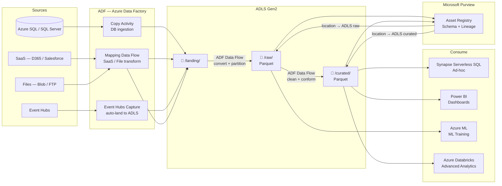
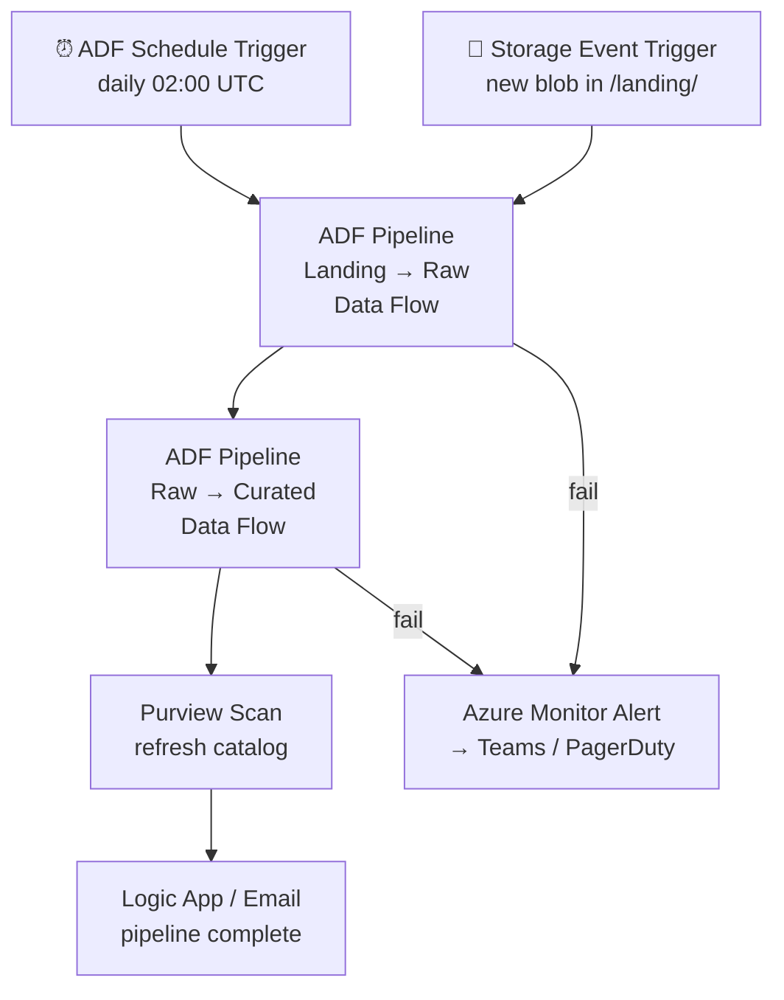

# 2.3 — Data Lake · Azure Fully Managed

**Stack:** ADLS Gen2 · Azure Data Factory · Microsoft Purview · Synapse Analytics Serverless
**Processing:** Batch-first · Schema-on-Read
**Buy vs Build:** Buy (fully managed Azure-native services)

---

## Architecture Overview

```
┌─────────────────────────────────────────────────────────────────────────────┐
│  DATA SOURCES                                                               │
│  ┌──────────┐  ┌──────────┐  ┌──────────┐  ┌──────────┐  ┌──────────┐   │
│  │ Azure SQL│  │ SaaS Apps│  │  Files   │  │ Event    │  │   IoT    │   │
│  │ SQL Server│  │(D365/SFDC│  │(Blob/FTP)│  │ Hubs     │  │   Hub    │   │
│  └────┬─────┘  └────┬─────┘  └────┬─────┘  └────┬─────┘  └────┬─────┘   │
└───────┼─────────────┼─────────────┼──────────────┼─────────────┼──────────┘
        ▼             ▼             ▼              ▼             ▼
┌─────────────────────────────────────────────────────────────────────────────┐
│  INGESTION — Azure Data Factory (ADF)                                       │
│  ┌──────────────────┐  ┌──────────────────┐  ┌──────────────────┐         │
│  │  ADF Copy        │  │  ADF Mapping     │  │  Event Hubs      │         │
│  │  Activity        │  │  Data Flows      │  │  Capture         │         │
│  │  (DB / Files)    │  │  (SaaS APIs)     │  │  (→ ADLS auto)   │         │
│  └────────┬─────────┘  └────────┬─────────┘  └────────┬─────────┘         │
└───────────┼────────────────────┼────────────────────────┼──────────────────┘
            └────────────────────┼────────────────────────┘
                                 ▼
┌─────────────────────────────────────────────────────────────────────────────┐
│  STORAGE — Azure Data Lake Storage Gen2 (ADLS)                              │
│                                                                             │
│  ┌─────────────────┐   ┌─────────────────┐   ┌─────────────────┐          │
│  │  LANDING        │──▶│   RAW           │──▶│  CURATED        │          │
│  │  /landing/      │   │  /raw/          │   │  /curated/      │          │
│  │  original files │   │  Parquet+Snappy │   │  clean Parquet  │          │
│  └─────────────────┘   └─────────────────┘   └─────────────────┘          │
│                                                                             │
│  Hierarchical Namespace enabled · RBAC + ACLs per folder                   │
└─────────────────────────────────────────────────────────────────────────────┘
                                 │
                                 ▼
┌─────────────────────────────────────────────────────────────────────────────┐
│  PROCESSING — ADF Data Flows / Synapse Pipelines / Databricks (optional)    │
│  ┌──────────────────────────────────────────────────────────────┐          │
│  │  ADF Mapping Data Flows (Spark-based, serverless)            │          │
│  │  Landing → Raw : convert, partition by date                  │          │
│  │  Raw → Curated : deduplicate, type-cast, conform             │          │
│  └──────────────────────────────────────────────────────────────┘          │
└─────────────────────────────────────────────────────────────────────────────┘
                                 │
                                 ▼
┌─────────────────────────────────────────────────────────────────────────────┐
│  CATALOG & GOVERNANCE — Microsoft Purview                                   │
│  ┌──────────────────────────────────────────────────────────────┐          │
│  │  Auto-scan ADLS → registers assets, schema, lineage          │          │
│  │  Data classification → PII / PHI / PCI tagging (built-in)   │          │
│  │  Business glossary · data owners · access policies           │          │
│  │  Lineage from ADF pipelines auto-captured                    │          │
│  └──────────────────────────────────────────────────────────────┘          │
└─────────────────────────────────────────────────────────────────────────────┘
           │ schema + location                    │ schema + location
           ▼                                      ▼
┌─────────────────────┐               ┌──────────────────────────────────────┐
│  ADLS /raw/         │               │  ADLS /curated/                      │
└──────────┬──────────┘               └──────────────┬───────────────────────┘
           │                                         │
           ▼                                         ▼
┌─────────────────────┐               ┌──────────────────────────────────────┐
│  Azure ML           │               │  Synapse Serverless SQL → ad-hoc     │
│  (training datasets)│               │  Power BI         → dashboards       │
│                     │               │  Azure Databricks → advanced analytics│
└─────────────────────┘               └──────────────────────────────────────┘
```

---

## Data Flow



---

## Zone Design (ADLS Folder Structure)

```
adls://<storage-account>/
│
├── landing/
│   └── {source}/{entity}/year=YYYY/month=MM/day=DD/
│       └── file as-received
│
├── raw/
│   └── {source}/{entity}/year=YYYY/month=MM/day=DD/
│       └── converted to Parquet + Snappy
│
└── curated/
    └── {domain}/{entity}/year=YYYY/month=MM/
        └── deduplicated · typed · Parquet + Snappy
```

---

## Security Model

```
┌─────────────────────────────────────────────────────────┐
│  ADLS Gen2 + Azure Active Directory                      │
│                                                          │
│  Role               Zone Access        Method            │
│  ──────────────     ──────────────     ──────────────    │
│  data-engineer      All zones RW       AAD Group + ACL   │
│  data-analyst       Curated RO         AAD Group + ACL   │
│  data-scientist     Raw + Curated RO   AAD Group + ACL   │
│  ml-pipeline        Raw + Curated RW   Service Principal │
│  bi-consumer        Curated RO         Service Principal │
│                                                          │
│  Column masking  → Purview access policies (preview)     │
│  PII tagging     → Purview auto-classification           │
│  Encryption      → Azure Key Vault (CMK)                 │
│  Audit           → Azure Monitor + Storage Logs          │
└─────────────────────────────────────────────────────────┘
```

---

## Orchestration (ADF Pipelines)



---

## Component Map

| Component | Azure Service | Notes |
|-----------|--------------|-------|
| Object Storage | ADLS Gen2 | Hierarchical namespace; POSIX ACLs on folders |
| DB Ingestion | ADF Copy Activity | SQL Server, Oracle, PostgreSQL, SAP |
| SaaS Ingestion | ADF Connectors / Mapping Data Flows | 90+ built-in connectors |
| Stream Ingestion | Event Hubs Capture | Auto-lands to ADLS in Avro or Parquet |
| Processing | ADF Mapping Data Flows | Serverless Spark — no cluster management |
| Heavy Processing | Azure Databricks | Optional for complex transforms |
| Catalog | Microsoft Purview | Auto-lineage from ADF; built-in classification |
| Ad-hoc Query | Synapse Analytics Serverless SQL | Query ADLS Parquet directly via SQL |
| Dashboards | Power BI | DirectQuery to Synapse Serverless |
| ML | Azure Machine Learning | Dataset registry points to ADLS |
| Orchestration | ADF Pipelines | Built-in scheduling + monitoring |
| Access Control | AAD + ADLS ACLs + Purview Policies | Fine-grained per folder + column |
| Encryption | Azure Key Vault (CMK) | Customer-managed keys on ADLS |

---

## vs 2.1 AWS Managed

| | 2.1 AWS Managed | 2.3 Azure Managed |
|--|----------------|-------------------|
| Storage | S3 | ADLS Gen2 (hierarchical NS) |
| Catalog | Glue Data Catalog | Microsoft Purview |
| Query Engine | Athena | Synapse Serverless SQL |
| Lineage | Manual / limited | Auto-captured from ADF |
| PII Classification | Macie (separate) | Purview built-in |
| Integration with BI | QuickSight | Power BI (tighter integration) |
| Best for | AWS-first orgs | Microsoft / Azure orgs, Office 365 data |
