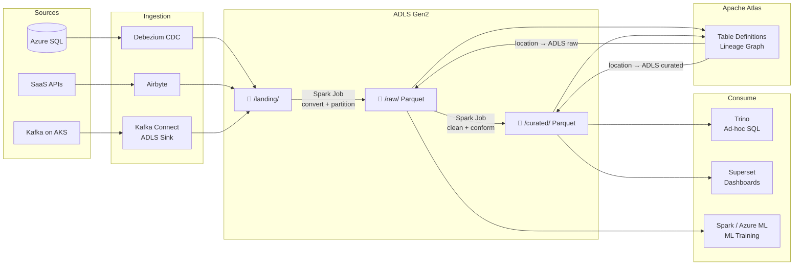

# 2.4 — Data Lake · Azure OSS on Cloud

**Stack:** ADLS Gen2 · Spark on AKS · Apache Atlas · Trino · Airflow · Superset
**Processing:** Batch-first · Schema-on-Read
**Buy vs Build:** Build (OSS on Azure managed infra)

---

## Architecture Overview

```
┌─────────────────────────────────────────────────────────────────────────────┐
│  DATA SOURCES                                                               │
│  ┌──────────┐  ┌──────────┐  ┌──────────┐  ┌──────────┐                  │
│  │ Azure SQL│  │ SaaS APIs│  │  Files   │  │  Kafka   │                  │
│  │ / Postgres│  │          │  │          │  │ on AKS   │                  │
│  └────┬─────┘  └────┬─────┘  └────┬─────┘  └────┬─────┘                  │
└───────┼─────────────┼─────────────┼──────────────┼──────────────────────┘
        ▼             ▼             ▼              ▼
┌─────────────────────────────────────────────────────────────────────────────┐
│  INGESTION                                                                  │
│  ┌─────────────────┐  ┌─────────────────┐  ┌─────────────────┐            │
│  │  Debezium       │  │  Airbyte        │  │  Kafka Connect  │            │
│  │  (CDC → Kafka)  │  │  (SaaS / Files) │  │  ADLS Sink      │            │
│  └────────┬────────┘  └────────┬────────┘  └────────┬────────┘            │
└───────────┼────────────────────┼────────────────────┼────────────────────┘
            └────────────────────┼────────────────────┘
                                 ▼
┌─────────────────────────────────────────────────────────────────────────────┐
│  STORAGE — ADLS Gen2                                                        │
│  ┌─────────────────┐   ┌─────────────────┐   ┌─────────────────┐          │
│  │  LANDING        │──▶│   RAW           │──▶│  CURATED        │          │
│  │  /landing/      │   │  /raw/          │   │  /curated/      │          │
│  └─────────────────┘   └─────────────────┘   └─────────────────┘          │
└─────────────────────────────────────────────────────────────────────────────┘
                                 │
                                 ▼
┌─────────────────────────────────────────────────────────────────────────────┐
│  PROCESSING — Apache Spark on AKS                                           │
│  ┌──────────────────────────────────────────────────────────────┐          │
│  │  Spark Operator on Kubernetes                                │          │
│  │  Landing → Raw : format conversion, partitioning             │          │
│  │  Raw → Curated : dedup, type casting, business rules         │          │
│  └──────────────────────────────────────────────────────────────┘          │
└─────────────────────────────────────────────────────────────────────────────┘
                                 │
                                 ▼
┌─────────────────────────────────────────────────────────────────────────────┐
│  CATALOG — Apache Atlas (on AKS)                                            │
│  ┌──────────────────────────────────────────────────────────────┐          │
│  │  Hive-compatible metastore · lineage graph · classifications  │          │
│  │  Ranger integration for access policy enforcement             │          │
│  └──────────────────────────────────────────────────────────────┘          │
└─────────────────────────────────────────────────────────────────────────────┘
           │                                      │
           ▼                                      ▼
┌─────────────────────┐               ┌──────────────────────────────────────┐
│  ADLS /raw/         │               │  ADLS /curated/                      │
└──────────┬──────────┘               └──────────────┬───────────────────────┘
           ▼                                         ▼
┌─────────────────────┐               ┌──────────────────────────────────────┐
│  Spark / Azure ML   │               │  Trino       → ad-hoc SQL            │
│  (ML training)      │               │  Superset    → dashboards            │
└─────────────────────┘               └──────────────────────────────────────┘
```

---

## Data Flow



---

## Component Map

| Component | Tool | Notes |
|-----------|------|-------|
| Object Storage | ADLS Gen2 | Hierarchical namespace; AAD + ACL security |
| CDC Ingestion | Debezium on AKS | PostgreSQL / SQL Server WAL → Kafka |
| SaaS Ingestion | Airbyte on AKS | Self-hosted; 300+ connectors |
| Stream Ingestion | Kafka Connect ADLS Sink | Kafka → ADLS in Parquet |
| Processing | Spark on AKS (Spark Operator) | K8s-native; auto-scale via KEDA |
| Catalog | Apache Atlas on AKS | Lineage + classification; Ranger policies |
| Ad-hoc Query | Trino on AKS | Federated across ADLS + other stores |
| Dashboards | Apache Superset on AKS | Connects to Trino |
| ML | Azure ML or self-hosted MLflow | Reads raw zone via ADLS SDK |
| Orchestration | Apache Airflow on AKS | DAGs trigger Spark jobs |
| Access Control | Apache Ranger + AAD | Tag-based + role-based policies |
