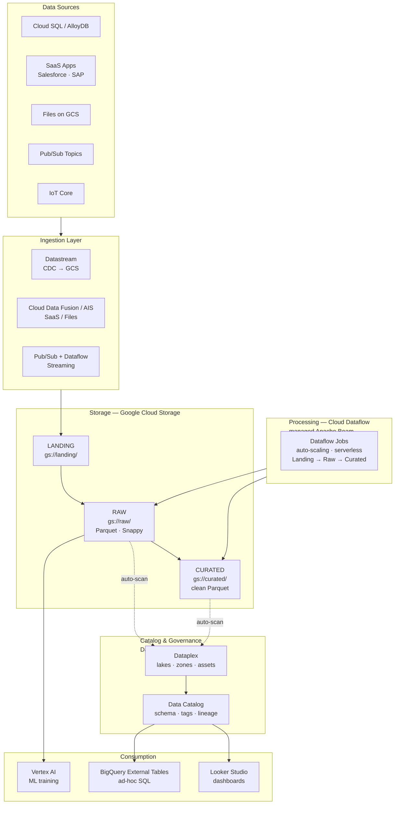
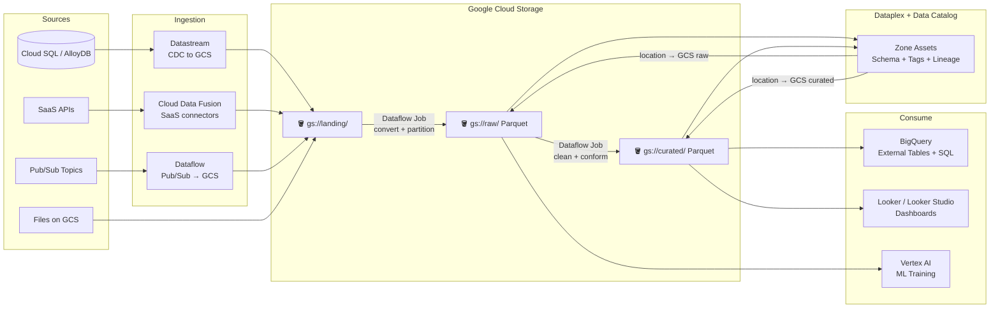

# 2.5 — Data Lake · GCP Fully Managed

**Stack:** GCS · Cloud Dataflow · Dataplex · BigQuery External Tables · Data Catalog
**Processing:** Batch-first · Schema-on-Read
**Buy vs Build:** Buy (fully managed GCP-native services)

---

## Architecture Overview



---

## Data Flow



---

## Dataplex Zone Mapping

```
Dataplex Lake: enterprise-data-lake
│
├── Raw Zone  (type: RAW)
│   └── Asset → gs://raw/
│       • Schema-on-read
│       • No quality rules enforced
│
└── Curated Zone  (type: CURATED)
    └── Asset → gs://curated/
        • Dataplex enforces data quality checks
        • Auto-registered in Data Catalog
        • DLP scan for PII on ingest
```

---

## Component Map

| Component | GCP Service | Notes |
|-----------|------------|-------|
| Object Storage | Google Cloud Storage | Multi-region buckets for HA |
| CDC Ingestion | Datastream | MySQL, PostgreSQL, Oracle → GCS in Avro/JSON |
| SaaS Ingestion | Cloud Data Fusion | Managed CDAP; 150+ connectors |
| Stream Ingestion | Pub/Sub + Dataflow | Pub/Sub → Dataflow → GCS in Parquet |
| Processing | Cloud Dataflow | Serverless Apache Beam; auto-scale |
| Catalog | Dataplex + Data Catalog | Zone management + tag templates |
| PII Detection | Cloud DLP API | Auto-scan GCS on landing |
| Ad-hoc Query | BigQuery External Tables | Query GCS Parquet without loading |
| Dashboards | Looker Studio / Looker | Looker for semantic layer |
| ML | Vertex AI | Dataset registry points to GCS |
| Orchestration | Cloud Composer (Airflow) | DAGs trigger Dataflow jobs |
| Access Control | IAM + VPC Service Controls | Service account per pipeline step |
| Encryption | Cloud KMS (CMEK) | Customer-managed keys on GCS |

---

## vs Other Managed Implementations

| | 2.1 AWS | 2.3 Azure | 2.5 GCP |
|--|---------|-----------|---------|
| Storage | S3 | ADLS Gen2 | GCS |
| Catalog | Glue Data Catalog | Purview | Dataplex + Data Catalog |
| Processing | Glue (Spark) | ADF Data Flows | Dataflow (Beam) |
| Query Engine | Athena | Synapse Serverless | BigQuery External Tables |
| Lineage | Limited | ADF auto-capture | Dataplex auto-capture |
| BI | QuickSight | Power BI | Looker / Looker Studio |
| Best for | AWS-first orgs | Microsoft / O365 orgs | GCP / Google Workspace orgs |
