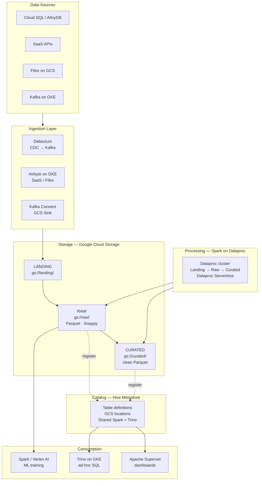
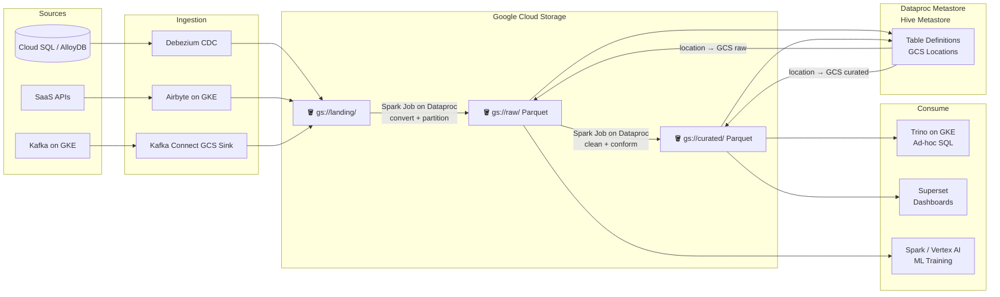

# 2.6 — Data Lake · GCP OSS on Cloud

**Stack:** GCS · Spark on Dataproc · Hive Metastore · Trino · Airflow · Superset
**Processing:** Batch-first · Schema-on-Read
**Buy vs Build:** Build (OSS on GCP managed infra)

---

## Architecture Overview

---

## Data Flow

---

## Component Map

| Component | Tool | Notes |
|-----------|------|-------|
| Object Storage | GCS | Same zones as managed; IAM per bucket |
| CDC Ingestion | Debezium on GKE | WAL-based; low source impact |
| SaaS Ingestion | Airbyte on GKE | Self-hosted; portable across clouds |
| Stream Ingestion | Kafka Connect GCS Sink | Parquet output; configurable buffer |
| Processing | Spark on Dataproc | Managed Hadoop/Spark; ephemeral clusters |
| Catalog | Dataproc Metastore (Hive) | Managed Hive; shared by Spark + Trino |
| Ad-hoc Query | Trino on GKE | Federated query beyond GCS |
| Dashboards | Apache Superset on GKE | Connects to Trino |
| ML | Vertex AI or self-hosted MLflow | Reads GCS directly |
| Orchestration | Cloud Composer (Airflow) | DAGs submit Dataproc jobs |
| Access Control | IAM + Apache Ranger | Fine-grained column/row policies |
