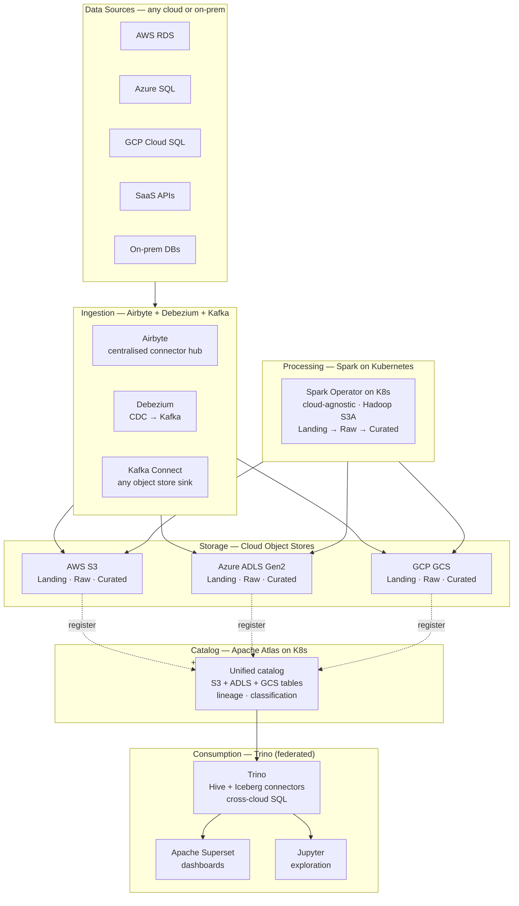
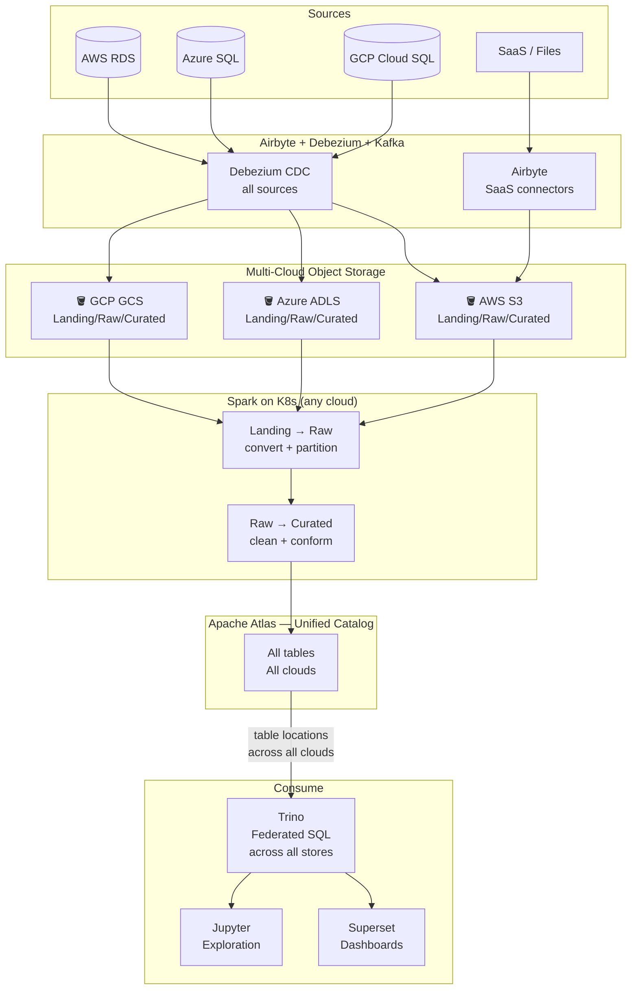

# 2.7 — Data Lake · Multi-Cloud OSS Portable

**Stack:** S3 / ADLS / GCS · Trino · Apache Atlas · Airflow · Superset
**Processing:** Batch-first · Schema-on-Read · Federated Query across clouds
**Buy vs Build:** Build (cloud-agnostic OSS — maximum portability, highest ops overhead)

---

## Architecture Overview



---

## Data Flow



---

## Why Multi-Cloud for a Data Lake?

```
Use case                              Data lands where source is
──────────────────────────────────    ────────────────────────────────────
M&A — acquired company on Azure       ADLS; avoid egress; process in-place
Compliance: EU data must stay in GCP  GCS eu-region; no cross-region copy
Cost: AWS Spot for processing         Spark on AWS EMR Spot, reads ADLS/GCS
DR: replicate curated to 2nd cloud    S3 primary → GCS replica via rclone
Avoid egress: SaaS data born in AWS   Land in S3; federate via Trino
```

---

## Component Map

| Component | Tool | Deployment |
|-----------|------|-----------|
| Object Storage | S3 + ADLS + GCS | One primary per data domain |
| CDC Ingestion | Debezium | K8s; writes to Kafka |
| SaaS Ingestion | Airbyte | K8s; cloud-agnostic |
| Broker | Apache Kafka | K8s (Strimzi operator) |
| Processing | Spark on K8s | Spark Operator; any cloud K8s |
| Catalog | Apache Atlas | K8s; single instance across clouds |
| Policy | Apache Ranger | Sidecar to Atlas |
| Query | Trino | K8s; multiple workers |
| Dashboards | Apache Superset | K8s; connects to Trino |
| Orchestration | Apache Airflow | K8s; cloud-agnostic DAGs |

---

## Trade-offs

| Factor | Rating | Notes |
|--------|--------|-------|
| Portability | ★★★★★ | No cloud-specific services |
| Operational overhead | ★☆☆☆☆ | Highest — all OSS to operate |
| Cost at scale | ★★★★☆ | No managed service markup |
| Vendor lock-in | ★★★★★ | Minimal — swap clouds freely |
| Egress costs | ★★☆☆☆ | Cross-cloud reads incur egress |
| Federated query speed | ★★★☆☆ | Trino good but cross-cloud slower |
