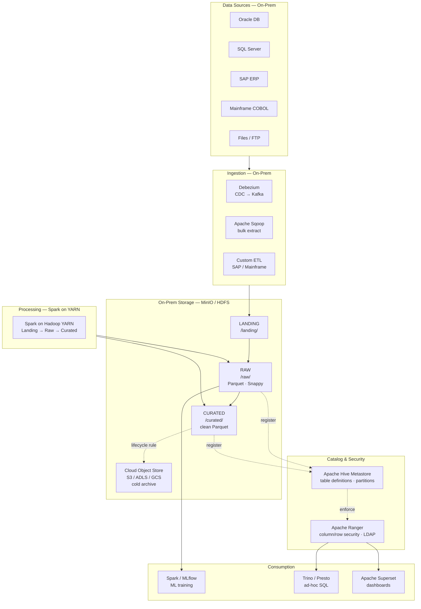
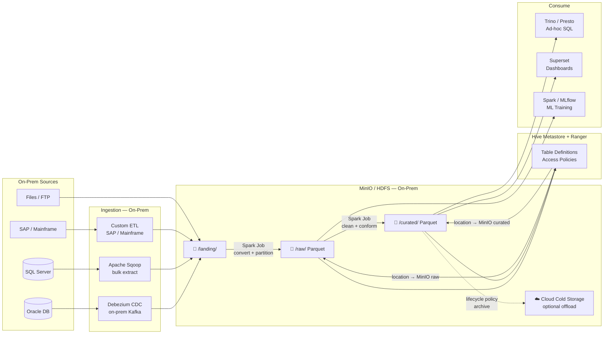

# 2.8 — Data Lake · Hybrid Self-Hosted (On-Prem + Cloud)

**Stack:** MinIO / HDFS · Spark · Apache Hive · Apache Ranger · Airflow · Superset
**Processing:** Batch-first · Schema-on-Read
**Buy vs Build:** Full Build (self-hosted OSS — maximum control, highest ops cost)

---

## Architecture Overview


└──────────┬──────────┘               └──────────────┬───────────────────────┘
           ▼                                         ▼
┌─────────────────────┐               ┌──────────────────────────────────────┐
│  Spark / MLflow     │               │  Trino / Presto → ad-hoc SQL         │
│  (ML training)      │               │  Apache Superset → dashboards        │
│                     │               │  Hive           → batch queries      │
└─────────────────────┘               └──────────────────────────────────────┘
```

---

## Data Flow



---

## Hybrid Cloud Offload Pattern

```
┌─────────────────────────────────────────────────────────────┐
│  DATA TEMPERATURE TIERING                                    │
│                                                              │
│  Hot  (0–90 days)    → MinIO on-prem / HDFS                 │
│  Warm (90–365 days)  → MinIO on-prem (lower-cost nodes)     │
│  Cold (365d+)        → S3 / GCS / ADLS (cloud archive tier) │
│                                                              │
│  Trino queries both on-prem and cloud transparently          │
│  Hive Metastore stores location for both tiers              │
└─────────────────────────────────────────────────────────────┘
```

---

## Component Map

| Component | Tool | Notes |
|-----------|------|-------|
| On-prem Storage | MinIO | S3-compatible API; runs on bare metal |
| Alt Storage | HDFS | For orgs with existing Hadoop clusters |
| CDC Ingestion | Debezium | Oracle / SQL Server / PostgreSQL WAL |
| Bulk Ingestion | Apache Sqoop | Full load / incremental from RDBMS |
| Message Broker | Apache Kafka on-prem | Strimzi on K8s or standalone |
| Processing | Spark on YARN / K8s | On-prem cluster; HDFS or MinIO storage |
| Catalog | Apache Hive Metastore | MySQL/PostgreSQL backend |
| Security | Apache Ranger | Column/row policies; LDAP / Active Directory |
| Ad-hoc Query | Trino or Presto | Federation across on-prem + cloud |
| Dashboards | Apache Superset | Connects to Trino |
| ML | MLflow + Spark | Self-hosted; reads from raw zone |
| Orchestration | Apache Airflow | On-prem; DAGs trigger Spark jobs |
| Cloud Offload | S3 / ADLS / GCS | Cold archive; Trino reads transparently |

---

## When to Choose This Implementation

✅ Data must not leave on-prem (regulatory, sovereignty)
✅ Existing Hadoop / on-prem investment to leverage
✅ SAP, mainframe, or legacy sources that can't egress to cloud
✅ Air-gapped environments (defence, gov, finance)
✅ Latency-sensitive ops that need local data proximity

❌ No dedicated ops team → use managed cloud (2.1 / 2.3 / 2.5)
❌ Need elastic scale on demand → cloud is cheaper
❌ Green-field deployment → start in cloud; avoid HDFS complexity

---

## vs Cloud Implementations

| | On-Prem (2.8) | Cloud Managed (2.1/2.3/2.5) |
|--|--------------|----------------------------|
| Control | Full | Limited to service APIs |
| Ops overhead | Very High | Low |
| Upfront cost | High (hardware) | Low (pay as you go) |
| Elastic scaling | Manual | Automatic |
| Data sovereignty | Guaranteed | Depends on region config |
| Legacy integration | Easier (same network) | Requires VPN / Direct Connect |
