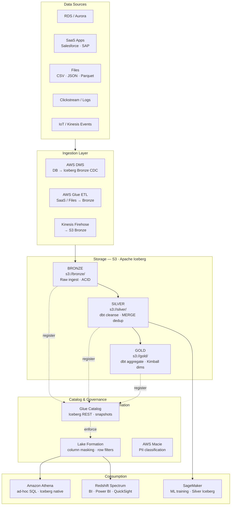
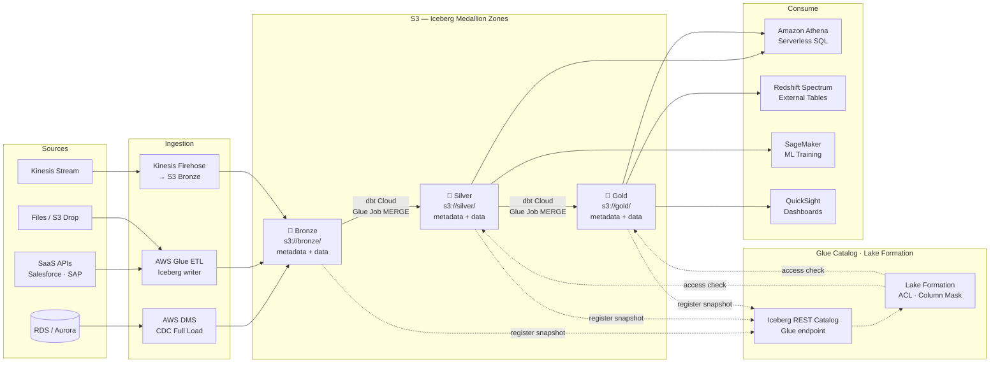
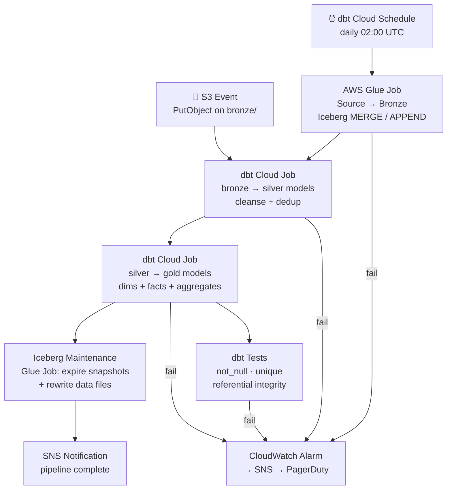

# 3.1 — Data Lakehouse · AWS Fully Managed

**Stack:** S3 · Apache Iceberg · AWS Glue · Lake Formation · Redshift Spectrum · dbt Cloud
**Processing:** Batch-first · ACID Transactions · Schema Evolution · Medallion Architecture
**Buy vs Build:** Buy (fully managed, no infra to operate)

---

## Architecture Overview



---

## Data Flow



---

## Zone Design

```
s3://<company>-lakehouse/
│
├── bronze/
│   └── {source}/{table}/
│       ├── metadata/
│       │   ├── 00000-*.metadata.json   ← Iceberg table metadata
│       │   └── snap-*.avro             ← manifest list
│       └── data/
│           └── {year}/{month}/{day}/
│               └── *.parquet
│
├── silver/
│   └── {domain}/{entity}/
│       ├── metadata/
│       └── data/
│           └── {hidden-partition}/
│               └── *.parquet           ← cleansed, deduped, conformed
│
└── gold/
    └── {domain}/{model}/
        ├── metadata/
        └── data/
            └── *.parquet               ← dbt-built dims, facts, aggregates
```

---

## Security Model

```
┌──────────────────────────────────────────────────────────┐
│         Lake Formation · IAM · KMS                        │
│                                                           │
│  IAM Role            Access Level      Zone(s)           │
│  ──────────────────  ──────────────    ─────────────     │
│  dms-ingest-role     Write only        Bronze            │
│  glue-etl-role       Read + Write      Bronze → Silver   │
│  dbt-cloud-role      Read + Write      Silver → Gold     │
│  data-engineer       Read + Write      All zones         │
│  data-analyst        Read only         Gold only         │
│  data-scientist      Read only         Silver + Gold     │
│  redshift-spectrum   Read only         Gold only         │
│  sagemaker-role      Read only         Silver + Gold     │
│                                                           │
│  Column masking  → PII fields via Lake Formation         │
│  Row filtering   → region / team LF-Tag conditions       │
│  KMS per zone    → separate CMKs for Bronze/Silver/Gold  │
│  Macie scanning  → auto-tag PII on Bronze arrival        │
└──────────────────────────────────────────────────────────┘
```

---

## Orchestration



---

## Component Map

| Component | AWS Service / Tool | Notes |
|-----------|-------------------|-------|
| Object Storage | Amazon S3 | Iceberg metadata + Parquet data files |
| Table Format | Apache Iceberg | ACID, time travel, hidden partitioning, V2 row deletes |
| DB Ingestion | AWS DMS | Full load + CDC; targets Iceberg Bronze via Glue |
| SaaS / File Ingestion | AWS Glue ETL | Spark-based Iceberg writer; built-in connectors |
| Stream Ingestion | Kinesis Firehose | Buffers stream → S3; Glue job converts to Iceberg |
| Schema Catalog | AWS Glue Data Catalog | Iceberg REST catalog endpoint for Spark/Athena |
| Access Control | AWS Lake Formation | Column masking, row filters, LF-Tag ABAC |
| PII Detection | AWS Macie | Auto-classify S3 objects on Bronze |
| Transform / dbt | dbt Cloud | Bronze→Silver→Gold models; tests + docs |
| Glue Processing | AWS Glue Jobs (Spark) | MERGE INTO Iceberg tables for ingestion |
| Ad-hoc Query | Amazon Athena v3 | Native Iceberg support, serverless |
| BI Query Engine | Redshift Spectrum | External Iceberg tables via Glue Catalog |
| ML Consumption | Amazon SageMaker | Reads Silver/Gold via Athena or Glue |
| Dashboards | Amazon QuickSight | Connects via Athena or Redshift Spectrum |
| Orchestration | dbt Cloud Scheduler | Triggers Glue jobs + dbt runs |
| Table Maintenance | AWS Glue Job | `expire_snapshots`, `rewrite_data_files` via Iceberg API |
| Encryption | AWS KMS | SSE-KMS; separate CMK per zone |
| Monitoring | CloudWatch + CloudTrail | Glue job metrics + S3 data access audit |

---

## Comparison vs 2.1 — Data Lake · AWS Fully Managed

| Dimension | 2.1 Data Lake (AWS Managed) | 3.1 Lakehouse (AWS Managed) |
|-----------|-----------------------------|-----------------------------|
| Table Format | Raw Parquet (no format) | Apache Iceberg (ACID log) |
| ACID Transactions | ❌ | ✅ MERGE / UPDATE / DELETE |
| Time Travel | ❌ | ✅ Query any prior snapshot |
| Schema Enforcement | Schema-on-read only | Schema-on-write + evolution |
| CDC Pattern | Full partition overwrite | Iceberg MERGE INTO |
| Row-Level Deletes | Partition rewrite | Iceberg V2 positional deletes |
| dbt Integration | Glue jobs only | dbt Cloud models on Iceberg |
| GDPR Erasure | Partition drop (coarse) | Row-level delete without full rewrite |
| Query Engine | Athena (plain Parquet) | Athena v3 (native Iceberg) |
| BI Layer | Redshift Spectrum (raw) | Redshift Spectrum (Gold Iceberg tables) |
| Small File Problem | Manual Glue compaction | Iceberg `rewrite_data_files` |
| Operational Overhead | Low | Medium (snapshot expiry + compaction) |
| Best For | Exploration, append-only | OLAP + mutable CDC + BI serving |
