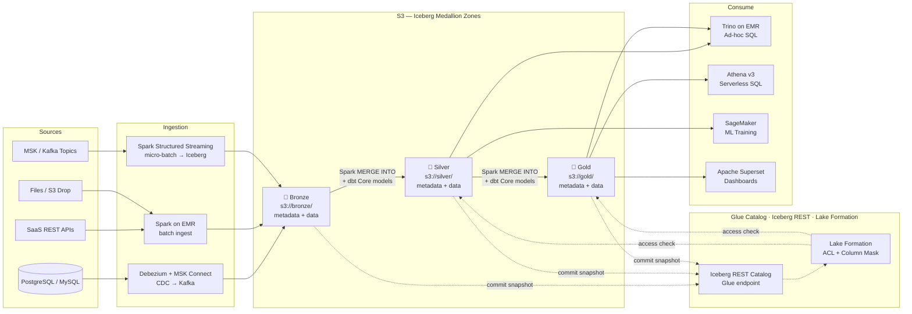
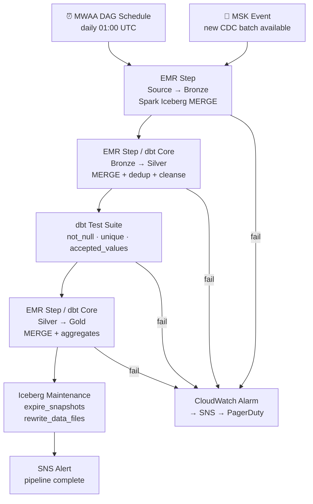

# 3.2 — Data Lakehouse · AWS OSS on Cloud

**Stack:** S3 · Apache Iceberg · Spark on EMR · dbt Core · Apache Airflow (MWAA) · Trino
**Processing:** Batch + Streaming · ACID Transactions · Hidden Partitioning · Open Catalog
**Buy vs Build:** Build (OSS stack on managed AWS infra)

---

## Architecture Overview

```
┌─────────────────────────────────────────────────────────────────────────────┐
│  DATA SOURCES                                                               │
│                                                                             │
│  ┌──────────┐  ┌──────────┐  ┌──────────┐  ┌──────────┐  ┌──────────┐    │
│  │PostgreSQL│  │ SaaS APIs│  │  Files   │  │  Apache  │  │   IoT /  │    │
│  │ MySQL /  │  │ REST /   │  │(CSV/JSON │  │  Kafka   │  │  Events  │    │
│  │ MongoDB  │  │ JDBC     │  │  Parquet)│  │  (MSK)   │  │  (MSK)   │    │
│  └────┬─────┘  └────┬─────┘  └────┬─────┘  └────┬─────┘  └────┬─────┘    │
└───────┼─────────────┼─────────────┼──────────────┼─────────────┼──────────┘
        │             │             │              │             │
        ▼             ▼             ▼              ▼             ▼
┌─────────────────────────────────────────────────────────────────────────────┐
│  INGESTION LAYER                                                            │
│                                                                             │
│  ┌─────────────────┐   ┌─────────────────┐   ┌─────────────────┐          │
│  │  Debezium       │   │  Apache Spark   │   │  Spark          │          │
│  │  on MSK Connect │   │  on EMR         │   │  Structured     │          │
│  │  (CDC → Kafka)  │   │  (batch ingest) │   │  Streaming      │          │
│  └────────┬────────┘   └────────┬────────┘   └────────┬────────┘          │
└───────────┼────────────────────┼─────────────────────┼────────────────────┘
            └────────────────────┼─────────────────────┘
                                 ▼
┌─────────────────────────────────────────────────────────────────────────────┐
│  STORAGE — Amazon S3  (Apache Iceberg table format)                         │
│                                                                             │
│  ┌─────────────────┐   ┌─────────────────┐   ┌─────────────────┐          │
│  │  BRONZE         │   │   SILVER        │   │   GOLD          │          │
│  │  s3://bronze/   │──▶│  s3://silver/   │──▶│  s3://gold/     │          │
│  │                 │   │                 │   │                 │          │
│  │ • Raw Iceberg   │   │ • dbt Core      │   │ • dbt Core      │          │
│  │ • Spark APPEND  │   │ • Spark MERGE   │   │ • Spark MERGE   │          │
│  │ • metadata/     │   │ • Deduped       │   │ • Kimball/wide  │          │
│  │ • data/*.parquet│   │ • Type-cast     │   │ • BI-ready      │          │
│  └─────────────────┘   └─────────────────┘   └─────────────────┘          │
│                                                                             │
│  Iceberg V2: row-level deletes · partition evolution · snapshot isolation  │
└─────────────────────────────────────────────────────────────────────────────┘
        ┆ (commit snapshot)       ┆ (commit snapshot)      ┆ (commit snapshot)
        ▼                         ▼                        ▼
┌─────────────────────────────────────────────────────────────────────────────┐
│  CATALOG — AWS Glue Data Catalog (Iceberg REST) + Lake Formation            │
│  ┄ ┄ ┄ ┄ ┄ ┄ ┄ ┄ ┄ ┄ ┄ ┄ ┄ ┄ ┄ ┄ ┄ ┄ ┄ ┄ ┄ ┄ ┄ ┄ ┄ ┄ ┄ ┄ ┄ ┄ ┄ ┄ ┄   │
│  Iceberg REST catalog → Spark, Trino resolve table metadata + snapshots    │
│  Glue Data Catalog → persists Iceberg table metadata, schemas, locations   │
│  Lake Formation → fine-grained column/row access per IAM role              │
│  ┄ ┄ ┄ ┄ ┄ ┄ ┄ ┄ ┄ ┄ ┄ ┄ ┄ ┄ ┄ ┄ ┄ ┄ ┄ ┄ ┄ ┄ ┄ ┄ ┄ ┄ ┄ ┄ ┄ ┄ ┄ ┄ ┄   │
└────────────────────────────────┬────────────────────────────────────────────┘
                                 │ snapshot resolution + access check
         ┌───────────────────────┼───────────────────────┐
         ▼                       ▼                       ▼
┌─────────────────┐   ┌──────────────────┐   ┌──────────────────────────────┐
│ CONSUMPTION     │   │ CONSUMPTION      │   │ CONSUMPTION                  │
│ — Interactive   │   │ — BI / Reporting │   │ — ML / Science               │
│                 │   │                  │   │                              │
│ Trino on EMR    │   │ Amazon Athena v3 │   │ SageMaker                    │
│ (low-latency    │   │ (serverless SQL  │   │ (EMR Spark reads Silver      │
│  SQL on Iceberg)│   │  on Gold)        │   │  Iceberg for training)       │
│                 │   │ Apache Superset  │   │                              │
│                 │   │ (dashboards)     │   │                              │
└─────────────────┘   └──────────────────┘   └──────────────────────────────┘
```

---

## Data Flow



---

## Zone Design

```
s3://<company>-lakehouse/
│
├── bronze/
│   └── {source}/{table}/
│       ├── metadata/
│       │   ├── 00000-*.metadata.json
│       │   └── snap-*.avro
│       └── data/
│           └── {year=YYYY}/{month=MM}/{day=DD}/
│               └── *.parquet
│
├── silver/
│   └── {domain}/{entity}/
│       ├── metadata/
│       └── data/
│           └── {hidden-partition}/
│               └── *.parquet           ← deduped, cleansed, typed
│
└── gold/
    └── {domain}/{dbt_model}/
        ├── metadata/
        └── data/
            └── *.parquet               ← dbt-built dims, facts, wide tables
```

---

## Security Model

```
┌──────────────────────────────────────────────────────────┐
│         Lake Formation · IAM · KMS                        │
│                                                           │
│  IAM Role / Principal   Access Level    Zone(s)          │
│  ─────────────────────  ─────────────   ──────────────── │
│  emr-ingest-role        Write only      Bronze           │
│  spark-streaming-role   Write only      Bronze           │
│  dbt-core-role          Read + Write    Silver + Gold    │
│  trino-service-acct     Read only       Silver + Gold    │
│  data-engineer          Read + Write    All zones        │
│  data-analyst           Read only       Gold only        │
│  data-scientist         Read only       Silver + Gold    │
│  sagemaker-role         Read only       Silver + Gold    │
│                                                           │
│  Iceberg V2 row deletes → GDPR erasure without rewrite   │
│  Lake Formation column masks → PII in Silver             │
│  KMS per zone → Bronze / Silver / Gold separate CMKs     │
└──────────────────────────────────────────────────────────┘
```

---

## Orchestration



---

## Component Map

| Component | Tool / Service | Notes |
|-----------|---------------|-------|
| Object Storage | Amazon S3 | Iceberg metadata + Parquet data files |
| Table Format | Apache Iceberg v2 | ACID, hidden partitioning, V2 row-level deletes |
| CDC Ingestion | Debezium + Amazon MSK Connect | Streams DB changes to Kafka/MSK topics |
| Batch Ingestion | Apache Spark on EMR 6.x | EMR with `iceberg-spark-runtime` jar |
| Stream Ingestion | Spark Structured Streaming on EMR | Micro-batch Iceberg writes |
| Schema Catalog | AWS Glue Data Catalog (Iceberg REST) | Spark/Trino catalog configuration |
| Access Control | AWS Lake Formation | Column/row security on Glue Catalog tables |
| Transform Layer | dbt Core on EMR | Models compile to Spark SQL with Iceberg |
| Ad-hoc Query | Trino on EMR | Iceberg connector; sub-second interactive queries |
| Serverless Query | Amazon Athena v3 | Native Iceberg; cost-effective ad-hoc |
| Dashboards | Apache Superset | Connects to Trino or Athena |
| ML Consumption | Amazon SageMaker | Reads Silver via Spark on EMR |
| Orchestration | Amazon MWAA (Airflow 2.x) | DAGs submit EMR steps + dbt CLI tasks |
| Table Maintenance | Iceberg `expire_snapshots` + `rewrite_data_files` | Run as post-Gold EMR step |
| Encryption | AWS KMS | SSE-KMS per zone bucket |
| Monitoring | CloudWatch + MWAA UI | EMR step logs + Airflow task history |

---

## Comparison vs 3.1 — AWS Fully Managed

| Dimension | 3.1 AWS Fully Managed | 3.2 AWS OSS on Cloud |
|-----------|-----------------------|----------------------|
| Table Format | Apache Iceberg | Apache Iceberg (same) |
| Transform Tool | dbt Cloud (SaaS) | dbt Core (self-managed) |
| Processing Engine | AWS Glue Jobs (Serverless Spark) | Spark on EMR (cluster-based) |
| Ingestion CDC | AWS DMS | Debezium + MSK Connect |
| Interactive Query | Athena v3 (serverless) | Trino on EMR (lower latency) |
| Catalog | Glue Catalog managed | Glue Catalog + Iceberg REST config |
| Orchestration | dbt Cloud Scheduler | Amazon MWAA (Airflow) |
| Streaming Ingest | Kinesis Firehose | Spark Structured Streaming |
| Operational Overhead | Low (fully managed) | Higher (EMR + MWAA cluster ops) |
| Cost Model | Pay-per-use (Glue DPU + Athena) | EMR instance-hour + MWAA workers |
| Customisability | Constrained by Glue/DMS | Full OSS flexibility |
| Vendor Lock-in | Medium (AWS Glue, DMS) | Low (portable Iceberg + dbt) |
| Best For | Speed to production, managed ops | Cost control, OSS portability |
