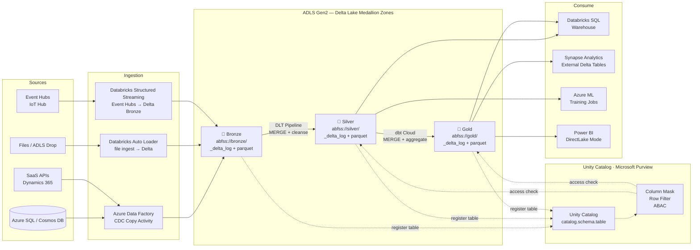
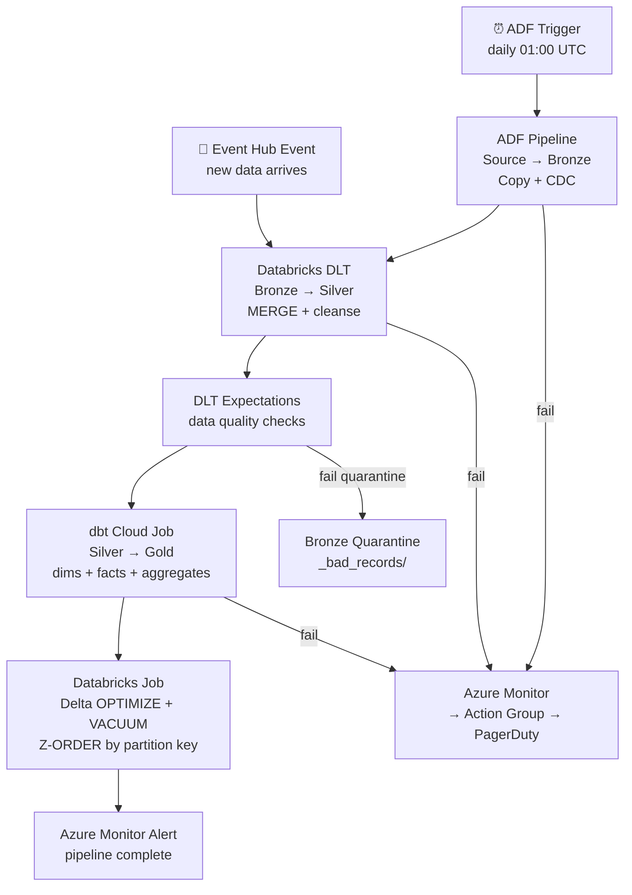

# 3.3 — Data Lakehouse · Azure Fully Managed

**Stack:** ADLS Gen2 · Delta Lake · Azure Databricks · Unity Catalog · dbt Cloud · Azure Synapse Analytics
**Processing:** Batch + Streaming · ACID Transactions · Delta Live Tables · Unity Catalog Governance
**Buy vs Build:** Buy (fully managed, no infra to operate)

---

## Architecture Overview

```
┌─────────────────────────────────────────────────────────────────────────────┐
│  DATA SOURCES                                                               │
│                                                                             │
│  ┌──────────┐  ┌──────────┐  ┌──────────┐  ┌──────────┐  ┌──────────┐    │
│  │Azure SQL │  │ SaaS Apps│  │  Files   │  │ Event    │  │   IoT /  │    │
│  │ / Cosmos │  │(Dynamics │  │(CSV/JSON │  │ Hubs     │  │  Azure   │    │
│  │   DB     │  │  365)    │  │  Parquet)│  │          │  │  IoT Hub │    │
│  └────┬─────┘  └────┬─────┘  └────┬─────┘  └────┬─────┘  └────┬─────┘    │
└───────┼─────────────┼─────────────┼──────────────┼─────────────┼──────────┘
        │             │             │              │             │
        ▼             ▼             ▼              ▼             ▼
┌─────────────────────────────────────────────────────────────────────────────┐
│  INGESTION LAYER                                                            │
│                                                                             │
│  ┌─────────────────┐   ┌─────────────────┐   ┌─────────────────┐          │
│  │  Azure Data     │   │  Azure          │   │  Event Hubs     │          │
│  │  Factory        │   │  Databricks     │   │  → Databricks   │          │
│  │  (CDC / copy)   │   │  Auto Loader    │   │  Structured     │          │
│  │                 │   │  (file ingest)  │   │  Streaming      │          │
│  └────────┬────────┘   └────────┬────────┘   └────────┬────────┘          │
└───────────┼────────────────────┼─────────────────────┼────────────────────┘
            └────────────────────┼─────────────────────┘
                                 ▼
┌─────────────────────────────────────────────────────────────────────────────┐
│  STORAGE — ADLS Gen2  (Delta Lake table format)                             │
│                                                                             │
│  ┌─────────────────┐   ┌─────────────────┐   ┌─────────────────┐          │
│  │  BRONZE         │   │   SILVER        │   │   GOLD          │          │
│  │  abfss://bronze/│──▶│  abfss://silver/│──▶│  abfss://gold/  │          │
│  │                 │   │                 │   │                 │          │
│  │ • Auto Loader   │   │ • DLT pipeline  │   │ • dbt Cloud     │          │
│  │ • Delta APPEND  │   │ • MERGE dedup   │   │ • MERGE models  │          │
│  │ • _delta_log/   │   │ • Type-cast     │   │ • Kimball dims  │          │
│  │ • *.parquet     │   │ • *.parquet     │   │ • *.parquet     │          │
│  └─────────────────┘   └─────────────────┘   └─────────────────┘          │
│                                                                             │
│  Delta Lake: ACID · time travel · schema enforcement · OPTIMIZE / VACUUM   │
└─────────────────────────────────────────────────────────────────────────────┘
        ┆ (register)              ┆ (register)             ┆ (register)
        ▼                         ▼                        ▼
┌─────────────────────────────────────────────────────────────────────────────┐
│  CATALOG & GOVERNANCE — Databricks Unity Catalog                            │
│  ┄ ┄ ┄ ┄ ┄ ┄ ┄ ┄ ┄ ┄ ┄ ┄ ┄ ┄ ┄ ┄ ┄ ┄ ┄ ┄ ┄ ┄ ┄ ┄ ┄ ┄ ┄ ┄ ┄ ┄ ┄ ┄ ┄   │
│  Unity Catalog → 3-level namespace: catalog.schema.table                   │
│  Column masking · row filtering · attribute-based access control (ABAC)    │
│  Microsoft Purview → data lineage · PII classification · sensitivity labels│
│  ┄ ┄ ┄ ┄ ┄ ┄ ┄ ┄ ┄ ┄ ┄ ┄ ┄ ┄ ┄ ┄ ┄ ┄ ┄ ┄ ┄ ┄ ┄ ┄ ┄ ┄ ┄ ┄ ┄ ┄ ┄ ┄ ┄   │
└────────────────────────────────┬────────────────────────────────────────────┘
                                 │ schema lookup + access enforcement
         ┌───────────────────────┼───────────────────────┐
         ▼                       ▼                       ▼
┌─────────────────┐   ┌──────────────────┐   ┌──────────────────────────────┐
│ CONSUMPTION     │   │ CONSUMPTION      │   │ CONSUMPTION                  │
│ — Ad-hoc SQL    │   │ — BI / Reporting │   │ — ML / Science               │
│                 │   │                  │   │                              │
│ Databricks SQL  │   │ Synapse          │   │ Azure ML                     │
│ Warehouse       │   │ Analytics        │   │ (reads Silver via            │
│ (serverless     │   │ (Gold external   │   │  Databricks Feature Store    │
│  Databricks SQL)│   │  Delta tables)   │   │  or direct ADLS read)        │
│                 │   │ Power BI         │   │                              │
│                 │   │ (DirectLake)     │   │                              │
└─────────────────┘   └──────────────────┘   └──────────────────────────────┘
```

---

## Data Flow



---

## Zone Design

```
abfss://<container>@<account>.dfs.core.windows.net/
│
├── bronze/
│   └── {source}/{table}/
│       ├── _delta_log/             ← Delta transaction log (ACID)
│       └── part-*.parquet          ← raw data files
│
├── silver/
│   └── {domain}/{entity}/
│       ├── _delta_log/
│       └── part-*.parquet          ← cleansed, deduped, type-cast
│
└── gold/
    └── {domain}/{dbt_model}/
        ├── _delta_log/
        └── part-*.parquet          ← dbt-built dims, facts, aggregates
```

---

## Security Model

```
┌──────────────────────────────────────────────────────────┐
│         Unity Catalog · Azure AD · Key Vault             │
│                                                           │
│  AAD Group / SP           Access Level    Zone(s)        │
│  ─────────────────────    ─────────────   ─────────────  │
│  adf-ingest-sp            Write only      Bronze         │
│  databricks-dlt-cluster   Read + Write    Bronze→Silver  │
│  dbt-cloud-sp             Read + Write    Silver→Gold    │
│  data-engineer-group      Read + Write    All zones      │
│  data-analyst-group       Read only       Gold only      │
│  data-scientist-group     Read only       Silver + Gold  │
│  synapse-linked-sp        Read only       Gold only      │
│  power-bi-sp              Read only       Gold only      │
│                                                           │
│  Unity Catalog column masks  → PII fields in Silver      │
│  Row filters                 → per region / team tag     │
│  Azure Key Vault             → CMK per container         │
│  Microsoft Purview           → auto-label PII on Bronze  │
└──────────────────────────────────────────────────────────┘
```

---

## Orchestration



---

## Component Map

| Component | Azure Service / Tool | Notes |
|-----------|---------------------|-------|
| Object Storage | ADLS Gen2 | Delta Lake transaction log + Parquet data files |
| Table Format | Delta Lake | ACID, time travel, schema enforcement, OPTIMIZE/VACUUM |
| DB Ingestion | Azure Data Factory | Copy Activity + CDC for SQL databases |
| File / SaaS Ingest | Databricks Auto Loader | Incremental file discovery from ADLS |
| Stream Ingestion | Databricks Structured Streaming | Event Hubs → Delta Bronze micro-batch |
| Transform (Bronze→Silver) | Delta Live Tables (DLT) | Declarative pipelines; built-in quality expectations |
| Transform (Silver→Gold) | dbt Cloud | Models run against Databricks SQL warehouse |
| Schema Catalog | Databricks Unity Catalog | 3-level namespace; lineage; column-level security |
| Data Governance | Microsoft Purview | PII classification; lineage scanning |
| Access Control | Unity Catalog ABAC + Azure AD | Column masks, row filters, service principals |
| Ad-hoc Query | Databricks SQL Warehouse | Serverless SQL on Delta Gold/Silver |
| BI Layer | Power BI DirectLake | Direct Delta read; no import needed |
| BI Alternative | Azure Synapse Analytics | External Delta tables via linked service |
| ML Consumption | Azure ML | Reads Silver via Databricks Feature Store |
| Orchestration | ADF + Databricks Workflows | ADF for ingestion; Databricks Workflows for DLT + dbt |
| Table Maintenance | Databricks OPTIMIZE + VACUUM | Scheduled via Databricks Workflows |
| Encryption | Azure Key Vault + CMK | Customer-managed key per container |
| Monitoring | Azure Monitor + Databricks Audit Logs | Pipeline alerts + data access audit |

---

## Comparison vs 3.1 — AWS Fully Managed

| Dimension | 3.1 AWS (Iceberg + Glue) | 3.3 Azure (Delta Lake + Databricks) |
|-----------|--------------------------|--------------------------------------|
| Table Format | Apache Iceberg | Delta Lake |
| Processing Engine | AWS Glue (Serverless Spark) | Azure Databricks (managed Spark) |
| Streaming Ingest | Kinesis Firehose → Glue | Event Hubs → Databricks Streaming |
| Bronze→Silver Transform | dbt Cloud + Glue MERGE | Delta Live Tables (declarative) |
| Silver→Gold Transform | dbt Cloud | dbt Cloud (same) |
| Catalog | AWS Glue + Lake Formation | Databricks Unity Catalog |
| Data Governance | AWS Macie + Lake Formation | Microsoft Purview + Unity Catalog |
| BI Direct Access | Power BI via Athena/Spectrum | Power BI DirectLake (native Delta) |
| Column Security | Lake Formation column masks | Unity Catalog column masks |
| Data Quality | dbt tests | DLT Expectations + dbt tests |
| Multi-engine Queries | Athena + Redshift Spectrum | Databricks SQL + Synapse Analytics |
| Vendor Lock-in | Medium (AWS Glue, DMS) | Higher (Databricks Unity Catalog) |
| Best For | AWS-native teams | Azure-native + Power BI shops |
