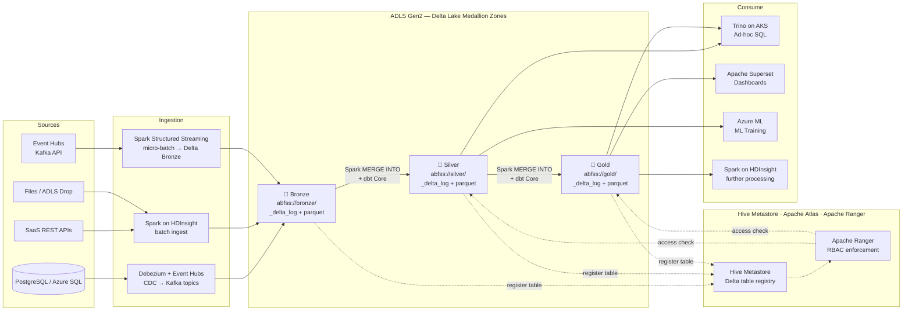
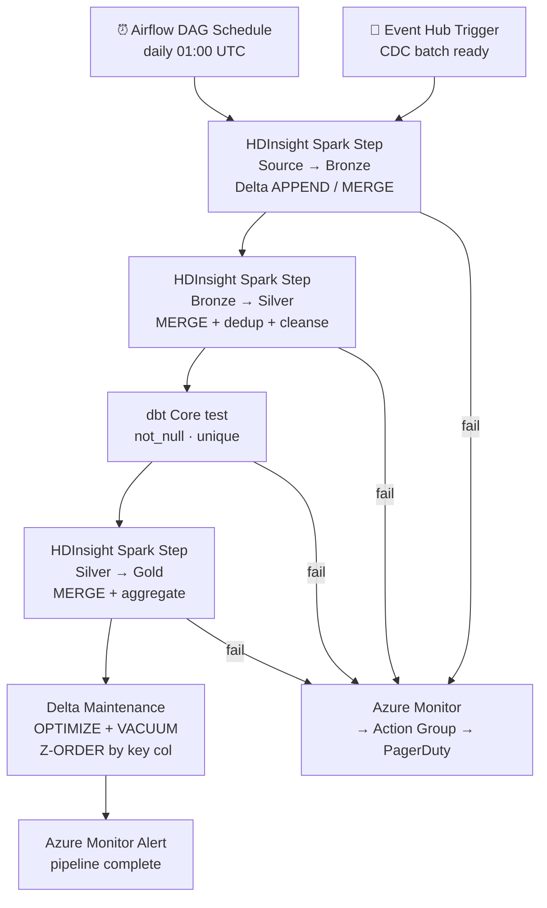

# 3.4 — Data Lakehouse · Azure OSS on Cloud

**Stack:** ADLS Gen2 · Delta Lake · Apache Spark on HDInsight / AKS · dbt Core · Apache Airflow · Apache Hudi (optional) · Trino
**Processing:** Batch + Streaming · ACID Transactions · Open Catalog · Schema Evolution
**Buy vs Build:** Build (OSS stack on Azure managed infra)

---

## Architecture Overview

```
┌─────────────────────────────────────────────────────────────────────────────┐
│  DATA SOURCES                                                               │
│                                                                             │
│  ┌──────────┐  ┌──────────┐  ┌──────────┐  ┌──────────┐  ┌──────────┐    │
│  │PostgreSQL│  │ SaaS APIs│  │  Files   │  │  Azure   │  │   IoT /  │    │
│  │ / Azure  │  │ REST /   │  │(CSV/JSON │  │ Event    │  │  MQTT    │    │
│  │ SQL DB   │  │ JDBC     │  │  Parquet)│  │  Hubs    │  │ → Hubs   │    │
│  └────┬─────┘  └────┬─────┘  └────┬─────┘  └────┬─────┘  └────┬─────┘    │
└───────┼─────────────┼─────────────┼──────────────┼─────────────┼──────────┘
        │             │             │              │             │
        ▼             ▼             ▼              ▼             ▼
┌─────────────────────────────────────────────────────────────────────────────┐
│  INGESTION LAYER                                                            │
│                                                                             │
│  ┌─────────────────┐   ┌─────────────────┐   ┌─────────────────┐          │
│  │  Debezium       │   │  Apache Spark   │   │  Spark          │          │
│  │  + Event Hubs   │   │  on HDInsight   │   │  Structured     │          │
│  │  (CDC → Kafka)  │   │  (batch ingest) │   │  Streaming      │          │
│  └────────┬────────┘   └────────┬────────┘   └────────┬────────┘          │
└───────────┼────────────────────┼─────────────────────┼────────────────────┘
            └────────────────────┼─────────────────────┘
                                 ▼
┌─────────────────────────────────────────────────────────────────────────────┐
│  STORAGE — ADLS Gen2  (Delta Lake table format)                             │
│                                                                             │
│  ┌─────────────────┐   ┌─────────────────┐   ┌─────────────────┐          │
│  │  BRONZE         │   │   SILVER        │   │   GOLD          │          │
│  │  abfss://bronze/│──▶│  abfss://silver/│──▶│  abfss://gold/  │          │
│  │                 │   │                 │   │                 │          │
│  │ • Raw Delta     │   │ • Spark MERGE   │   │ • dbt Core      │          │
│  │ • APPEND write  │   │ • dbt Core      │   │ • Aggregates    │          │
│  │ • _delta_log/   │   │ • Deduped       │   │ • Kimball/Wide  │          │
│  │ • *.parquet     │   │ • Type-cast     │   │ • *.parquet     │          │
│  └─────────────────┘   └─────────────────┘   └─────────────────┘          │
│                                                                             │
│  Delta Lake: ACID · schema enforce · time travel · OPTIMIZE / VACUUM       │
└─────────────────────────────────────────────────────────────────────────────┘
        ┆ (register)              ┆ (register)             ┆ (register)
        ▼                         ▼                        ▼
┌─────────────────────────────────────────────────────────────────────────────┐
│  CATALOG — Apache Hive Metastore on Azure SQL DB + Apache Atlas             │
│  ┄ ┄ ┄ ┄ ┄ ┄ ┄ ┄ ┄ ┄ ┄ ┄ ┄ ┄ ┄ ┄ ┄ ┄ ┄ ┄ ┄ ┄ ┄ ┄ ┄ ┄ ┄ ┄ ┄ ┄ ┄ ┄ ┄   │
│  Hive Metastore → Spark, Trino resolve Delta table schemas + locations     │
│  Apache Atlas → data lineage · classification · governance policies        │
│  Apache Ranger → fine-grained RBAC on Hive Metastore tables                │
│  ┄ ┄ ┄ ┄ ┄ ┄ ┄ ┄ ┄ ┄ ┄ ┄ ┄ ┄ ┄ ┄ ┄ ┄ ┄ ┄ ┄ ┄ ┄ ┄ ┄ ┄ ┄ ┄ ┄ ┄ ┄ ┄ ┄   │
└────────────────────────────────┬────────────────────────────────────────────┘
                                 │ schema lookup + Ranger access check
         ┌───────────────────────┼───────────────────────┐
         ▼                       ▼                       ▼
┌─────────────────┐   ┌──────────────────┐   ┌──────────────────────────────┐
│ CONSUMPTION     │   │ CONSUMPTION      │   │ CONSUMPTION                  │
│ — Ad-hoc SQL    │   │ — BI / Reporting │   │ — ML / Science               │
│                 │   │                  │   │                              │
│ Trino on AKS    │   │ Apache Superset  │   │ Azure ML                     │
│ (Delta connector│   │ (via Trino or    │   │ (reads Silver via            │
│  sub-second SQL)│   │  Spark on Hive)  │   │  Spark on HDInsight)         │
│                 │   │                  │   │                              │
└─────────────────┘   └──────────────────┘   └──────────────────────────────┘
```

---

## Data Flow



---

## Zone Design

```
abfss://<container>@<account>.dfs.core.windows.net/
│
├── bronze/
│   └── {source}/{table}/
│       ├── _delta_log/             ← Delta transaction log
│       └── part-*.parquet
│
├── silver/
│   └── {domain}/{entity}/
│       ├── _delta_log/
│       └── part-*.parquet          ← deduped, cleansed, typed
│
└── gold/
    └── {domain}/{dbt_model}/
        ├── _delta_log/
        └── part-*.parquet          ← dbt-built dims, facts, wide tables
```

---

## Security Model

```
┌──────────────────────────────────────────────────────────┐
│         Apache Ranger · Hive Metastore · Azure Key Vault │
│                                                           │
│  Ranger Principal / Group   Access Level    Zone(s)      │
│  ──────────────────────     ─────────────   ──────────── │
│  spark-ingest-sp            Write only      Bronze       │
│  spark-transform-sp         Read + Write    Bronze→Silver│
│  dbt-core-sp                Read + Write    Silver→Gold  │
│  trino-service-acct         Read only       Silver + Gold│
│  data-engineer-group        Read + Write    All zones    │
│  data-analyst-group         Read only       Gold only    │
│  data-scientist-group       Read only       Silver + Gold│
│  azure-ml-sp                Read only       Silver + Gold│
│                                                           │
│  Ranger column masking → PII columns in Silver           │
│  Ranger row filter     → per team / region tag           │
│  Azure Key Vault CMK   → ADLS container encryption       │
│  Atlas classification  → auto-tag PII entities           │
└──────────────────────────────────────────────────────────┘
```

---

## Orchestration



---

## Component Map

| Component | Tool / Service | Notes |
|-----------|---------------|-------|
| Object Storage | ADLS Gen2 | Delta transaction log + Parquet data files |
| Table Format | Delta Lake | ACID, time travel, schema enforcement |
| CDC Ingestion | Debezium + Azure Event Hubs | Streams DB changes via Kafka-compatible Event Hubs |
| Batch Ingestion | Apache Spark on HDInsight | Delta `foreachBatch` writer |
| Stream Ingestion | Spark Structured Streaming on HDInsight | Micro-batch Event Hubs → Delta Bronze |
| Schema Catalog | Apache Hive Metastore (on Azure SQL DB) | Shared by Spark + Trino |
| Data Lineage / Governance | Apache Atlas | Auto-lineage from Spark hooks |
| Access Control | Apache Ranger | Column/row RBAC on Hive Metastore |
| Transform Layer | dbt Core | Runs against Spark Thrift Server; Delta models |
| Ad-hoc Query | Trino on AKS | Delta connector via Hive Metastore |
| Dashboards | Apache Superset | Connects to Trino |
| ML Consumption | Azure ML | Reads Silver via Spark on HDInsight |
| Orchestration | Apache Airflow (self-hosted on AKS) | DAGs submit HDInsight Spark jobs |
| Table Maintenance | Delta OPTIMIZE + VACUUM | Scheduled Airflow task |
| Encryption | Azure Key Vault CMK | ADLS customer-managed key |
| Monitoring | Azure Monitor + Spark History Server | Job metrics + Airflow task logs |

---

## Comparison vs 3.3 — Azure Fully Managed

| Dimension | 3.3 Azure Fully Managed | 3.4 Azure OSS on Cloud |
|-----------|-------------------------|------------------------|
| Table Format | Delta Lake (same) | Delta Lake (same) |
| Catalog | Databricks Unity Catalog | Apache Hive Metastore + Atlas |
| Access Control | Unity Catalog ABAC | Apache Ranger RBAC |
| Processing Engine | Azure Databricks | Spark on HDInsight / AKS |
| Bronze→Silver | Delta Live Tables | Spark MERGE + dbt Core |
| Silver→Gold | dbt Cloud (SaaS) | dbt Core (self-managed) |
| Streaming Ingest | Databricks Structured Streaming | Spark Structured Streaming |
| Ad-hoc Query | Databricks SQL Warehouse | Trino on AKS |
| BI Layer | Power BI DirectLake | Apache Superset |
| Orchestration | Databricks Workflows + ADF | Apache Airflow on AKS |
| Data Governance | Microsoft Purview | Apache Atlas |
| Vendor Lock-in | High (Databricks + Unity Catalog) | Low (portable OSS stack) |
| Operational Overhead | Low (managed) | High (HDInsight + Ranger + Atlas + Airflow) |
| Cost Model | Databricks DBU-hour | HDInsight + AKS instance-hour |
| Best For | Azure + Databricks committed teams | OSS portability, cost control |
