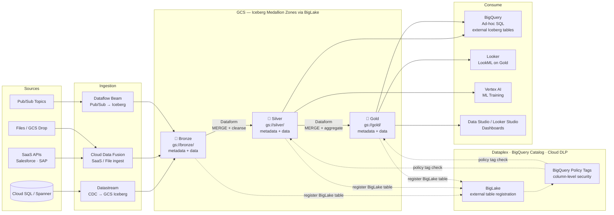
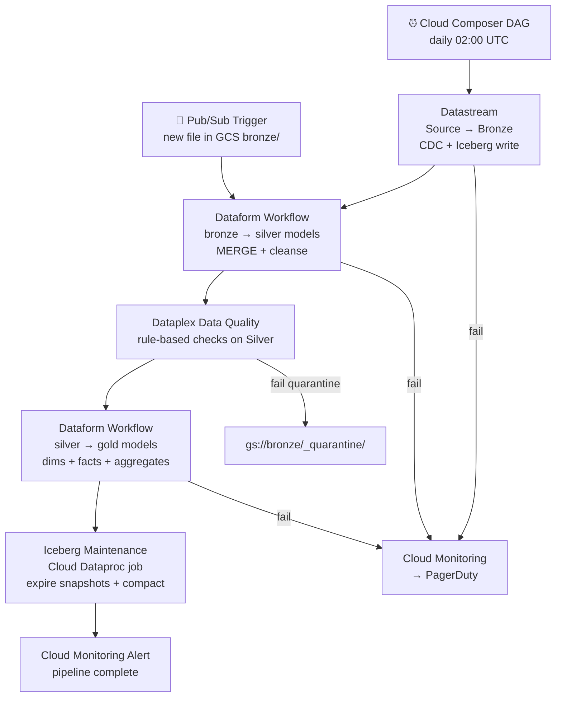

# 3.5 — Data Lakehouse · GCP Fully Managed

**Stack:** GCS · Apache Iceberg · BigLake · BigQuery · Dataform · Cloud Data Fusion · Dataplex
**Processing:** Batch + Streaming · ACID Transactions · BigQuery-native Iceberg · Medallion Architecture
**Buy vs Build:** Buy (fully managed, no infra to operate)

---

## Architecture Overview

```
┌─────────────────────────────────────────────────────────────────────────────┐
│  DATA SOURCES                                                               │
│                                                                             │
│  ┌──────────┐  ┌──────────┐  ┌──────────┐  ┌──────────┐  ┌──────────┐    │
│  │Cloud SQL │  │ SaaS Apps│  │  Files   │  │  Pub/Sub │  │   IoT    │    │
│  │ / Spanner│  │(Salesforce│  │(CSV/JSON │  │  Topics  │  │  Core    │    │
│  │          │  │ SAP etc) │  │  Parquet)│  │          │  │          │    │
│  └────┬─────┘  └────┬─────┘  └────┬─────┘  └────┬─────┘  └────┬─────┘    │
└───────┼─────────────┼─────────────┼──────────────┼─────────────┼──────────┘
        │             │             │              │             │
        ▼             ▼             ▼              ▼             ▼
┌─────────────────────────────────────────────────────────────────────────────┐
│  INGESTION LAYER                                                            │
│                                                                             │
│  ┌─────────────────┐   ┌─────────────────┐   ┌─────────────────┐          │
│  │  Datastream     │   │  Cloud Data     │   │  Dataflow       │          │
│  │  (CDC → GCS /   │   │  Fusion         │   │  (Apache Beam)  │          │
│  │   BigQuery)     │   │  (SaaS / Files) │   │  Pub/Sub→Iceberg│          │
│  └────────┬────────┘   └────────┬────────┘   └────────┬────────┘          │
└───────────┼────────────────────┼─────────────────────┼────────────────────┘
            └────────────────────┼─────────────────────┘
                                 ▼
┌─────────────────────────────────────────────────────────────────────────────┐
│  STORAGE — GCS  (Apache Iceberg table format via BigLake)                   │
│                                                                             │
│  ┌─────────────────┐   ┌─────────────────┐   ┌─────────────────┐          │
│  │  BRONZE         │   │   SILVER        │   │   GOLD          │          │
│  │  gs://bronze/   │──▶│  gs://silver/   │──▶│  gs://gold/     │          │
│  │                 │   │                 │   │                 │          │
│  │ • Raw Iceberg   │   │ • Dataform      │   │ • Dataform      │          │
│  │ • Dataflow write│   │ • MERGE dedup   │   │ • MERGE dims    │          │
│  │ • metadata/     │   │ • Type-cast     │   │ • Kimball/Wide  │          │
│  │ • data/*.parquet│   │ • data/*.parquet│   │ • data/*.parquet│          │
│  └─────────────────┘   └─────────────────┘   └─────────────────┘          │
│                                                                             │
│  BigLake: unified access API for GCS Iceberg tables via BigQuery engine    │
└─────────────────────────────────────────────────────────────────────────────┘
        ┆ (register)              ┆ (register)             ┆ (register)
        ▼                         ▼                        ▼
┌─────────────────────────────────────────────────────────────────────────────┐
│  CATALOG & GOVERNANCE — Dataplex + BigQuery Catalog + Cloud DLP             │
│  ┄ ┄ ┄ ┄ ┄ ┄ ┄ ┄ ┄ ┄ ┄ ┄ ┄ ┄ ┄ ┄ ┄ ┄ ┄ ┄ ┄ ┄ ┄ ┄ ┄ ┄ ┄ ┄ ┄ ┄ ┄ ┄ ┄   │
│  Dataplex → zone management · data quality · auto-discovery                │
│  BigQuery Catalog → external Iceberg table registration via BigLake        │
│  Cloud DLP → PII detection + de-identification on Bronze                   │
│  IAM Conditions → column / row level (BigQuery policy tags)                │
│  ┄ ┄ ┄ ┄ ┄ ┄ ┄ ┄ ┄ ┄ ┄ ┄ ┄ ┄ ┄ ┄ ┄ ┄ ┄ ┄ ┄ ┄ ┄ ┄ ┄ ┄ ┄ ┄ ┄ ┄ ┄ ┄ ┄   │
└────────────────────────────────┬────────────────────────────────────────────┘
                                 │ schema lookup + policy tag enforcement
         ┌───────────────────────┼───────────────────────┐
         ▼                       ▼                       ▼
┌─────────────────┐   ┌──────────────────┐   ┌──────────────────────────────┐
│ CONSUMPTION     │   │ CONSUMPTION      │   │ CONSUMPTION                  │
│ — Ad-hoc SQL    │   │ — BI / Reporting │   │ — ML / Science               │
│                 │   │                  │   │                              │
│ BigQuery        │   │ Looker           │   │ Vertex AI                    │
│ (external tables│   │ (LookML on BQ    │   │ (reads Silver via            │
│  on Iceberg GCS)│   │  Gold models)    │   │  BigQuery or GCS direct)     │
│                 │   │                  │   │                              │
└─────────────────┘   └──────────────────┘   └──────────────────────────────┘
```

---

## Data Flow



---

## Zone Design

```
gs://<company>-lakehouse/
│
├── bronze/
│   └── {source}/{table}/
│       ├── metadata/
│       │   ├── 00000-*.metadata.json   ← Iceberg table metadata
│       │   └── snap-*.avro
│       └── data/
│           └── {year}/{month}/{day}/
│               └── *.parquet
│
├── silver/
│   └── {domain}/{entity}/
│       ├── metadata/
│       └── data/
│           └── {hidden-partition}/
│               └── *.parquet           ← cleansed, deduped, typed
│
└── gold/
    └── {domain}/{dataform_model}/
        ├── metadata/
        └── data/
            └── *.parquet               ← dims, facts, aggregates
```

---

## Security Model

```
┌──────────────────────────────────────────────────────────┐
│         IAM · BigQuery Policy Tags · CMEK                 │
│                                                           │
│  IAM Principal / SA          Access Level    Zone(s)     │
│  ───────────────────────     ─────────────   ─────────── │
│  datastream-sa               Write only      Bronze      │
│  dataflow-sa                 Write only      Bronze      │
│  dataform-sa                 Read + Write    Silver+Gold │
│  data-engineer-group         Read + Write    All zones   │
│  data-analyst-group          Read only       Gold only   │
│  data-scientist-group        Read only       Silver+Gold │
│  vertex-ai-sa                Read only       Silver+Gold │
│  looker-sa                   Read only       Gold only   │
│                                                           │
│  BigQuery Policy Tags → column-level masking on Silver   │
│  Dataplex zones       → IAM boundary per zone            │
│  Cloud DLP            → auto-detect + mask PII on Bronze │
│  CMEK                 → Cloud KMS key per GCS bucket     │
└──────────────────────────────────────────────────────────┘
```

---

## Orchestration



---

## Component Map

| Component | GCP Service / Tool | Notes |
|-----------|-------------------|-------|
| Object Storage | Google Cloud Storage (GCS) | Iceberg metadata + Parquet data files |
| Table Format | Apache Iceberg | ACID, time travel, hidden partitioning |
| Open Table API | BigLake | Unified access layer for GCS Iceberg via BigQuery |
| DB Ingestion (CDC) | Datastream | CDC from Cloud SQL / Spanner / AlloyDB → GCS |
| SaaS / File Ingestion | Cloud Data Fusion | 100+ connectors; writes to GCS Bronze |
| Stream Ingestion | Dataflow (Apache Beam) | Pub/Sub → Iceberg GCS; exactly-once |
| Transform (Bronze→Gold) | Dataform | SQL-based transforms; runs in BigQuery engine |
| Schema Catalog | BigQuery Catalog + BigLake | External Iceberg table registration |
| Data Governance | Dataplex | Zone management + data quality rules |
| PII Detection | Cloud DLP | Auto-classify + mask PII on Bronze |
| Access Control | IAM + BigQuery Policy Tags | Column-level masking via policy tag taxonomy |
| Ad-hoc Query | BigQuery (external tables) | Serverless SQL on Iceberg GCS |
| BI Layer | Looker + LookML | Semantic layer on Gold BigQuery external tables |
| ML Consumption | Vertex AI | Reads Silver/Gold via BigQuery or GCS direct |
| Orchestration | Cloud Composer (Airflow) | Triggers Datastream, Dataform, DQ checks |
| Table Maintenance | Dataproc Spark job | Iceberg `expire_snapshots` + `rewrite_data_files` |
| Encryption | Cloud KMS (CMEK) | Per-bucket customer-managed encryption key |
| Monitoring | Cloud Monitoring + Cloud Audit Logs | Pipeline metrics + GCS data access |

---

## Comparison vs 3.1 — AWS Fully Managed

| Dimension | 3.1 AWS (Iceberg + Glue) | 3.5 GCP (Iceberg + BigLake) |
|-----------|--------------------------|------------------------------|
| Table Format | Apache Iceberg (same) | Apache Iceberg (same) |
| Storage | Amazon S3 | Google Cloud Storage |
| Open Table API | AWS Glue Catalog (Iceberg REST) | BigLake (unified API) |
| CDC Ingestion | AWS DMS | Datastream |
| SaaS Ingestion | AWS Glue ETL | Cloud Data Fusion |
| Stream Ingestion | Kinesis Firehose → Glue | Dataflow (Apache Beam) |
| Transform Tool | dbt Cloud | Dataform (GCP-native) |
| Ad-hoc Query | Amazon Athena v3 | BigQuery (external Iceberg tables) |
| BI Layer | QuickSight / Redshift Spectrum | Looker + LookML |
| ML Consumption | SageMaker | Vertex AI |
| Data Governance | AWS Macie + Lake Formation | Dataplex + Cloud DLP |
| Column Security | Lake Formation column masks | BigQuery Policy Tags |
| Orchestration | dbt Cloud Scheduler | Cloud Composer (Airflow) |
| Best For | AWS-native teams | GCP-native teams + Looker shops |
