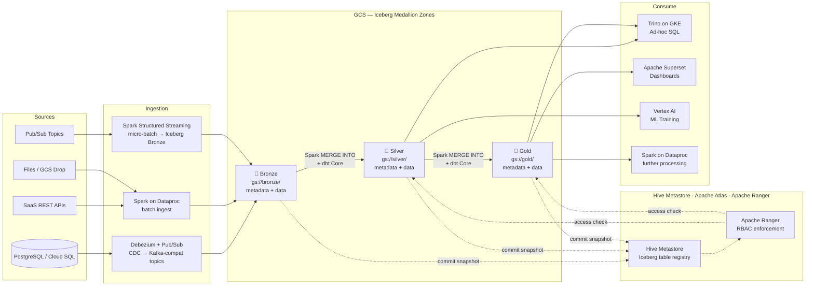
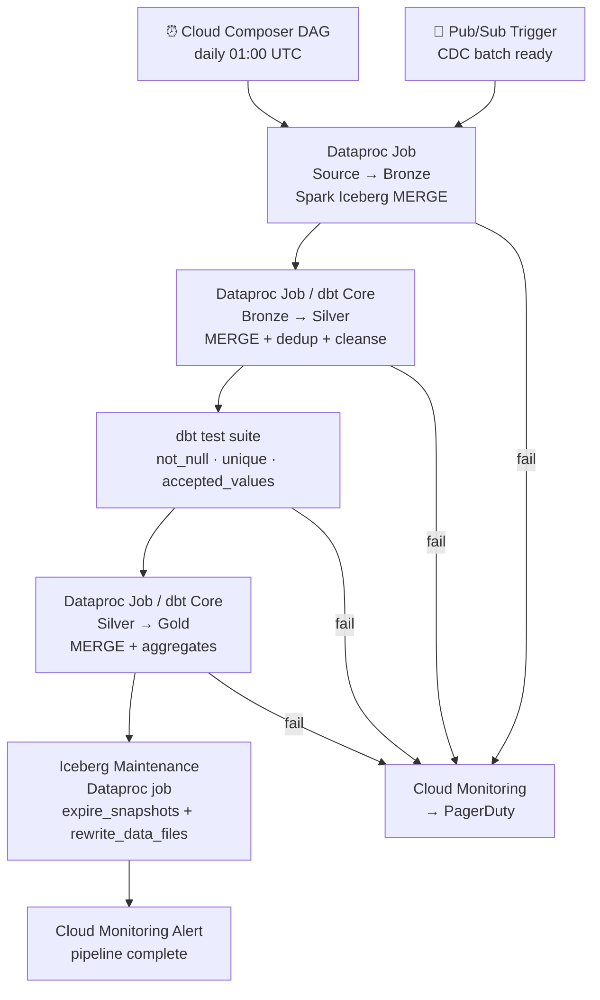

# 3.6 — Data Lakehouse · GCP OSS on Cloud

**Stack:** GCS · Apache Iceberg · Spark on Dataproc · dbt Core · Apache Airflow (Cloud Composer) · Trino
**Processing:** Batch + Streaming · ACID Transactions · Open Catalog · Schema Evolution
**Buy vs Build:** Build (OSS stack on GCP managed infra)

---

## Architecture Overview

```
┌─────────────────────────────────────────────────────────────────────────────┐
│  DATA SOURCES                                                               │
│                                                                             │
│  ┌──────────┐  ┌──────────┐  ┌──────────┐  ┌──────────┐  ┌──────────┐    │
│  │PostgreSQL│  │ SaaS APIs│  │  Files   │  │  Pub/Sub │  │   IoT    │    │
│  │ / Cloud  │  │ REST /   │  │(CSV/JSON │  │  Topics  │  │  Core    │    │
│  │ SQL      │  │ JDBC     │  │  Parquet)│  │          │  │          │    │
│  └────┬─────┘  └────┬─────┘  └────┬─────┘  └────┬─────┘  └────┬─────┘    │
└───────┼─────────────┼─────────────┼──────────────┼─────────────┼──────────┘
        │             │             │              │             │
        ▼             ▼             ▼              ▼             ▼
┌─────────────────────────────────────────────────────────────────────────────┐
│  INGESTION LAYER                                                            │
│                                                                             │
│  ┌─────────────────┐   ┌─────────────────┐   ┌─────────────────┐          │
│  │  Debezium       │   │  Apache Spark   │   │  Spark          │          │
│  │  + Pub/Sub      │   │  on Dataproc    │   │  Structured     │          │
│  │  (CDC → Kafka)  │   │  (batch ingest) │   │  Streaming      │          │
│  └────────┬────────┘   └────────┬────────┘   └────────┬────────┘          │
└───────────┼────────────────────┼─────────────────────┼────────────────────┘
            └────────────────────┼─────────────────────┘
                                 ▼
┌─────────────────────────────────────────────────────────────────────────────┐
│  STORAGE — Google Cloud Storage  (Apache Iceberg table format)              │
│                                                                             │
│  ┌─────────────────┐   ┌─────────────────┐   ┌─────────────────┐          │
│  │  BRONZE         │   │   SILVER        │   │   GOLD          │          │
│  │  gs://bronze/   │──▶│  gs://silver/   │──▶│  gs://gold/     │          │
│  │                 │   │                 │   │                 │          │
│  │ • Raw Iceberg   │   │ • Spark MERGE   │   │ • dbt Core      │          │
│  │ • APPEND write  │   │ • dbt Core      │   │ • Aggregates    │          │
│  │ • metadata/     │   │ • Deduped       │   │ • Kimball/Wide  │          │
│  │ • data/*.parquet│   │ • Type-cast     │   │ • data/*.parquet│          │
│  └─────────────────┘   └─────────────────┘   └─────────────────┘          │
│                                                                             │
│  Iceberg V2: row-level deletes · partition evolution · snapshot isolation  │
└─────────────────────────────────────────────────────────────────────────────┘
        ┆ (commit snapshot)       ┆ (commit snapshot)      ┆ (commit snapshot)
        ▼                         ▼                        ▼
┌─────────────────────────────────────────────────────────────────────────────┐
│  CATALOG — Hive Metastore on Dataproc + Apache Atlas (on GKE)               │
│  ┄ ┄ ┄ ┄ ┄ ┄ ┄ ┄ ┄ ┄ ┄ ┄ ┄ ┄ ┄ ┄ ┄ ┄ ┄ ┄ ┄ ┄ ┄ ┄ ┄ ┄ ┄ ┄ ┄ ┄ ┄ ┄ ┄   │
│  Hive Metastore → Spark, Trino resolve Iceberg table schemas + locations   │
│  Apache Atlas → data lineage · PII classification · governance policies    │
│  Apache Ranger (on GKE) → fine-grained RBAC on metastore tables            │
│  ┄ ┄ ┄ ┄ ┄ ┄ ┄ ┄ ┄ ┄ ┄ ┄ ┄ ┄ ┄ ┄ ┄ ┄ ┄ ┄ ┄ ┄ ┄ ┄ ┄ ┄ ┄ ┄ ┄ ┄ ┄ ┄ ┄   │
└────────────────────────────────┬────────────────────────────────────────────┘
                                 │ schema lookup + Ranger access check
         ┌───────────────────────┼───────────────────────┐
         ▼                       ▼                       ▼
┌─────────────────┐   ┌──────────────────┐   ┌──────────────────────────────┐
│ CONSUMPTION     │   │ CONSUMPTION      │   │ CONSUMPTION                  │
│ — Ad-hoc SQL    │   │ — BI / Reporting │   │ — ML / Science               │
│                 │   │                  │   │                              │
│ Trino on GKE    │   │ Apache Superset  │   │ Vertex AI                    │
│ (Iceberg connect│   │ (connects via    │   │ (reads Silver via            │
│  sub-second SQL)│   │  Trino)          │   │  Spark on Dataproc)          │
│                 │   │                  │   │                              │
└─────────────────┘   └──────────────────┘   └──────────────────────────────┘
```

---

## Data Flow



---

## Zone Design

```
gs://<company>-lakehouse/
│
├── bronze/
│   └── {source}/{table}/
│       ├── metadata/
│       │   ├── 00000-*.metadata.json
│       │   └── snap-*.avro
│       └── data/
│           └── {year=YYYY}/{month=MM}/{day=DD}/
│               └── *.parquet
│
├── silver/
│   └── {domain}/{entity}/
│       ├── metadata/
│       └── data/
│           └── {hidden-partition}/
│               └── *.parquet           ← deduped, cleansed, typed
│
└── gold/
    └── {domain}/{dbt_model}/
        ├── metadata/
        └── data/
            └── *.parquet               ← dbt-built dims, facts, wide tables
```

---

## Security Model

```
┌──────────────────────────────────────────────────────────┐
│         Apache Ranger · Hive Metastore · Cloud KMS        │
│                                                           │
│  Ranger Principal / SA      Access Level    Zone(s)      │
│  ─────────────────────      ─────────────   ──────────── │
│  dataproc-ingest-sa         Write only      Bronze       │
│  spark-streaming-sa         Write only      Bronze       │
│  dbt-core-sa                Read + Write    Silver+Gold  │
│  trino-sa                   Read only       Silver+Gold  │
│  data-engineer-group        Read + Write    All zones    │
│  data-analyst-group         Read only       Gold only    │
│  data-scientist-group       Read only       Silver+Gold  │
│  vertex-ai-sa               Read only       Silver+Gold  │
│                                                           │
│  Ranger column masking → PII columns in Silver           │
│  Ranger row filter     → per team / region tag           │
│  Cloud KMS CMEK        → per GCS bucket encryption       │
│  Atlas classification  → auto-tag PII entities           │
└──────────────────────────────────────────────────────────┘
```

---

## Orchestration



---

## Component Map

| Component | Tool / Service | Notes |
|-----------|---------------|-------|
| Object Storage | Google Cloud Storage (GCS) | Iceberg metadata + Parquet data files |
| Table Format | Apache Iceberg v2 | ACID, hidden partitioning, V2 row-level deletes |
| CDC Ingestion | Debezium + Pub/Sub | Streams DB changes via Pub/Sub Kafka-compatible API |
| Batch Ingestion | Apache Spark on Dataproc | `iceberg-spark-runtime` jar; APPEND + MERGE |
| Stream Ingestion | Spark Structured Streaming on Dataproc | Micro-batch Pub/Sub → Iceberg Bronze |
| Schema Catalog | Hive Metastore (Dataproc) | Shared by Spark + Trino |
| Data Lineage / Governance | Apache Atlas on GKE | Auto-lineage from Spark Atlas connector |
| Access Control | Apache Ranger on GKE | Column/row RBAC on Hive Metastore |
| Transform Layer | dbt Core | Models run against Trino or Spark Thrift Server |
| Ad-hoc Query | Trino on GKE | Iceberg connector via Hive Metastore |
| Dashboards | Apache Superset | Connects to Trino |
| ML Consumption | Vertex AI | Reads Silver via Spark on Dataproc |
| Orchestration | Cloud Composer (Airflow 2.x) | DAGs submit Dataproc jobs + dbt CLI tasks |
| Table Maintenance | Iceberg `expire_snapshots` + `rewrite_data_files` | Scheduled Airflow task via Dataproc |
| Encryption | Cloud KMS (CMEK) | Per-bucket customer-managed encryption key |
| Monitoring | Cloud Monitoring + Spark History Server | Job metrics + Airflow task logs |

---

## Comparison vs 3.5 — GCP Fully Managed

| Dimension | 3.5 GCP Fully Managed | 3.6 GCP OSS on Cloud |
|-----------|-----------------------|----------------------|
| Table Format | Apache Iceberg (same) | Apache Iceberg (same) |
| Open Table API | BigLake | Hive Metastore (Iceberg catalog) |
| Processing Engine | Dataflow (Beam) + Dataform | Spark on Dataproc |
| CDC Ingestion | Datastream | Debezium + Pub/Sub |
| SaaS Ingestion | Cloud Data Fusion | Spark on Dataproc (custom) |
| Stream Ingestion | Dataflow Apache Beam | Spark Structured Streaming |
| Transform Tool | Dataform (GCP-native) | dbt Core (self-managed) |
| Ad-hoc Query | BigQuery (external Iceberg) | Trino on GKE |
| BI Layer | Looker + LookML | Apache Superset |
| ML Consumption | Vertex AI (same) | Vertex AI (same) |
| Data Governance | Dataplex + Cloud DLP | Apache Atlas + Ranger |
| Column Security | BigQuery Policy Tags | Ranger column masking |
| Orchestration | Cloud Composer (Airflow) | Cloud Composer (Airflow) — same |
| Vendor Lock-in | Medium (Dataform, BigLake) | Low (portable OSS stack) |
| Operational Overhead | Low (managed) | High (Dataproc + GKE Ranger/Atlas) |
| Cost Model | Dataflow + BigQuery on-demand | Dataproc + GKE instance-hour |
| Best For | GCP-native teams + BigQuery users | OSS portability, cost control |
