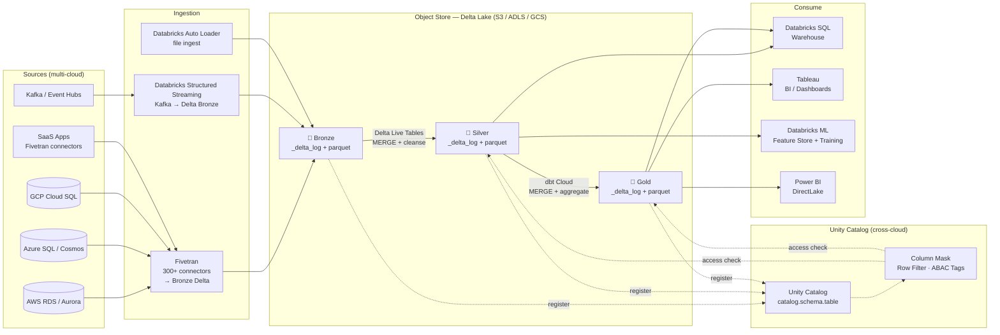
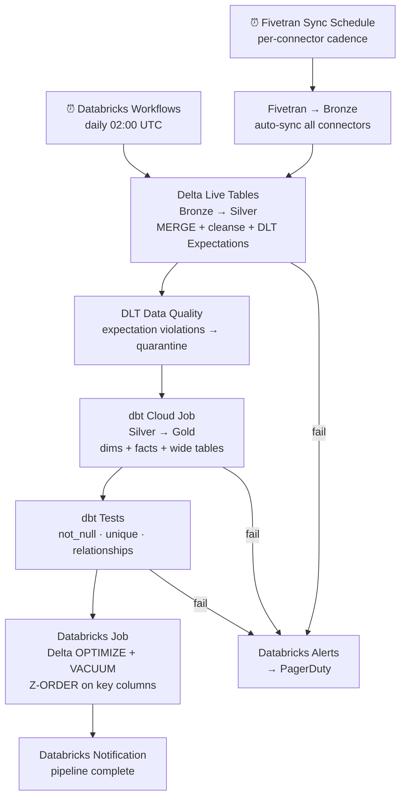

# 3.7 — Data Lakehouse · Multi-Cloud Fully Managed

**Stack:** Databricks (AWS + Azure + GCP) · Delta Lake · Unity Catalog · dbt Cloud · Tableau
**Processing:** Batch + Streaming · ACID Transactions · Cross-Cloud Unified Catalog · Medallion Architecture
**Buy vs Build:** Buy (fully managed across clouds via Databricks control plane)

---

## Architecture Overview

```
┌─────────────────────────────────────────────────────────────────────────────┐
│  DATA SOURCES  (multi-cloud, on-prem)                                       │
│                                                                             │
│  ┌──────────┐  ┌──────────┐  ┌──────────┐  ┌──────────┐  ┌──────────┐    │
│  │AWS RDS / │  │Azure SQL │  │ GCP Cloud│  │ SaaS Apps│  │  Kafka / │    │
│  │Aurora    │  │ / Cosmos │  │ SQL /    │  │(Salesforce│  │ Event    │    │
│  │          │  │          │  │ Spanner  │  │ SAP etc) │  │ Hubs etc)│    │
│  └────┬─────┘  └────┬─────┘  └────┬─────┘  └────┬─────┘  └────┬─────┘    │
└───────┼─────────────┼─────────────┼──────────────┼─────────────┼──────────┘
        │             │             │              │             │
        ▼             ▼             ▼              ▼             ▼
┌─────────────────────────────────────────────────────────────────────────────┐
│  INGESTION LAYER  (cloud-agnostic via Databricks connectors)                │
│                                                                             │
│  ┌─────────────────┐   ┌─────────────────┐   ┌─────────────────┐          │
│  │  Fivetran       │   │  Databricks     │   │  Databricks     │          │
│  │  (300+ SaaS     │   │  Auto Loader    │   │  Structured     │          │
│  │   connectors)   │   │  (file ingest)  │   │  Streaming      │          │
│  └────────┬────────┘   └────────┬────────┘   └────────┬────────┘          │
└───────────┼────────────────────┼─────────────────────┼────────────────────┘
            └────────────────────┼─────────────────────┘
                                 ▼
┌─────────────────────────────────────────────────────────────────────────────┐
│  STORAGE — Cloud Object Store  (Delta Lake table format)                    │
│                                                                             │
│  ┌──────────────────────────────────────────────────────────────────────┐  │
│  │  Primary region (e.g. AWS S3)  ←  replicated to ADLS/GCS if needed  │  │
│  │                                                                      │  │
│  │  ┌─────────────┐   ┌─────────────┐   ┌─────────────┐               │  │
│  │  │  BRONZE     │   │   SILVER    │   │   GOLD      │               │  │
│  │  │  s3|abfss|  │──▶│  s3|abfss|  │──▶│  s3|abfss|  │               │  │
│  │  │  gs://brnz/ │   │  gs://slvr/ │   │  gs://gold/ │               │  │
│  │  │             │   │             │   │             │               │  │
│  │  │ • Fivetran  │   │ • DLT MERGE │   │ • dbt Cloud │               │  │
│  │  │ • Auto Ldr  │   │ • Cleansed  │   │ • Kimball   │               │  │
│  │  │ • _delta_log│   │ • Deduped   │   │ • Wide Table│               │  │
│  │  └─────────────┘   └─────────────┘   └─────────────┘               │  │
│  └──────────────────────────────────────────────────────────────────────┘  │
│                                                                             │
│  Delta Lake: ACID · time travel · OPTIMIZE · VACUUM · schema evolution     │
└─────────────────────────────────────────────────────────────────────────────┘
        ┆ (register)              ┆ (register)             ┆ (register)
        ▼                         ▼                        ▼
┌─────────────────────────────────────────────────────────────────────────────┐
│  CATALOG & GOVERNANCE — Databricks Unity Catalog  (cross-cloud)             │
│  ┄ ┄ ┄ ┄ ┄ ┄ ┄ ┄ ┄ ┄ ┄ ┄ ┄ ┄ ┄ ┄ ┄ ┄ ┄ ┄ ┄ ┄ ┄ ┄ ┄ ┄ ┄ ┄ ┄ ┄ ┄ ┄ ┄   │
│  Single Unity Catalog namespace spans AWS + Azure + GCP workspaces         │
│  Column masking · row filtering · ABAC via catalog tags                    │
│  Databricks Lineage → auto-captured across all Spark + SQL jobs            │
│  ┄ ┄ ┄ ┄ ┄ ┄ ┄ ┄ ┄ ┄ ┄ ┄ ┄ ┄ ┄ ┄ ┄ ┄ ┄ ┄ ┄ ┄ ┄ ┄ ┄ ┄ ┄ ┄ ┄ ┄ ┄ ┄ ┄   │
└────────────────────────────────┬────────────────────────────────────────────┘
                                 │ access check + schema resolution
         ┌───────────────────────┼───────────────────────┐
         ▼                       ▼                       ▼
┌─────────────────┐   ┌──────────────────┐   ┌──────────────────────────────┐
│ CONSUMPTION     │   │ CONSUMPTION      │   │ CONSUMPTION                  │
│ — Ad-hoc SQL    │   │ — BI / Reporting │   │ — ML / Science               │
│                 │   │                  │   │                              │
│ Databricks SQL  │   │ Tableau          │   │ Databricks ML Runtime        │
│ Warehouse       │   │ (via JDBC to SQL │   │ (reads Silver via            │
│ (serverless,    │   │  Warehouse)      │   │  Databricks Feature Store)   │
│  cross-cloud)   │   │ Power BI         │   │                              │
│                 │   │ (DirectLake)     │   │                              │
└─────────────────┘   └──────────────────┘   └──────────────────────────────┘
```

---

## Data Flow



---

## Zone Design

```
<cloud-object-store>://<company>-lakehouse/
│                       (S3 | ADLS | GCS depending on primary region)
│
├── bronze/
│   └── {source}/{connector}/{table}/
│       ├── _delta_log/             ← Delta transaction log
│       └── part-*.parquet
│
├── silver/
│   └── {domain}/{entity}/
│       ├── _delta_log/
│       └── part-*.parquet          ← deduped, cleansed, typed
│
└── gold/
    └── {domain}/{dbt_model}/
        ├── _delta_log/
        └── part-*.parquet          ← dims, facts, wide tables
```

---

## Security Model

```
┌──────────────────────────────────────────────────────────┐
│         Unity Catalog · Cloud IAM · KMS per cloud        │
│                                                           │
│  Identity (SSO via IdP)    Access Level    Zone(s)       │
│  ─────────────────────     ─────────────   ──────────── │
│  fivetran-service-acct     Write only      Bronze        │
│  databricks-dlt-cluster    Read + Write    Bronze→Silver │
│  dbt-cloud-sp              Read + Write    Silver→Gold   │
│  data-engineer-group       Read + Write    All zones     │
│  data-analyst-group        Read only       Gold only     │
│  data-scientist-group      Read only       Silver + Gold │
│  tableau-service-acct      Read only       Gold only     │
│  power-bi-sp               Read only       Gold only     │
│                                                           │
│  Unity Catalog column masks  → PII fields in Silver      │
│  Row filters / ABAC tags     → per domain / region       │
│  SSO (Okta / Azure AD)       → SCIM group sync          │
│  Cloud KMS per region        → CMK per object store      │
└──────────────────────────────────────────────────────────┘
```

---

## Orchestration



---

## Component Map

| Component | Tool / Service | Notes |
|-----------|---------------|-------|
| Object Storage | S3 / ADLS Gen2 / GCS | Chosen per Databricks workspace region |
| Table Format | Delta Lake | ACID, time travel, schema enforcement |
| SaaS / DB Ingestion | Fivetran | 300+ managed connectors; lands Delta Bronze |
| File Ingestion | Databricks Auto Loader | Incremental file detection from cloud object store |
| Stream Ingestion | Databricks Structured Streaming | Kafka / Event Hubs / Pub/Sub → Delta Bronze |
| Bronze→Silver Transform | Delta Live Tables (DLT) | Declarative; built-in quality expectations |
| Silver→Gold Transform | dbt Cloud | Databricks-native adapter; runs on SQL Warehouse |
| Schema Catalog | Databricks Unity Catalog | Cross-cloud; 3-level namespace; lineage |
| Access Control | Unity Catalog ABAC + SSO | Column masks, row filters, SCIM group sync |
| Ad-hoc Query | Databricks SQL Warehouse | Serverless; cross-cloud single endpoint |
| BI Layer | Tableau + Power BI DirectLake | Tableau via JDBC; Power BI via DirectLake |
| ML Consumption | Databricks Feature Store + ML Runtime | Reads Silver; online + offline feature serving |
| Orchestration | Databricks Workflows + Fivetran | Workflows for DLT + dbt; Fivetran for ingest |
| Table Maintenance | Databricks OPTIMIZE + VACUUM | Scheduled via Databricks Workflows |
| Encryption | Cloud KMS (per cloud) | CMK per object store bucket/container |
| Monitoring | Databricks Audit Logs + System Tables | Job metrics + data access audit |

---

## Comparison vs 3.3 — Azure Fully Managed (Single Cloud)

| Dimension | 3.3 Azure Databricks (Single Cloud) | 3.7 Databricks Multi-Cloud |
|-----------|--------------------------------------|---------------------------|
| Cloud Scope | Azure only | AWS + Azure + GCP |
| Object Storage | ADLS Gen2 only | S3 / ADLS / GCS (per workspace) |
| Catalog | Unity Catalog (Azure-anchored) | Unity Catalog (cross-cloud metastore) |
| Ingestion | ADF + Auto Loader | Fivetran + Auto Loader |
| Transform | DLT + dbt Cloud (same) | DLT + dbt Cloud (same) |
| BI Layer | Power BI DirectLake | Tableau + Power BI |
| ML | Azure ML | Databricks ML Runtime |
| Governance | Purview + Unity Catalog | Unity Catalog (single pane) |
| Portability | Single cloud | Workloads portable across clouds |
| Cost Model | Databricks DBU + Azure infra | Databricks DBU + multi-cloud infra |
| Operational Complexity | Medium | Higher (multi-cloud networking + IAM) |
| Best For | Azure-committed enterprises | Multi-cloud or cloud-agnostic strategy |
