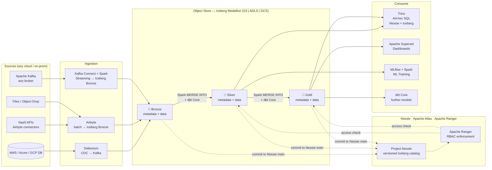
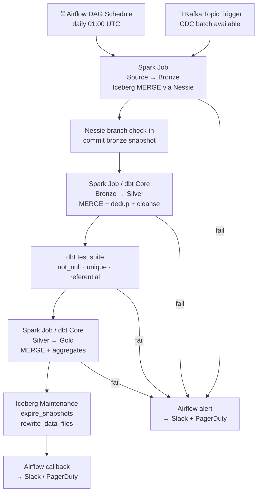

# 3.8 — Data Lakehouse · Multi-Cloud OSS Portable

**Stack:** S3 / ADLS / GCS · Apache Iceberg · Apache Spark · dbt Core · Apache Airflow · Trino · Project Nessie
**Processing:** Batch + Streaming · ACID Transactions · Cross-Cloud Catalog · Full OSS Portability
**Buy vs Build:** Build (fully portable OSS; cloud object store is the only cloud dependency)

---

## Architecture Overview

```
┌─────────────────────────────────────────────────────────────────────────────┐
│  DATA SOURCES  (any cloud, on-prem)                                         │
│                                                                             │
│  ┌──────────┐  ┌──────────┐  ┌──────────┐  ┌──────────┐  ┌──────────┐    │
│  │AWS RDS / │  │Azure SQL │  │ GCP SQL  │  │ SaaS APIs│  │  Apache  │    │
│  │PostgreSQL│  │ / ADLS   │  │ / Spanner│  │ REST /   │  │  Kafka   │    │
│  │          │  │          │  │          │  │ JDBC     │  │ (any)    │    │
│  └────┬─────┘  └────┬─────┘  └────┬─────┘  └────┬─────┘  └────┬─────┘    │
└───────┼─────────────┼─────────────┼──────────────┼─────────────┼──────────┘
        │             │             │              │             │
        ▼             ▼             ▼              ▼             ▼
┌─────────────────────────────────────────────────────────────────────────────┐
│  INGESTION LAYER  (portable OSS)                                            │
│                                                                             │
│  ┌─────────────────┐   ┌─────────────────┐   ┌─────────────────┐          │
│  │  Debezium       │   │  Airbyte        │   │  Kafka Connect  │          │
│  │  (CDC → Kafka)  │   │  (SaaS / batch  │   │  + Spark        │          │
│  │                 │   │   → Iceberg)    │   │  Structured     │          │
│  │                 │   │                 │   │  Streaming      │          │
│  └────────┬────────┘   └────────┬────────┘   └────────┬────────┘          │
└───────────┼────────────────────┼─────────────────────┼────────────────────┘
            └────────────────────┼─────────────────────┘
                                 ▼
┌─────────────────────────────────────────────────────────────────────────────┐
│  STORAGE — Cloud Object Store  (Apache Iceberg · cloud-agnostic)            │
│                                                                             │
│  ┌─────────────────┐   ┌─────────────────┐   ┌─────────────────┐          │
│  │  BRONZE         │   │   SILVER        │   │   GOLD          │          │
│  │  s3|abfss|gs:// │──▶│  s3|abfss|gs:// │──▶│  s3|abfss|gs:// │          │
│  │  bronze/        │   │  silver/        │   │  gold/          │          │
│  │                 │   │                 │   │                 │          │
│  │ • Iceberg ACID  │   │ • Spark MERGE   │   │ • dbt Core      │          │
│  │ • metadata/     │   │ • dbt Core      │   │ • Aggregates    │          │
│  │ • data/*.parquet│   │ • data/*.parquet│   │ • Kimball/Wide  │          │
│  └─────────────────┘   └─────────────────┘   └─────────────────┘          │
│                                                                             │
│  Iceberg V2 + Nessie: ACID · branching · tag-based time travel             │
└─────────────────────────────────────────────────────────────────────────────┘
        ┆ (commit to Nessie)      ┆ (commit to Nessie)     ┆ (commit to Nessie)
        ▼                         ▼                        ▼
┌─────────────────────────────────────────────────────────────────────────────┐
│  CATALOG — Project Nessie (Git-like catalog) + Apache Atlas                 │
│  ┄ ┄ ┄ ┄ ┄ ┄ ┄ ┄ ┄ ┄ ┄ ┄ ┄ ┄ ┄ ┄ ┄ ┄ ┄ ┄ ┄ ┄ ┄ ┄ ┄ ┄ ┄ ┄ ┄ ┄ ┄ ┄ ┄   │
│  Nessie → versioned Iceberg catalog; branches for dev/prod isolation       │
│  Apache Atlas → lineage · PII classification · governance policies         │
│  Apache Ranger → column/row RBAC enforced at Trino + Spark query time      │
│  ┄ ┄ ┄ ┄ ┄ ┄ ┄ ┄ ┄ ┄ ┄ ┄ ┄ ┄ ┄ ┄ ┄ ┄ ┄ ┄ ┄ ┄ ┄ ┄ ┄ ┄ ┄ ┄ ┄ ┄ ┄ ┄ ┄   │
└────────────────────────────────┬────────────────────────────────────────────┘
                                 │ versioned table lookup + Ranger access check
         ┌───────────────────────┼───────────────────────┐
         ▼                       ▼                       ▼
┌─────────────────┐   ┌──────────────────┐   ┌──────────────────────────────┐
│ CONSUMPTION     │   │ CONSUMPTION      │   │ CONSUMPTION                  │
│ — Ad-hoc SQL    │   │ — BI / Reporting │   │ — ML / Science               │
│                 │   │                  │   │                              │
│ Trino           │   │ Apache Superset  │   │ MLflow + custom              │
│ (Nessie + Icebg │   │ (via Trino)      │   │ training pipelines           │
│  connector)     │   │                  │   │ (Spark reads Silver)         │
└─────────────────┘   └──────────────────┘   └──────────────────────────────┘
```

---

## Data Flow



---

## Zone Design

```
<cloud-object-store>://<company>-lakehouse/
│         (S3 | ADLS Gen2 | GCS — same path structure on any cloud)
│
├── bronze/
│   └── {source}/{table}/
│       ├── metadata/
│       │   ├── 00000-*.metadata.json   ← Iceberg table metadata
│       │   └── snap-*.avro
│       └── data/
│           └── {year}/{month}/{day}/
│               └── *.parquet
│
├── silver/
│   └── {domain}/{entity}/
│       ├── metadata/
│       └── data/
│           └── {hidden-partition}/
│               └── *.parquet
│
└── gold/
    └── {domain}/{dbt_model}/
        ├── metadata/
        └── data/
            └── *.parquet
```

---

## Security Model

```
┌──────────────────────────────────────────────────────────┐
│     Apache Ranger · Nessie · Cloud IAM · Vault           │
│                                                           │
│  Ranger Principal / SA    Access Level    Zone(s)        │
│  ─────────────────────    ─────────────   ──────────── │
│  debezium-connector-sa    Write only      Bronze         │
│  airbyte-sa               Write only      Bronze         │
│  spark-transform-sa       Read + Write    Bronze→Silver  │
│  dbt-core-sa              Read + Write    Silver→Gold    │
│  trino-sa                 Read only       Silver + Gold  │
│  data-engineer-group      Read + Write    All zones      │
│  data-analyst-group       Read only       Gold only      │
│  data-scientist-group     Read only       Silver + Gold  │
│                                                           │
│  Nessie branches          → prod / dev / staging catalog │
│  Ranger column masking    → PII columns in Silver        │
│  Ranger row filter        → per team / region tag        │
│  HashiCorp Vault          → secret management (DB creds) │
│  Cloud KMS per region     → CMK per object store bucket  │
└──────────────────────────────────────────────────────────┘
```

---

## Orchestration



---

## Component Map

| Component | Tool / Service | Notes |
|-----------|---------------|-------|
| Object Storage | S3 / ADLS Gen2 / GCS | Cloud-agnostic; same Iceberg path layout |
| Table Format | Apache Iceberg v2 | ACID, hidden partitioning, V2 row deletes |
| Versioned Catalog | Project Nessie | Git-like branches for catalog; Iceberg REST compatible |
| Data Lineage / Governance | Apache Atlas | Auto-lineage; integrates with Spark + dbt |
| Access Control | Apache Ranger | Column/row RBAC; integrates with Trino + Spark |
| CDC Ingestion | Debezium + Apache Kafka | Cloud-agnostic; any Kafka broker |
| SaaS / Batch Ingestion | Airbyte | 300+ connectors; OSS; writes to Iceberg Bronze |
| Stream Ingestion | Kafka Connect + Spark Structured Streaming | Iceberg sink connector |
| Batch Processing | Apache Spark (any cluster manager) | MERGE INTO Iceberg; dbt Core adapter |
| Transform Layer | dbt Core | Runs against Trino; Iceberg adapter |
| Ad-hoc Query | Trino | Nessie + Iceberg connector; cloud-portable |
| Dashboards | Apache Superset | Connects to Trino |
| ML Consumption | MLflow + Apache Spark | Reads Silver via Spark; MLflow experiment tracking |
| Secret Management | HashiCorp Vault | DB credentials + cloud keys |
| Orchestration | Apache Airflow (any deployment) | DAGs for all Spark + dbt tasks |
| Table Maintenance | Iceberg `expire_snapshots` + `rewrite_data_files` | Scheduled Airflow task |
| Encryption | Cloud KMS (per cloud) | CMK per object store bucket |
| Monitoring | Airflow UI + Spark History Server + Atlas | Unified observability across clouds |

---

## Comparison vs 3.7 — Multi-Cloud Fully Managed (Databricks)

| Dimension | 3.7 Databricks Multi-Cloud | 3.8 OSS Portable Multi-Cloud |
|-----------|---------------------------|------------------------------|
| Table Format | Delta Lake | Apache Iceberg |
| Catalog | Databricks Unity Catalog | Project Nessie (git-like versioning) |
| Catalog Versioning | ❌ No branching | ✅ Branch / tag / merge catalog state |
| Ingestion (SaaS) | Fivetran (managed, paid) | Airbyte (OSS, self-hosted) |
| Ingestion (CDC) | Fivetran CDC | Debezium + Kafka |
| Processing Engine | Databricks Runtime | Apache Spark (any cluster) |
| Transform Tool | dbt Cloud (SaaS) | dbt Core (self-managed) |
| Streaming | Databricks Structured Streaming | Kafka Connect + Spark Streaming |
| Interactive Query | Databricks SQL Warehouse | Trino |
| BI Layer | Tableau + Power BI | Apache Superset |
| Governance | Unity Catalog ABAC | Apache Atlas + Ranger |
| Vendor Lock-in | High (Databricks, Fivetran) | Very low (all Apache + CNCF projects) |
| Operational Overhead | Low (managed) | Very high (Nessie + Ranger + Atlas + Airflow + Spark) |
| Cost Model | DBU-hour + Fivetran rows | Compute + engineering time |
| Best For | Enterprises wanting managed multi-cloud | Fully OSS, avoid all vendor lock-in |
