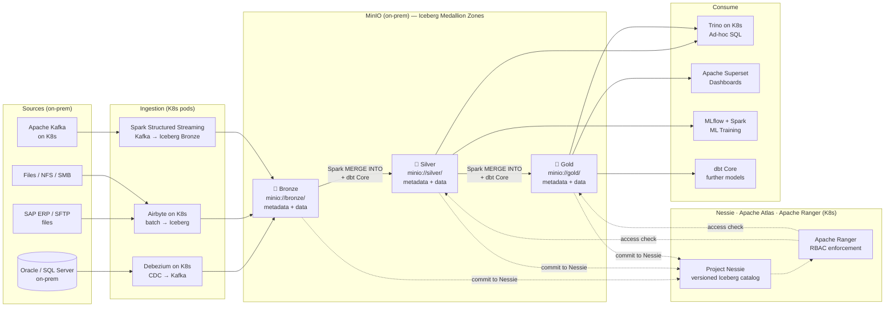
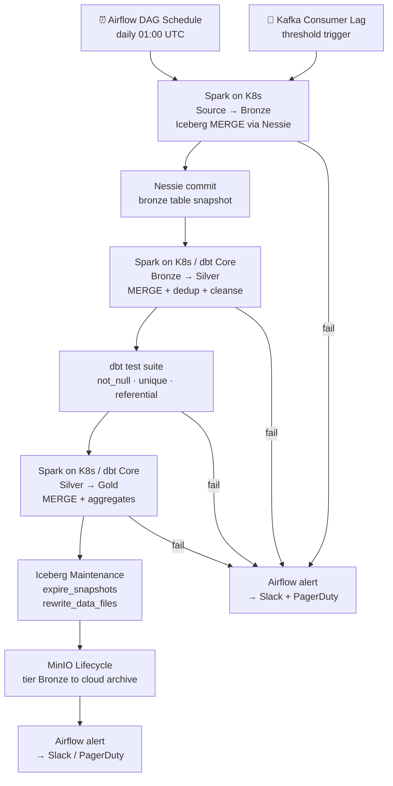

# 3.9 — Data Lakehouse · Hybrid OSS Self-Hosted

**Stack:** MinIO · Apache Iceberg · Apache Spark on Kubernetes · dbt Core · Apache Airflow · Trino · Project Nessie · Apache Ranger
**Processing:** Batch + Streaming · ACID Transactions · On-Prem + Cloud Hybrid · Full Build
**Buy vs Build:** Full Build (self-hosted on-prem / private cloud + cloud object store for spill)

---

## Architecture Overview

```
┌─────────────────────────────────────────────────────────────────────────────┐
│  DATA SOURCES  (on-prem + cloud)                                            │
│                                                                             │
│  ┌──────────┐  ┌──────────┐  ┌──────────┐  ┌──────────┐  ┌──────────┐    │
│  │On-prem   │  │On-prem   │  │  Files / │  │  Apache  │  │  Cloud   │    │
│  │Oracle /  │  │SAP ERP / │  │  NFS /   │  │  Kafka   │  │  SaaS    │    │
│  │SQL Server│  │  SFTP    │  │  SMB     │  │ (on K8s) │  │  (REST)  │    │
│  └────┬─────┘  └────┬─────┘  └────┬─────┘  └────┬─────┘  └────┬─────┘    │
└───────┼─────────────┼─────────────┼──────────────┼─────────────┼──────────┘
        │             │             │              │             │
        ▼             ▼             ▼              ▼             ▼
┌─────────────────────────────────────────────────────────────────────────────┐
│  INGESTION LAYER  (on-prem Kubernetes)                                      │
│                                                                             │
│  ┌─────────────────┐   ┌─────────────────┐   ┌─────────────────┐          │
│  │  Debezium       │   │  Airbyte        │   │  Kafka Connect  │          │
│  │  on K8s         │   │  on K8s         │   │  + Spark        │          │
│  │  (CDC → Kafka)  │   │  (batch / SaaS) │   │  Structured     │          │
│  │                 │   │                 │   │  Streaming      │          │
│  └────────┬────────┘   └────────┬────────┘   └────────┬────────┘          │
└───────────┼────────────────────┼─────────────────────┼────────────────────┘
            └────────────────────┼─────────────────────┘
                                 ▼
┌─────────────────────────────────────────────────────────────────────────────┐
│  STORAGE — MinIO (on-prem S3-compatible) + Cloud spill (S3/ADLS/GCS)       │
│                                                                             │
│  ┌─────────────────┐   ┌─────────────────┐   ┌─────────────────┐          │
│  │  BRONZE         │   │   SILVER        │   │   GOLD          │          │
│  │  minio://bronze/│──▶│  minio://silver/│──▶│  minio://gold/  │          │
│  │  (on-prem hot)  │   │  (on-prem hot)  │   │  (on-prem/cloud)│          │
│  │                 │   │                 │   │                 │          │
│  │ • Iceberg ACID  │   │ • Spark MERGE   │   │ • dbt Core      │          │
│  │ • metadata/     │   │ • dbt Core      │   │ • Aggregates    │          │
│  │ • data/*.parquet│   │ • Deduped       │   │ • Kimball/Wide  │          │
│  └─────────────────┘   └─────────────────┘   └─────────────────┘          │
│                                                                             │
│  Tiering: Bronze → archive to cloud S3/ADLS/GCS after retention period    │
│  MinIO erasure coding + replication across on-prem nodes                  │
└─────────────────────────────────────────────────────────────────────────────┘
        ┆ (commit to Nessie)      ┆ (commit to Nessie)     ┆ (commit to Nessie)
        ▼                         ▼                        ▼
┌─────────────────────────────────────────────────────────────────────────────┐
│  CATALOG — Project Nessie on K8s + Apache Atlas + Apache Ranger             │
│  ┄ ┄ ┄ ┄ ┄ ┄ ┄ ┄ ┄ ┄ ┄ ┄ ┄ ┄ ┄ ┄ ┄ ┄ ┄ ┄ ┄ ┄ ┄ ┄ ┄ ┄ ┄ ┄ ┄ ┄ ┄ ┄ ┄   │
│  Nessie → versioned Iceberg catalog; prod / dev branch isolation            │
│  Apache Atlas → data lineage · PII classification · governance policies    │
│  Apache Ranger → column/row RBAC for Trino + Spark queries                 │
│  ┄ ┄ ┄ ┄ ┄ ┄ ┄ ┄ ┄ ┄ ┄ ┄ ┄ ┄ ┄ ┄ ┄ ┄ ┄ ┄ ┄ ┄ ┄ ┄ ┄ ┄ ┄ ┄ ┄ ┄ ┄ ┄ ┄   │
└────────────────────────────────┬────────────────────────────────────────────┘
                                 │ versioned table lookup + Ranger access check
         ┌───────────────────────┼───────────────────────┐
         ▼                       ▼                       ▼
┌─────────────────┐   ┌──────────────────┐   ┌──────────────────────────────┐
│ CONSUMPTION     │   │ CONSUMPTION      │   │ CONSUMPTION                  │
│ — Ad-hoc SQL    │   │ — BI / Reporting │   │ — ML / Science               │
│                 │   │                  │   │                              │
│ Trino on K8s    │   │ Apache Superset  │   │ MLflow + Spark on K8s        │
│ (Nessie + Icebg │   │ (on K8s)         │   │ (reads Silver from MinIO)    │
│  connector)     │   │                  │   │                              │
└─────────────────┘   └──────────────────┘   └──────────────────────────────┘
```

---

## Data Flow



---

## Zone Design

```
minio://<tenant>-lakehouse/       ← on-prem MinIO (S3-compatible API)
│
├── bronze/
│   └── {source}/{table}/
│       ├── metadata/
│       │   ├── 00000-*.metadata.json   ← Iceberg table metadata
│       │   └── snap-*.avro
│       └── data/
│           └── {year}/{month}/{day}/
│               └── *.parquet
│       TTL: 90 days → tiered to s3://<archive-bucket>/bronze/
│
├── silver/
│   └── {domain}/{entity}/
│       ├── metadata/
│       └── data/
│           └── {hidden-partition}/
│               └── *.parquet
│
└── gold/
    └── {domain}/{dbt_model}/
        ├── metadata/
        └── data/
            └── *.parquet               ← dims, facts, wide tables
```

---

## Security Model

```
┌──────────────────────────────────────────────────────────┐
│    Apache Ranger · Nessie · MinIO IAM · HashiCorp Vault  │
│                                                           │
│  Ranger Principal / SA    Access Level    Zone(s)        │
│  ─────────────────────    ─────────────   ──────────── │
│  debezium-sa              Write only      Bronze         │
│  airbyte-sa               Write only      Bronze         │
│  spark-transform-sa       Read + Write    Bronze→Silver  │
│  dbt-core-sa              Read + Write    Silver→Gold    │
│  trino-sa                 Read only       Silver + Gold  │
│  data-engineer-ldap       Read + Write    All zones      │
│  data-analyst-ldap        Read only       Gold only      │
│  data-scientist-ldap      Read only       Silver + Gold  │
│                                                           │
│  MinIO policies     → bucket-level IAM (S3-compatible)   │
│  Ranger column mask → PII columns in Silver              │
│  Ranger row filter  → per team / cost centre tag         │
│  HashiCorp Vault    → DB creds + MinIO access keys       │
│  Nessie branches    → prod / dev / staging isolation     │
│  LDAP / AD          → principal source for Ranger        │
│  TLS everywhere     → MinIO + Nessie + Trino + Airflow   │
└──────────────────────────────────────────────────────────┘
```

---

## Orchestration



---

## Component Map

| Component | Tool / Service | Notes |
|-----------|---------------|-------|
| On-Prem Object Store | MinIO | S3-compatible API; erasure coding; multi-node HA |
| Cloud Archive Tier | S3 / ADLS / GCS | Bronze TTL overflow; Iceberg table still readable |
| Table Format | Apache Iceberg v2 | ACID, hidden partitioning, V2 row-level deletes |
| Versioned Catalog | Project Nessie | Git-like branches for catalog; runs on K8s |
| Data Lineage | Apache Atlas | Runs on K8s; Spark + dbt hooks |
| Access Control | Apache Ranger | Column/row RBAC; integrates with LDAP/AD |
| CDC Ingestion | Debezium on K8s | Pods per connector; outputs to Kafka |
| Event Broker | Apache Kafka on K8s | Strimzi Operator; on-prem |
| SaaS / Batch Ingestion | Airbyte on K8s | 300+ connectors; targets MinIO Bronze |
| Stream Ingestion | Spark Structured Streaming | Kafka → Iceberg Bronze micro-batch |
| Batch Processing | Apache Spark on K8s | Spark Operator; MERGE INTO Iceberg |
| Transform Layer | dbt Core | Runs against Trino; Iceberg dbt adapter |
| Ad-hoc Query | Trino on K8s | Nessie + Iceberg connector; Ranger plugin |
| Dashboards | Apache Superset on K8s | Connects to Trino |
| ML Consumption | MLflow + Apache Spark | Reads Silver; MLflow on K8s |
| Secret Management | HashiCorp Vault | DB creds, MinIO keys, TLS certs |
| Orchestration | Apache Airflow on K8s | KubernetesExecutor; DAGs in Git |
| Table Maintenance | Iceberg `expire_snapshots` + `rewrite_data_files` | Scheduled Airflow task via Spark |
| Infrastructure | Kubernetes (on-prem bare metal or VMware) | All components run as K8s workloads |
| Monitoring | Prometheus + Grafana + Spark History Server | Full on-prem observability stack |

---

## Comparison vs 3.8 — Multi-Cloud OSS Portable

| Dimension | 3.8 Multi-Cloud OSS | 3.9 Hybrid Self-Hosted |
|-----------|---------------------|------------------------|
| Object Storage | S3 / ADLS / GCS (cloud) | MinIO on-prem + cloud archive spill |
| Data Residency | Cloud region | On-prem datacenter (full control) |
| Catalog | Project Nessie (same) | Project Nessie on K8s (same, self-hosted) |
| Table Format | Apache Iceberg (same) | Apache Iceberg (same) |
| Compute | Cloud-managed clusters | Kubernetes on bare-metal / VMware |
| Network Egress Cost | Cloud object store egress | Near-zero (on-prem → on-prem) |
| Latency (internal) | Cloud WAN latency | On-prem sub-ms latency |
| Compliance | Cloud region boundaries | Full data residency on-prem |
| BI Layer | Apache Superset (same) | Apache Superset (same, on K8s) |
| ML | MLflow + Spark (same) | MLflow + Spark on K8s (same) |
| Cold Storage | Cloud storage classes | MinIO tiering → cloud S3/ADLS/GCS |
| Operational Overhead | Very high (OSS on cloud) | Extreme (OSS + bare-metal + K8s) |
| Skill Requirement | Spark + K8s + Iceberg + dbt | Above + datacenter / storage operations |
| Cost Model | Cloud compute + storage | CapEx (hardware) + OpEx (operations) |
| Best For | Max portability, avoid egress | Regulated industries, data sovereignty |
