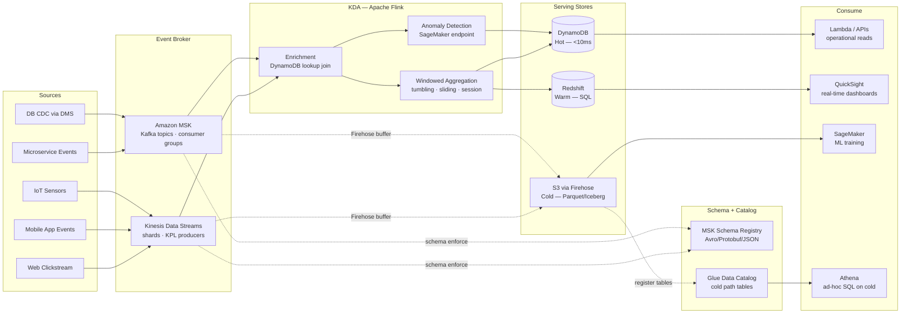
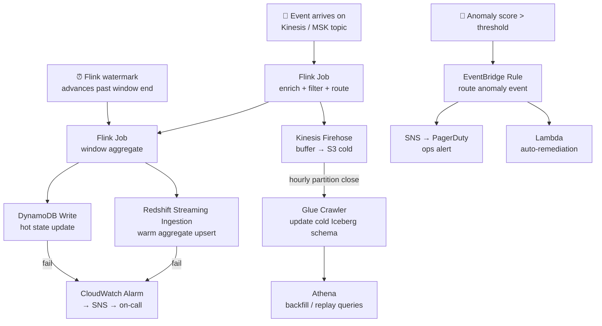

# 4.1 — Streaming / Event-Driven · AWS Fully Managed

**Stack:** Kinesis Data Streams · MSK (Kafka) · Kinesis Data Analytics (Flink) · DynamoDB · Redshift
**Processing:** Streaming-first · Kappa Architecture
**Buy vs Build:** Buy (fully managed, no infra to operate)

---

## Architecture Overview

```
┌─────────────────────────────────────────────────────────────────────────────┐
│  EVENT SOURCES                                                              │
│                                                                             │
│  ┌──────────┐  ┌──────────┐  ┌──────────┐  ┌──────────┐  ┌──────────┐    │
│  │  Web /   │  │  Mobile  │  │   IoT /  │  │Microserv-│  │  DB CDC  │    │
│  │  Click-  │  │  App     │  │  Sensor  │  │  ices    │  │(DMS/CDC) │    │
│  │  stream  │  │  Events  │  │  Telemetry│  │  Events  │  │          │    │
│  └────┬─────┘  └────┬─────┘  └────┬─────┘  └────┬─────┘  └────┬─────┘    │
└───────┼─────────────┼─────────────┼──────────────┼─────────────┼──────────┘
        │             │             │              │             │
        ▼             ▼             ▼              ▼             ▼
┌─────────────────────────────────────────────────────────────────────────────┐
│  EVENT BROKER LAYER                                                         │
│                                                                             │
│  ┌──────────────────────────────┐   ┌──────────────────────────────┐       │
│  │  Amazon Kinesis Data Streams │   │  Amazon MSK (Kafka)          │       │
│  │                              │   │                              │       │
│  │  • High-throughput ingest    │   │  • Kafka-native producers    │       │
│  │  • 1–7 day retention         │   │  • Consumer groups           │       │
│  │  • Shard-based scaling       │   │  • Topic-per-domain          │       │
│  │  • KPL / SDK producers       │   │  • 7–30 day retention        │       │
│  └──────────────┬───────────────┘   └──────────────┬───────────────┘       │
└─────────────────┼────────────────────────────────── ┼──────────────────────┘
                  │                                    │
                  └────────────────┬───────────────────┘
                                   ▼
┌─────────────────────────────────────────────────────────────────────────────┐
│  STREAM PROCESSING — Kinesis Data Analytics (Apache Flink)                  │
│                                                                             │
│  ┌─────────────────┐   ┌─────────────────┐   ┌─────────────────┐          │
│  │  Enrichment     │   │  Windowed        │   │  Anomaly        │          │
│  │  (lookup joins  │   │  Aggregations    │   │  Detection      │          │
│  │   from DynamoDB)│   │  (tumbling/      │   │  (ML models via │          │
│  │                 │   │   sliding/session│   │   SageMaker)    │          │
│  │                 │   │   windows)       │   │                 │          │
│  └────────┬────────┘   └────────┬─────────┘   └────────┬────────┘          │
└───────────┼────────────────────┼────────────────────── ┼───────────────────┘
            │                    │                        │
            └────────────────────┼────────────────────────┘
                                 ▼
┌─────────────────────────────────────────────────────────────────────────────┐
│  SERVING STORES                                                             │
│                                                                             │
│  ┌─────────────────┐   ┌─────────────────┐   ┌─────────────────┐          │
│  │  HOT STORE      │   │  WARM STORE      │   │  COLD STORE     │          │
│  │  DynamoDB       │──▶│  Amazon Redshift │──▶│  S3 + Firehose  │          │
│  │                 │   │  (materialized   │   │  (Parquet for   │          │
│  │ • <10ms reads   │   │   aggregates)    │   │   replay/ML)    │          │
│  │ • Point lookups │   │ • SQL analytics  │   │ • Iceberg table │          │
│  │ • Session state │   │ • BI queries     │   │ • Long retention│          │
│  └─────────────────┘   └─────────────────┘   └─────────────────┘          │
└─────────────────────────────────────────────────────────────────────────────┘
            │                    │                        │
            ▼                    ▼                        ▼
┌─────────────────────────────────────────────────────────────────────────────┐
│  CATALOG & GOVERNANCE — AWS Glue Data Catalog + Lake Formation (Cold path)  │
│  · Schema Registry (MSK / Kinesis) for event schema enforcement             │
│  · Glue Catalog registers S3/Iceberg tables for cold-path SQL access        │
└──────────┬──────────────────────────────────────────────────────────────────┘
           │
           ▼
┌─────────────────────────────────────────────────────────────────────────────┐
│  CONSUMERS                                                                  │
│                                                                             │
│  ┌─────────────────┐  ┌─────────────────┐  ┌─────────────────┐            │
│  │  Operational    │  │  BI / Dashboards │  │  ML / SageMaker │            │
│  │  APIs           │  │                 │  │  Training        │            │
│  │  (DynamoDB)     │  │  QuickSight     │  │  (S3 cold store) │            │
│  │  Lambda triggers│  │  Redshift       │  │                 │            │
│  └─────────────────┘  └─────────────────┘  └─────────────────┘            │
└─────────────────────────────────────────────────────────────────────────────┘
```

---

## Data Flow



---

## Stream Store Design

```
HOT PATH  — DynamoDB
  Table: events_state
    PK: entity_id (user_id / device_id / session_id)
    SK: event_type#timestamp
    TTL: 72 hours (auto-expire)
    GSI: event_type-timestamp-index (for type-based scans)

WARM PATH — Redshift (materialized aggregates)
  Schema: streaming
    events_1min_agg   — 1-minute tumbling window counts/sums per entity
    events_hourly_agg — hourly rollups (loaded from Flink → Redshift Streaming Ingestion)
    anomaly_alerts    — Flink anomaly detection output

COLD PATH — S3 + Kinesis Firehose → Iceberg
  s3://<company>-streaming-cold/
  ├── raw_events/
  │   └── {topic}/{year}/{month}/{day}/{hour}/
  │       └── *.parquet  (Firehose buffered, Snappy)
  └── processed_events/
      └── {domain}/{entity_type}/{year}/{month}/{day}/
          └── *.parquet  (Flink sink, partitioned)
```

---

## Security Model

```
┌──────────────────────────────────────────────────────────────────┐
│  IAM + MSK Schema Registry + DynamoDB Fine-Grained Access        │
│                                                                  │
│  IAM Role            Access Level        Scope                   │
│  ─────────────────   ────────────────    ──────────────────────  │
│  stream-producer     PutRecord / Publish  Kinesis shards + MSK   │
│                                           topics (own domain)    │
│  flink-processor     GetRecords / Consume Kinesis + MSK (all)    │
│                      Write                DynamoDB + Redshift    │
│  api-consumer        GetItem / Query      DynamoDB (hot) only    │
│  bi-analyst          SELECT               Redshift warm schema   │
│  data-scientist      Read                 S3 cold path (Athena)  │
│  ml-engineer         Read                 S3 cold + DynamoDB     │
│                                                                  │
│  Schema Registry  → enforce Avro/Protobuf on every topic         │
│  DynamoDB FGAC    → attribute-level conditions via IAM           │
│  Redshift RLS     → row-level per team/region                    │
│  KMS CMK          → encrypt Kinesis, MSK, DynamoDB, S3           │
└──────────────────────────────────────────────────────────────────┘
```

---

## Orchestration



---

## Component → AWS Service Map

| Component | AWS Service | Notes |
|-----------|-------------|-------|
| Event Broker (throughput) | Amazon Kinesis Data Streams | KPL for high-throughput batched producers; on-demand capacity mode |
| Event Broker (Kafka native) | Amazon MSK | Kafka-compatible; use when migrating from self-hosted Kafka |
| Schema Registry | AWS Glue Schema Registry / MSK Schema Registry | Avro / Protobuf / JSON Schema enforcement per topic |
| Stream Processor | Kinesis Data Analytics (KDA) — Apache Flink | Managed Flink; auto-scaling; ZooKeeper-free via KDA |
| Stream Processor (micro-batch) | AWS Glue Streaming | Simpler; use when sub-second latency not required |
| Hot Serving Store | Amazon DynamoDB | Single-digit ms reads; TTL for automatic expiry of state |
| Warm Serving Store | Amazon Redshift Streaming Ingestion | Direct Kinesis → Redshift materialized views; sub-second latency |
| Cold Store Sink | Kinesis Data Firehose → S3 | Buffers stream to S3 Parquet; dynamic partitioning by event type |
| Cold Store Format | Apache Iceberg on S3 | ACID; time-travel for replay; Flink native writer |
| Catalog (cold path) | AWS Glue Data Catalog | Registers Iceberg tables; Athena + EMR compatible |
| Ad-hoc Query (cold) | Amazon Athena | Serverless SQL on S3/Iceberg cold path |
| BI Dashboards | Amazon QuickSight | SPICE cache on Redshift aggregates; real-time refresh |
| ML Consumption | Amazon SageMaker | Pull from S3 cold store for training datasets |
| Anomaly / ML Inference | SageMaker Real-Time Endpoint | Flink calls endpoint inline for per-event scoring |
| Event Routing | Amazon EventBridge | Route alerts and anomaly outputs to downstream services |
| Orchestration | AWS Step Functions / EventBridge Scheduler | Backfill jobs, crawler triggers, cold-path maintenance |
| Encryption | AWS KMS (CMK) | Encrypts Kinesis shards, MSK topics, DynamoDB, S3 |
| Monitoring | CloudWatch + CloudTrail + X-Ray | Flink job metrics, consumer lag, data access audit |

---

## Comparison vs 4.2 (AWS OSS)

| Dimension | 4.1 AWS Managed | 4.2 AWS OSS |
|-----------|----------------|-------------|
| Kafka management | MSK (managed) | MSK or EC2-hosted Kafka |
| Flink management | KDA (serverless) | Flink on EMR / YARN |
| Hot store | DynamoDB | Apache Cassandra |
| Cold format | Iceberg via Firehose | Iceberg via Flink direct |
| Schema enforcement | Glue Schema Registry | Confluent Schema Registry (self-managed) |
| Ops overhead | Low | High |
| Cost model | Per shard-hour + DPU | EC2/EMR instance-hours |
| Vendor lock-in | High (AWS APIs) | Low (portable Flink/Kafka) |
| Latency | 100ms–1s (KDA) | 10–100ms (self-tuned Flink) |

---

## When to Choose This Implementation

✅ AWS is primary cloud
✅ Want zero infrastructure management for stream processing
✅ Kafka compatibility needed (MSK) alongside Kinesis
✅ Real-time dashboards + operational APIs + ML in one platform
✅ Sub-second to single-digit second latency acceptable

❌ Need <100ms Flink latency with fine-grained tuning → use 4.2 (OSS on EMR)
❌ Kafka-first, multi-cloud portability required → use 4.7 (Confluent Cloud)
❌ Near-real-time analytics only (not event-driven ops) → Pattern 7 (Operational Analytics)
