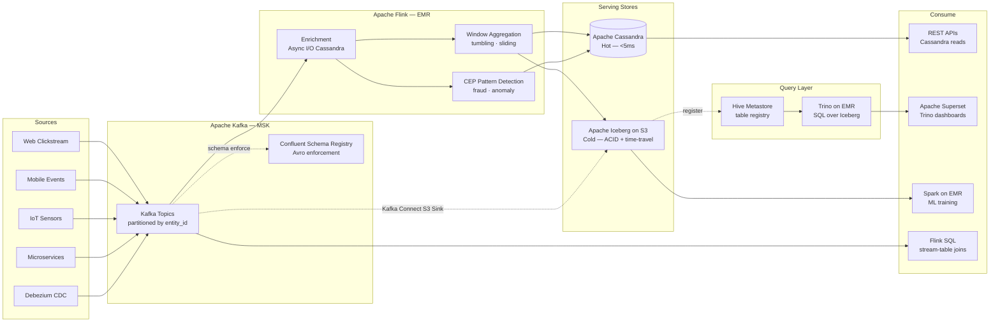
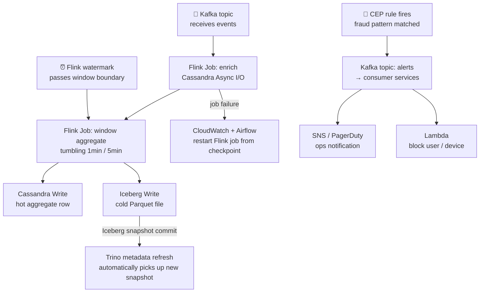

# 4.2 — Streaming / Event-Driven · AWS OSS on Cloud

**Stack:** Kafka on MSK/EC2 · Apache Flink on EMR · Apache Cassandra · Apache Iceberg
**Processing:** Streaming-first · Kappa Architecture
**Buy vs Build:** Build (OSS components, managed infrastructure)

---

## Architecture Overview

```
┌─────────────────────────────────────────────────────────────────────────────┐
│  EVENT SOURCES                                                              │
│                                                                             │
│  ┌──────────┐  ┌──────────┐  ┌──────────┐  ┌──────────┐  ┌──────────┐    │
│  │  Web /   │  │  Mobile  │  │   IoT /  │  │Microserv-│  │  DB CDC  │    │
│  │  Click-  │  │  App     │  │  Sensor  │  │  ices    │  │(Debezium)│    │
│  │  stream  │  │  Events  │  │  Telemetry│  │  Events  │  │          │    │
│  └────┬─────┘  └────┬─────┘  └────┬─────┘  └────┬─────┘  └────┬─────┘    │
└───────┼─────────────┼─────────────┼──────────────┼─────────────┼──────────┘
        │             │             │              │             │
        ▼             ▼             ▼              ▼             ▼
┌─────────────────────────────────────────────────────────────────────────────┐
│  EVENT BROKER — Apache Kafka on Amazon MSK                                  │
│                                                                             │
│  ┌──────────────────────────────────────────────────────────────┐          │
│  │  MSK cluster (3-broker, multi-AZ)                            │          │
│  │                                                              │          │
│  │  Topics (partitioned by entity_id):                          │          │
│  │  • clickstream.raw          • orders.events                  │          │
│  │  • iot.telemetry            • cdc.{db}.{table}               │          │
│  │                                                              │          │
│  │  Confluent Schema Registry (self-managed on EC2)             │          │
│  │  → Avro schema per topic · evolution policies                │          │
│  └──────────────────────────────────────────────────────────────┘          │
└─────────────────────────────────────────────────────────────────────────────┘
        │
        ▼
┌─────────────────────────────────────────────────────────────────────────────┐
│  STREAM PROCESSING — Apache Flink on Amazon EMR                             │
│                                                                             │
│  ┌─────────────────┐   ┌─────────────────┐   ┌─────────────────┐          │
│  │  Enrichment     │   │  Windowed        │   │  CEP / Pattern  │          │
│  │  (Flink Async   │   │  Aggregations    │   │  Detection      │          │
│  │   I/O → Cassand-│   │  (tumbling/      │   │  (Flink CEP     │          │
│  │   ra lookup)    │   │   sliding/       │   │   fraud rules)  │          │
│  │                 │   │   session)       │   │                 │          │
│  └────────┬────────┘   └────────┬─────────┘   └────────┬────────┘          │
└───────────┼────────────────────┼────────────────────── ┼───────────────────┘
            │                    │                        │
            └────────────────────┼────────────────────────┘
                                 ▼
┌─────────────────────────────────────────────────────────────────────────────┐
│  SERVING STORES                                                             │
│                                                                             │
│  ┌─────────────────┐   ┌─────────────────┐   ┌─────────────────┐          │
│  │  HOT STORE      │   │  WARM STORE      │   │  COLD STORE     │          │
│  │  Apache         │   │  Trino on EMR    │──▶│  Apache Iceberg │          │
│  │  Cassandra      │   │  (query engine   │   │  on S3          │          │
│  │  (EC2/EKS)      │   │   over Iceberg)  │   │                 │          │
│  │                 │   │                  │   │ • ACID tables   │          │
│  │ • <5ms reads    │   │ • SQL on Iceberg  │   │ • Time travel   │          │
│  │ • Wide rows     │   │ • BI / ad-hoc    │   │ • Flink direct  │          │
│  │ • TTL native    │   │                  │   │   write         │          │
│  └─────────────────┘   └─────────────────┘   └─────────────────┘          │
└─────────────────────────────────────────────────────────────────────────────┘
            │                    │                        │
            ▼                    ▼                        ▼
┌─────────────────────────────────────────────────────────────────────────────┐
│  CATALOG — Apache Hive Metastore / AWS Glue Data Catalog                    │
│  · Iceberg tables registered for Trino and Flink SQL access                 │
│  · Schema Registry enforces Avro/Protobuf on Kafka topics                  │
└──────────┬──────────────────────────────────────────────────────────────────┘
           │
           ▼
┌─────────────────────────────────────────────────────────────────────────────┐
│  CONSUMERS                                                                  │
│                                                                             │
│  ┌─────────────────┐  ┌─────────────────┐  ┌─────────────────┐            │
│  │  Operational    │  │  BI / Analytics  │  │  ML / Training  │            │
│  │  APIs           │  │  Apache Superset │  │  Spark on EMR   │            │
│  │  (Cassandra)    │  │  (Trino backend) │  │  (S3 Iceberg)   │            │
│  └─────────────────┘  └─────────────────┘  └─────────────────┘            │
└─────────────────────────────────────────────────────────────────────────────┘
```

---

## Data Flow



---

## Stream Store Design

```
HOT PATH  — Apache Cassandra
  Keyspace: streaming_hot
    Table: entity_state
      PK: entity_id  (user_id / device_id)
      CK: event_type, event_time
      TTL: 86400s (1 day default)

    Table: aggregates_1min
      PK: (entity_id, window_start)
      Columns: count, sum, min, max, p99_latency
      TTL: 604800s (7 days)

COLD PATH — Apache Iceberg on S3
  s3://<company>-streaming-iceberg/
  ├── raw_events/
  │   └── {topic}/
  │       └── data/  (Parquet, Snappy, z-order on entity_id)
  │       └── metadata/  (Iceberg manifest + snapshot files)
  └── aggregated_events/
      └── {domain}/{window_type}/
          └── data/  (hourly partitions, Parquet)
```

---

## Security Model

```
┌──────────────────────────────────────────────────────────────────┐
│  Apache Kafka ACLs + Cassandra Auth + Ranger (optional)          │
│                                                                  │
│  Principal              Access Level      Scope                  │
│  ─────────────────────  ───────────────   ──────────────────── │
│  kafka-producer-svc     WRITE             own domain topics      │
│  flink-job-sa           READ (all topics) Kafka consumer group   │
│                         WRITE             Cassandra + Iceberg    │
│  cassandra-api-svc      READ              own keyspace           │
│  trino-query-svc        SELECT            Iceberg tables (Trino) │
│  analyst-role           SELECT            Iceberg (filtered cols)│
│  ml-engineer-role       READ              S3 Iceberg prefix      │
│                                                                  │
│  Kafka mTLS           → inter-broker + producer/consumer TLS     │
│  Kafka ACLs           → topic-level READ/WRITE per service acct  │
│  Cassandra RBAC       → keyspace + table + column level          │
│  Iceberg + Ranger     → row/column filter policies (optional)    │
│  S3 bucket policy     → restrict to VPC endpoint only            │
│  KMS                  → SSE-KMS on S3, EBS volumes               │
└──────────────────────────────────────────────────────────────────┘
```

---

## Orchestration



---

## Component Map

| Component | Tool / Service | Notes |
|-----------|---------------|-------|
| Event Broker | Apache Kafka on Amazon MSK | 3-broker multi-AZ; MSK Serverless option for variable load |
| Schema Registry | Confluent Schema Registry (EC2) | Avro / Protobuf; compatibility modes (BACKWARD/FORWARD) |
| CDC Capture | Debezium (Kafka Connect on EC2/EKS) | MySQL / PostgreSQL / MongoDB connectors |
| Stream Processor | Apache Flink on Amazon EMR | YARN cluster; Flink 1.18+; RocksDB state backend on NVMe |
| State Backend | RocksDB (Flink) + S3 checkpoints | Incremental checkpoints to S3 every 30s |
| Hot Store | Apache Cassandra (EC2 or EKS) | CQL; multi-DC replication; native TTL |
| Cold Store Format | Apache Iceberg on S3 | Flink Iceberg sink; z-order compaction via Spark |
| Query Engine | Trino on EMR | Federation across Iceberg + Cassandra + Hive |
| Data Catalog | Hive Metastore / AWS Glue | Iceberg catalog for Trino + Flink SQL |
| BI Layer | Apache Superset | Trino connection; dashboards on Iceberg aggregates |
| ML Training | Spark on EMR | Reads Iceberg cold store for feature engineering |
| Kafka Connect | Kafka Connect (EC2/EKS) | S3 Sink Connector for raw event archival |
| Orchestration | Apache Airflow (MWAA) | Backfill Flink jobs, compaction, crawler triggers |
| Monitoring | Prometheus + Grafana | Flink job metrics, Kafka consumer lag, Cassandra ops |
| Encryption | AWS KMS + Kafka TLS | S3 SSE-KMS; Kafka inter-broker TLS; Cassandra TLS |

---

## Comparison vs 4.1 (AWS Managed)

| Dimension | 4.2 AWS OSS | 4.1 AWS Managed |
|-----------|------------|----------------|
| Kafka management | MSK (managed broker) + self-managed Schema Registry | MSK + AWS Glue Schema Registry |
| Flink management | Self-managed on EMR YARN | KDA serverless |
| Hot store | Cassandra (self-operated) | DynamoDB (fully managed) |
| Query engine | Trino (self-managed on EMR) | Athena (serverless) |
| Cold format | Iceberg (Flink native write) | Iceberg via Firehose + Glue |
| Latency tuning | Full control (10–50ms achievable) | Limited (100ms–1s typical) |
| Ops overhead | High (Cassandra + Flink + Trino) | Low |
| Cost model | EC2 instance-hours (predictable) | Per shard + DPU (variable) |
| Vendor lock-in | Low — fully portable | High (Kinesis, KDA, DynamoDB) |

---

## When to Choose This Implementation

✅ Need fine-grained Flink tuning for <100ms processing latency
✅ Existing Kafka/Cassandra expertise in the team
✅ Want portability to move off AWS without re-architecting
✅ Confluent Schema Registry compatibility required
✅ Cost predictability more important than managed convenience

❌ Team lacks Flink/Cassandra/Trino operational expertise → use 4.1
❌ Rapid onboarding more valuable than tuning control → use 4.1
❌ Multi-cloud Kafka required → use 4.7 (Confluent Cloud)
