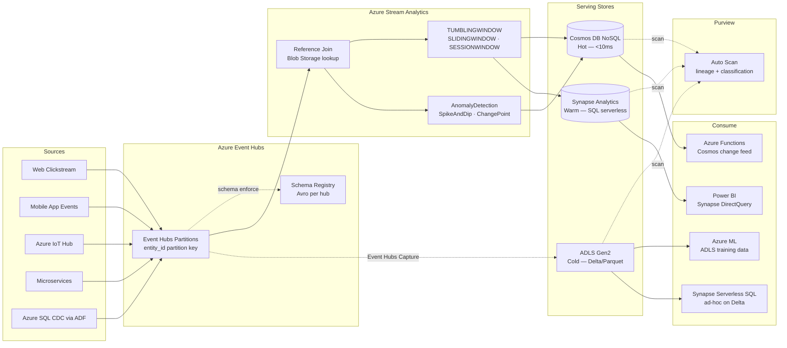

# 4.3 — Streaming / Event-Driven · Azure Fully Managed

**Stack:** Azure Event Hubs · Azure Stream Analytics · Azure Cosmos DB · Azure Synapse Analytics
**Processing:** Streaming-first · Lambda Architecture (speed + batch layers)
**Buy vs Build:** Buy (fully managed, no infra to operate)

---

## Architecture Overview

```
┌─────────────────────────────────────────────────────────────────────────────┐
│  EVENT SOURCES                                                              │
│                                                                             │
│  ┌──────────┐  ┌──────────┐  ┌──────────┐  ┌──────────┐  ┌──────────┐    │
│  │  Web /   │  │  Mobile  │  │   IoT /  │  │Microserv-│  │  DB CDC  │    │
│  │  Click-  │  │  App     │  │  Azure   │  │  ices    │  │(Azure SQL│    │
│  │  stream  │  │  Events  │  │  IoT Hub │  │  Events  │  │ CDC/ADF) │    │
│  └────┬─────┘  └────┬─────┘  └────┬─────┘  └────┬─────┘  └────┬─────┘    │
└───────┼─────────────┼─────────────┼──────────────┼─────────────┼──────────┘
        │             │             │              │             │
        ▼             ▼             ▼              ▼             ▼
┌─────────────────────────────────────────────────────────────────────────────┐
│  EVENT BROKER — Azure Event Hubs                                            │
│                                                                             │
│  ┌──────────────────────────────────────────────────────────────┐          │
│  │  Event Hubs Namespace (Premium tier)                         │          │
│  │                                                              │          │
│  │  Event Hubs (partitioned by entity_id):                      │          │
│  │  • eh-clickstream     (32 partitions)                        │          │
│  │  • eh-iot-telemetry   (64 partitions)                        │          │
│  │  • eh-orders          (16 partitions)                        │          │
│  │  • eh-cdc             (16 partitions)                        │          │
│  │                                                              │          │
│  │  Event Hubs Schema Registry                                  │          │
│  │  → Avro / JSON Schema per hub · compatible evolution         │          │
│  └──────────────────────────────────────────────────────────────┘          │
└─────────────────────────────────────────────────────────────────────────────┘
        │
        ▼
┌─────────────────────────────────────────────────────────────────────────────┐
│  STREAM PROCESSING — Azure Stream Analytics                                 │
│                                                                             │
│  ┌─────────────────┐   ┌─────────────────┐   ┌─────────────────┐          │
│  │  Enrichment     │   │  Windowed        │   │  Anomaly        │          │
│  │  (Reference     │   │  Aggregations    │   │  Detection      │          │
│  │   Data from     │   │  TUMBLINGWINDOW  │   │  (built-in ML   │          │
│  │   Blob Storage) │   │  SLIDINGWINDOW   │   │  AnomalyDetect- │          │
│  │                 │   │  SESSIONWINDOW   │   │  ion function)  │          │
│  └────────┬────────┘   └────────┬─────────┘   └────────┬────────┘          │
└───────────┼────────────────────┼────────────────────── ┼───────────────────┘
            │                    │                        │
            └────────────────────┼────────────────────────┘
                                 ▼
┌─────────────────────────────────────────────────────────────────────────────┐
│  SERVING STORES                                                             │
│                                                                             │
│  ┌─────────────────┐   ┌─────────────────┐   ┌─────────────────┐          │
│  │  HOT STORE      │   │  WARM STORE      │   │  COLD STORE     │          │
│  │  Azure Cosmos DB│   │  Azure Synapse   │──▶│  ADLS Gen2      │          │
│  │  (NoSQL API)    │   │  Analytics       │   │  (Parquet/Delta)│          │
│  │                 │   │                  │   │                 │          │
│  │ • <10ms reads   │   │ • Synapse SQL     │   │ • ADF pipeline  │          │
│  │ • Global dist.  │   │   serverless      │   │   batch loads   │          │
│  │ • Change feed   │   │ • Power BI Direct │   │ • Long retention│          │
│  └─────────────────┘   └─────────────────┘   └─────────────────┘          │
└─────────────────────────────────────────────────────────────────────────────┘
            │                    │                        │
            ▼                    ▼                        ▼
┌─────────────────────────────────────────────────────────────────────────────┐
│  CATALOG & GOVERNANCE — Microsoft Purview                                   │
│  · Auto-scan Event Hubs, Cosmos DB, Synapse, ADLS                           │
│  · Lineage: Event Hubs → ASA → Cosmos DB / Synapse                          │
│  · Data classification: PII tagging, sensitivity labels                     │
└──────────┬──────────────────────────────────────────────────────────────────┘
           │
           ▼
┌─────────────────────────────────────────────────────────────────────────────┐
│  CONSUMERS                                                                  │
│                                                                             │
│  ┌─────────────────┐  ┌─────────────────┐  ┌─────────────────┐            │
│  │  Operational    │  │  BI Dashboards   │  │  ML / Azure ML  │            │
│  │  APIs           │  │  Power BI        │  │  Training        │            │
│  │  (Cosmos DB)    │  │  (Synapse Direct)│  │  (ADLS cold)    │            │
│  │  Azure Functions│  │                 │  │                 │            │
│  └─────────────────┘  └─────────────────┘  └─────────────────┘            │
└─────────────────────────────────────────────────────────────────────────────┘
```

---

## Data Flow



---

## Stream Store Design

```
HOT PATH  — Azure Cosmos DB (NoSQL API)
  Container: entity_state
    Partition Key: /entity_id
    Items:
      { entity_id, event_type, latest_value, last_updated, ttl: 259200 }
    TTL: 3 days (auto-purge)
    Change Feed → Azure Functions for downstream triggers

  Container: aggregates_realtime
    Partition Key: /window_key  (entity_id#window_start)
    Items: { window_start, window_end, count, sum, p99 }
    TTL: 7 days

WARM PATH — Azure Synapse Analytics
  Database: streaming_warm
    Table: events_5min_agg   — Synapse Dedicated Pool (columnstore)
    Table: anomaly_events    — Stream Analytics output
    External Table → Delta tables on ADLS (Synapse Serverless)

COLD PATH — ADLS Gen2 + Delta Lake
  abfss://streaming@<account>.dfs.core.windows.net/
  ├── raw_events/
  │   └── {hub_name}/{year}/{month}/{day}/{hour}/
  │       └── *.avro  (Event Hubs Capture native format)
  └── processed_events/
      └── {domain}/{entity_type}/
          └── _delta_log/  + *.parquet  (Delta Lake format)
```

---

## Security Model

```
┌──────────────────────────────────────────────────────────────────┐
│  Azure RBAC + Cosmos DB RBAC + Synapse Row-Level Security        │
│                                                                  │
│  Azure AD Identity       Access Level     Scope                  │
│  ─────────────────────   ────────────     ──────────────────── │
│  producer-managed-id     Send             Event Hubs namespace   │
│  asa-managed-id          Listen + Write   Event Hubs + Cosmos DB │
│                                           + Synapse + ADLS       │
│  api-function-managed-id Read             Cosmos DB container    │
│  bi-analyst-aad-group    db_datareader    Synapse dedicated pool │
│  data-scientist-group    Storage Blob     ADLS cold prefix       │
│                          Data Reader                             │
│  ml-engineer-group       Storage Blob     ADLS full cold         │
│                          Data Contributor                        │
│                                                                  │
│  Event Hubs Schema Reg → enforce Avro compatibility on publish   │
│  Cosmos DB RBAC        → container-level read/write per identity │
│  Synapse RLS           → row filter by team / region column      │
│  ADLS ACLs             → path-level ACLs via Azure AD groups     │
│  Azure Key Vault       → CMK for Cosmos DB, Synapse, ADLS        │
│  Private Endpoints     → all services behind VNet private DNS    │
└──────────────────────────────────────────────────────────────────┘
```

---

## Orchestration

```mermaid
flowchart TD
    EV1[📡 Event arrives in\nEvent Hubs partition]
    EV2[⏰ ASA window\nboundary crossed]
    EV3[🚨 AnomalyDetection\nspike detected]

    EV1 --> P1[Stream Analytics Job\nenrich + route]
    P1 --> P2[Stream Analytics Job\nwindow aggregate]
    EV2 --> P2
    P2 --> S1[Cosmos DB Write\nhot aggregate upsert]
    P2 --> S2[Synapse Dedicated\nSQL INSERT]
    EV1 -.->|Event Hubs Capture\nevery 5min or 300MB| D3[ADLS Gen2\nAvro raw archive]

    EV3 --> A1[Event Hubs: alerts-topic\n→ downstream consumers]
    A1 --> A2[Azure Service Bus\nnotification queue]
    A2 --> A3[Azure Functions\nauto-remediation action]

    D3 -->|daily ADF pipeline| T1[ADF Mapping Data Flow\nAvro → Delta conversion]
    T1 --> D4[ADLS Delta tables\n(queryable via Synapse Serverless)]

    P1 -->|ASA job fails| ERR[Azure Monitor Alert\n→ Action Group → PagerDuty]
```

---

## Component Map

| Component | Azure Service | Notes |
|-----------|--------------|-------|
| Event Broker | Azure Event Hubs (Premium) | Kafka-compatible endpoint; 1–90 day retention |
| IoT Ingestion | Azure IoT Hub → Event Hubs routing | Device twin + telemetry; routes to Event Hubs |
| Schema Registry | Event Hubs Schema Registry | Avro; inline schema validation on publish |
| Stream Processor | Azure Stream Analytics | SQL-based window queries; built-in ML anomaly detection |
| Reference Data | Azure Blob Storage (ASA reference input) | Static lookup tables joined in ASA queries |
| Hot Store | Azure Cosmos DB (NoSQL API) | Multi-region writes; change feed for downstream triggers |
| Warm Store | Azure Synapse Analytics Dedicated Pool | Columnstore indexes; Power BI DirectQuery |
| Cold Store | ADLS Gen2 + Delta Lake | Event Hubs Capture → Avro → ADF → Delta |
| Cold Query | Synapse Analytics Serverless SQL | External tables over Delta on ADLS |
| Catalog / Governance | Microsoft Purview | Auto-scan, lineage, PII classification |
| BI Layer | Power BI | DirectQuery on Synapse; real-time push datasets from ASA |
| ML Training | Azure Machine Learning | ADLS cold Delta tables as training datasets |
| Event Routing | Azure Service Bus | Durable queuing for downstream async consumers |
| Serverless Triggers | Azure Functions | Cosmos DB change feed; Service Bus queue triggers |
| Orchestration | Azure Data Factory | Daily Avro → Delta conversion; Synapse pipeline |
| Monitoring | Azure Monitor + Application Insights | ASA job metrics, Cosmos RU usage, Event Hubs lag |
| Encryption | Azure Key Vault (CMK) | Customer-managed keys for Cosmos DB, Synapse, ADLS |

---

## Comparison vs 4.4 (Azure OSS)

| Dimension | 4.3 Azure Managed | 4.4 Azure OSS |
|-----------|------------------|--------------|
| Stream processor | Azure Stream Analytics (SQL) | Apache Flink on AKS |
| Processing language | ASA SQL + built-in functions | Java / Python / Flink SQL |
| Hot store | Cosmos DB | Cosmos DB (shared) |
| Cold format | Delta Lake (ADF conversion) | Delta Lake (Flink direct write) |
| Flink CEP | Not supported | Full Flink CEP library |
| Ops overhead | Very low | Medium (AKS + Flink) |
| Latency | ~1s (ASA checkpoint interval) | 50–200ms (Flink) |
| Vendor lock-in | High (ASA proprietary SQL) | Medium (Flink portable) |
| Cost model | ASA SU-hour + Cosmos RU | AKS node-hours + Cosmos RU |

---

## When to Choose This Implementation

✅ Azure is primary cloud
✅ Team prefers SQL-based stream processing over Java/Flink
✅ Power BI is the primary BI tool (tight Synapse integration)
✅ IoT Hub device management required
✅ Minimal streaming expertise — want managed simplicity

❌ Need complex CEP patterns (fraud graphs, sequence detection) → use 4.4
❌ Sub-200ms processing latency required → use 4.4 (Flink on AKS)
❌ Kafka API compatibility critical → use 4.4 (Event Hubs Kafka endpoint + Flink)
