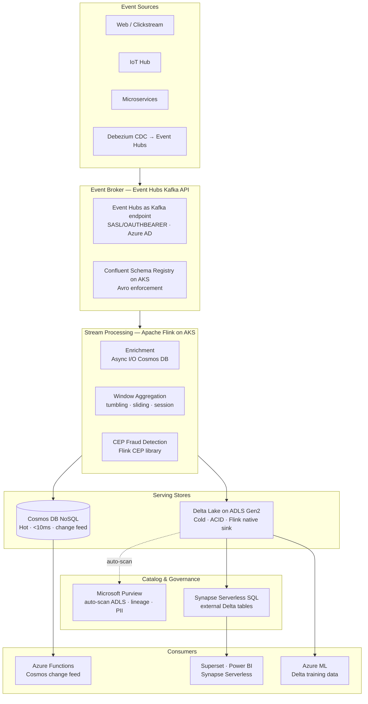
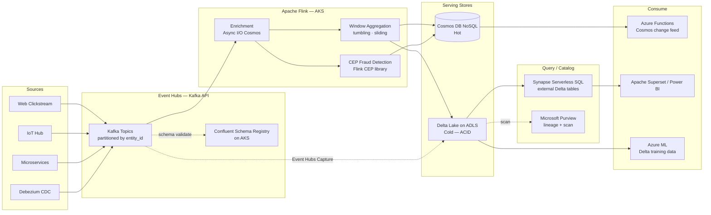
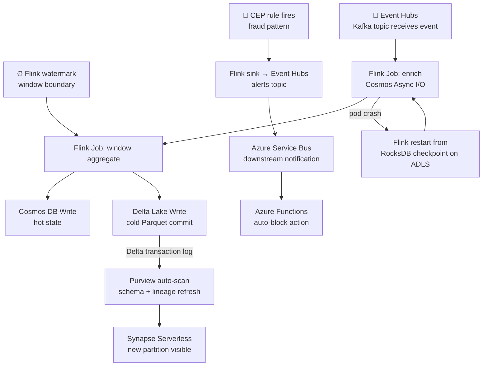

# 4.4 — Streaming / Event-Driven · Azure OSS on Cloud

**Stack:** Azure Event Hubs (Kafka API) · Apache Flink on AKS · Delta Lake · Cosmos DB
**Processing:** Streaming-first · Kappa Architecture
**Buy vs Build:** Build (OSS processing on managed Azure infra)

---

## Architecture Overview



---

## Data Flow



---

## Stream Store Design

```
HOT PATH  — Azure Cosmos DB (NoSQL API)
  Container: stream_state
    Partition Key: /entity_id
    TTL: 86400s (1 day)
    Change Feed → Azure Functions

  Container: window_aggregates
    Partition Key: /window_key  (entity_id#window_type#window_start)
    TTL: 604800s (7 days)

COLD PATH — Delta Lake on ADLS Gen2
  abfss://streaming@<account>.dfs.core.windows.net/
  ├── raw/
  │   └── {topic}/
  │       └── _delta_log/ + *.parquet
  │           (Flink Delta sink, partitioned by event_date)
  └── aggregated/
      └── {domain}/{window_type}/
          └── _delta_log/ + *.parquet
              (Z-order by entity_id + event_date)
```

---

## Security Model

```
┌──────────────────────────────────────────────────────────────────┐
│  Azure AD + Kafka ACLs (Event Hubs) + ADLS ACLs + Cosmos RBAC   │
│                                                                  │
│  Azure AD Identity       Access Level     Scope                  │
│  ─────────────────────   ────────────     ──────────────────── │
│  producer-workload-id    Kafka Send        Event Hubs topics     │
│  flink-job-pod-id        Kafka Consume     Event Hubs (all)      │
│                          Write             Cosmos DB + ADLS      │
│  schema-registry-id      Admin             Schema Registry AKS   │
│  api-function-id         Read              Cosmos DB container   │
│  analyst-aad-group       Storage Blob      ADLS Delta (read)     │
│                          Data Reader                             │
│  ml-engineer-group       Contributor       ADLS full             │
│                                                                  │
│  Event Hubs mTLS      → SASL/OAUTHBEARER via Azure AD           │
│  Flink checkpoints    → ADLS + Azure Key Vault secret ref        │
│  Delta table ACLs     → ADLS Gen2 fine-grained ACLs             │
│  Cosmos DB RBAC       → built-in roles per container            │
│  AKS network policy   → restrict Flink pods to Event Hubs VNet  │
└──────────────────────────────────────────────────────────────────┘
```

---

## Orchestration



---

## Component Map

| Component | Tool / Service | Notes |
|-----------|---------------|-------|
| Event Broker | Azure Event Hubs (Kafka API) | SASL/OAUTHBEARER auth; Kafka 2.x protocol compatible |
| CDC Capture | Debezium → Event Hubs (Kafka Connect) | PostgreSQL/MySQL/SQL Server connectors |
| Schema Registry | Confluent Schema Registry on AKS | Avro; managed as AKS Deployment |
| Stream Processor | Apache Flink on AKS (Flink Operator) | Kubernetes-native; RocksDB state; ADLS checkpoints |
| State Backend | RocksDB + ADLS Gen2 checkpoints | Incremental checkpoint every 30s; exactly-once sink |
| Hot Store | Azure Cosmos DB (NoSQL API) | Async I/O source for enrichment lookups + output sink |
| Cold Store Format | Delta Lake on ADLS Gen2 | Flink `delta-flink` connector; ACID transactions |
| Cold Query Engine | Azure Synapse Serverless SQL | External tables on Delta ADLS; no data movement |
| Catalog | Microsoft Purview | Auto-scan ADLS Delta; lineage from Event Hubs → Flink → Delta |
| BI Layer | Apache Superset / Power BI | Superset via Synapse Serverless; Power BI DirectQuery |
| ML Training | Azure Machine Learning | ADLS Delta tables as MLTable datasets |
| Event Routing | Azure Service Bus | Durable delivery for CEP alert outputs |
| Serverless Triggers | Azure Functions | Cosmos change feed; Service Bus message triggers |
| Monitoring | Prometheus + Grafana (AKS) | Flink job metrics, Kafka consumer lag |
| Orchestration | Apache Airflow (Azure MWAA / AKS) | Delta compaction jobs, backfill Flink jobs |
| Encryption | Azure Key Vault | ADLS CMK, Cosmos DB CMK, AKS secrets via CSI driver |

---

## Comparison vs 4.3 (Azure Managed)

| Dimension | 4.4 Azure OSS | 4.3 Azure Managed |
|-----------|--------------|------------------|
| Stream processor | Apache Flink (Java/Python/SQL) | Azure Stream Analytics (SQL only) |
| CEP capabilities | Full Flink CEP library | None (ASA limitation) |
| Latency | 50–200ms | ~1s (ASA checkpoint interval) |
| Delta writes | Flink native delta-flink connector | ADF batch conversion |
| Schema enforcement | Confluent Schema Registry (OSS) | Event Hubs Schema Registry |
| Ops overhead | Medium (AKS + Flink operator) | Very low |
| Portability | High (Kafka + Flink portable) | Low (ASA proprietary) |
| Cost | AKS node hours (predictable) | ASA SU-hours (variable) |

---

## When to Choose This Implementation

✅ Complex CEP patterns required (fraud, sequence detection, graph traversal)
✅ Sub-200ms stream processing latency needed
✅ Kafka API compatibility for producer SDK reuse
✅ Team has Flink expertise
✅ Want portability to avoid ASA proprietary SQL lock-in

❌ Team unfamiliar with Kubernetes / Flink operations → use 4.3
❌ SQL-only streaming team, no Flink engineers → use 4.3
❌ Pure Azure-managed ops required → use 4.3
