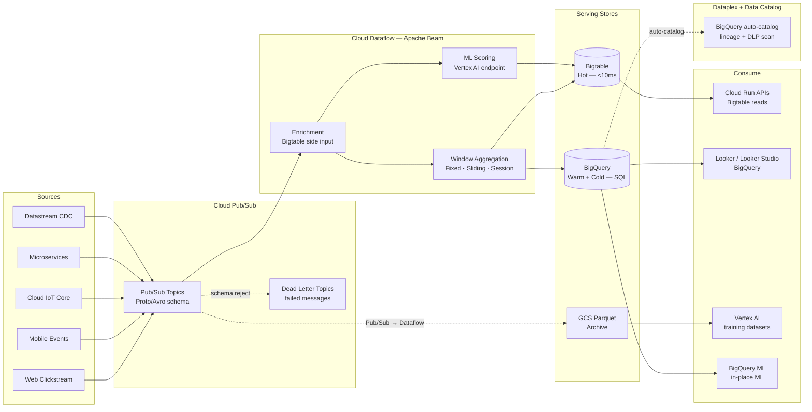
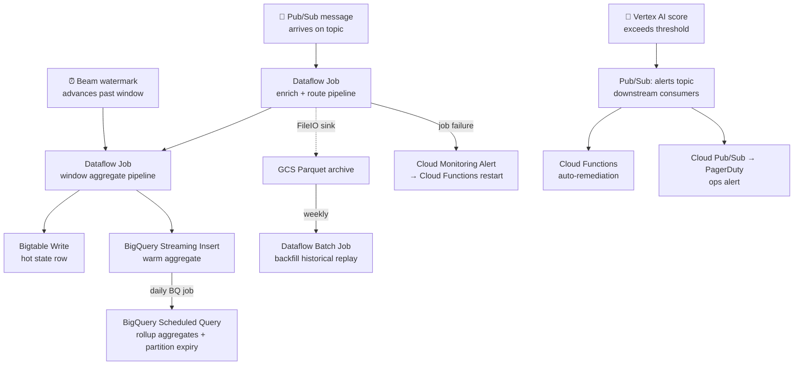

# 4.5 — Streaming / Event-Driven · GCP Fully Managed

**Stack:** Cloud Pub/Sub · Dataflow (Apache Beam) · BigQuery Streaming · Cloud Bigtable
**Processing:** Streaming-first · Unified Batch + Stream (Beam)
**Buy vs Build:** Buy (fully managed, no infra to operate)

---

## Architecture Overview

```
┌─────────────────────────────────────────────────────────────────────────────┐
│  EVENT SOURCES                                                              │
│                                                                             │
│  ┌──────────┐  ┌──────────┐  ┌──────────┐  ┌──────────┐  ┌──────────┐    │
│  │  Web /   │  │  Mobile  │  │   IoT /  │  │Microserv-│  │  DB CDC  │    │
│  │  Click-  │  │  App     │  │  Cloud   │  │  ices    │  │(Datastream│   │
│  │  stream  │  │  Events  │  │  IoT Core│  │  Events  │  │ CDC)     │    │
│  └────┬─────┘  └────┬─────┘  └────┬─────┘  └────┬─────┘  └────┬─────┘    │
└───────┼─────────────┼─────────────┼──────────────┼─────────────┼──────────┘
        │             │             │              │             │
        ▼             ▼             ▼              ▼             ▼
┌─────────────────────────────────────────────────────────────────────────────┐
│  EVENT BROKER — Google Cloud Pub/Sub                                        │
│                                                                             │
│  ┌──────────────────────────────────────────────────────────────┐          │
│  │  Pub/Sub Topics (global, auto-replicated):                   │          │
│  │  • clickstream-raw       • iot-telemetry                     │          │
│  │  • orders-events         • cdc-{table}                       │          │
│  │  • alerts-output                                             │          │
│  │                                                              │          │
│  │  Pub/Sub Schema → Protobuf / Avro schema enforcement         │          │
│  │  Dead Letter Topics → failed message capture                 │          │
│  │  Seek / Replay → replay from any timestamp (7-day window)    │          │
│  └──────────────────────────────────────────────────────────────┘          │
└─────────────────────────────────────────────────────────────────────────────┘
        │
        ▼
┌─────────────────────────────────────────────────────────────────────────────┐
│  STREAM PROCESSING — Google Cloud Dataflow (Apache Beam)                    │
│                                                                             │
│  ┌─────────────────┐   ┌─────────────────┐   ┌─────────────────┐          │
│  │  Enrichment     │   │  Windowed        │   │  Anomaly /      │          │
│  │  (side input    │   │  Aggregations    │   │  ML Scoring     │          │
│  │   from Bigtable │   │  Fixed/Sliding/  │   │  (Vertex AI     │          │
│  │   lookups)      │   │  Session windows │   │   Endpoint)     │          │
│  │                 │   │                  │   │                 │          │
│  └────────┬────────┘   └────────┬─────────┘   └────────┬────────┘          │
└───────────┼────────────────────┼────────────────────── ┼───────────────────┘
            │                    │                        │
            └────────────────────┼────────────────────────┘
                                 ▼
┌─────────────────────────────────────────────────────────────────────────────┐
│  SERVING STORES                                                             │
│                                                                             │
│  ┌─────────────────┐   ┌─────────────────┐   ┌─────────────────┐          │
│  │  HOT STORE      │   │  WARM / COLD     │   │  COLD ARCHIVE   │          │
│  │  Cloud Bigtable │   │  BigQuery        │──▶│  GCS            │          │
│  │                 │   │  (streaming      │   │  (Parquet via   │          │
│  │ • <10ms reads   │   │   inserts +      │   │   Dataflow)     │          │
│  │ • HBase API     │   │   partitioned    │   │ • Long-term     │          │
│  │ • Auto-scale    │   │   tables)        │   │   replay store  │          │
│  │ • TTL per col   │   │ • Standard SQL   │   │                 │          │
│  └─────────────────┘   └─────────────────┘   └─────────────────┘          │
└─────────────────────────────────────────────────────────────────────────────┘
            │                    │                        │
            ▼                    ▼                        ▼
┌─────────────────────────────────────────────────────────────────────────────┐
│  CATALOG & GOVERNANCE — Google Dataplex + Data Catalog                      │
│  · BigQuery tables auto-cataloged; lineage via Dataflow → BQ lineage API    │
│  · Cloud DLP → PII detection on BigQuery columns                            │
│  · Dataplex data quality rules applied at BQ table level                    │
└──────────┬──────────────────────────────────────────────────────────────────┘
           │
           ▼
┌─────────────────────────────────────────────────────────────────────────────┐
│  CONSUMERS                                                                  │
│                                                                             │
│  ┌─────────────────┐  ┌─────────────────┐  ┌─────────────────┐            │
│  │  Operational    │  │  BI / Analytics  │  │  ML / Vertex AI │            │
│  │  APIs           │  │  Looker          │  │  Training        │            │
│  │  (Bigtable)     │  │  (BigQuery)      │  │  (GCS / BQ)     │            │
│  │  Cloud Run      │  │  Looker Studio   │  │                 │            │
│  └─────────────────┘  └─────────────────┘  └─────────────────┘            │
└─────────────────────────────────────────────────────────────────────────────┘
```

---

## Data Flow



---

## Stream Store Design

```
HOT PATH  — Cloud Bigtable
  Instance: streaming-hot  (SSD, 3-node min, auto-scale to 10)
  Table: entity_state
    Row key: {entity_type}#{entity_id}#{reverse_timestamp}
    Column families:
      cf:latest   → latest event per entity (TTL 3 days)
      cf:agg_1m   → 1-minute aggregates (TTL 7 days)
      cf:agg_1h   → hourly aggregates (TTL 30 days)

WARM + COLD PATH — BigQuery
  Dataset: streaming_events
    Table: raw_events_YYYYMMDD
      → streaming inserts from Dataflow
      → partitioned by event_date, clustered by entity_id
      → BigQuery time-based partitioning (90 day hot, archive to GCS)

    Table: aggregates_1min
      → windowed Beam output via streaming insert
      → partitioned by window_date

    Table: anomaly_detections
      → Dataflow + Vertex AI scoring output

COLD ARCHIVE — GCS
  gs://<company>-streaming-archive/
  ├── raw_events/{topic}/{year}/{month}/{day}/
  │   └── *.parquet  (Dataflow FileIO sink, Snappy)
  └── replay_snapshots/
      └── {topic}/{snapshot_ts}/
```

---

## Security Model

```
┌──────────────────────────────────────────────────────────────────┐
│  Google IAM + BigQuery Column-Level Security + Bigtable IAM      │
│                                                                  │
│  Google Identity / SA        Access Level     Scope              │
│  ──────────────────────────  ─────────────    ───────────────── │
│  producer-sa@              pubsub.publisher   Pub/Sub topics     │
│  dataflow-sa@              Dataflow Worker    Bigtable+BQ+GCS    │
│                            bigquery.dataEditor                   │
│                            bigtable.user                         │
│  cloudrun-api-sa@          bigtable.reader    hot table only     │
│  bi-analyst-group@         bigquery.dataViewer aggregates dataset│
│  data-scientist-group@     bigquery.dataViewer + GCS read        │
│  ml-engineer-sa@           bigquery.dataEditor + GCS write       │
│                                                                  │
│  BigQuery Column Security → policy tags on PII columns           │
│  BigQuery Row Security    → row access policies per analyst group│
│  Bigtable IAM             → table-level read/write roles         │
│  Cloud DLP                → auto-tag PII in BQ columns           │
│  VPC Service Controls     → restrict BQ/BT/GCS to VPC perimeter  │
│  CMEK                     → Cloud KMS for BQ, Bigtable, GCS      │
└──────────────────────────────────────────────────────────────────┘
```

---

## Orchestration



---

## Component Map

| Component | GCP Service | Notes |
|-----------|------------|-------|
| Event Broker | Cloud Pub/Sub | Global, serverless, exactly-once delivery; Seek for replay |
| Schema Enforcement | Pub/Sub Schema (Protobuf / Avro) | Reject malformed messages at publish time |
| Dead Letter | Pub/Sub Dead Letter Topic | Auto-forward undeliverable messages |
| CDC Capture | Google Datastream | MySQL / PostgreSQL / Oracle CDC → Pub/Sub |
| Stream Processor | Cloud Dataflow (Apache Beam) | Managed Beam runner; auto-scaling workers |
| ML Scoring | Vertex AI Online Prediction Endpoint | Called inline from Dataflow Beam pipeline |
| Hot Store | Cloud Bigtable | SSD instance; HBase API; auto-scale nodes |
| Warm + Cold Store | BigQuery | Streaming inserts + partitioned tables; pay-per-query |
| Cold Archive | Google Cloud Storage (GCS) | Parquet via Dataflow FileIO; Nearline/Coldline lifecycle |
| Catalog | Google Data Catalog + Dataplex | Auto-discover BQ tables; policy tags; lineage API |
| PII Detection | Cloud DLP | Inspect BigQuery table columns; policy tag auto-assign |
| BI Layer | Looker / Looker Studio | Native BigQuery connector; real-time dashboards |
| ML Training | Vertex AI Pipelines | BQ or GCS datasets as input; Managed Datasets |
| In-place ML | BigQuery ML | SQL-based model training and scoring inside BQ |
| Serverless Triggers | Cloud Functions / Cloud Run | Pub/Sub push subscriptions, Bigtable change streams |
| Orchestration | Cloud Composer (Airflow) | BQ partition maintenance, GCS lifecycle, backfill jobs |
| Monitoring | Cloud Monitoring + Cloud Logging | Dataflow job metrics, Pub/Sub backlog, BQ slot usage |
| Encryption | Cloud KMS (CMEK) | BQ datasets, Bigtable, GCS buckets |

---

## Comparison vs 4.6 (GCP OSS)

| Dimension | 4.5 GCP Managed | 4.6 GCP OSS |
|-----------|----------------|------------|
| Stream processor | Dataflow / Beam (managed) | Apache Flink on GKE |
| Processing API | Beam SDK (Java/Python/Go) | Flink API (Java/Python) |
| Hot store | Cloud Bigtable (managed) | Bigtable (same — managed) |
| Cold format | BigQuery native tables | Apache Iceberg on GCS |
| SQL query | BigQuery (serverless) | Trino on GKE |
| CEP patterns | Beam extensions | Flink CEP library |
| Ops overhead | Very low | Medium (GKE + Flink) |
| Latency | 100ms–1s (Dataflow) | 50–200ms (Flink) |
| Vendor lock-in | Medium (Beam portable) | Low (fully portable) |

---

## When to Choose This Implementation

✅ GCP is primary cloud
✅ BigQuery is already central analytics store
✅ Python/Java Beam SDK acceptable for stream logic
✅ Looker is primary BI tool
✅ Want fully managed with zero Kubernetes operations

❌ Need complex CEP (sequence/pattern detection) → use 4.6 (Flink on GKE)
❌ Need open table format portability (Iceberg) → use 4.6
❌ Sub-100ms latency required → use 4.6
