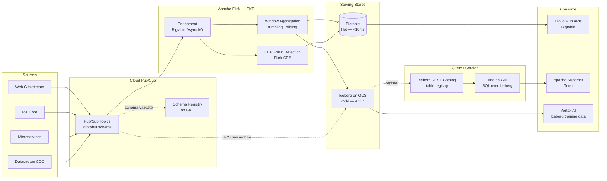
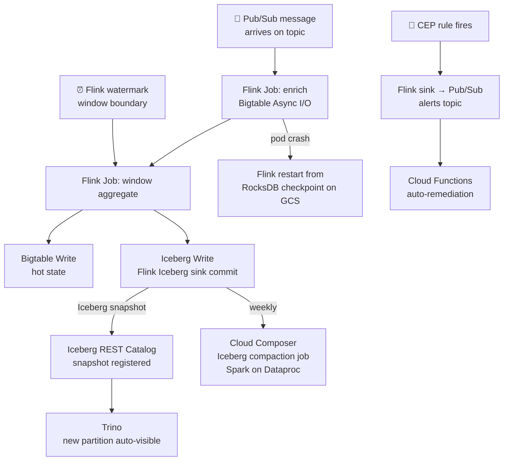

# 4.6 — Streaming / Event-Driven · GCP OSS on Cloud

**Stack:** Cloud Pub/Sub · Apache Flink on GKE · Apache Iceberg on GCS · Cloud Bigtable
**Processing:** Streaming-first · Kappa Architecture
**Buy vs Build:** Build (OSS processing on managed GCP infra)

---

## Architecture Overview

```
┌─────────────────────────────────────────────────────────────────────────────┐
│  EVENT SOURCES                                                              │
│                                                                             │
│  ┌──────────┐  ┌──────────┐  ┌──────────┐  ┌──────────┐  ┌──────────┐    │
│  │  Web /   │  │  Mobile  │  │   IoT /  │  │Microserv-│  │  DB CDC  │    │
│  │  Click-  │  │  App     │  │  Cloud   │  │  ices    │  │(Datastream│   │
│  │  stream  │  │  Events  │  │  IoT Core│  │  Events  │  │→ Pub/Sub) │   │
│  └────┬─────┘  └────┬─────┘  └────┬─────┘  └────┬─────┘  └────┬─────┘    │
└───────┼─────────────┼─────────────┼──────────────┼─────────────┼──────────┘
        │             │             │              │             │
        ▼             ▼             ▼              ▼             ▼
┌─────────────────────────────────────────────────────────────────────────────┐
│  EVENT BROKER — Cloud Pub/Sub                                               │
│                                                                             │
│  ┌──────────────────────────────────────────────────────────────┐          │
│  │  Pub/Sub Topics (global):                                    │          │
│  │  • clickstream.raw   • iot.telemetry   • cdc.{table}        │          │
│  │  • orders.events     • alerts.output                        │          │
│  │                                                              │          │
│  │  Pub/Sub Schema → Protobuf enforcement at publish            │          │
│  │  Confluent Schema Registry (on GKE) → Avro for Flink        │          │
│  └──────────────────────────────────────────────────────────────┘          │
└─────────────────────────────────────────────────────────────────────────────┘
        │
        ▼
┌─────────────────────────────────────────────────────────────────────────────┐
│  STREAM PROCESSING — Apache Flink on GKE (Flink Kubernetes Operator)        │
│                                                                             │
│  ┌─────────────────┐   ┌─────────────────┐   ┌─────────────────┐          │
│  │  Enrichment     │   │  Windowed        │   │  CEP / Fraud    │          │
│  │  (Async I/O     │   │  Aggregations    │   │  Pattern        │          │
│  │   Bigtable      │   │  tumbling/       │   │  Detection      │          │
│  │   lookups)      │   │  sliding/session │   │  (Flink CEP)    │          │
│  │                 │   │                  │   │                 │          │
│  └────────┬────────┘   └────────┬─────────┘   └────────┬────────┘          │
└───────────┼────────────────────┼────────────────────── ┼───────────────────┘
            │                    │                        │
            └────────────────────┼────────────────────────┘
                                 ▼
┌─────────────────────────────────────────────────────────────────────────────┐
│  SERVING STORES                                                             │
│                                                                             │
│  ┌─────────────────┐   ┌─────────────────┐   ┌─────────────────┐          │
│  │  HOT STORE      │   │  COLD STORE      │   │  QUERY ENGINE   │          │
│  │  Cloud Bigtable │   │  Apache Iceberg  │   │  Trino on GKE   │          │
│  │                 │   │  on GCS          │   │                 │          │
│  │ • <10ms reads   │   │ • ACID writes    │   │ • SQL over      │          │
│  │ • HBase API     │   │ • Time travel    │   │   Iceberg + BQ  │          │
│  │ • Auto-scale    │   │ • Z-order by     │   │ • Federation    │          │
│  │ • Column TTL    │   │   entity_id      │   │   across stores │          │
│  └─────────────────┘   └─────────────────┘   └─────────────────┘          │
└─────────────────────────────────────────────────────────────────────────────┘
            │                    │                        │
            ▼                    ▼                        ▼
┌─────────────────────────────────────────────────────────────────────────────┐
│  CATALOG — Apache Iceberg REST Catalog / Hive Metastore on GKE              │
│  · Iceberg REST catalog registers all tables; Flink + Trino share catalog   │
│  · Google Data Catalog auto-scan for discovery + lineage                    │
└──────────┬──────────────────────────────────────────────────────────────────┘
           │
           ▼
┌─────────────────────────────────────────────────────────────────────────────┐
│  CONSUMERS                                                                  │
│                                                                             │
│  ┌─────────────────┐  ┌─────────────────┐  ┌─────────────────┐            │
│  │  Operational    │  │  BI / Analytics  │  │  ML / Vertex AI │            │
│  │  APIs (Cloud    │  │  Apache Superset │  │  Training        │            │
│  │  Run + Bigtable)│  │  (Trino backend) │  │  (GCS Iceberg)  │            │
│  └─────────────────┘  └─────────────────┘  └─────────────────┘            │
└─────────────────────────────────────────────────────────────────────────────┘
```

---

## Data Flow



---

## Stream Store Design

```
HOT PATH  — Cloud Bigtable
  Instance: streaming-hot  (SSD, auto-scale 3–10 nodes)
  Table: entity_state
    Row key: {entity_type}#{entity_id}#{reverse_timestamp}
    Column families:
      cf:latest    (TTL: 259200s / 3 days)
      cf:agg_1m    (TTL: 604800s / 7 days)
      cf:agg_1h    (TTL: 2592000s / 30 days)

COLD PATH — Apache Iceberg on GCS
  gs://<company>-streaming-iceberg/
  ├── raw_events/
  │   └── {topic}/
  │       └── data/  (Parquet, Snappy)
  │       └── metadata/  (Iceberg manifests + snapshots)
  └── aggregated_events/
      └── {domain}/{window_type}/
          └── data/  (Z-order on entity_id + event_date)
          └── metadata/
```

---

## Security Model

```
┌──────────────────────────────────────────────────────────────────┐
│  Google IAM + Bigtable IAM + GCS IAM + Trino RBAC               │
│                                                                  │
│  Google SA / Group            Access Level     Scope             │
│  ─────────────────────────    ─────────────    ──────────────── │
│  producer-sa@                 pubsub.publisher  own topics       │
│  flink-workload-sa@           pubsub.subscriber all topics       │
│                               bigtable.user     hot tables       │
│                               storage.objectAdmin GCS Iceberg    │
│  cloudrun-api-sa@             bigtable.reader   hot table        │
│  trino-query-sa@              storage.objectViewer GCS Iceberg   │
│  analyst-group@               Trino schema READ filtered cols    │
│  ml-engineer-sa@              storage.objectViewer GCS full      │
│                                                                  │
│  Pub/Sub Schema      → reject non-conforming messages at publish │
│  Bigtable IAM        → table + column family ACLs               │
│  GCS IAM + ACLs      → bucket + prefix-level controls           │
│  Trino RBAC          → catalog/schema/table/column policies      │
│  VPC Service Controls → restrict GCS/BT/Pub-Sub to VPC perimeter│
│  CMEK               → Cloud KMS for GCS, Bigtable, Pub/Sub      │
└──────────────────────────────────────────────────────────────────┘
```

---

## Orchestration



---

## Component Map

| Component | Tool / Service | Notes |
|-----------|---------------|-------|
| Event Broker | Cloud Pub/Sub | Global; exactly-once delivery; Seek for 7-day replay |
| Schema Enforcement | Pub/Sub Schema (Protobuf) | Reject malformed at publish; Confluent SR for Avro on GKE |
| CDC Capture | Google Datastream → Pub/Sub | MySQL / PostgreSQL / Oracle CDC |
| Stream Processor | Apache Flink on GKE | Flink Kubernetes Operator; RocksDB state; GCS checkpoints |
| State Backend | RocksDB + GCS checkpoints | Incremental checkpoints every 30s; exactly-once sink |
| Hot Store | Cloud Bigtable | Flink Async I/O for enrichment lookups + write sink |
| Cold Format | Apache Iceberg on GCS | Flink `iceberg-flink` connector; Parquet + Snappy |
| Iceberg Catalog | Iceberg REST Catalog (on GKE) | Shared by Flink + Trino; consistent snapshot management |
| Query Engine | Trino on GKE | SQL federation over Iceberg + Bigtable + BQ connectors |
| BI Layer | Apache Superset | Trino connection; Iceberg dashboards |
| ML Training | Vertex AI Pipelines | GCS Iceberg files as training datasets |
| Compaction | Apache Spark on Dataproc | Weekly Iceberg compaction + z-order optimization |
| Orchestration | Cloud Composer (Airflow) | Compaction jobs, backfill, catalog maintenance |
| Monitoring | Prometheus + Grafana (GKE) | Flink job metrics, Pub/Sub backlog lag |
| Encryption | Cloud KMS (CMEK) | GCS bucket, Bigtable, Pub/Sub |

---

## Comparison vs 4.5 (GCP Managed)

| Dimension | 4.6 GCP OSS | 4.5 GCP Managed |
|-----------|------------|----------------|
| Stream processor | Flink on GKE (Java/Python/SQL) | Dataflow / Beam |
| CEP | Flink CEP library | Beam extensions (limited) |
| Cold format | Iceberg (portable) | BigQuery native tables |
| Query engine | Trino on GKE | BigQuery (serverless) |
| Cold portability | High — move to any cloud | Low — BQ lock-in |
| Latency | 50–200ms | 100ms–1s |
| Ops overhead | Medium (GKE + Flink + Trino) | Very low |
| Cost model | GKE node hours | BQ slot-hours + Dataflow DPU |

---

## When to Choose This Implementation

✅ Need Flink CEP for complex fraud / sequence detection
✅ Want Iceberg portability — ability to move cold data to AWS/Azure
✅ Sub-200ms stream processing latency required
✅ Trino federation across Iceberg + Bigtable + other sources needed
✅ Team has Flink + Kubernetes expertise

❌ Team lacks Flink/Kubernetes expertise → use 4.5
❌ BigQuery is central analytics hub — keep all data there → use 4.5
❌ Managed everything, zero ops → use 4.5
