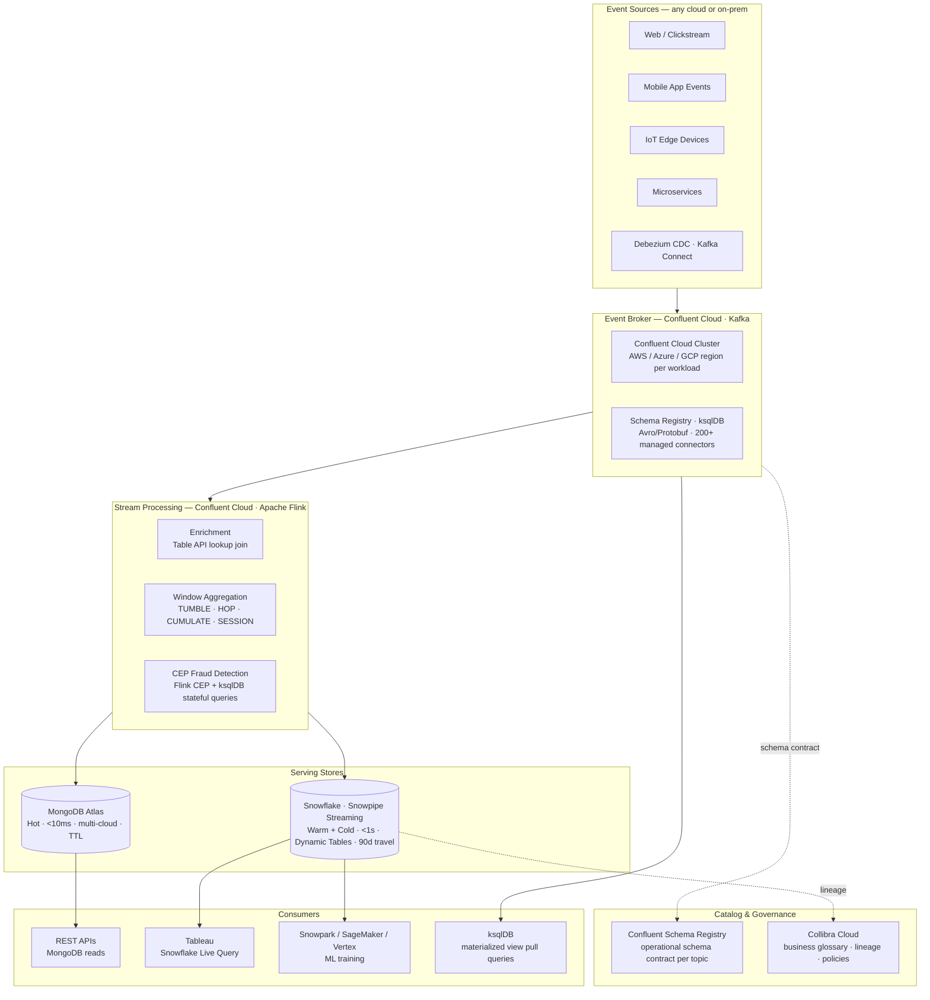
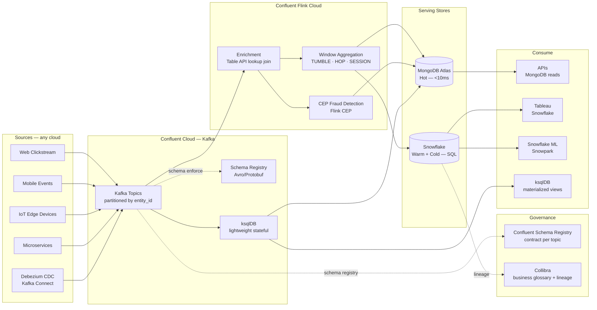
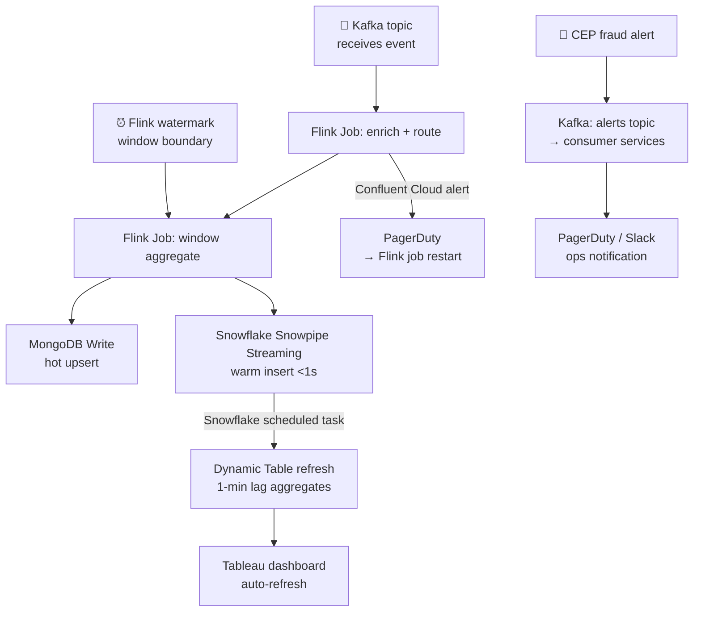

# 4.7 — Streaming / Event-Driven · Multi-Cloud Fully Managed

**Stack:** Confluent Cloud (Kafka) · Confluent Flink Cloud · Snowflake Streaming (Snowpipe Streaming)
**Processing:** Streaming-first · Kappa Architecture · Cloud-Portable
**Buy vs Build:** Buy (fully managed SaaS, runs across AWS / Azure / GCP)

---

## Architecture Overview



---

## Data Flow



---

## Stream Store Design

```
HOT PATH  — MongoDB Atlas (or DynamoDB / Cosmos DB)
  Collection: entity_state
    { _id: entity_id, event_type, last_value, updated_at }
    TTL index on updated_at (3-day expiry)
  Collection: window_aggregates
    { entity_id, window_type, window_start, count, sum, p99 }
    TTL index: 7 days

WARM + COLD PATH — Snowflake
  Database: STREAMING_DB
  Schema: RAW
    Table: EVENTS_RAW
      → Snowpipe Streaming inserts (<1s latency)
      → Clustered by EVENT_DATE, ENTITY_ID
      → 90-day time travel (Enterprise tier)

  Schema: AGGREGATED
    Dynamic Table: EVENTS_5MIN_AGG
      → refresh lag = 1 minute
      → incremental materialization
    Dynamic Table: EVENTS_HOURLY_AGG
      → refresh lag = 5 minutes

  Schema: ALERTS
    Table: ANOMALY_EVENTS
      → Flink Snowflake Sink connector output
```

---

## Security Model

```
┌──────────────────────────────────────────────────────────────────┐
│  Confluent RBAC + Snowflake RBAC + MongoDB Atlas RBAC            │
│                                                                  │
│  Identity               Access Level     Scope                   │
│  ─────────────────────  ─────────────    ──────────────────────  │
│  producer-service-acct  DeveloperWrite   Confluent topics (own)  │
│  flink-env-sa           DeveloperRead    All Confluent topics     │
│                         WRITE            Snowflake + MongoDB      │
│  ksqldb-svc-acct        DeveloperRead    topics it queries        │
│                         DeveloperWrite   output topics            │
│  api-service-acct       read             MongoDB collection       │
│  bi-analyst-role        SELECT           Snowflake AGGREGATED     │
│  data-scientist-role    SELECT           Snowflake RAW schema     │
│  ml-engineer-role       SELECT + CREATE  Snowflake RAW + STAGE    │
│                                                                  │
│  Confluent Schema Reg → BACKWARD compat enforced on every topic  │
│  Confluent Audit Log  → all cluster operations logged            │
│  Snowflake RBAC       → row access policies + dynamic data mask  │
│  Snowflake Network    → private link per cloud region            │
│  MongoDB Atlas        → VPC peering; field-level encryption      │
│  Encryption at rest   → Confluent + Snowflake + MongoDB all BYOK │
└──────────────────────────────────────────────────────────────────┘
```

---

## Orchestration



---

## Component Map

| Component | Tool / Service | Notes |
|-----------|---------------|-------|
| Event Broker | Confluent Cloud (Kafka) | Multi-cloud; Standard / Dedicated clusters; 99.99% SLA |
| Schema Registry | Confluent Cloud Schema Registry | Avro / Protobuf / JSON Schema; compatibility policies |
| Lightweight Streaming | Confluent ksqlDB (Cloud) | Stateful materialized views; lightweight CEP |
| CDC Connectors | Confluent Managed Kafka Connect | Debezium CDC; 200+ managed connectors |
| Stream Processor | Confluent Cloud for Apache Flink | Serverless Flink; shares Confluent Schema Registry |
| Hot Store | MongoDB Atlas | Multi-cloud; TTL indexes; Atlas Search for lookup |
| Warm + Cold Store | Snowflake (Snowpipe Streaming) | <1s streaming ingest; Dynamic Tables; 90-day time travel |
| Snowflake ML | Snowpark (Python) | In-database ML; UDF / stored procs on streaming data |
| Governance / Catalog | Collibra Cloud | Business glossary; lineage; Snowflake + Confluent connectors |
| BI Layer | Tableau | Snowflake Live Query mode; real-time dashboards |
| ML Training | SageMaker / Vertex AI | Pull Snowflake datasets via JDBC or Snowflake ML |
| Monitoring | Confluent Cloud Metrics API + Snowflake Query History | Topic lag, consumer group offsets, Snowflake credit usage |
| Encryption | Confluent BYOK + Snowflake Tri-Secret Secure + MongoDB CSFLE | All data encrypted with customer-managed keys |

---

## Comparison vs 4.8 (Multi-Cloud OSS)

| Dimension | 4.7 Multi-Cloud Managed | 4.8 Multi-Cloud OSS |
|-----------|------------------------|-------------------|
| Kafka | Confluent Cloud (SaaS) | Self-managed Apache Kafka |
| Flink | Confluent Flink Cloud (SaaS) | Self-managed Apache Flink |
| Serving store | Snowflake (SaaS) | Apache Iceberg + ksqlDB |
| Schema management | Confluent Schema Registry (managed) | Confluent SR or Apicurio (self-managed) |
| Hot store | MongoDB Atlas | Cassandra / ScyllaDB |
| Ops overhead | Very low — all SaaS | High — all self-managed |
| Cost model | Confluent CKU + Snowflake credits | Infrastructure cost |
| Vendor lock-in | High (Confluent + Snowflake) | Low (fully portable OSS) |
| Latency | <1s (Snowpipe Streaming) | 10–100ms (self-tuned) |

---

## When to Choose This Implementation

✅ Multi-cloud strategy with data sources on AWS + Azure + GCP
✅ Kafka expertise but want managed operations
✅ Snowflake already central analytics platform
✅ Confluent certified connectors needed for 50+ source systems
✅ Minimize streaming infrastructure ops

❌ Cost sensitivity — Confluent + Snowflake CKUs are expensive → use 4.8
❌ Full control over Flink tuning (<100ms latency) → use 4.8
❌ Open table format portability (Iceberg) critical → use 4.8
