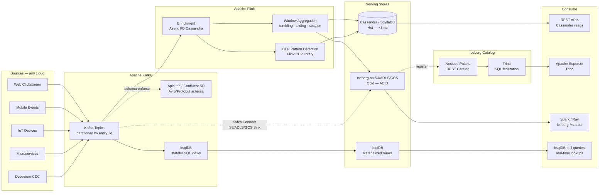
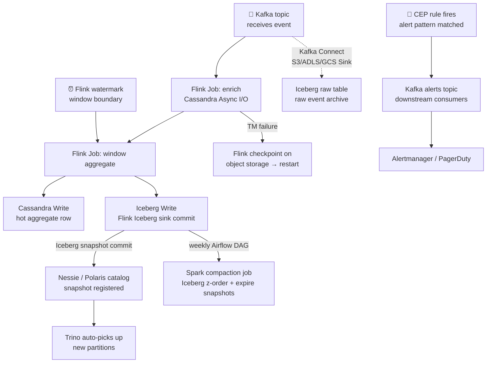

# 4.8 — Streaming / Event-Driven · Multi-Cloud OSS Portable

**Stack:** Apache Kafka · Apache Flink · Apache Iceberg · ksqlDB
**Processing:** Streaming-first · Kappa Architecture · Cloud-Portable
**Buy vs Build:** Build (fully OSS, deployable on any cloud or on-prem)

---

## Architecture Overview

```
┌─────────────────────────────────────────────────────────────────────────────┐
│  EVENT SOURCES  (any cloud or on-prem)                                      │
│                                                                             │
│  ┌──────────┐  ┌──────────┐  ┌──────────┐  ┌──────────┐  ┌──────────┐    │
│  │  Web /   │  │  Mobile  │  │   IoT /  │  │Microserv-│  │  DB CDC  │    │
│  │  Click-  │  │  App     │  │  Edge    │  │  ices    │  │(Debezium)│    │
│  │  stream  │  │  Events  │  │  Devices │  │  Events  │  │          │    │
│  └────┬─────┘  └────┬─────┘  └────┬─────┘  └────┬─────┘  └────┬─────┘    │
└───────┼─────────────┼─────────────┼──────────────┼─────────────┼──────────┘
        │             │             │              │             │
        ▼             ▼             ▼              ▼             ▼
┌─────────────────────────────────────────────────────────────────────────────┐
│  EVENT BROKER — Apache Kafka (managed MSK / Event Hubs / Confluent OSS)     │
│                                                                             │
│  ┌──────────────────────────────────────────────────────────────┐          │
│  │  Kafka Cluster (3+ brokers, multi-AZ)                        │          │
│  │                                                              │          │
│  │  Topics (partitioned by entity_id):                          │          │
│  │  • clickstream.raw   • iot.telemetry   • cdc.{table}        │          │
│  │  • orders.events     • alerts.output   • dlq.{topic}        │          │
│  │                                                              │          │
│  │  Apicurio Registry / Confluent SR → Avro / Protobuf schema  │          │
│  │  Kafka Connect (Debezium, S3 Sink, JDBC)                    │          │
│  │  ksqlDB → lightweight stateful streaming SQL                │          │
│  └──────────────────────────────────────────────────────────────┘          │
└─────────────────────────────────────────────────────────────────────────────┘
        │
        ▼
┌─────────────────────────────────────────────────────────────────────────────┐
│  STREAM PROCESSING — Apache Flink (on K8s / YARN / standalone)              │
│                                                                             │
│  ┌─────────────────┐   ┌─────────────────┐   ┌─────────────────┐          │
│  │  Enrichment     │   │  Windowed        │   │  CEP / Fraud    │          │
│  │  (Async I/O     │   │  Aggregations    │   │  Pattern        │          │
│  │   Cassandra /   │   │  tumbling/       │   │  Detection      │          │
│  │   Redis lookup) │   │  sliding/session │   │  (Flink CEP)    │          │
│  └────────┬────────┘   └────────┬─────────┘   └────────┬────────┘          │
└───────────┼────────────────────┼────────────────────── ┼───────────────────┘
            │                    │                        │
            └────────────────────┼────────────────────────┘
                                 ▼
┌─────────────────────────────────────────────────────────────────────────────┐
│  SERVING STORES                                                             │
│                                                                             │
│  ┌─────────────────┐   ┌─────────────────┐   ┌─────────────────┐          │
│  │  HOT STORE      │   │  MATERIALIZED    │   │  COLD STORE     │          │
│  │  Apache         │   │  VIEWS           │──▶│  Apache Iceberg │          │
│  │  Cassandra /    │   │  ksqlDB          │   │  on S3/ADLS/GCS │          │
│  │  ScyllaDB       │   │  (push queries)  │   │                 │          │
│  │                 │   │                  │   │ • ACID + time   │          │
│  │ • <5ms reads    │   │ • pull queries   │   │   travel        │          │
│  │ • Wide rows     │   │ • topic → table  │   │ • Z-order       │          │
│  │ • Linear scale  │   │   materialization│   │   compaction    │          │
│  └─────────────────┘   └─────────────────┘   └─────────────────┘          │
└─────────────────────────────────────────────────────────────────────────────┘
            │                    │                        │
            ▼                    ▼                        ▼
┌─────────────────────────────────────────────────────────────────────────────┐
│  CATALOG — Apache Iceberg REST Catalog (Nessie or Polaris)                  │
│  · Tables registered centrally; Flink + Trino + Spark share catalog         │
│  · Apicurio Registry = Avro/Protobuf schema contract per topic              │
└──────────┬──────────────────────────────────────────────────────────────────┘
           │
           ▼
┌─────────────────────────────────────────────────────────────────────────────┐
│  CONSUMERS                                                                  │
│                                                                             │
│  ┌─────────────────┐  ┌─────────────────┐  ┌─────────────────┐            │
│  │  Operational    │  │  BI / Analytics  │  │  ML Training    │            │
│  │  APIs           │  │  Apache Superset │  │  Spark / Ray    │            │
│  │  (Cassandra)    │  │  (Trino backend) │  │  (Iceberg)      │            │
│  └─────────────────┘  └─────────────────┘  └─────────────────┘            │
└─────────────────────────────────────────────────────────────────────────────┘
```

---

## Data Flow



---

## Stream Store Design

```
HOT PATH  — Apache Cassandra / ScyllaDB
  Keyspace: streaming_hot  (RF=3, NTS per region)
  Table: entity_state
    PK: entity_id  CK: event_type, event_time
    TTL: 86400s (1 day default per table)

  Table: window_aggregates
    PK: (entity_id, window_type)  CK: window_start
    Columns: count, sum, p50, p99, min, max
    TTL: 604800s (7 days)

MATERIALIZED — ksqlDB
  Persistent Query: CREATE TABLE entity_latest AS
    SELECT entity_id, LATEST_BY_OFFSET(event_type) AS event_type,
           COUNT(*) AS event_count
    FROM clickstream_raw
    GROUP BY entity_id
    EMIT CHANGES;

COLD PATH — Apache Iceberg on object storage (S3 / ADLS / GCS)
  {bucket}/streaming-iceberg/
  ├── raw_events/
  │   └── {topic}/
  │       ├── data/  (Parquet, Snappy)
  │       └── metadata/  (manifests, snapshots, table metadata)
  └── aggregated_events/
      └── {domain}/{window_type}/
          ├── data/  (Z-order by entity_id + event_date)
          └── metadata/
```

---

## Security Model

```
┌──────────────────────────────────────────────────────────────────┐
│  Kafka ACLs + Cassandra RBAC + Iceberg + Apache Ranger (opt.)    │
│                                                                  │
│  Principal               Access Level     Scope                  │
│  ──────────────────────  ─────────────    ──────────────────── │
│  producer-service         WRITE            own Kafka topics      │
│  flink-job-sa             READ (all topics) Kafka consumer group │
│                           WRITE             Cassandra + Iceberg  │
│  ksqldb-cluster           READ+WRITE        ksqlDB topics        │
│  cassandra-api-sa         SELECT            own keyspace         │
│  trino-query-sa           SELECT            Iceberg catalog      │
│  analyst-role             SELECT (filtered) Iceberg via Ranger   │
│  ml-engineer-sa           READ              Iceberg all tables   │
│                                                                  │
│  Kafka mTLS           → inter-broker + producer/consumer TLS     │
│  Kafka ACLs           → topic-level READ/WRITE per service       │
│  Cassandra CQL RBAC   → keyspace + table + column permissions    │
│  Iceberg + Ranger     → row/column filter policies (optional)    │
│  ksqlDB auth          → HTTP Basic / Kafka-delegated auth        │
│  Object storage       → bucket policy + VPC endpoint only        │
│  KMS / Vault          → HashiCorp Vault for key management       │
└──────────────────────────────────────────────────────────────────┘
```

---

## Orchestration



---

## Component Map

| Component | Tool / Service | Notes |
|-----------|---------------|-------|
| Event Broker | Apache Kafka | Self-managed or cloud-managed (MSK / Event Hubs / Confluent) |
| Schema Registry | Apicurio Registry / Confluent Schema Registry | Avro/Protobuf; compatibility enforcement |
| CDC Capture | Debezium (Kafka Connect) | MySQL/PostgreSQL/Oracle/MongoDB CDC |
| Lightweight Streaming | ksqlDB | Materialized views + stateful queries; runs alongside Kafka |
| Stream Processor | Apache Flink | YARN / Kubernetes Operator; Java/Python/SQL API |
| State Backend | RocksDB + object storage checkpoints | Incremental checkpoints every 30s; exactly-once sink |
| Hot Store | Apache Cassandra / ScyllaDB | ScyllaDB for 5–10× higher throughput at same cost |
| Cold Store Format | Apache Iceberg | Flink + Kafka Connect S3/ADLS/GCS Sink writers |
| Iceberg Catalog | Project Nessie / Apache Polaris | Git-like branching for Iceberg; REST API |
| Query Engine | Trino | Federation across Iceberg + Cassandra + Kafka connectors |
| BI Layer | Apache Superset | Trino connection; community dashboards |
| ML Training | Apache Spark / Ray | Read Iceberg via Spark catalog or Ray Dataset |
| Compaction | Apache Spark (Airflow-triggered) | Weekly Iceberg compaction + z-order + snapshot expiry |
| Orchestration | Apache Airflow | Backfill Flink jobs, compaction, catalog tasks |
| Monitoring | Prometheus + Grafana | Flink job metrics, Kafka consumer lag, Cassandra ops |
| Encryption | HashiCorp Vault / Cloud KMS | Key management for Kafka, Cassandra, object storage |

---

## Comparison vs 4.7 (Multi-Cloud Managed)

| Dimension | 4.8 Multi-Cloud OSS | 4.7 Multi-Cloud Managed |
|-----------|--------------------|-----------------------|
| Kafka | Self-managed | Confluent Cloud |
| Flink | Self-managed | Confluent Flink Cloud |
| Serving store | Cassandra + Iceberg | MongoDB Atlas + Snowflake |
| Schema registry | Apicurio (OSS) | Confluent Cloud SR |
| Ops overhead | High (all self-managed) | Very low |
| Cost (at scale) | Lower (infra only) | Higher (CKU + credits) |
| Vendor lock-in | None | High |
| Portability | Maximum | Low |
| Latency | 10–100ms (tunable) | <1s (Snowpipe Streaming) |

---

## When to Choose This Implementation

✅ Maximum portability — must run on any cloud or on-prem
✅ Avoid vendor lock-in (Confluent, Snowflake) on principle or cost
✅ Team has strong Kafka + Flink + Cassandra expertise
✅ Sub-100ms stream processing latency required with full tuning control
✅ Cost optimization at high scale (>TB/day) justifies operational investment

❌ Limited platform engineering team → use 4.7 (managed SaaS)
❌ Snowflake already central platform → use 4.7
❌ Need 200+ managed Kafka connectors out of the box → use 4.7
