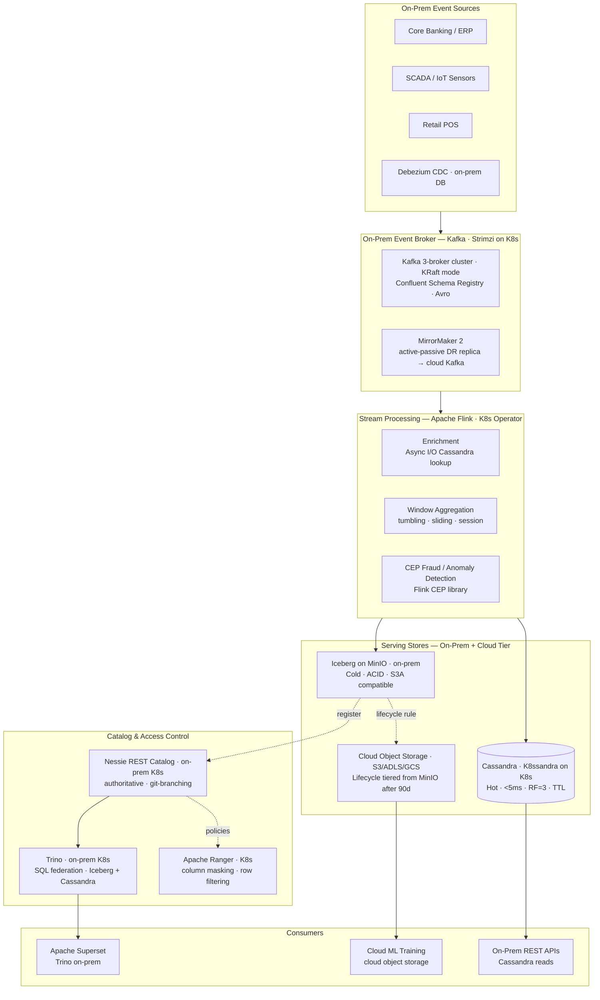
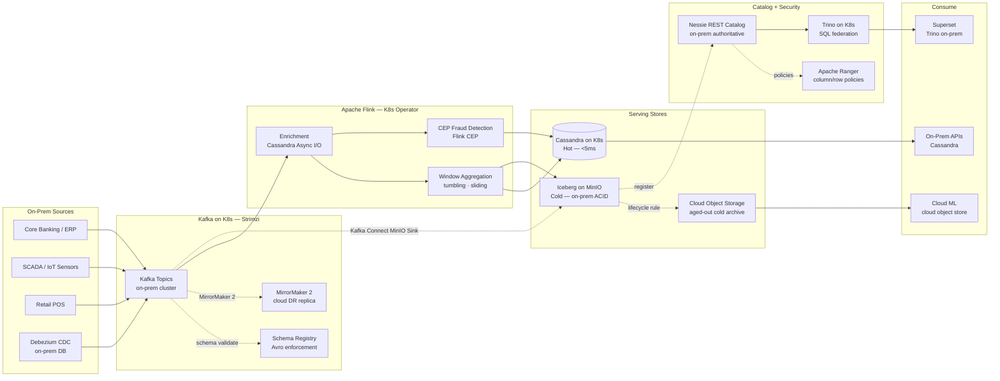
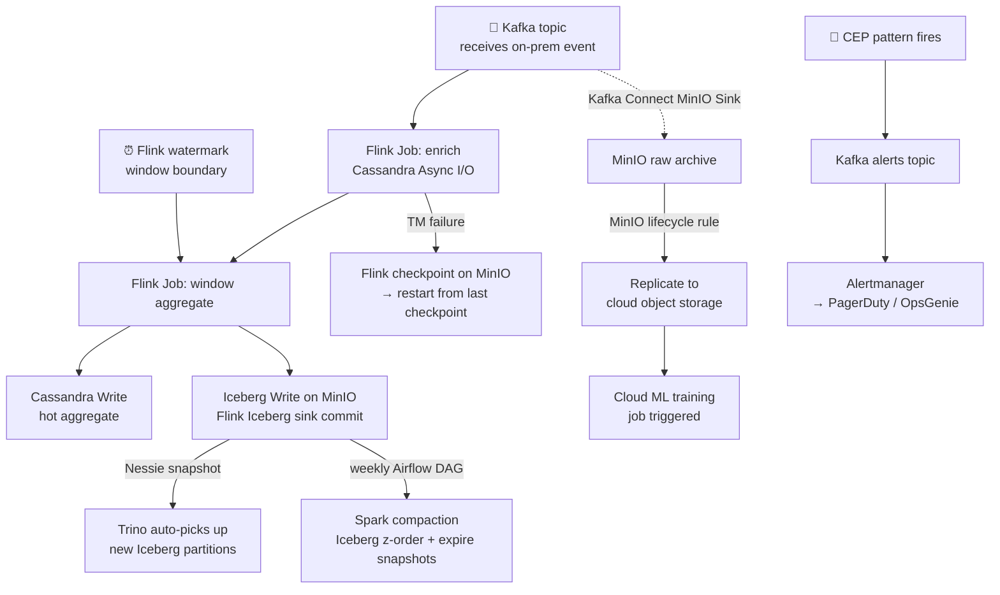

# 4.9 — Streaming / Event-Driven · Hybrid OSS Self-Hosted (On-Prem + Cloud)

**Stack:** Apache Kafka on Kubernetes · Apache Flink on Kubernetes · Apache Cassandra · MinIO
**Processing:** Streaming-first · Kappa Architecture · On-Prem Core + Cloud Burst
**Buy vs Build:** Full Build (self-hosted OSS, full infrastructure ownership)

---

## Architecture Overview



---

## Data Flow



---

## Stream Store Design

```
HOT PATH  — Apache Cassandra on Kubernetes
  Namespace: cassandra  (K8s StatefulSet via K8ssandra Operator)
  Keyspace: streaming_hot  (RF=3, local DC)
  Table: entity_state
    PK: entity_id   CK: event_type, event_time
    TTL: 86400s (1 day)
  Table: window_aggregates
    PK: (entity_id, window_type)  CK: window_start
    TTL: 604800s (7 days)

COLD PATH — Apache Iceberg on MinIO (on-prem S3-compatible)
  s3a://streaming-iceberg/  (MinIO endpoint)
  ├── raw_events/
  │   └── {topic}/
  │       ├── data/  (Parquet, Snappy, partitioned by event_date)
  │       └── metadata/
  └── aggregated_events/
      └── {domain}/{window_type}/
          ├── data/  (Z-order: entity_id + event_date)
          └── metadata/

CLOUD TIER — Object Storage (aged out from MinIO)
  MinIO lifecycle rule: objects > 90 days → replicate to S3/ADLS/GCS
  s3://{company}-cold-archive/streaming-iceberg/  (mirrored path)
  → queryable via Trino Iceberg connector pointing to cloud catalog
```

---

## Security Model

```
┌──────────────────────────────────────────────────────────────────┐
│  Kafka ACLs + Cassandra RBAC + Apache Ranger + MinIO IAM         │
│                                                                  │
│  Principal             Access Level     Scope                    │
│  ─────────────────── ─ ─────────────    ──────────────────────  │
│  producer-svc          WRITE            own Kafka topics         │
│  flink-job-sa          READ (all topics) Kafka consumer group    │
│                        WRITE             Cassandra + MinIO       │
│  debezium-sa           READ              source DB (CDC)         │
│                        WRITE             cdc.* Kafka topics      │
│  cassandra-api-svc     SELECT            own keyspace            │
│  trino-query-svc       SELECT            Iceberg (Ranger filter) │
│  analyst-role          SELECT (cols)     Iceberg via Ranger RLS  │
│  ml-engineer-role      READ              MinIO + cloud archive   │
│                                                                  │
│  Kafka mTLS         → Strimzi cert manager, inter-broker TLS     │
│  Kafka Authz        → OPA / custom authorizer (fine-grained)     │
│  Cassandra RBAC     → keyspace + table + column level            │
│  MinIO IAM          → bucket policies per service account        │
│  Apache Ranger      → Iceberg column masking + row filtering      │
│  K8s RBAC           → service account per Flink JobManager       │
│  HashiCorp Vault    → secret injection into pods (CSI driver)    │
│  Network Policies   → K8s NetworkPolicy per namespace            │
└──────────────────────────────────────────────────────────────────┘
```

---

## Orchestration



---

## Component Map

| Component | Tool / Service | Notes |
|-----------|---------------|-------|
| Event Broker | Apache Kafka via Strimzi Operator | K8s-native; TLS cert via cert-manager; ZooKeeper or KRaft mode |
| CDC Capture | Debezium via Kafka Connect | Oracle / PostgreSQL / MySQL / SQL Server on-prem |
| Schema Registry | Confluent Schema Registry (K8s pod) | Avro; compatibility enforcement; backed by Kafka topic |
| Kafka Replication | MirrorMaker 2 | Active-passive to cloud Kafka for DR / burst |
| Stream Processor | Apache Flink (Flink Kubernetes Operator) | RocksDB state; checkpoints on MinIO S3A; exactly-once |
| State Backend | RocksDB + MinIO checkpoints (S3A) | NVMe SSDs on K8s nodes for RocksDB |
| Hot Store | Apache Cassandra (K8ssandra Operator) | StatefulSet on K8s; local RF=3; Cassandra 4.x |
| Cold Store | Apache Iceberg on MinIO | S3A connector; Parquet + Snappy; Flink `iceberg-flink` |
| Object Storage | MinIO (K8s) | S3-compatible; erasure coding; lifecycle policies |
| Iceberg Catalog | Project Nessie (K8s pod) | REST + git-like branching; JDBC backend (PostgreSQL) |
| Query Engine | Trino on K8s | Iceberg + Cassandra + Kafka connectors; on-prem queries |
| Access Control | Apache Ranger (K8s) | Column masking + row filter policies on Iceberg |
| BI Layer | Apache Superset (K8s) | Trino connection; on-prem dashboards |
| Orchestration | Apache Airflow (K8s CeleryExecutor) | Flink job submission, compaction, cloud sync |
| Monitoring | Prometheus + Grafana (K8s) | Flink, Kafka, Cassandra, MinIO, Trino metrics |
| Secrets | HashiCorp Vault + K8s CSI driver | Dynamic secrets; PKI for Kafka TLS |
| Cloud Tiering | MinIO → S3/ADLS/GCS lifecycle | Automatic replication after configurable retention |

---

## Comparison vs 4.8 (Multi-Cloud OSS Portable)

| Dimension | 4.9 Hybrid Self-Hosted | 4.8 Multi-Cloud OSS |
|-----------|----------------------|-------------------|
| Deployment model | On-prem K8s + cloud burst | Cloud K8s (any cloud) |
| Storage | MinIO on-prem → cloud lifecycle | Cloud object storage direct |
| Kafka deployment | Strimzi on bare-metal/VM K8s | Cloud-managed MSK / Event Hubs |
| Data residency | On-prem (hard requirement met) | Cloud (jurisdiction dependent) |
| DR / Burst | MirrorMaker 2 to cloud Kafka | Multi-region cloud natively |
| Infra ownership | Full (hardware + software) | Cloud hardware (managed) |
| Ops complexity | Highest | High |
| Latency | 1–10ms on-prem (local) | 10–100ms (network hop) |
| Data sovereignty | Maximum control | Cloud provider dependent |

---

## When to Choose This Implementation

✅ Strict data residency / sovereignty — data must not leave on-prem (banking, defense, healthcare)
✅ Existing on-prem Kubernetes infrastructure to leverage
✅ Ultra-low latency (<10ms) stream processing on local network
✅ Air-gapped or restricted environments where cloud not permitted for primary data
✅ Regulatory requirement for full infrastructure auditability

❌ No on-prem Kubernetes experience or platform team → use 4.8 (cloud OSS)
❌ Data residency not a constraint → use 4.8 or 4.7 (lower ops burden)
❌ Cloud-native team with no on-prem footprint → use 4.1/4.3/4.5
