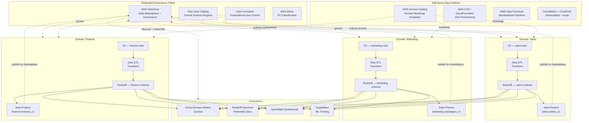
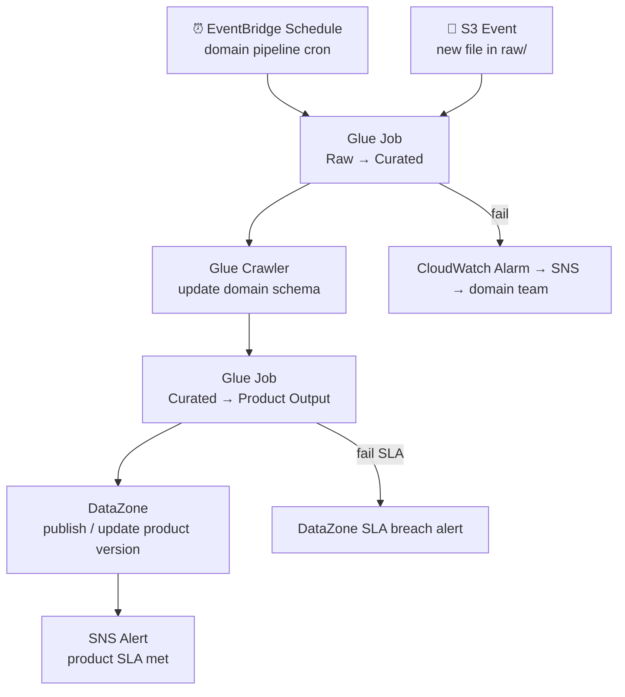

# 5.1 — Data Mesh · AWS Fully Managed

**Stack:** S3 · Lake Formation · Glue Data Catalog · Redshift (per domain) · AWS DataZone
**Processing:** Domain-chosen (Batch / Streaming / Hybrid per domain)
**Buy vs Build:** Buy (fully managed, no infra to operate)

---

## Architecture Overview



---

## Data Flow

```mermaid
flowchart LR
    subgraph Sources
        S1[(Operational DBs)]
        S2[SaaS APIs]
        S3[Event Streams]
    end

    subgraph DomainIngestion["Domain Ingestion (per domain)"]
        I1[AWS DMS / Glue ETL\nCDC + Batch]
        I2[Kinesis Firehose\nStream]
    end

    subgraph DomainStorage["Domain Storage (per domain) — S3 + Redshift"]
        Z1[S3 Raw\ns3://{domain}-raw/]
        Z2[S3 Curated\ns3://{domain}-curated/]
        Z3[Redshift Schema\n{domain}.*]
    end

    subgraph Catalog["Glue Catalog + Lake Formation + DataZone"]
        C1[Glue Crawler\nAuto Schema]
        C2[Lake Formation\nDomain RBAC]
        C3[DataZone\nProduct Marketplace]
    end

    subgraph Consume
        E1[Athena\nCross-Domain SQL]
        E2[Redshift Spectrum]
        E3[QuickSight]
        E4[SageMaker]
    end

    S1 --> I1 --> Z1
    S2 --> I1
    S3 --> I2 --> Z1
    Z1 --> Z2 --> Z3
    Z2 & Z3 -. register .-> C1 --> C2 --> C3
    Z2 -->|reads data| E4
    Z3 -->|reads data| E1 & E2 & E3
```

---

## Zone Design

```
s3://{domain}-data/
│
├── raw/
│   └── {source}/{table}/year=YYYY/month=MM/day=DD/
│       └── Parquet · partitioned · compressed
│
├── curated/
│   └── {entity}/year=YYYY/month=MM/
│       └── deduplicated · type-cast · Parquet
│
└── products/
    └── {product-name}/version=v1/
        └── SLA-backed output · Parquet · schema-locked

Redshift:
  cluster: {domain}-cluster  (or serverless namespace)
  schemas: raw_{domain} · curated_{domain} · products_{domain}
```

---

## Security Model

```
┌──────────────────────────────────────────────────────────┐
│  Lake Formation — per-domain isolation                    │
│                                                           │
│  IAM Role              Access Level     Scope             │
│  ──────────────────    ────────────     ──────────────    │
│  domain-owner          Read + Write     Own domain only   │
│  domain-engineer       Read + Write     Own domain only   │
│  cross-domain-reader   Read only        Published products│
│  platform-admin        Admin            All domains       │
│  ml-consumer           Read only        Curated + Products│
│  bi-consumer           Read only        Products only     │
│                                                           │
│  Lake Formation Tags  → domain=sales / marketing / finance│
│  Column masking       → PII fields via Lake Formation     │
│  S3 Bucket Policy     → domain isolation (no cross-read)  │
│  AWS Macie            → auto-classify PII on ingest       │
│  DataZone Subscriptions → explicit approval per product   │
└──────────────────────────────────────────────────────────┘
```

---

## Orchestration



---

## Component Map

| Component | AWS Service | Notes |
|-----------|-------------|-------|
| Domain Storage | S3 (per domain bucket) | Bucket policy enforces domain isolation |
| Domain Warehouse | Redshift Serverless (per domain namespace) | Schema-per-domain; cross-domain via Spectrum |
| DB Ingestion | AWS DMS | CDC from operational sources |
| File / SaaS Ingestion | AWS Glue ETL | Domain-owned jobs |
| Stream Ingestion | Kinesis Firehose | Buffers to domain S3 raw |
| Schema Catalog | Glue Data Catalog | Shared registry; domain-scoped databases |
| Access Control | Lake Formation (tag-based) | LF-tags enforce domain boundaries |
| PII Detection | AWS Macie | Auto-classify on domain S3 buckets |
| Data Marketplace | AWS DataZone | Product discovery, subscription, approval |
| Orchestration | AWS Glue Workflows + EventBridge | Domain-managed pipelines |
| Platform Templates | AWS Service Catalog + CDK | One-click domain bootstrap |
| Observability | CloudWatch + CloudTrail | Per-domain dashboards; cross-domain audit |
| Encryption | AWS KMS (per domain CMK) | Separate key per domain for isolation |
| Query (Cross-Domain) | Athena + Redshift Spectrum | Federated cross-domain reads via catalog |

---

## Comparison vs 5.2 (AWS OSS)

| Dimension | 5.1 AWS Managed | 5.2 AWS OSS |
|-----------|----------------|-------------|
| Governance tool | AWS DataZone | DataHub |
| Table format | Redshift native + S3 Parquet | Apache Iceberg |
| Query engine | Athena + Redshift Spectrum | Trino |
| Domain warehouse | Redshift Serverless per domain | Trino schema per domain |
| Infra overhead | Low — fully managed | Medium — manage Trino + DataHub |
| Cross-domain join | Redshift Spectrum federated | Trino distributed join |
| Cost model | DPU + Redshift RPU | EC2/EMR compute |
| Vendor lock-in | High (AWS services) | Low (portable OSS) |
| Data product contract | DataZone subscription | DataHub + custom API |
