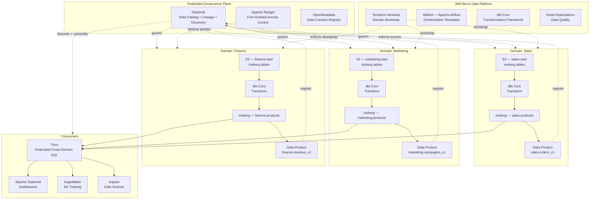
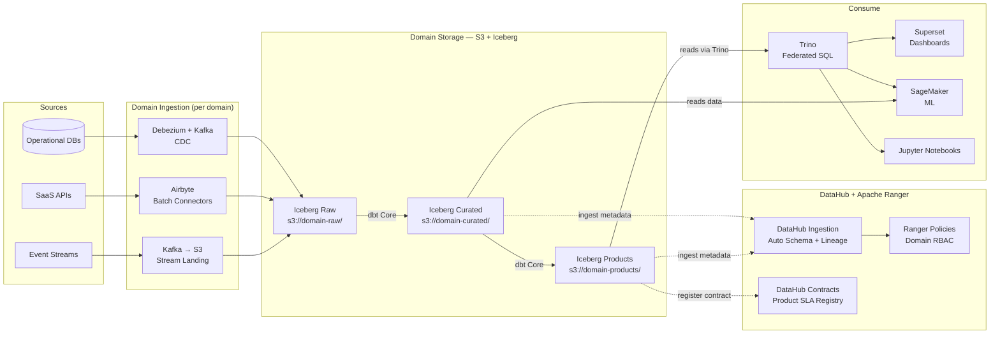
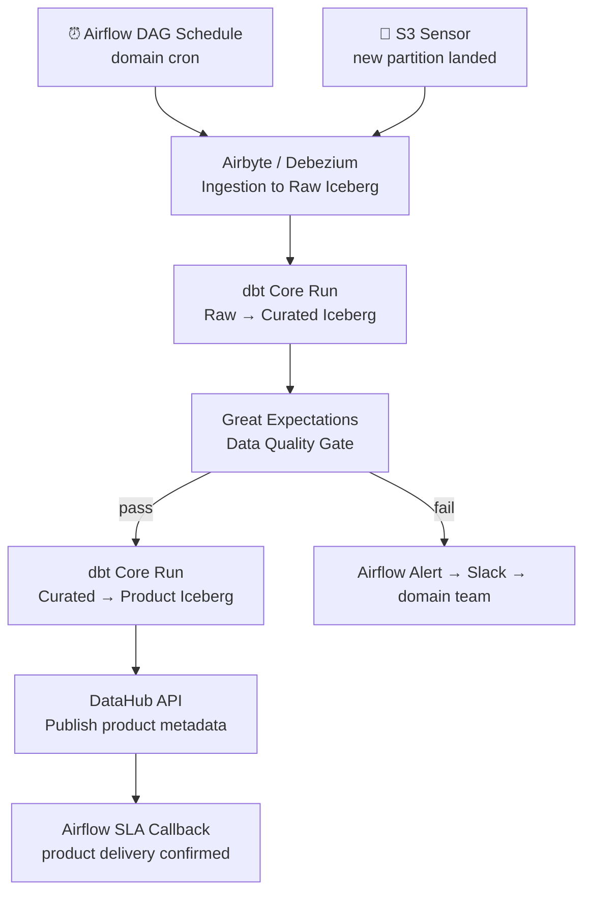

# 5.2 — Data Mesh · AWS OSS on Cloud

**Stack:** S3 · Apache Iceberg · Trino · DataHub · dbt Core · Apache Airflow (MWAA)
**Processing:** Domain-chosen (Batch / Streaming / Hybrid per domain)
**Buy vs Build:** Build (OSS on AWS infrastructure)

---

## Architecture Overview



---

## Data Flow



---

## Zone Design

```
s3://{domain}-lake/
│
├── raw/
│   └── {source}/{table}/         ← Iceberg table (metadata/ + data/)
│       └── metadata/             ← Iceberg manifest + snapshot
│       └── data/year=YYYY/month=MM/
│
├── curated/
│   └── {entity}/                 ← Iceberg table
│       └── dbt-transformed · MERGE-capable · ACID
│
└── products/
    └── {product-name}/           ← Iceberg table · schema-locked · SLA-backed
        └── version pinned in DataHub contract

Iceberg catalog: AWS Glue Data Catalog (Hive-compatible)
  database: {domain}_raw, {domain}_curated, {domain}_products
```

---

## Security Model

```
┌──────────────────────────────────────────────────────────┐
│  Apache Ranger — domain-scoped policies                   │
│                                                           │
│  Principal             Access Level     Scope             │
│  ──────────────────    ────────────     ──────────────    │
│  domain-owner          Read + Write     Own domain tables │
│  domain-engineer       Read + Write     Own domain tables │
│  cross-domain-reader   Read only        Products schema   │
│  platform-admin        Admin            All schemas       │
│  ml-consumer           Read only        Curated + Products│
│  bi-consumer           Read only        Products only     │
│                                                           │
│  Ranger Tag Policies   → domain tag gates all access      │
│  Iceberg Row Filters   → row-level via Trino view + Ranger│
│  S3 Bucket Policy      → domain isolation enforced        │
│  Column Masking        → Ranger masking policies on PII   │
│  DataHub Contracts     → schema + SLA enforcement         │
└──────────────────────────────────────────────────────────┘
```

---

## Orchestration



---

## Component Map

| Component | Tool / Service | Notes |
|-----------|----------------|-------|
| Domain Storage | S3 + Apache Iceberg | ACID, time-travel, schema evolution per domain |
| Batch Ingestion | Airbyte (on EC2/ECS) | 300+ connectors; domain-managed instances |
| CDC Ingestion | Debezium + MSK (Kafka) | Low-latency DB replication |
| Stream Landing | Kafka → S3 (Iceberg sink) | Flink or Kafka Connect Iceberg sink |
| Transformation | dbt Core | Domain-owned dbt projects |
| Iceberg Catalog | AWS Glue Data Catalog | Hive-compatible; shared across Trino + EMR |
| Query Engine | Trino (on EMR Serverless) | Federated cross-domain SQL |
| Access Control | Apache Ranger | Tag-based + column masking + row filter |
| Data Catalog | DataHub (on ECS/Fargate) | Lineage, contracts, discovery |
| Data Quality | Great Expectations | Domain pipeline quality gates |
| Orchestration | Apache Airflow (MWAA) | Managed Airflow; domain DAG namespaces |
| Dashboards | Apache Superset | Connected to Trino |
| ML Consumption | SageMaker | Reads Iceberg curated/products directly |
| Infra Provisioning | Terraform + AWS CDK | Domain bootstrap modules |
| Observability | Prometheus + Grafana | Airflow + Trino + Iceberg metrics |

---

## Comparison vs 5.1 (AWS Managed)

| Dimension | 5.2 AWS OSS | 5.1 AWS Managed |
|-----------|------------|----------------|
| Governance tool | DataHub | AWS DataZone |
| Table format | Apache Iceberg | Redshift native + S3 Parquet |
| Query engine | Trino | Athena + Redshift Spectrum |
| Access control | Apache Ranger | Lake Formation |
| Catalog | Glue + DataHub | Glue + DataZone |
| Infra overhead | Medium — Ranger, DataHub, Trino | Low — fully managed |
| Vendor lock-in | Low (portable) | High (AWS-specific) |
| Cost model | EC2/EMR compute | DPU + RPU serverless |
| Time-travel | Iceberg native | Redshift limited |
| Data product API | DataHub REST API | DataZone subscription flow |
