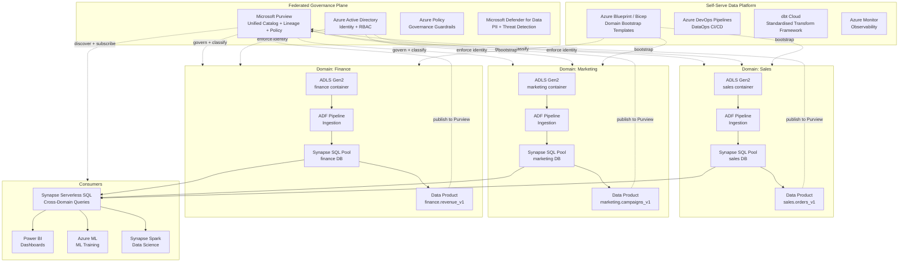
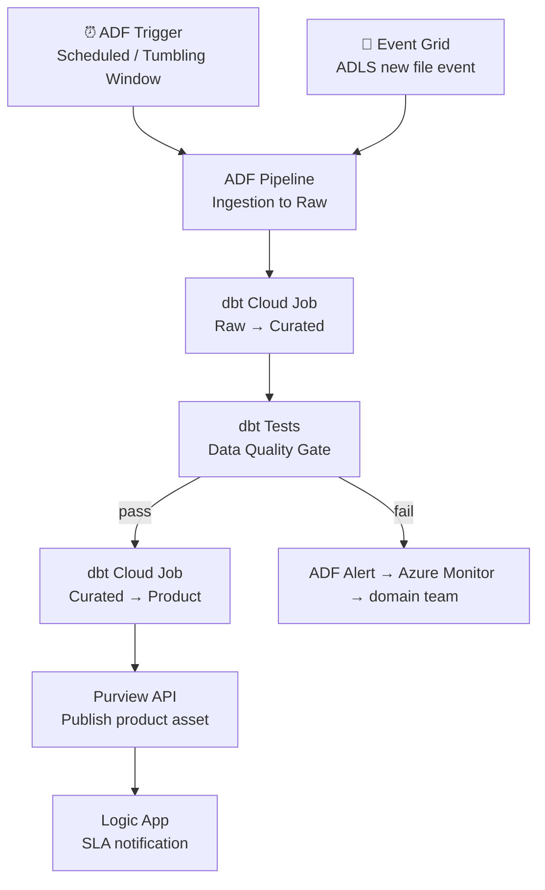

# 5.3 — Data Mesh · Azure Fully Managed

**Stack:** ADLS Gen2 (per domain) · Microsoft Purview · Synapse Analytics (per domain) · Azure Data Factory · dbt Cloud
**Processing:** Domain-chosen (Batch / Streaming / Hybrid per domain)
**Buy vs Build:** Buy (fully managed, no infra to operate)

---

## Architecture Overview



---

## Data Flow

```mermaid
flowchart LR
    subgraph Sources
        S1[(Azure SQL / Cosmos DB)]
        S2[SaaS APIs]
        S3[Event Hub Streams]
    end

    subgraph DomainIngestion["Domain Ingestion (per domain)"]
        I1[Azure Data Factory\nBatch + CDC Pipelines]
        I2[Event Hubs Capture\nStream to ADLS]
    end

    subgraph DomainStorage["Domain Storage — ADLS Gen2 + Synapse"]
        Z1[ADLS Raw\nabfss://{domain}/raw/]
        Z2[ADLS Curated\nabfss://{domain}/curated/]
        Z3[Synapse SQL Pool\n{domain}_db]
    end

    subgraph Catalog["Purview + Azure AD"]
        C1[Purview Scanner\nAuto Schema + Lineage]
        C2[Azure AD RBAC\nDomain Access Control]
        C3[Purview Data Products\nAsset + SLA Registry]
    end

    subgraph Consume
        E1[Synapse Serverless\nCross-Domain SQL]
        E2[Power BI\nDashboards]
        E3[Azure ML\nML]
        E4[Synapse Spark]
    end

    S1 --> I1 --> Z1
    S2 --> I1
    S3 --> I2 --> Z1
    Z1 -->|dbt Cloud| Z2 -->|dbt Cloud| Z3
    Z2 & Z3 -. scan .-> C1 --> C2
    Z3 -. register product .-> C3
    Z3 -->|reads data| E1 --> E2 & E3
    Z2 -->|reads data| E3 & E4
```

---

## Zone Design

```
ADLS Gen2 — Storage Account: {domain}datalake
│
├── container: raw/
│   └── {source}/{table}/year=YYYY/month=MM/day=DD/
│       └── Parquet · Snappy · as-received schema
│
├── container: curated/
│   └── {entity}/year=YYYY/month=MM/
│       └── dbt-transformed · Delta format · deduplicated
│
└── container: products/
    └── {product-name}/v={version}/
        └── schema-locked · SLA-backed · Delta or Parquet

Synapse SQL Pools (per domain):
  Database: {domain}_raw, {domain}_curated, {domain}_products
  External tables → point to ADLS via PolyBase / COPY INTO
```

---

## Security Model

```
┌──────────────────────────────────────────────────────────┐
│  Microsoft Purview + Azure AD — domain isolation          │
│                                                           │
│  AAD Group / Role       Access Level     Scope            │
│  ──────────────────     ────────────     ──────────────   │
│  domain-owner           Read + Write     Own ADLS + Synapse│
│  domain-engineer        Read + Write     Own ADLS + Synapse│
│  cross-domain-reader    Read only        Products layer   │
│  platform-admin         Owner            All domains      │
│  ml-consumer            Read only        Curated + Products│
│  bi-consumer            Read only        Products only    │
│                                                           │
│  ADLS ACL (POSIX)      → folder-level per domain          │
│  Synapse Row Security  → row filters on shared pools      │
│  Purview Data Policy   → attribute-based access control   │
│  Defender for Data     → auto-classify PII on ADLS        │
│  Azure Key Vault       → domain-scoped encryption keys    │
└──────────────────────────────────────────────────────────┘
```

---

## Orchestration



---

## Component Map

| Component | Azure Service | Notes |
|-----------|--------------|-------|
| Domain Storage | ADLS Gen2 (per storage account) | Container-per-zone; ACL-based isolation |
| Domain Warehouse | Synapse Analytics SQL Pool (per domain) | Dedicated or serverless per domain |
| Batch Ingestion | Azure Data Factory | 90+ connectors; linked service per source |
| CDC Ingestion | ADF + Azure Database for PostgreSQL CDC | Or Debezium on AKS for full OSS CDC |
| Stream Landing | Event Hubs Capture → ADLS | Avro/Parquet landing |
| Transformation | dbt Cloud | Domain-owned dbt projects; Synapse adapter |
| Cross-Domain Query | Synapse Serverless SQL | External tables across ADLS containers |
| Data Catalog | Microsoft Purview | Lineage, classification, data products |
| Access Control | Azure AD + ADLS ACL + Synapse RBAC | Layered identity + data access |
| PII Detection | Microsoft Defender for Cloud | Auto-classify ADLS + Synapse |
| Orchestration | ADF + dbt Cloud + Azure DevOps | Pipeline + transform + CI/CD |
| Dashboards | Power BI (Premium) | Direct Lake mode on Synapse |
| ML Consumption | Azure Machine Learning | Reads ADLS curated via datastore |
| Infra Provisioning | Azure Bicep + Azure Blueprint | Domain bootstrap templates |
| Observability | Azure Monitor + Log Analytics | ADF pipeline + Synapse metrics |

---

## Comparison vs 5.4 (Azure OSS)

| Dimension | 5.3 Azure Managed | 5.4 Azure OSS |
|-----------|------------------|--------------|
| Governance | Microsoft Purview | DataHub |
| Table format | Delta Lake (via Synapse) | Delta Lake |
| Query engine | Synapse Serverless SQL | Trino on AKS |
| Access control | Azure AD + Purview Policy | Apache Ranger |
| Orchestration | ADF + dbt Cloud | Airflow + dbt Core |
| Infra overhead | Low — managed services | Medium — Ranger, Trino, DataHub on AKS |
| Vendor lock-in | High (Azure-specific) | Medium (OSS + Azure infra) |
| Cost model | Synapse DWU + ADF DIU | AKS node compute |
| Data product registry | Purview Data Products | DataHub Data Products |
