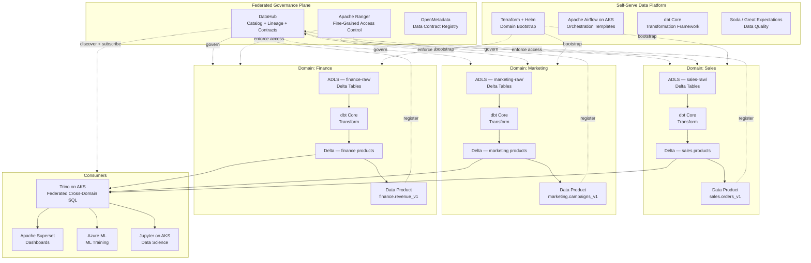
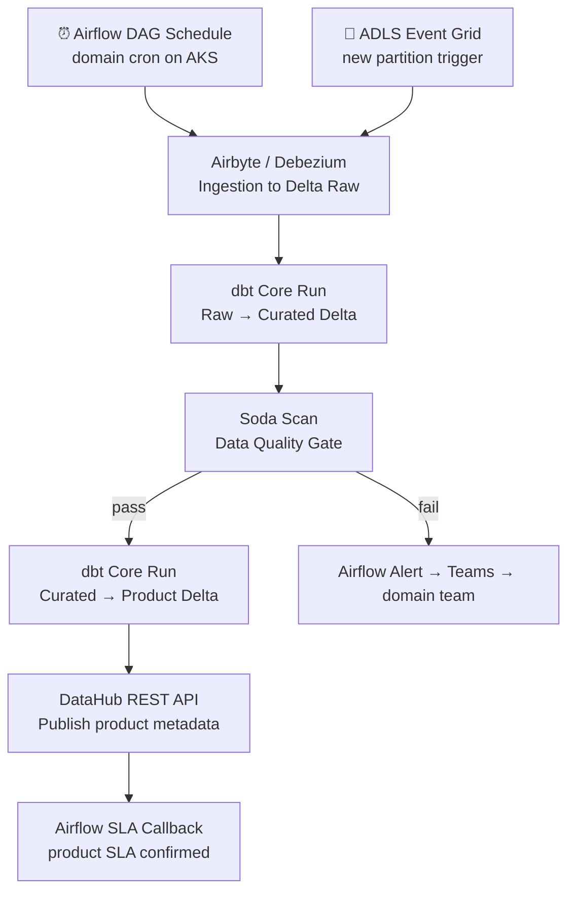

# 5.4 — Data Mesh · Azure OSS on Cloud

**Stack:** ADLS Gen2 · Delta Lake · DataHub · dbt Core · Apache Airflow (on AKS)
**Processing:** Domain-chosen (Batch / Streaming / Hybrid per domain)
**Buy vs Build:** Build (OSS on Azure infrastructure)

---

## Architecture Overview



---

## Data Flow

```mermaid
flowchart LR
    subgraph Sources
        S1[(Azure SQL / PostgreSQL)]
        S2[SaaS APIs]
        S3[Event Hub Streams]
    end

    subgraph DomainIngestion["Domain Ingestion (per domain)"]
        I1[Airbyte on AKS\nBatch Connectors]
        I2[Debezium + Event Hubs\nCDC]
        I3[Kafka Connect\nStream to ADLS]
    end

    subgraph DomainStorage["Domain Storage — ADLS + Delta Lake"]
        Z1[Delta Raw\nabfss://{domain}/raw/]
        Z2[Delta Curated\nabfss://{domain}/curated/]
        Z3[Delta Products\nabfss://{domain}/products/]
    end

    subgraph Catalog["DataHub + Apache Ranger"]
        C1[DataHub Ingestion\nAuto Lineage + Schema]
        C2[Ranger Policies\nDomain RBAC]
        C3[DataHub Contracts\nProduct SLA]
    end

    subgraph Consume
        E1[Trino on AKS\nFederated SQL]
        E2[Superset\nDashboards]
        E3[Azure ML\nML]
        E4[Jupyter]
    end

    S1 --> I2 --> Z1
    S2 --> I1 --> Z1
    S3 --> I3 --> Z1
    Z1 -->|dbt Core| Z2 -->|dbt Core| Z3
    Z2 & Z3 -. ingest .-> C1 --> C2
    Z3 -. contract .-> C3
    Z3 -->|reads via Trino| E1 --> E2 & E3 & E4
    Z2 -->|reads| E3
```

---

## Zone Design

```
ADLS Gen2 — Storage Account: {domain}datalake
│
├── raw/                    ← Delta Lake tables
│   └── {source}/{table}/   ← _delta_log/ + part files
│       └── year=YYYY/month=MM/day=DD/
│
├── curated/                ← Delta Lake tables
│   └── {entity}/           ← MERGE + UPSERT capable
│       └── ACID · schema evolution
│
└── products/               ← Delta Lake tables (schema-locked)
    └── {product-name}/     ← versioned via Delta tags
        └── SLA-backed · validated by Great Expectations

Delta catalog: Unity Catalog (OSS Hive Metastore on AKS)
  databases: {domain}_raw, {domain}_curated, {domain}_products
```

---

## Security Model

```
┌──────────────────────────────────────────────────────────┐
│  Apache Ranger + Azure AD — domain-scoped policies        │
│                                                           │
│  Principal             Access Level     Scope             │
│  ──────────────────    ────────────     ──────────────    │
│  domain-owner          Read + Write     Own ADLS + tables │
│  domain-engineer       Read + Write     Own ADLS + tables │
│  cross-domain-reader   Read only        Products schema   │
│  platform-admin        Admin            All domains       │
│  ml-consumer           Read only        Curated + Products│
│  bi-consumer           Read only        Products only     │
│                                                           │
│  Ranger Tag Policies   → domain tag gates table access    │
│  ADLS POSIX ACL        → folder-level isolation           │
│  Delta Row Filters     → via Trino + Ranger row policies  │
│  Column Masking        → Ranger masking on PII columns    │
│  DataHub Contracts     → schema + SLA enforcement         │
│  Azure Key Vault       → domain-scoped CMK encryption     │
└──────────────────────────────────────────────────────────┘
```

---

## Orchestration



---

## Component Map

| Component | Tool / Service | Notes |
|-----------|----------------|-------|
| Domain Storage | ADLS Gen2 + Delta Lake | Delta ACID on Azure blob; per-domain storage account |
| Batch Ingestion | Airbyte (on AKS) | Domain-managed connectors |
| CDC Ingestion | Debezium + Azure Event Hubs | Kafka-compatible stream; Debezium on AKS |
| Stream Landing | Kafka Connect Iceberg/Delta Sink | Event Hubs → ADLS via Kafka Connect on AKS |
| Transformation | dbt Core | Domain-owned dbt projects; Delta adapter |
| Query Engine | Trino (on AKS) | Federated SQL over Delta on ADLS |
| Access Control | Apache Ranger (on AKS) | Tag-based + column masking + row filter |
| Data Catalog | DataHub (on AKS) | Lineage, contracts, discovery |
| Data Quality | Soda Core / Great Expectations | Domain pipeline gates |
| Orchestration | Apache Airflow (on AKS) | Domain DAG namespaces via Airflow RBAC |
| Dashboards | Apache Superset | Connected to Trino |
| ML Consumption | Azure Machine Learning | Reads Delta curated/products via datastore |
| Infra Provisioning | Terraform + Helm | AKS namespaces per domain |
| Observability | Prometheus + Grafana | Airflow + Trino + Delta metrics |

---

## Comparison vs 5.3 (Azure Managed)

| Dimension | 5.4 Azure OSS | 5.3 Azure Managed |
|-----------|--------------|------------------|
| Governance | DataHub | Microsoft Purview |
| Table format | Delta Lake | Delta Lake (via Synapse) |
| Query engine | Trino on AKS | Synapse Serverless SQL |
| Access control | Apache Ranger | Azure AD + Purview Policy |
| Orchestration | Airflow + dbt Core | ADF + dbt Cloud |
| Infra overhead | Medium — AKS workloads | Low — managed services |
| Vendor lock-in | Low (OSS portable) | Medium (Azure-specific) |
| Cost model | AKS node compute | Synapse DWU + ADF DIU |
| Schema evolution | Delta ACID + dbt | Synapse schema migration |
| Data product registry | DataHub Data Products | Purview Data Products |
