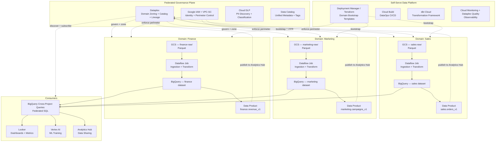
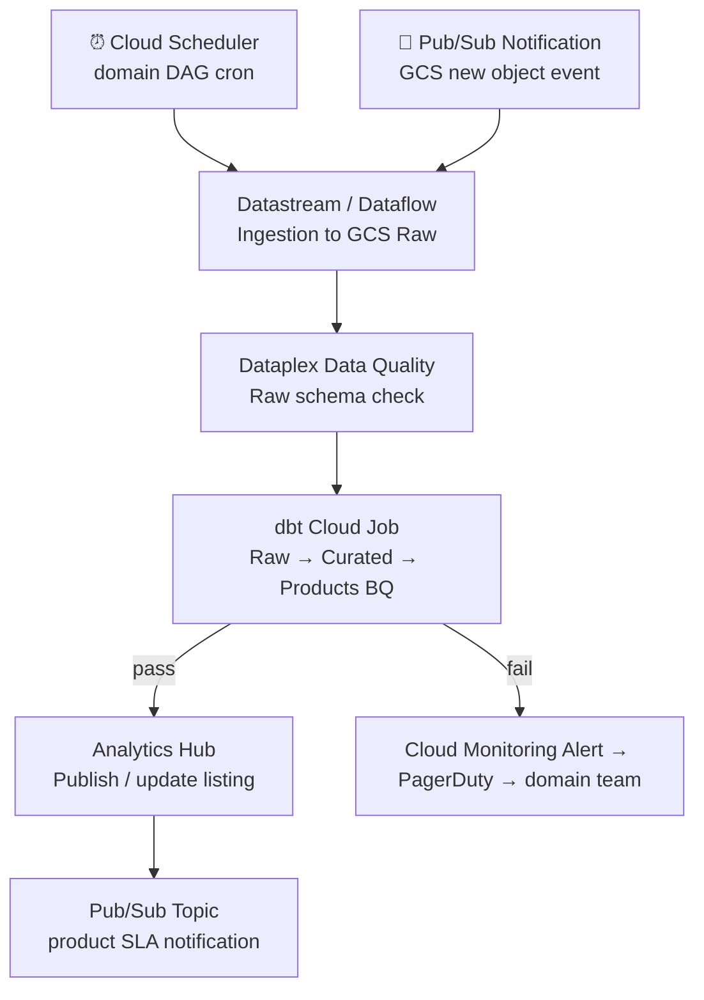

# 5.5 — Data Mesh · GCP Fully Managed

**Stack:** GCS · Dataplex (domain zoning) · BigQuery (per domain dataset) · Dataflow · dbt Cloud
**Processing:** Domain-chosen (Batch / Streaming / Hybrid per domain)
**Buy vs Build:** Buy (fully managed, no infra to operate)

---

## Architecture Overview



---

## Data Flow

```mermaid
flowchart LR
    subgraph Sources
        S1[(Cloud SQL / AlloyDB)]
        S2[SaaS APIs]
        S3[Pub/Sub Streams]
    end

    subgraph DomainIngestion["Domain Ingestion (per domain)"]
        I1[Datastream\nCDC from Cloud SQL]
        I2[Dataflow\nBatch + API Ingestion]
        I3[Pub/Sub → Dataflow\nStream Landing]
    end

    subgraph DomainStorage["Domain Storage — GCS + BigQuery"]
        Z1[GCS Raw\ngs://{domain}-raw/]
        Z2[GCS Curated\ngs://{domain}-curated/]
        Z3[BigQuery Dataset\n{domain}_products]
    end

    subgraph Catalog["Dataplex + Data Catalog + Analytics Hub"]
        C1[Dataplex Scanner\nAuto Schema + Quality]
        C2[IAM + VPC-SC\nDomain Access Control]
        C3[Analytics Hub\nData Product Exchange]
    end

    subgraph Consume
        E1[BigQuery\nCross-Project SQL]
        E2[Looker\nDashboards]
        E3[Vertex AI\nML]
        E4[Analytics Hub Subscriber]
    end

    S1 --> I1 --> Z1
    S2 --> I2 --> Z1
    S3 --> I3 --> Z1
    Z1 -->|dbt Cloud| Z2 -->|dbt Cloud| Z3
    Z2 & Z3 -. scan .-> C1 --> C2
    Z3 -. publish listing .-> C3
    Z3 -->|reads data| E1 --> E2 & E3
    C3 --> E4
    Z2 -->|reads| E3
```

---

## Zone Design

```
GCS: gs://{domain}-datalake/
│
├── raw/
│   └── {source}/{table}/year=YYYY/month=MM/day=DD/
│       └── Parquet · Snappy · as-received
│
├── curated/
│   └── {entity}/year=YYYY/month=MM/
│       └── dbt-transformed · Parquet · deduplicated
│
└── products/
    └── {product-name}/v={version}/
        └── schema-locked · SLA-backed · Parquet

BigQuery Datasets (per domain project):
  {domain}_raw          — external tables over GCS
  {domain}_curated      — materialized via dbt
  {domain}_products     — SLA-backed data product tables
  {domain}_analytics    — Analytics Hub published listings

Dataplex Lakes/Zones:
  lake: {domain}-lake
    zone: raw-zone       → GCS raw bucket
    zone: curated-zone   → GCS curated bucket + BQ curated
    zone: products-zone  → BQ products dataset
```

---

## Security Model

```
┌──────────────────────────────────────────────────────────┐
│  Google IAM + Dataplex + VPC Service Controls            │
│                                                           │
│  IAM Principal         Access Level     Scope             │
│  ──────────────────    ────────────     ──────────────    │
│  domain-owner@         Editor           Own GCS + BQ      │
│  domain-engineer@      Editor           Own GCS + BQ      │
│  cross-domain-reader@  Viewer           Products BQ dataset│
│  platform-admin@       Owner            All projects       │
│  ml-consumer@          Viewer           Curated + Products │
│  bi-consumer@          Viewer           Products only      │
│                                                           │
│  VPC Service Controls  → project-level perimeter          │
│  Dataplex Policies     → zone-level fine-grained access   │
│  BQ Column Security    → policy tags + Cloud DLP masking  │
│  BQ Row Access Policies→ domain-specific row filter       │
│  Analytics Hub         → explicit subscription approval   │
│  Cloud DLP             → auto-classify PII in BQ + GCS    │
│  Cloud KMS             → CMEK per domain project          │
└──────────────────────────────────────────────────────────┘
```

---

## Orchestration



---

## Component Map

| Component | GCP Service | Notes |
|-----------|------------|-------|
| Domain Storage | GCS (per domain bucket) | Uniform bucket-level access; CMEK |
| Domain Warehouse | BigQuery (per domain GCP project) | Dataset-level IAM; cross-project queries |
| CDC Ingestion | Datastream | Serverless CDC from Cloud SQL / AlloyDB / MySQL |
| Batch Ingestion | Dataflow (Apache Beam) | Managed Beam; built-in GCS + BQ connectors |
| Stream Landing | Pub/Sub + Dataflow Streaming | Pub/Sub subscription → Dataflow → BQ/GCS |
| Transformation | dbt Cloud | Domain dbt projects; BigQuery adapter |
| Cross-Domain Query | BigQuery (cross-project) | Authorized views or Analytics Hub listings |
| Data Catalog | Dataplex + Data Catalog | Zones, lineage, quality, tagging |
| Data Marketplace | Analytics Hub | Publisher/subscriber model for data products |
| Access Control | IAM + VPC-SC + Dataplex | Layered: project → dataset → table → column |
| PII Detection | Cloud DLP + BQ policy tags | Auto-classify + column-level masking |
| Data Quality | Dataplex Data Quality + dbt tests | Quality rules on Dataplex zones |
| Orchestration | Cloud Composer (Airflow) + Cloud Scheduler | Managed Airflow; or Workflows for simple |
| Dashboards | Looker | LookML semantic layer on BQ |
| ML Consumption | Vertex AI | Reads BQ curated/products via Vertex Datasets |
| Infra Provisioning | Terraform + Cloud Build | Domain GCP project bootstrap |
| Observability | Cloud Monitoring + Cloud Logging | Dataflow + BQ + Dataplex metrics |

---

## Comparison vs 5.6 (GCP OSS)

| Dimension | 5.5 GCP Managed | 5.6 GCP OSS |
|-----------|----------------|------------|
| Governance | Dataplex + Data Catalog | DataHub |
| Table format | BigQuery native | Apache Iceberg on GCS |
| Query engine | BigQuery | Trino on GKE |
| Access control | IAM + VPC-SC + Dataplex | Apache Ranger |
| Data marketplace | Analytics Hub | DataHub Data Products |
| Orchestration | Cloud Composer + dbt Cloud | Airflow + dbt Core |
| Infra overhead | Low — managed services | Medium — GKE workloads |
| Vendor lock-in | High (GCP-specific) | Low (OSS + GCP compute) |
| Cost model | BQ slot + storage | GKE node compute |
| Stream ingest | Pub/Sub + Dataflow | Pub/Sub + Apache Flink |
