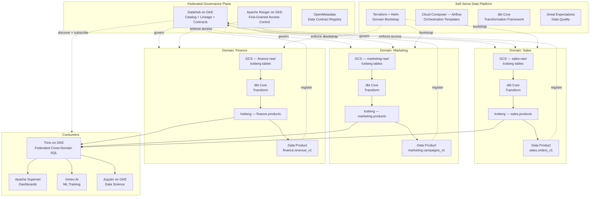
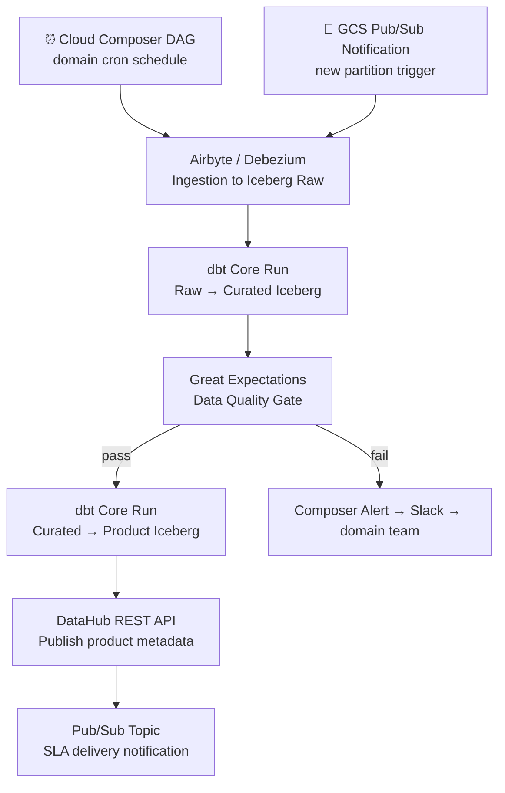

# 5.6 — Data Mesh · GCP OSS on Cloud

**Stack:** GCS · Apache Iceberg · DataHub · dbt Core · Apache Airflow (Cloud Composer) · Trino on GKE
**Processing:** Domain-chosen (Batch / Streaming / Hybrid per domain)
**Buy vs Build:** Build (OSS on GCP infrastructure)

---

## Architecture Overview



---

## Data Flow

```mermaid
flowchart LR
    subgraph Sources
        S1[(Cloud SQL / AlloyDB)]
        S2[SaaS APIs]
        S3[Pub/Sub Streams]
    end

    subgraph DomainIngestion["Domain Ingestion (per domain)"]
        I1[Airbyte on GKE\nBatch Connectors]
        I2[Debezium + Pub/Sub\nCDC]
        I3[Apache Flink on GKE\nStream to Iceberg]
    end

    subgraph DomainStorage["Domain Storage — GCS + Iceberg"]
        Z1[Iceberg Raw\ngs://{domain}-raw/]
        Z2[Iceberg Curated\ngs://{domain}-curated/]
        Z3[Iceberg Products\ngs://{domain}-products/]
    end

    subgraph Catalog["DataHub + Apache Ranger"]
        C1[DataHub Ingestion\nAuto Schema + Lineage]
        C2[Ranger Policies\nDomain RBAC]
        C3[DataHub Contracts\nProduct SLA]
    end

    subgraph Consume
        E1[Trino on GKE\nFederated SQL]
        E2[Superset\nDashboards]
        E3[Vertex AI\nML]
        E4[Jupyter]
    end

    S1 --> I2 --> Z1
    S2 --> I1 --> Z1
    S3 --> I3 --> Z1
    Z1 -->|dbt Core| Z2 -->|dbt Core| Z3
    Z2 & Z3 -. ingest .-> C1 --> C2
    Z3 -. contract .-> C3
    Z3 -->|reads via Trino| E1 --> E2 & E3 & E4
    Z2 -->|reads| E3
```

---

## Zone Design

```
GCS: gs://{domain}-lake/
│
├── raw/                      ← Iceberg tables (metadata/ + data/)
│   └── {source}/{table}/     ← _iceberg/ metadata dir
│       └── data/year=YYYY/month=MM/
│
├── curated/                  ← Iceberg tables
│   └── {entity}/             ← MERGE + UPSERT · schema evolution
│
└── products/                 ← Iceberg tables (schema-locked)
    └── {product-name}/       ← tagged by DataHub contract version
        └── SLA-backed · validated by Great Expectations

Iceberg catalog: Hive Metastore on GKE (or Nessie)
  databases: {domain}_raw, {domain}_curated, {domain}_products
```

---

## Security Model

```
┌──────────────────────────────────────────────────────────┐
│  Apache Ranger + GCP IAM — domain-scoped policies         │
│                                                           │
│  Principal             Access Level     Scope             │
│  ──────────────────    ────────────     ──────────────    │
│  domain-owner@         Read + Write     Own GCS + Iceberg │
│  domain-engineer@      Read + Write     Own GCS + Iceberg │
│  cross-domain-reader@  Read only        Products schema   │
│  platform-admin@       Admin            All domains       │
│  ml-consumer@          Read only        Curated + Products│
│  bi-consumer@          Read only        Products only     │
│                                                           │
│  Ranger Tag Policies   → domain tag gates table access    │
│  GCS IAM Conditions    → bucket-level domain isolation    │
│  Iceberg Row Filters   → via Trino + Ranger row policies  │
│  Column Masking        → Ranger masking on PII columns    │
│  DataHub Contracts     → schema + SLA enforcement         │
│  Cloud KMS + CMEK      → domain-scoped encryption keys    │
└──────────────────────────────────────────────────────────┘
```

---

## Orchestration



---

## Component Map

| Component | Tool / Service | Notes |
|-----------|----------------|-------|
| Domain Storage | GCS + Apache Iceberg | ACID, time-travel per domain bucket |
| Batch Ingestion | Airbyte (on GKE) | Domain-managed connectors |
| CDC Ingestion | Debezium + Pub/Sub | Kafka-protocol CDC; Debezium on GKE |
| Stream Landing | Apache Flink on GKE → Iceberg | Flink Iceberg sink; streaming writes |
| Transformation | dbt Core | Domain-owned dbt projects; Trino adapter |
| Iceberg Catalog | Hive Metastore on GKE (or Nessie) | Shared across Trino + Flink |
| Query Engine | Trino on GKE | Federated SQL over Iceberg on GCS |
| Access Control | Apache Ranger (on GKE) | Tag-based + column masking + row filter |
| Data Catalog | DataHub (on GKE) | Lineage, contracts, discovery |
| Data Quality | Great Expectations | Domain pipeline quality gates |
| Orchestration | Cloud Composer (managed Airflow) | Domain DAG namespaces |
| Dashboards | Apache Superset | Connected to Trino |
| ML Consumption | Vertex AI | Reads Iceberg curated/products via GCS |
| Infra Provisioning | Terraform + Helm | GKE namespace per domain |
| Observability | Prometheus + Grafana on GKE | Trino + Flink + Airflow metrics |

---

## Comparison vs 5.5 (GCP Managed)

| Dimension | 5.6 GCP OSS | 5.5 GCP Managed |
|-----------|------------|----------------|
| Governance | DataHub | Dataplex + Data Catalog |
| Table format | Apache Iceberg | BigQuery native |
| Query engine | Trino on GKE | BigQuery |
| Access control | Apache Ranger | IAM + VPC-SC + Dataplex |
| Data marketplace | DataHub Data Products | Analytics Hub |
| Orchestration | Cloud Composer + dbt Core | Cloud Composer + dbt Cloud |
| Infra overhead | Medium — GKE workloads | Low — managed BQ + Dataplex |
| Vendor lock-in | Low (portable OSS) | High (GCP-specific) |
| Cost model | GKE node compute | BQ slot + storage |
| Time-travel | Iceberg native | BigQuery time-travel (7 days) |
