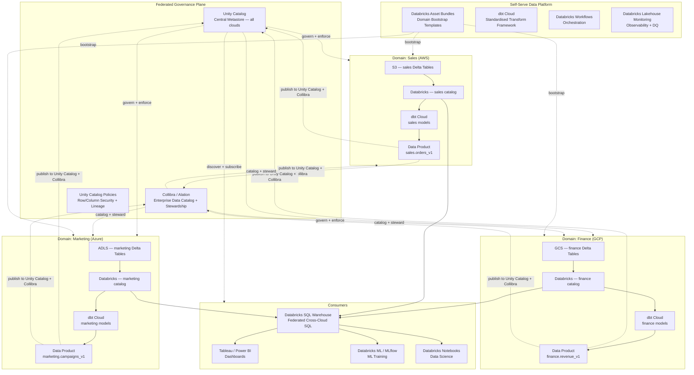
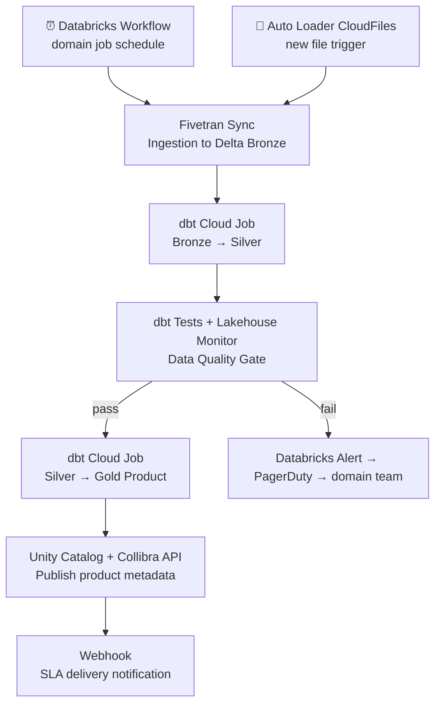

# 5.7 — Data Mesh · Multi-Cloud Fully Managed

**Stack:** Databricks (Unity Catalog) · Delta Lake · dbt Cloud · Alation / Collibra · Fivetran
**Processing:** Domain-chosen (Batch / Streaming / Hybrid per domain)
**Buy vs Build:** Buy (managed SaaS across clouds)

---

## Architecture Overview



---

## Data Flow

```mermaid
flowchart LR
    subgraph Sources
        S1[(Cloud DBs — RDS / Azure SQL / Cloud SQL)]
        S2[SaaS APIs\nSalesforce · Marketo · SAP]
        S3[Event Streams\nKinesis · Event Hubs · Pub/Sub]
    end

    subgraph DomainIngestion["Domain Ingestion (per domain)"]
        I1[Fivetran\nManaged Connectors]
        I2[Databricks Auto Loader\nGCS/S3/ADLS stream ingest]
    end

    subgraph DomainStorage["Domain Storage — Cloud Object Store + Delta Lake"]
        Z1[Delta Bronze\n{cloud}://{domain}-bronze/]
        Z2[Delta Silver\n{cloud}://{domain}-silver/]
        Z3[Delta Gold\n{cloud}://{domain}-gold/]
    end

    subgraph Catalog["Unity Catalog + Collibra"]
        C1[Unity Catalog\nAuto Schema + Lineage]
        C2[Unity Policies\nDomain RBAC + Masking]
        C3[Collibra\nBusiness Catalog + Stewardship]
    end

    subgraph Consume
        E1[Databricks SQL Warehouse\nCross-Cloud SQL]
        E2[Tableau / Power BI]
        E3[Databricks ML / MLflow]
        E4[Notebooks]
    end

    S1 --> I1 --> Z1
    S2 --> I1
    S3 --> I2 --> Z1
    Z1 -->|dbt Cloud| Z2 -->|dbt Cloud| Z3
    Z2 & Z3 -. register .-> C1 --> C2
    Z3 -. steward .-> C3
    Z3 -->|reads via SQL Warehouse| E1 --> E2 & E3 & E4
    Z2 -->|reads| E3
```

---

## Zone Design

```
Cloud Object Storage (per domain per cloud):
  AWS:   s3://{domain}-lakehouse/
  Azure: abfss://{domain}@{account}.dfs.core.windows.net/
  GCP:   gs://{domain}-lakehouse/
│
├── bronze/       ← Delta Lake · raw as-landed · Auto Loader
│   └── {source}/{table}/
│
├── silver/       ← Delta Lake · dbt-transformed · MERGE
│   └── {entity}/
│
└── gold/         ← Delta Lake · domain data products
    └── {product-name}/    ← schema-locked · SLA-backed

Unity Catalog (per-domain):
  metastore: enterprise-metastore (shared, cross-cloud)
  catalog:   {domain}          ← one catalog per domain
    schema:  bronze / silver / gold
    tables:  registered Delta tables

Collibra:
  community: {domain}
  domain: Data Products
  assets: one asset per gold table + SLA attributes
```

---

## Security Model

```
┌──────────────────────────────────────────────────────────┐
│  Databricks Unity Catalog — domain-isolated catalogs      │
│                                                           │
│  Principal             Access Level     Scope             │
│  ──────────────────    ────────────     ──────────────    │
│  domain-owner          USE + MODIFY     Own catalog       │
│  domain-engineer       USE + MODIFY     Own catalog       │
│  cross-domain-reader   SELECT           Gold tables only  │
│  platform-admin        Account Admin    All catalogs      │
│  ml-consumer           SELECT           Silver + Gold     │
│  bi-consumer           SELECT           Gold only         │
│                                                           │
│  Unity Catalog Tags    → domain tag gates catalog access  │
│  Column Masks          → Unity dynamic masking on PII     │
│  Row Filters           → Unity row-level security         │
│  Collibra Policies     → business-level access approval   │
│  Cloud IAM             → storage-level fallback           │
│  Cloud KMS / BYOK      → domain encryption keys           │
└──────────────────────────────────────────────────────────┘
```

---

## Orchestration



---

## Component Map

| Component | Tool / Service | Notes |
|-----------|----------------|-------|
| Domain Storage | S3 / ADLS / GCS + Delta Lake | One cloud per domain; Unity spans all |
| Batch Ingestion | Fivetran | 500+ managed connectors; no infra |
| Stream Ingestion | Databricks Auto Loader | Incremental file processing on all clouds |
| Transformation | dbt Cloud | Domain dbt projects; Databricks adapter |
| Table Format | Delta Lake | ACID, time-travel, schema evolution |
| Query Engine | Databricks SQL Warehouse | Serverless; cross-catalog federated SQL |
| Central Catalog | Databricks Unity Catalog | Cross-cloud metastore; lineage; column masking |
| Business Catalog | Collibra / Alation | Business glossary + stewardship + approval |
| Access Control | Unity Catalog RBAC + Masks | Row filters + column masking built-in |
| ML Platform | Databricks ML + MLflow | Feature engineering + model tracking |
| Orchestration | Databricks Workflows | DAG-based; Delta Live Tables for streaming |
| Dashboards | Tableau / Power BI | JDBC to Databricks SQL Warehouse |
| Infra Provisioning | Databricks Asset Bundles + Terraform | One bundle template per domain |
| Observability | Databricks Lakehouse Monitoring | DQ metrics on Delta tables + query history |
| Encryption | Cloud KMS (BYOK) | Domain-level CMK per cloud |

---

## Comparison vs 5.8 (Multi-Cloud OSS)

| Dimension | 5.7 Multi-Cloud Managed | 5.8 Multi-Cloud OSS |
|-----------|------------------------|---------------------|
| Central catalog | Databricks Unity Catalog | Apache Iceberg + Nessie Catalog |
| Business catalog | Collibra / Alation | DataHub + OpenMetadata |
| Table format | Delta Lake | Apache Iceberg |
| Query engine | Databricks SQL Warehouse | Trino |
| Orchestration | Databricks Workflows + dbt Cloud | Airflow + dbt Core |
| Ingestion | Fivetran | Airbyte + Debezium |
| Infra overhead | Low — managed SaaS | Medium — self-managed on K8s |
| Vendor lock-in | Medium (Databricks) | Low (fully portable OSS) |
| Cost model | DBU serverless | EC2/GKE compute |
| Cross-cloud governance | Unity single metastore | Nessie + Ranger per cluster |
