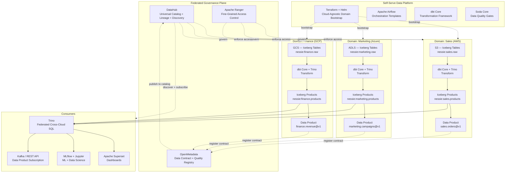
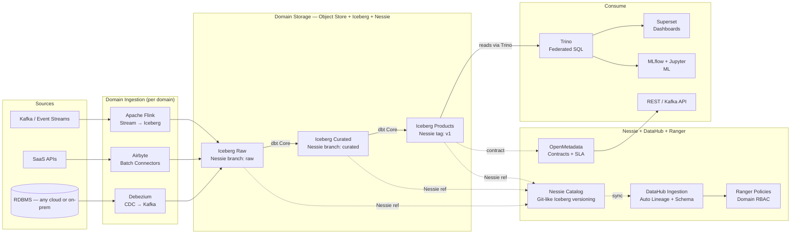
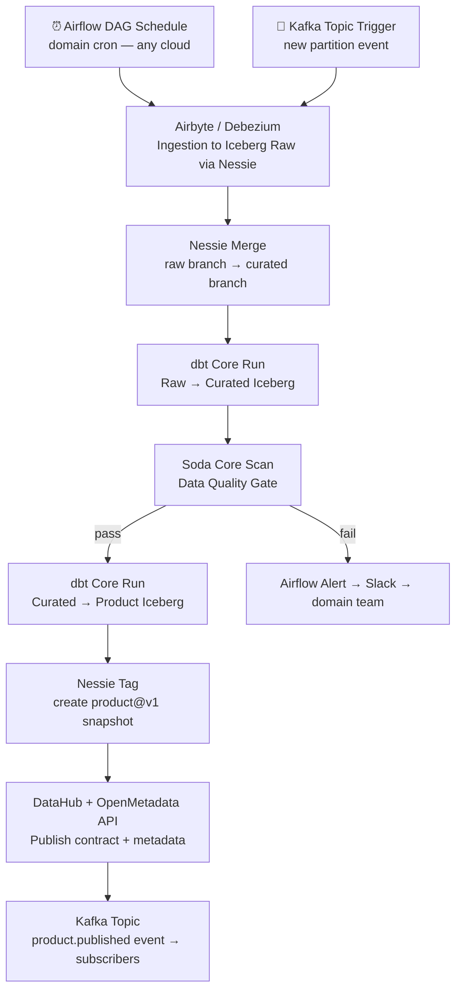

# 5.8 — Data Mesh · Multi-Cloud OSS Portable

**Stack:** Apache Iceberg · Project Nessie (Catalog) · DataHub · OpenMetadata · dbt Core · Apache Airflow · Trino
**Processing:** Domain-chosen (Batch / Streaming / Hybrid per domain)
**Buy vs Build:** Build (fully portable OSS — runs on any cloud or on-prem)

---

## Architecture Overview



---

## Data Flow



---

## Zone Design

```
Object Storage (per domain, any cloud):
  AWS:   s3://{domain}-iceberg/
  Azure: abfss://{domain}@{account}.dfs.core.windows.net/
  GCP:   gs://{domain}-iceberg/
  MinIO: http://minio/{domain}-iceberg/   ← on-prem / hybrid
│
├── raw/                      ← Iceberg table (metadata/ + data/)
│   └── {source}/{table}/
│       └── metadata/ + data/year=YYYY/month=MM/
│
├── curated/                  ← Iceberg table · MERGE capable
│   └── {entity}/
│
└── products/                 ← Iceberg table · schema-locked
    └── {product-name}/

Nessie Catalog (shared across domains):
  branches:
    main/{domain}/raw          → raw tables
    main/{domain}/curated      → curated tables
  tags:
    {domain}/{product}@v1      → immutable product snapshot

OpenMetadata contract per product:
  schema version · SLA (latency + freshness) · owner · data quality rules
```

---

## Security Model

```
┌──────────────────────────────────────────────────────────┐
│  Apache Ranger + Cloud IAM — fully portable              │
│                                                           │
│  Principal             Access Level     Scope             │
│  ──────────────────    ────────────     ──────────────    │
│  domain-owner          Read + Write     Own Nessie branch │
│  domain-engineer       Read + Write     Own Nessie branch │
│  cross-domain-reader   Read only        Products tag only │
│  platform-admin        Admin            All domains       │
│  ml-consumer           Read only        Curated + Products│
│  bi-consumer           Read only        Products only     │
│                                                           │
│  Ranger Tag Policies   → Iceberg namespace tag           │
│  Cloud IAM Conditions  → bucket prefix per domain        │
│  Trino + Ranger        → row filter + column masking     │
│  Nessie Branch ACL     → write-lock product tags         │
│  OpenMetadata SLA      → quality gate blocks product push│
│  HashiCorp Vault       → cross-cloud secret management   │
│  BYOK (cloud KMS)      → domain-scoped encryption        │
└──────────────────────────────────────────────────────────┘
```

---

## Orchestration



---

## Component Map

| Component | Tool / Service | Notes |
|-----------|----------------|-------|
| Domain Storage | Cloud Object Store + Apache Iceberg | S3/ADLS/GCS/MinIO — same API |
| Iceberg Catalog | Project Nessie | Git-like branching for Iceberg tables; cross-cloud |
| Batch Ingestion | Airbyte (on K8s) | Cloud-agnostic; 300+ connectors |
| CDC Ingestion | Debezium + Apache Kafka | Portable CDC; Kafka Connect Iceberg sink |
| Stream Landing | Apache Flink + Iceberg sink | Flink on K8s; real-time Iceberg writes |
| Transformation | dbt Core | Domain dbt projects; Trino adapter |
| Query Engine | Trino | Federated SQL over Iceberg on any object store |
| Access Control | Apache Ranger | Tag-based; column masking; row filter |
| Universal Catalog | DataHub | Auto lineage from dbt + Airflow + Trino |
| Contract Registry | OpenMetadata | Schema contracts + SLA + quality rules |
| Data Quality | Soda Core | Pipeline-embedded quality checks |
| Secret Management | HashiCorp Vault | Cross-cloud credentials; no cloud lock-in |
| Orchestration | Apache Airflow | Cloud Composer / MWAA / self-hosted on K8s |
| Dashboards | Apache Superset | Connected to Trino |
| ML Platform | MLflow + Jupyter | Reads Iceberg tables via PyIceberg |
| Infra Provisioning | Terraform + Helm | Cloud-agnostic Kubernetes modules |
| Observability | Prometheus + Grafana | Trino + Flink + Airflow + Nessie metrics |

---

## Comparison vs 5.7 (Multi-Cloud Managed)

| Dimension | 5.8 Multi-Cloud OSS | 5.7 Multi-Cloud Managed |
|-----------|---------------------|------------------------|
| Central catalog | Nessie + DataHub | Databricks Unity Catalog |
| Business catalog | OpenMetadata | Collibra / Alation |
| Table format | Apache Iceberg | Delta Lake |
| Query engine | Trino | Databricks SQL Warehouse |
| Orchestration | Airflow + dbt Core | Databricks Workflows + dbt Cloud |
| Ingestion | Airbyte + Debezium | Fivetran |
| Stream ingest | Flink + Iceberg sink | Databricks Auto Loader |
| Infra overhead | High — full K8s stack | Low — managed SaaS |
| Vendor lock-in | None — fully portable | Medium (Databricks) |
| Cost model | K8s compute | DBU serverless |
| Table versioning | Nessie git branches | Delta log |
| Product API | Kafka events + REST | Webhook + Unity |
