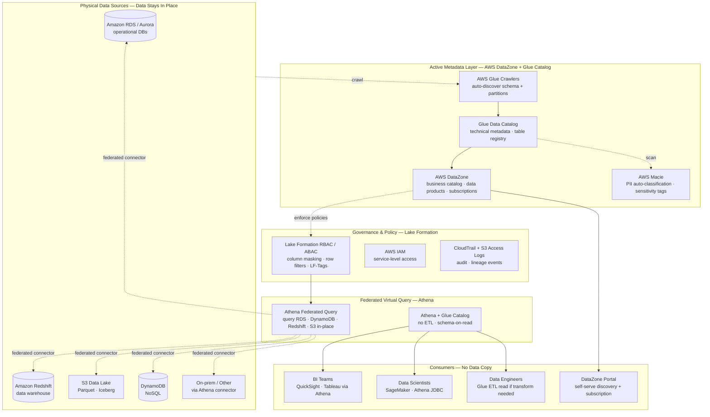
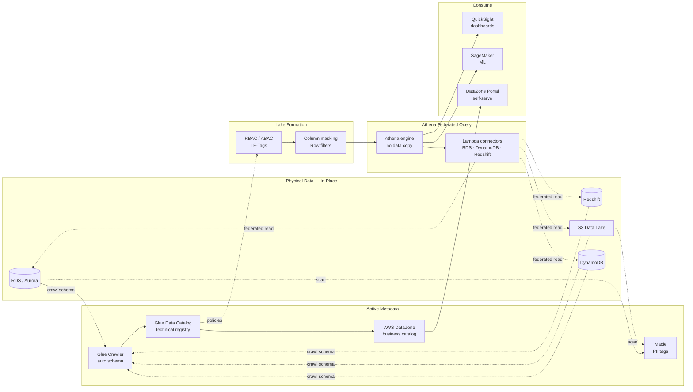
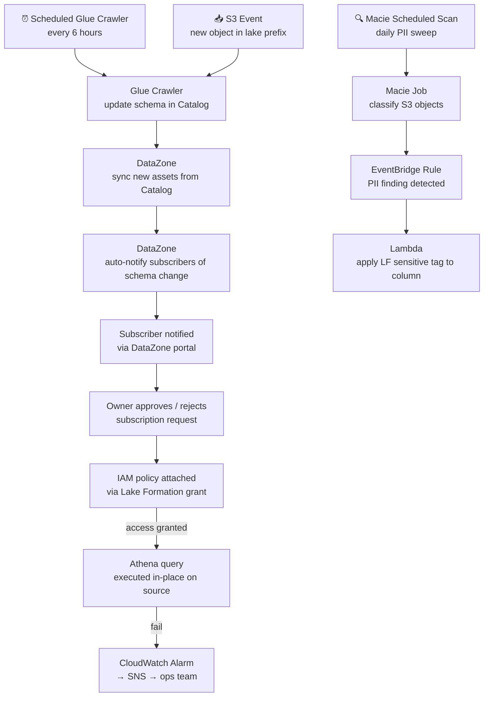

# 6.1 — Data Fabric · AWS Fully Managed

**Stack:** AWS DataZone · AWS Glue Data Catalog · Lake Formation · Athena Federated Query · AWS Macie · Amazon DataZone
**Processing:** Federated Query · No Data Movement · Active Metadata
**Buy vs Build:** Buy (fully managed AWS-native fabric)

---

## Architecture Overview



---

## Data Flow



---

## Catalog Structure

```
AWS DataZone Domain
├── domain: finance
│   ├── data-product: customer-360
│   │   ├── asset: customer_dim         → Redshift (virtual)
│   │   └── asset: customer_events      → S3 Iceberg (virtual)
│   └── data-product: transactions
│       └── asset: transactions_raw     → S3 (virtual)
│
├── domain: operations
│   ├── data-product: inventory
│   │   └── asset: inventory_current    → DynamoDB (virtual)
│   └── data-product: orders
│       └── asset: orders_live          → RDS Aurora (virtual)
│
└── domain: marketing
    └── data-product: campaign-analytics
        └── asset: campaign_events      → S3 (virtual)

Glue Data Catalog (technical layer)
├── database: finance_raw
│   └── tables → s3://lake/finance/*/
├── database: ops_raw
│   └── tables → s3://lake/ops/*/
└── database: redshift_ext
    └── tables → Redshift Spectrum external schemas

All assets are virtual — no data physically moved to catalog.
Athena Federated Query resolves at query-time via Lambda connectors.
```

---

## Security Model

```
┌──────────────────────────────────────────────────────────────────┐
│  Lake Formation RBAC/ABAC + DataZone Subscriptions + IAM         │
│                                                                  │
│  Principal             Access Level     Scope                    │
│  ─────────────────── ─ ─────────────    ──────────────────────  │
│  data-engineer-role    SELECT + crawl   all databases            │
│  bi-analyst-role       SELECT (masked)  finance · marketing      │
│  data-scientist-role   SELECT           raw + curated assets     │
│  ml-pipeline-sa        SELECT           approved DataZone assets │
│  ops-reader-role       SELECT           ops domain only          │
│  audit-role            SELECT           CloudTrail + access logs │
│                                                                  │
│  Lake Formation → LF-Tag ABAC per domain (no per-table grants)  │
│  Column masking → PII columns via LF column-level security       │
│  Row filters    → region / team scope per analyst role           │
│  DataZone subs  → consumers subscribe; owner approves access     │
│  Macie          → auto-tag PII buckets; triggers LF policy       │
│  CloudTrail     → all Athena + Glue API calls audited            │
└──────────────────────────────────────────────────────────────────┘
```

---

## Orchestration



---

## Component Map

| Component | AWS Service | Notes |
|-----------|-------------|-------|
| Business Catalog | AWS DataZone | Data product marketplace; subscription-based access; domain ownership |
| Technical Catalog | AWS Glue Data Catalog | Hive-compatible; shared by Athena, EMR, Glue, Redshift Spectrum |
| Schema Discovery | AWS Glue Crawlers | Auto-detect schema from S3, RDS, Redshift; schedule or event-triggered |
| PII Detection | AWS Macie | S3 content scanning; findings trigger Lake Formation tag policies |
| Access Control | AWS Lake Formation | Column masking · row filters · LF-Tag ABAC; no IAM per-table grants |
| Federated Query | Amazon Athena + Lambda connectors | Query RDS, DynamoDB, Redshift, S3 in-place without ETL |
| S3 Connector | Athena native | Built-in Parquet, ORC, JSON, CSV, Iceberg support |
| RDS Connector | Athena JDBC Lambda | MySQL, PostgreSQL, SQL Server, Oracle via Lambda Data Source |
| DynamoDB Connector | Athena DynamoDB Lambda | Full scan or partition filter pushdown |
| Redshift Connector | Athena Redshift Lambda | In-place query without Spectrum; or use Redshift native |
| Audit & Lineage | CloudTrail + S3 Access Logs | API-level audit; DataZone lineage for data products |
| BI Access | Amazon QuickSight | Native Athena integration; SPICE or direct |
| Monitoring | CloudWatch | Athena query metrics, crawler run status, Macie findings |
| Encryption | AWS KMS | SSE-KMS on S3; TLS for all Athena federated connectors |

---

## Comparison vs 6.2 (Azure Data Fabric)

| Dimension | 6.1 AWS Managed | 6.2 Azure Managed |
|-----------|----------------|-------------------|
| Business catalog | AWS DataZone | Microsoft Purview |
| Technical catalog | Glue Data Catalog | Purview unified catalog |
| Federated query | Athena + Lambda connectors | Synapse Serverless SQL |
| Operational link | Athena RDS connector | Azure Synapse Link (Cosmos DB / SQL) |
| PII classification | AWS Macie | Purview DLP + sensitivity labels |
| Access control | Lake Formation ABAC | Azure RBAC + Purview data policy |
| Cross-cloud query | Limited (Lambda connectors) | Yes (Synapse Link + Purview cross-source) |
| Self-serve portal | DataZone marketplace | Purview data catalog |

---

## When to Choose This Implementation

✅ AWS is primary cloud and data stays on AWS
✅ Need self-serve data product marketplace (DataZone)
✅ Multiple data sources (RDS, DynamoDB, Redshift, S3) need unified virtual access
✅ Compliance requires zero data copy — Athena queries in-place
✅ Fine-grained column/row access via Lake Formation already in use

❌ Cross-cloud data sources on Azure/GCP → use 6.4 (Multi-Cloud Managed)
❌ On-prem data residency is primary constraint → use 6.6 or 6.7
❌ Full OSS stack, no vendor lock-in → use 6.5
