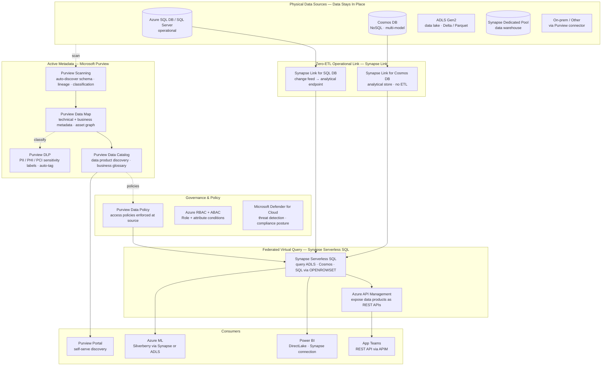
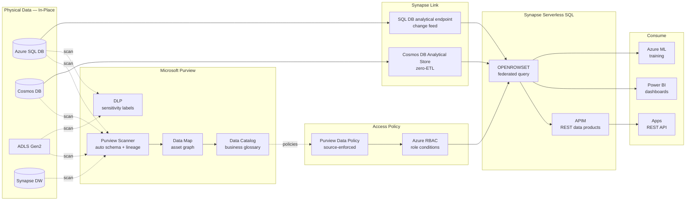
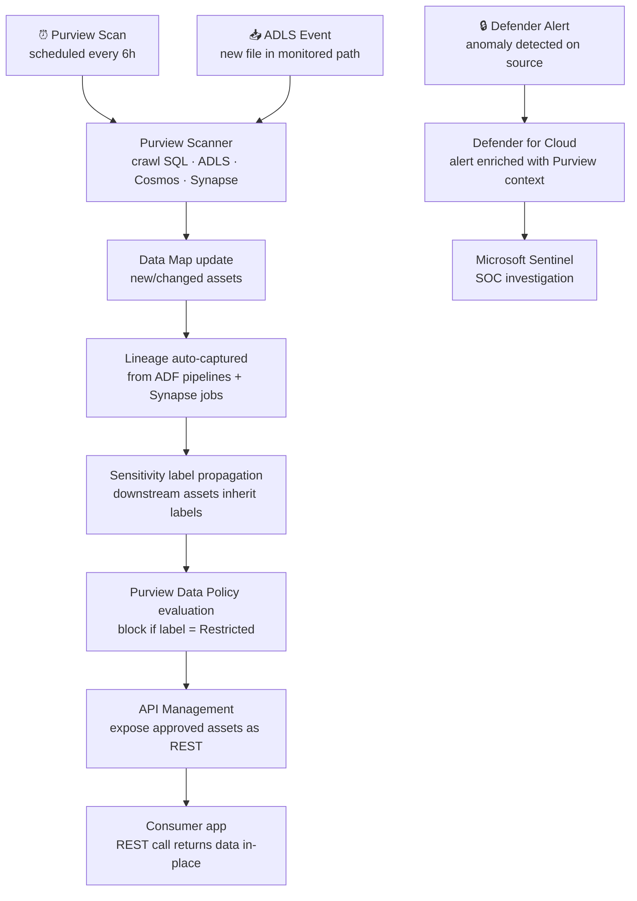

# 6.2 — Data Fabric · Azure Fully Managed

**Stack:** Microsoft Purview · Azure Synapse Link · Synapse Serverless SQL · Azure API Management · Microsoft Defender for Cloud
**Processing:** Federated Query · No Data Movement · Active Metadata · Zero-ETL Operational Analytics
**Buy vs Build:** Buy (fully managed Azure-native fabric)

---

## Architecture Overview



---

## Data Flow



---

## Catalog Structure

```
Microsoft Purview Data Map
├── Collection: azure-data-fabric
│   ├── Source: Azure SQL DB (prod-sql-server)
│   │   ├── Asset: dbo.customers        → sensitivity: PII
│   │   └── Asset: dbo.orders           → sensitivity: Confidential
│   ├── Source: Cosmos DB (cosmos-ops)
│   │   ├── Asset: orders container     → analytical store enabled
│   │   └── Asset: inventory container  → analytical store enabled
│   ├── Source: ADLS Gen2 (datalake-prod)
│   │   ├── Asset: /finance/*/          → Delta Lake
│   │   └── Asset: /marketing/*/        → Parquet
│   └── Source: Synapse DW (synapse-prod)
│       └── Asset: gold.* tables        → BI-ready

Business Glossary (Purview)
  customer → canonical definition · owner: CRM team
  order    → canonical definition · owner: Commerce team

All assets are virtual — Purview maps metadata only.
Synapse Link provides zero-ETL analytical access to Cosmos DB and SQL DB.
Synapse Serverless SQL queries ADLS in-place via OPENROWSET.
```

---

## Security Model

```
┌──────────────────────────────────────────────────────────────────┐
│  Purview Data Policy + Azure RBAC + Defender for Cloud           │
│                                                                  │
│  Principal               Access Level     Scope                  │
│  ──────────────────────  ─────────────    ──────────────────── │
│  data-engineer-grp       READ + scan      all collections        │
│  bi-analyst-grp          READ (masked)    finance · marketing    │
│  data-scientist-grp      READ             ADLS full · Synapse    │
│  app-team-sa             READ             APIM REST endpoints     │
│  compliance-officer      READ + audit     Purview compliance view │
│  defender-sa             READ             all sources (scanning)  │
│                                                                  │
│  Purview Data Policy → access enforced at storage source level   │
│  Sensitivity labels  → auto-applied; block access if PII         │
│  Column masking      → dynamic data masking in SQL DB / Synapse  │
│  Row-level security  → Synapse Serverless SQL row filters        │
│  Defender for Cloud  → anomaly detection on SQL + Storage        │
│  Private Endpoints   → ADLS, SQL DB, Cosmos DB not public        │
└──────────────────────────────────────────────────────────────────┘
```

---

## Orchestration



---

## Component Map

| Component | Azure Service | Notes |
|-----------|--------------|-------|
| Business Catalog | Microsoft Purview Data Catalog | Business glossary · data product discovery · lineage graph |
| Technical Metadata | Purview Data Map | Auto-scan schema from ADLS, SQL DB, Cosmos, Synapse, on-prem |
| PII Classification | Purview DLP + sensitivity labels | 100+ built-in classifiers; custom regex; propagates to downstream |
| Zero-ETL Link | Azure Synapse Link for Cosmos DB | Analytical store — columnar, no RU cost; auto-sync |
| Zero-ETL Link | Azure Synapse Link for SQL DB | Change feed to analytical endpoint; no DMS needed |
| Federated Query | Synapse Serverless SQL | OPENROWSET over ADLS Parquet/Delta/CSV; pay per TB scanned |
| API Exposure | Azure API Management | REST data product APIs; OAuth + subscription keys |
| Access Control | Purview Data Policy | Source-enforced; no per-app IAM grants needed |
| Authorization | Azure RBAC + ABAC | Conditions on storage account + Synapse workspace |
| Threat Detection | Microsoft Defender for Cloud | SQL threat detection · anomalous access · misconfiguration |
| Audit | Azure Monitor + Purview Audit | All access events; retention to Log Analytics |
| BI Access | Power BI DirectLake | Zero-copy semantic model on ADLS Delta tables |
| Encryption | Azure Key Vault + CMK | ADLS, SQL DB, Cosmos, Synapse all BYOK |

---

## Comparison vs 6.1 (AWS Data Fabric)

| Dimension | 6.2 Azure Managed | 6.1 AWS Managed |
|-----------|------------------|----------------|
| Business catalog | Microsoft Purview | AWS DataZone |
| Technical catalog | Purview Data Map (unified) | Glue Data Catalog (separate) |
| Zero-ETL operational | Synapse Link (Cosmos + SQL) | Athena Lambda connector |
| Federated query | Synapse Serverless SQL | Amazon Athena |
| PII classification | Purview built-in 100+ classifiers | AWS Macie (S3 only) |
| Access control | Purview Data Policy (source-enforced) | Lake Formation (catalog-enforced) |
| API exposure | Azure API Management built-in | Custom API Gateway + Lambda |
| Security posture | Defender for Cloud unified | AWS Security Hub |

---

## When to Choose This Implementation

✅ Azure is primary cloud; Cosmos DB or Azure SQL are key operational sources
✅ Need zero-ETL analytical access to Cosmos DB (Synapse Link)
✅ Microsoft 365 / Entra ID already governs identity — Purview integrates natively
✅ Power BI DirectLake is the primary BI tool
✅ Compliance requires unified lineage from operational to analytical systems

❌ Cross-cloud data on AWS/GCP is primary → use 6.4 (Multi-Cloud Managed)
❌ On-prem Oracle/SAP is primary source → use 6.6 (Hybrid Managed)
❌ Full OSS, no Azure dependency → use 6.5
