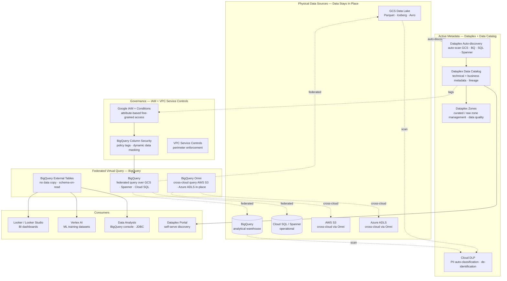
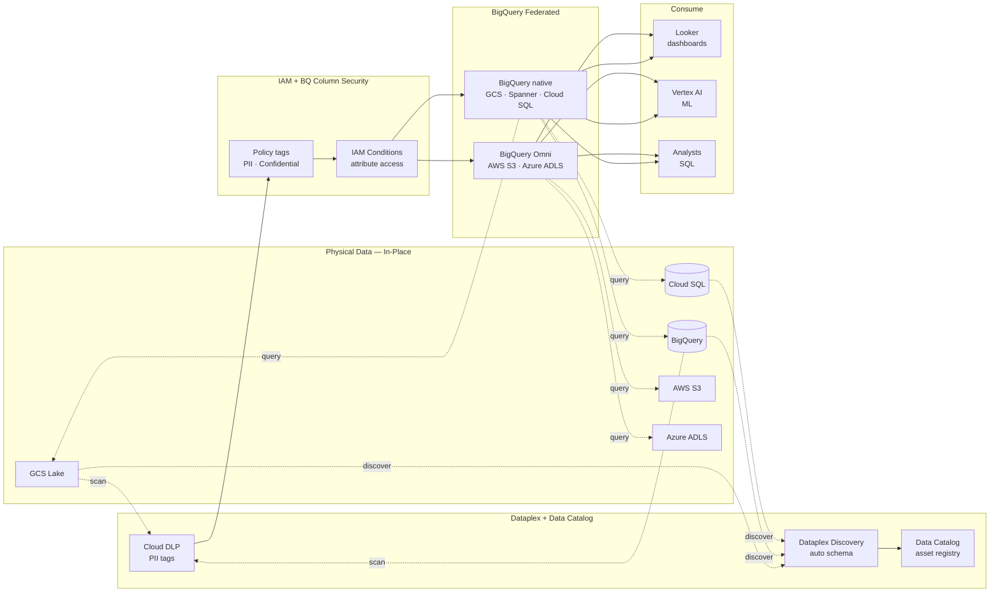
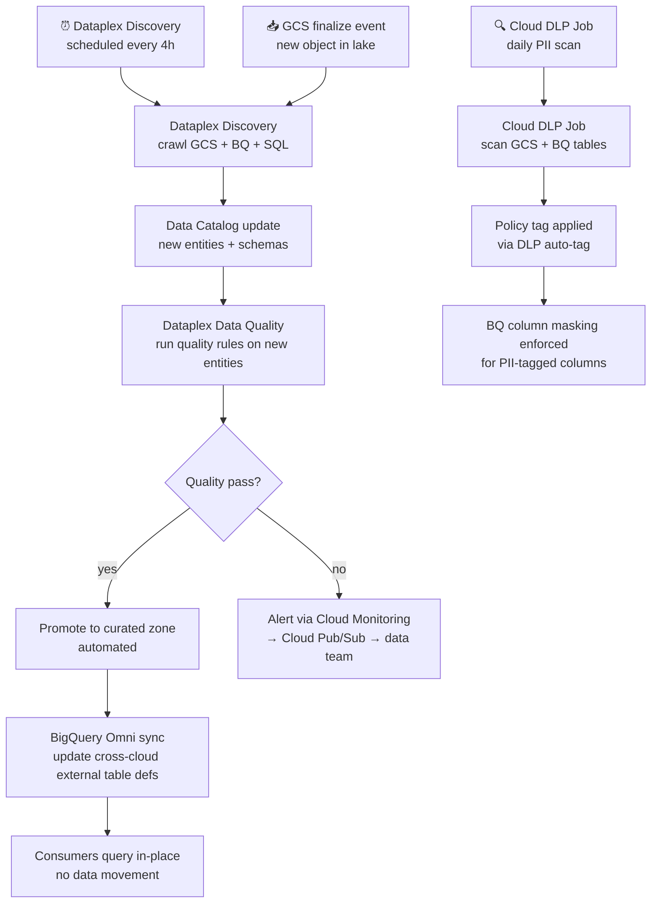

# 6.3 — Data Fabric · GCP Fully Managed

**Stack:** Dataplex · Google Data Catalog · BigQuery Omni · Cloud DLP · Chronicle SIEM
**Processing:** Federated Query · No Data Movement · Active Metadata · Cross-Cloud Analytics
**Buy vs Build:** Buy (fully managed GCP-native fabric)

---

## Architecture Overview



---

## Data Flow



---

## Catalog Structure

```
Dataplex Lake: enterprise-data-fabric
├── Zone: raw (raw data zone)
│   ├── GCS bucket: gs://raw-data-lake/
│   │   ├── entity: clickstream (auto-discovered · Parquet)
│   │   └── entity: iot_events (auto-discovered · Avro)
│   └── BigQuery dataset: raw_external
│       └── external tables → GCS in-place
│
├── Zone: curated (curated data zone)
│   ├── GCS bucket: gs://curated-data-lake/
│   │   └── entity: customer_dim (Iceberg)
│   └── BigQuery dataset: curated
│       └── tables → BQ native or external Iceberg
│
└── Zone: trusted (high-quality governed zone)
    └── BigQuery dataset: gold
        └── tables → aggregated · BI-ready

Cross-Cloud (BigQuery Omni)
  AWS region: aws-us-east-1
    external table: s3://partner-data/transactions/ → query in-place
  Azure region: azure-eastus2
    external table: adls://collab-data/profiles/   → query in-place

Cloud DLP tags propagate from raw → curated → trusted zones.
```

---

## Security Model

```
┌──────────────────────────────────────────────────────────────────┐
│  Google IAM + BigQuery Column Security + VPC Service Controls    │
│                                                                  │
│  Google Identity / Group     Access Level     Scope              │
│  ──────────────────────────  ─────────────    ───────────────── │
│  data-engineers@             dataplex.editor  all lakes + zones  │
│  bi-analysts@                bigquery.dataViewer  curated + gold │
│  data-scientists@            bigquery.dataViewer  raw + curated  │
│  vertex-ai-sa@               storage.objectViewer  GCS zones     │
│  omni-query-sa@              bigquery.jobUser  cross-cloud query  │
│  audit-compliance@           dataplex.viewer  all + DLP findings │
│                                                                  │
│  BigQuery policy tags  → PII / PHI / PCI columns masked          │
│  IAM Conditions        → restrict by resource tag (zone)         │
│  VPC Service Controls  → GCS + BQ + Spanner in one perimeter     │
│  CMEK                  → Cloud KMS for GCS, BQ, Spanner          │
│  Dataplex data quality → reject assets failing quality rules     │
└──────────────────────────────────────────────────────────────────┘
```

---

## Orchestration



---

## Component Map

| Component | GCP Service | Notes |
|-----------|------------|-------|
| Data Management | Dataplex | Unified data lake management: zones, quality, discovery, lineage |
| Technical Catalog | Google Data Catalog (within Dataplex) | Auto-discover GCS, BigQuery, Spanner, Cloud SQL assets |
| Data Quality | Dataplex Data Quality | Rule-based quality checks; auto-reject bad data from promotion |
| PII Detection | Cloud DLP API | 100+ detectors; auto-tag BigQuery columns + GCS objects |
| Federated Query | BigQuery native | External tables over GCS Parquet/Iceberg; Spanner federated joins |
| Cross-Cloud Query | BigQuery Omni | Query AWS S3 and Azure ADLS from BigQuery — no data copy |
| BI Access | Looker / Looker Studio | LookML semantic layer on BigQuery; real-time + SPICE |
| ML Access | Vertex AI Pipelines | Read BigQuery or GCS datasets; Vertex Feature Store |
| Access Control | Google IAM + BigQuery Column Security | Policy tags for column masking; IAM Conditions for attribute access |
| Network Control | VPC Service Controls | Service perimeter around GCS, BQ, Spanner, Dataplex |
| Encryption | Cloud KMS (CMEK) | All services BYOK; key rotation enforced |
| Security Monitoring | Chronicle SIEM | Ingest Cloud Audit Logs; threat detection + UEBA |
| Lineage | Dataplex Lineage API | Auto-capture from Dataflow, Spark, BigQuery jobs |

---

## Comparison vs 6.2 (Azure Data Fabric)

| Dimension | 6.3 GCP Managed | 6.2 Azure Managed |
|-----------|----------------|------------------|
| Metadata platform | Dataplex (integrated) | Microsoft Purview |
| Technical + business catalog | Unified in Dataplex | Unified in Purview |
| Cross-cloud query | BigQuery Omni (AWS + Azure) | Purview + Synapse (limited) |
| Zero-ETL operational | BQ federated Spanner | Synapse Link (Cosmos + SQL) |
| Data quality | Dataplex Data Quality built-in | Purview Data Quality (preview) |
| PII classification | Cloud DLP (100+ detectors) | Purview DLP |
| Access control | IAM Conditions + BQ policy tags | Purview Data Policy + RBAC |
| BI | Looker / Looker Studio | Power BI DirectLake |

---

## When to Choose This Implementation

✅ GCP is primary cloud; BigQuery is central analytical engine
✅ Cross-cloud query needed against AWS S3 or Azure ADLS (BigQuery Omni)
✅ Dataplex already manages data zones and quality rules
✅ Cloud DLP required for automated PII classification at scale
✅ Chronicle SIEM for unified security + data access monitoring

❌ Microsoft ecosystem deeply entrenched → use 6.2
❌ On-prem data residency critical → use 6.6 or 6.7
❌ Full OSS portability required → use 6.5
