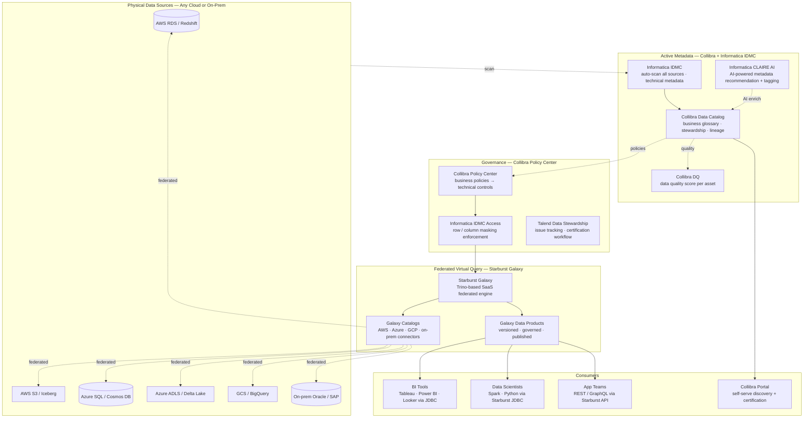
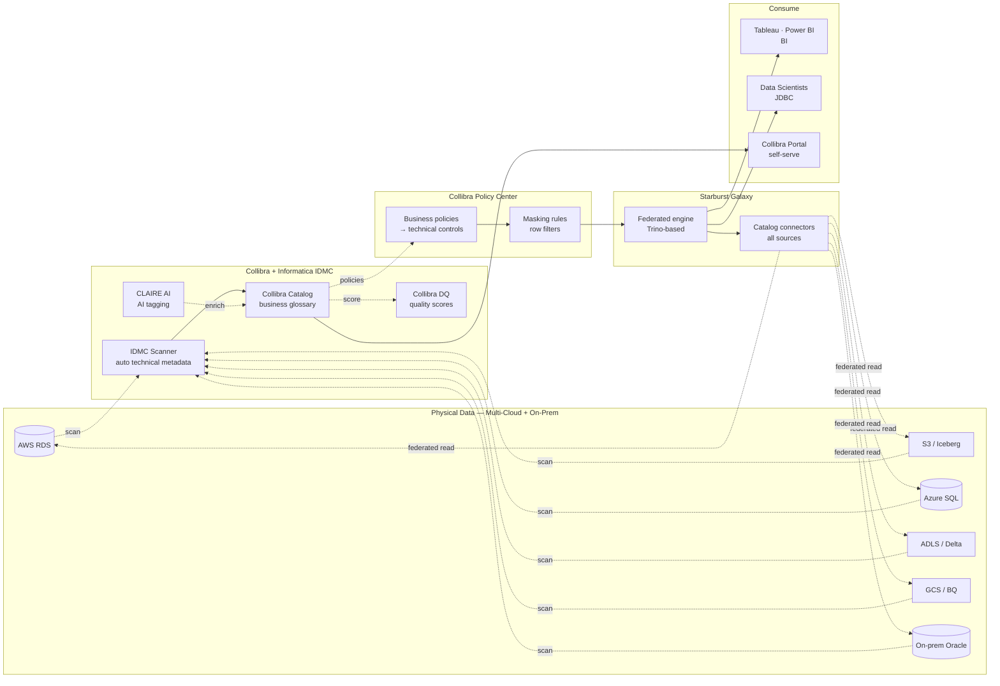
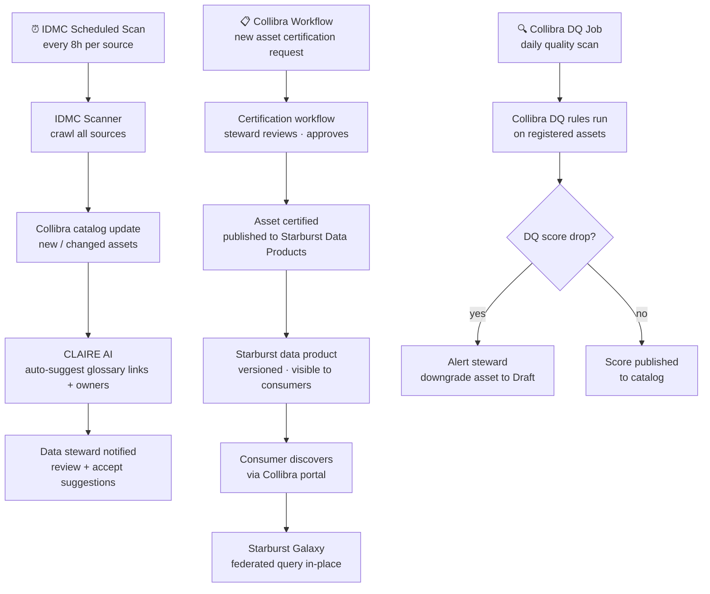

# 6.4 — Data Fabric · Multi-Cloud Fully Managed

**Stack:** Informatica IDMC · Collibra Data Intelligence Cloud · Starburst Galaxy · Talend Data Fabric
**Processing:** Federated Query · No Data Movement · Active Metadata · Cross-Cloud Governance
**Buy vs Build:** Buy (fully managed SaaS across AWS / Azure / GCP)

---

## Architecture Overview



---

## Data Flow



---

## Catalog Structure

```
Collibra Data Intelligence Cloud
├── Domain: Enterprise Data Catalog
│   ├── Business Glossary
│   │   ├── Term: Customer       → certified · owner: CRM
│   │   ├── Term: Transaction    → certified · owner: Finance
│   │   └── Term: Product        → draft · owner: Commerce
│   │
│   ├── Data Domain: Finance
│   │   ├── Data Set: Customer 360
│   │   │   ├── Asset: customers (AWS RDS)      → DQ score: 97%
│   │   │   └── Asset: transactions (S3 Iceberg) → DQ score: 99%
│   │   └── Data Set: GL Reporting
│   │       └── Asset: gl_entries (Oracle on-prem) → DQ score: 94%
│   │
│   └── Data Domain: Operations
│       └── Data Set: Inventory
│           ├── Asset: inventory (Azure SQL)     → DQ score: 91%
│           └── Asset: warehouse (ADLS Delta)    → DQ score: 95%

Informatica IDMC Technical Catalog
  Source: AWS RDS (prod-rds-cluster)    → 148 tables scanned
  Source: S3 (company-lake-prod)        → 2,400 objects
  Source: Azure SQL (prod-sql-01)       → 89 tables scanned
  Source: Oracle on-prem (erp-oracle)   → 312 tables scanned

All assets are virtual — Starburst Galaxy queries in-place.
No data is physically copied to the catalog layer.
```

---

## Security Model

```
┌──────────────────────────────────────────────────────────────────┐
│  Collibra Policy Center + Informatica IDMC + Starburst RBAC      │
│                                                                  │
│  Principal             Access Level     Scope                    │
│  ─────────────────── ─ ─────────────    ──────────────────────  │
│  data-steward          manage           Collibra certified assets │
│  data-engineer         SELECT + write   all Starburst catalogs   │
│  bi-analyst            SELECT (masked)  certified data products  │
│  data-scientist        SELECT           raw + curated domains    │
│  compliance-officer    SELECT + audit   all + DQ + policy view   │
│  app-service-sa        SELECT           approved data products   │
│                                                                  │
│  Collibra policies  → business rules → Informatica masking rules │
│  IDMC masking       → column-level dynamic masking at query time │
│  Starburst RBAC     → catalog-level + table + column grants      │
│  Row filters        → Starburst row-level security per role      │
│  Audit              → Collibra audit + Starburst query log       │
│  SSO                → Okta / Entra ID via SAML/OIDC              │
└──────────────────────────────────────────────────────────────────┘
```

---

## Orchestration



---

## Component Map

| Component | Tool / Service | Notes |
|-----------|---------------|-------|
| Data Integration | Informatica IDMC | Cloud-native; 500+ connectors; AI-powered CLAIRE engine |
| Business Catalog | Collibra Data Intelligence Cloud | Business glossary · data products · stewardship workflows |
| Technical Catalog | Informatica IDMC Catalog | Auto-scan technical metadata from all sources |
| Data Quality | Collibra DQ (Owl Analytics) | Rule-based DQ scoring; anomaly detection |
| AI Metadata | Informatica CLAIRE | Auto-suggest lineage, owners, glossary links using ML |
| Data Stewardship | Talend Data Stewardship | Issue management · certification · correction workflows |
| Federated Query | Starburst Galaxy | Managed Trino SaaS; 50+ connectors; runs on customer VPC |
| Data Products | Starburst Galaxy Data Products | Versioned, governed, published views over federated data |
| BI Access | Tableau / Power BI / Looker | JDBC/ODBC to Starburst Galaxy |
| ML Access | Spark / Python | Starburst JDBC for bulk reads in training pipelines |
| Policy Enforcement | Collibra Policy Center | Business policies translated to IDMC masking + Starburst RBAC |
| Audit | Collibra Audit + Starburst logs | All access events; stewardship decisions tracked |
| Identity | Okta / Entra ID | SSO via SAML/OIDC; group-based role assignment |

---

## Comparison vs 6.5 (Multi-Cloud OSS)

| Dimension | 6.4 Multi-Cloud Managed | 6.5 Multi-Cloud OSS |
|-----------|------------------------|---------------------|
| Business catalog | Collibra (SaaS) | OpenMetadata (self-managed) |
| Technical catalog | Informatica IDMC (SaaS) | Apache Atlas (self-managed) |
| AI metadata | CLAIRE AI (built-in) | None out-of-box |
| Federated query | Starburst Galaxy (SaaS) | Trino (self-managed) |
| Data quality | Collibra DQ (integrated) | Custom rules via dbt |
| Policy enforcement | Collibra → IDMC (automated) | Ranger (manual config) |
| Ops overhead | Very low (all SaaS) | High (K8s + self-managed) |
| Vendor lock-in | High (Collibra + Informatica) | None |
| Cost at scale | High (per-user licensing) | Infrastructure only |

---

## When to Choose This Implementation

✅ Multi-cloud data spanning AWS + Azure + GCP + on-prem
✅ Formal data governance program with stewardship workflows required
✅ AI-powered metadata management (CLAIRE) to scale catalog curation
✅ Executive-level business catalog needed (Collibra data products)
✅ Minimal platform engineering team — all SaaS, no K8s

❌ Cost sensitivity → use 6.5 (OSS)
❌ Single cloud only → use 6.1 / 6.2 / 6.3 (cloud-native)
❌ On-prem only, no SaaS → use 6.7 (Hybrid OSS Self-Hosted)
