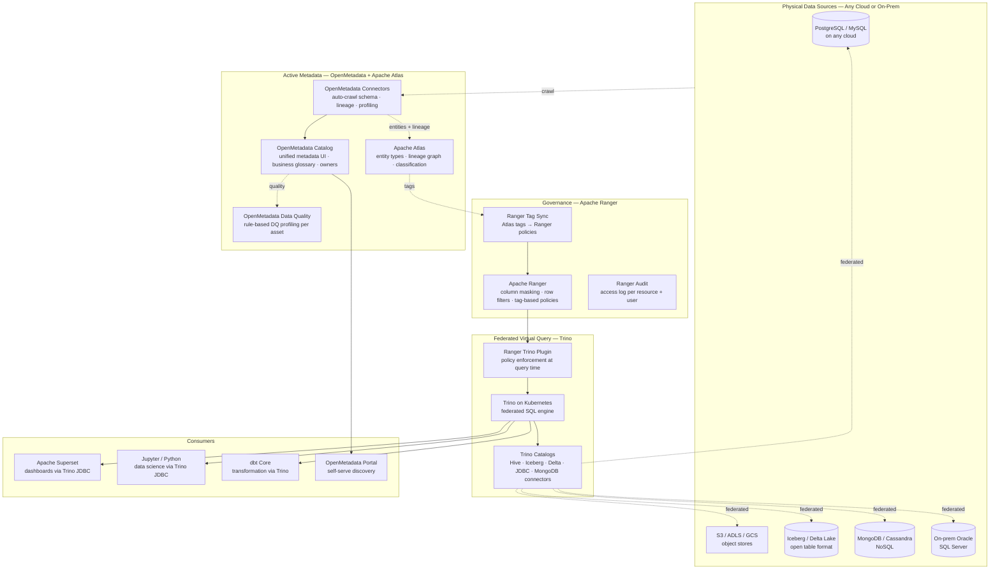
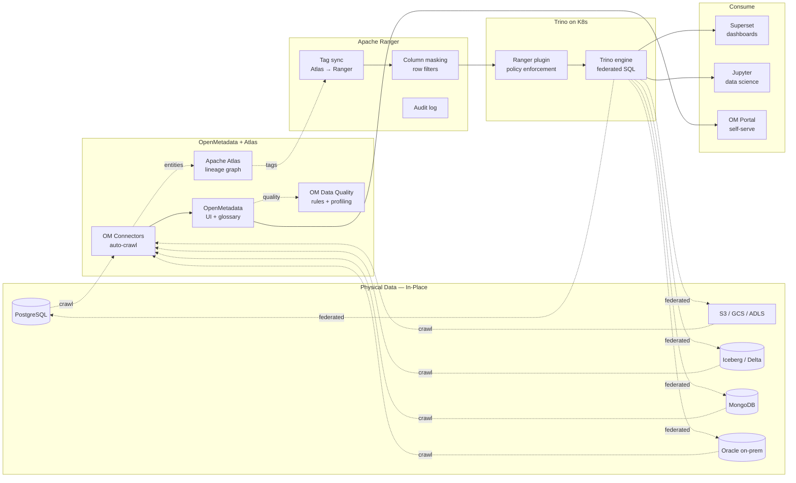
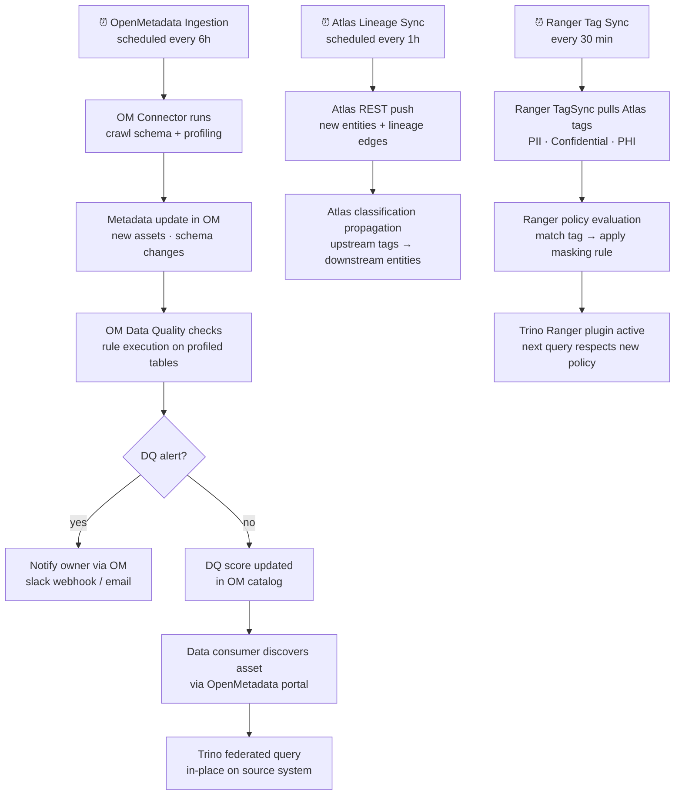

# 6.5 — Data Fabric · Multi-Cloud OSS Portable

**Stack:** Apache Atlas · OpenMetadata · Apache Ranger · Trino · Apache Superset
**Processing:** Federated Query · No Data Movement · Active Metadata · Full OSS Portability
**Buy vs Build:** Build (fully portable OSS — runs on any cloud or on-prem K8s)

---

## Architecture Overview



---

## Data Flow



---

## Catalog Structure

```
OpenMetadata — Unified Metadata Platform
├── Services
│   ├── DatabaseService: postgres-prod       (PostgreSQL)
│   ├── DatabaseService: oracle-erp          (Oracle on-prem)
│   ├── StorageService: s3-data-lake         (AWS S3)
│   ├── StorageService: gcs-data-lake        (GCP GCS)
│   └── DashboardService: superset-prod      (Apache Superset)
│
├── Domains
│   ├── Finance
│   │   ├── Data Product: customer-360
│   │   │   ├── Table: postgres-prod.finance.customers  → DQ: 98%
│   │   │   └── Table: oracle-erp.fin.gl_entries        → DQ: 95%
│   │   └── Data Product: transactions
│   │       └── Topic: kafka.finance.transactions       → DQ: 99%
│   └── Operations
│       └── Data Product: inventory
│           └── Table: postgres-prod.ops.inventory      → DQ: 91%
│
└── Glossary
    ├── Term: Customer  → linked to 14 assets
    └── Term: Order     → linked to 9 assets

Apache Atlas — Lineage + Classification
  Entity types: hive_table · rdbms_table · kafka_topic · s3_object
  Classifications: PII · PHI · PCI · Confidential · Internal
  Lineage: source entity → process → target entity (auto-captured)

All assets are virtual — Trino queries in-place, no data copies.
```

---

## Security Model

```
┌──────────────────────────────────────────────────────────────────┐
│  Apache Ranger + OpenMetadata RBAC + Trino ACLs                  │
│                                                                  │
│  Principal             Access Level     Scope                    │
│  ─────────────────── ─ ─────────────    ──────────────────────  │
│  data-engineer         SELECT + DDL     all Trino catalogs       │
│  bi-analyst            SELECT (masked)  certified data products  │
│  data-scientist        SELECT           raw + curated catalogs   │
│  dbt-service-sa        SELECT + CREATE  curated + gold schemas   │
│  om-crawler-sa         SELECT (meta)    schema crawl only        │
│  compliance-sa         SELECT           Ranger audit + Atlas     │
│                                                                  │
│  Ranger tag policies  → PII tag → mask SSN, email, phone cols   │
│  Ranger row filter    → restrict by country / department attr    │
│  Trino system RBAC    → catalog · schema · table grants         │
│  OpenMetadata RBAC    → viewer / editor / owner per domain       │
│  Atlas REST auth      → Kerberos / basic / LDAP                  │
│  TLS                  → Trino coordinator + worker TLS           │
│  Secrets              → HashiCorp Vault for connector creds      │
└──────────────────────────────────────────────────────────────────┘
```

---

## Orchestration



---

## Component Map

| Component | Tool / Service | Notes |
|-----------|---------------|-------|
| Unified Metadata | OpenMetadata | Modern OSS metadata platform; REST API; 50+ connectors; data quality |
| Lineage + Classification | Apache Atlas | Entity graph; auto-classification; tag propagation; Atlas REST API |
| Access Control | Apache Ranger | Tag-based + resource-based policies; column masking; row filters |
| Tag Sync | Ranger TagSync | Pulls classifications from Atlas → applies as Ranger tag policies |
| Federated Query | Trino on Kubernetes | Trino Kubernetes Operator; supports Hive, Iceberg, Delta, JDBC, MongoDB |
| Iceberg Catalog | Project Nessie / Hive Metastore | REST catalog for Iceberg; shared by Trino + Spark |
| BI Layer | Apache Superset | Trino JDBC connection; community dashboards |
| Transformation | dbt Core | Reads via Trino; pushes lineage to OpenMetadata |
| Data Profiling | OpenMetadata profiler | Column-level stats; completeness; uniqueness; distribution |
| Secrets Management | HashiCorp Vault | Dynamic secrets; connector credentials injected via K8s CSI |
| Identity | LDAP / Keycloak | SSO via OpenID Connect; Ranger LDAP group sync |
| Monitoring | Prometheus + Grafana | Trino cluster metrics; OM ingestion job status |
| Audit | Ranger Audit → Elasticsearch | Query-level audit trail; searchable via Kibana |

---

## Comparison vs 6.4 (Multi-Cloud Managed)

| Dimension | 6.5 Multi-Cloud OSS | 6.4 Multi-Cloud Managed |
|-----------|--------------------|-----------------------|
| Business catalog | OpenMetadata (OSS) | Collibra (SaaS) |
| Technical catalog | Apache Atlas (OSS) | Informatica IDMC (SaaS) |
| AI metadata | None built-in | CLAIRE AI (Informatica) |
| Federated query | Trino (self-managed) | Starburst Galaxy (SaaS) |
| Data quality | OpenMetadata profiler | Collibra DQ (Owl) |
| Policy enforcement | Ranger (manual config) | Collibra → IDMC (automated) |
| Ops overhead | High (K8s + 4 tools) | Very low (all SaaS) |
| Vendor lock-in | None | High |
| Cost at scale | Infrastructure only | High per-user licensing |

---

## When to Choose This Implementation

✅ Maximum portability — must run on any cloud or on-prem
✅ Zero vendor lock-in (no Collibra, Informatica, Starburst licensing)
✅ Strong platform engineering team familiar with K8s + OSS stack
✅ Cost optimization at large scale justifies ops investment
✅ Existing Apache Atlas or Ranger investment to build on

❌ Small platform team → use 6.4 (all SaaS, low ops)
❌ AI-powered metadata curation needed → use 6.4 (CLAIRE AI)
❌ On-prem only without K8s → use 6.7 (Hybrid OSS Self-Hosted)
