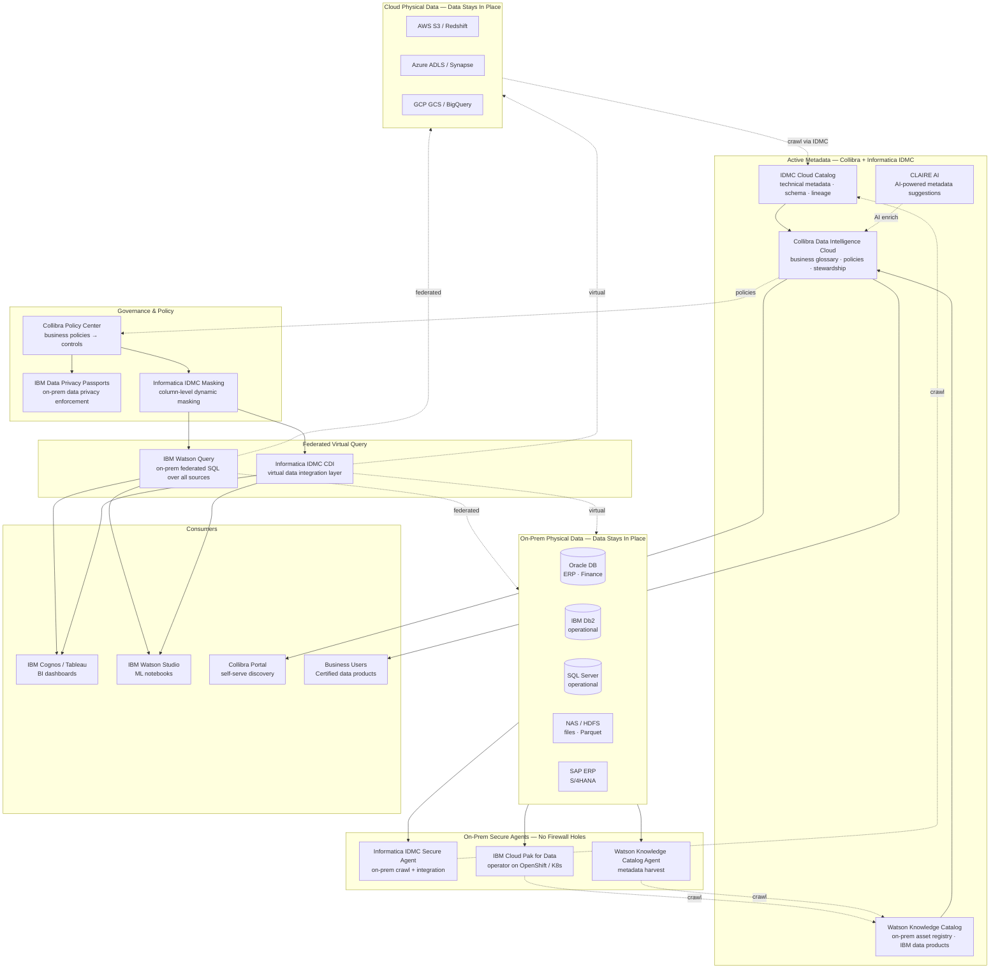
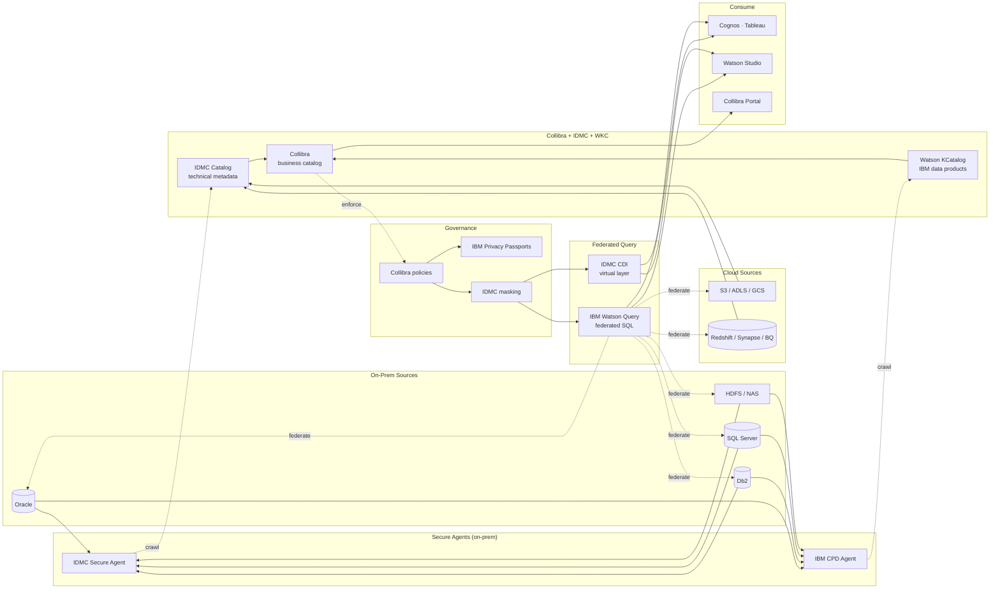
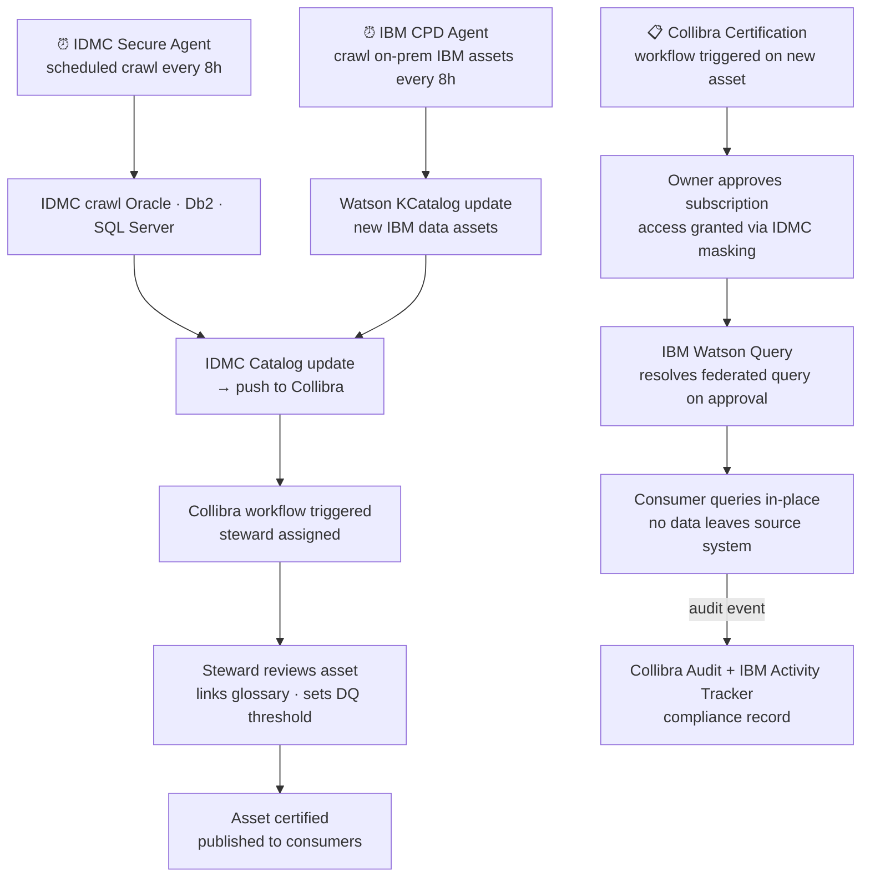

# 6.6 — Data Fabric · Hybrid Fully Managed (On-Prem + Cloud)

**Stack:** Informatica IDMC · Collibra Data Intelligence Cloud · IBM Cloud Pak for Data · Watson Knowledge Catalog
**Processing:** Federated Query · No Data Movement · Active Metadata · On-Prem + Cloud Unified Governance
**Buy vs Build:** Buy (managed SaaS control plane + on-prem compute agents)

---

## Architecture Overview



---

## Data Flow



---

## Catalog Structure

```
Collibra Data Intelligence Cloud (SaaS control plane)
├── Domain: Finance (on-prem primary)
│   ├── Data Product: General Ledger
│   │   ├── Asset: Oracle.fin.gl_accounts     → certified · DQ: 96%
│   │   └── Asset: Db2.fin.journal_entries    → certified · DQ: 94%
│   └── Data Product: Customer Master
│       └── Asset: SQL Server.crm.customers   → certified · DQ: 98%
│
├── Domain: Supply Chain (hybrid)
│   ├── Data Product: Inventory
│   │   ├── Asset: SAP.MM.inventory           → draft · DQ: 88%
│   │   └── Asset: S3.supply.warehouse_snap   → certified · DQ: 95%
│   └── Data Product: Orders
│       └── Asset: Oracle.scm.order_lines     → certified · DQ: 97%
│
└── Domain: Analytics (cloud)
    └── Data Product: Executive Reporting
        ├── Asset: Redshift.gold.financials    → certified
        └── Asset: BigQuery.gold.sales         → certified

IBM Watson Knowledge Catalog (on-prem)
  Namespace: enterprise-data
    Catalog: Finance Assets          → 312 assets · governed
    Catalog: Operations Assets       → 189 assets · governed

All assets virtual — Watson Query + IDMC CDI resolve at query time.
Secure Agents relay metadata and queries without opening inbound ports.
```

---

## Security Model

```
┌──────────────────────────────────────────────────────────────────┐
│  Collibra Policy + IBM Data Privacy Passports + IDMC Masking     │
│                                                                  │
│  Principal             Access Level     Scope                    │
│  ─────────────────── ─ ─────────────    ──────────────────────  │
│  data-steward          manage           all Collibra domains     │
│  data-engineer         SELECT + write   on-prem + cloud sources  │
│  bi-analyst            SELECT (masked)  certified data products  │
│  data-scientist        SELECT           approved domains         │
│  compliance-officer    SELECT + audit   all + Privacy Passport   │
│  ibm-cpd-sa            SELECT           Watson Query + Studio    │
│                                                                  │
│  IDMC masking      → column-level dynamic masking on all sources │
│  Privacy Passports → on-prem policy enforcement (no cloud exit)  │
│  Collibra policies → steward-approved access before publish      │
│  Secure Agent      → TLS tunnel outbound only (no inbound ports) │
│  IBM CPD auth      → LDAP / Kerberos / SAML for on-prem users   │
│  Network           → MPLS / VPN between on-prem and cloud fabric │
└──────────────────────────────────────────────────────────────────┘
```

---

## Orchestration



---

## Component Map

| Component | Tool / Service | Notes |
|-----------|---------------|-------|
| Integration Engine | Informatica IDMC (Cloud Data Integration) | Secure Agents for on-prem; 500+ connectors; no inbound firewall |
| Business Catalog | Collibra Data Intelligence Cloud | Business glossary · stewardship · certification · policy center |
| On-Prem Catalog | IBM Watson Knowledge Catalog | IBM data products; integrates with Db2, Cognos, Watson Studio |
| AI Metadata | Informatica CLAIRE | Auto-suggest lineage, owners, glossary terms via ML |
| On-Prem Compute | IBM Cloud Pak for Data (OpenShift) | Watson Studio · Watson Query · WKC on on-prem K8s |
| Federated Query | IBM Watson Query | Federated SQL over IBM Db2, Oracle, S3, Netezza, Kafka |
| Virtual Integration | Informatica IDMC CDI | Virtual data integration; no physical movement |
| Privacy Enforcement | IBM Data Privacy Passports | On-prem policy enforcement; data remains sovereign |
| Column Masking | Informatica IDMC dynamic masking | Column-level masking based on Collibra sensitivity policies |
| BI Access | IBM Cognos Analytics / Tableau | Cognos native on CPD; Tableau via JDBC to Watson Query |
| ML Access | IBM Watson Studio | Notebooks + AutoML; reads via Watson Query |
| Identity | LDAP / Kerberos (on-prem) · Entra ID (cloud) | Federated SSO via SAML |
| Network | IPSec VPN / MPLS | Secure Agent outbound only; no inbound ports on on-prem |
| Audit | IBM Activity Tracker + Collibra Audit | All data access events; compliance reporting |

---

## Comparison vs 6.7 (Hybrid OSS Self-Hosted)

| Dimension | 6.6 Hybrid Managed | 6.7 Hybrid OSS Self-Hosted |
|-----------|-------------------|---------------------------|
| Business catalog | Collibra (SaaS) | DataHub (self-managed) |
| Technical catalog | Informatica IDMC (SaaS) | Apache Atlas (self-managed) |
| On-prem catalog | IBM Watson KCatalog | Apache Atlas + Ranger |
| Federated query | IBM Watson Query | Trino on K8s |
| Privacy enforcement | IBM Privacy Passports | Apache Ranger |
| On-prem compute | IBM Cloud Pak for Data | K8s + all OSS |
| Ops overhead | Low (agents only on-prem) | High (full K8s stack) |
| IBM ecosystem | Deep integration | Not applicable |
| Vendor lock-in | High (Collibra + IBM) | None |

---

## When to Choose This Implementation

✅ Existing IBM infrastructure (Db2, Cognos, Watson Studio, OpenShift)
✅ Strict data residency — data never leaves on-prem; only metadata to cloud SaaS
✅ Formal data governance program with Collibra already licensed
✅ Secure Agent model required — no inbound firewall changes
✅ Hybrid workforce: on-prem analysts + cloud data scientists

❌ No IBM investment → use 6.4 (Informatica + Collibra + Starburst)
❌ Full OSS preference → use 6.7
❌ Cloud-only data → use 6.4 or 6.1/6.2/6.3
