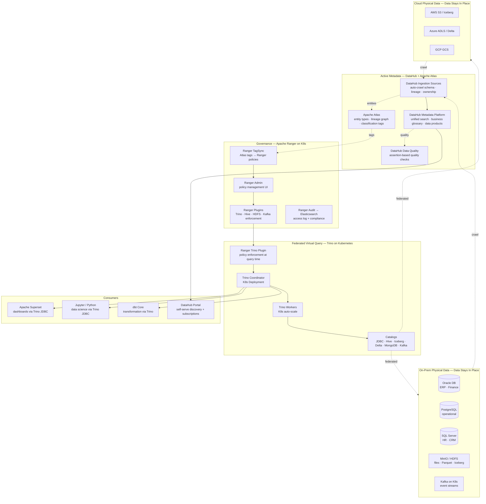
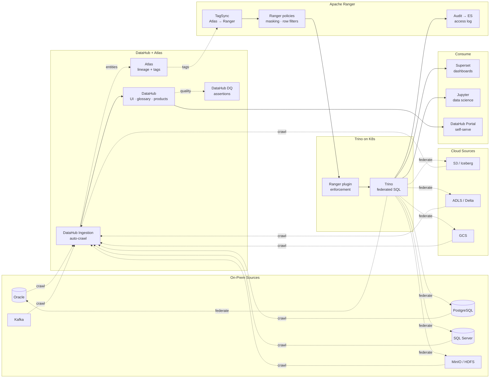
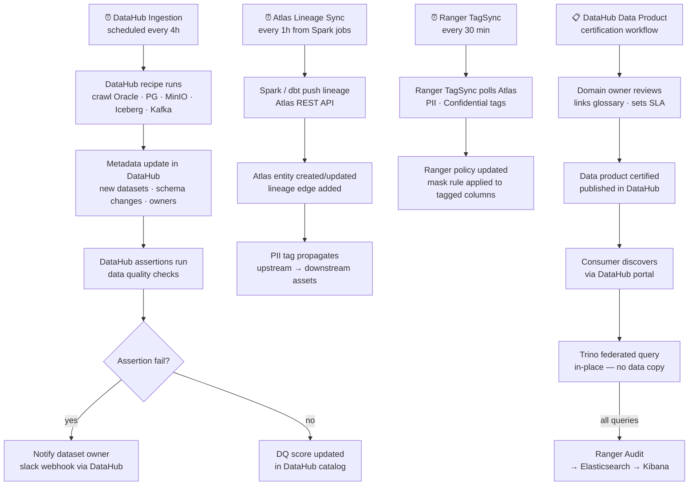

# 6.7 — Data Fabric · Hybrid OSS Self-Hosted (On-Prem + Cloud)

**Stack:** Apache Atlas · DataHub · Apache Ranger · Trino on Kubernetes · Apache Superset
**Processing:** Federated Query · No Data Movement · Active Metadata · Full Build
**Buy vs Build:** Full Build (self-hosted OSS — maximum control, highest ops cost)

---

## Architecture Overview



---

## Data Flow



---

## Catalog Structure

```
DataHub — Unified Metadata Platform (on-prem K8s)
├── Platforms
│   ├── oracle        → 318 datasets · 12 owners assigned
│   ├── postgresql    → 145 datasets · 8 owners assigned
│   ├── mssql         → 89 datasets  · 5 owners assigned
│   ├── minio         → 1,240 S3 paths · partitioned assets
│   ├── iceberg       → 380 tables (on S3 + ADLS)
│   └── kafka         → 64 topics · schema registry linked
│
├── Domains
│   ├── Finance
│   │   ├── Data Product: gl-reporting       → certified
│   │   └── Data Product: customer-master    → certified
│   ├── Operations
│   │   ├── Data Product: inventory-snapshot → draft
│   │   └── Data Product: order-pipeline     → certified
│   └── Analytics
│       └── Data Product: executive-kpis     → certified
│
└── Glossary
    ├── Term: Customer  → 22 assets linked
    ├── Term: Order     → 15 assets linked
    └── Term: Product   → 11 assets linked

Apache Atlas (on-prem K8s — lineage + classification)
  Entity types: rdbms_table · hive_table · kafka_topic · hdfs_path
  Classifications: PII · PHI · PCI · Confidential · Internal
  Lineage graph: Spark jobs + dbt runs auto-push entities

All assets are virtual — Trino queries in-place. No data moved.
Secure Agents pattern: Trino workers co-located on on-prem K8s.
```

---

## Security Model

```
┌──────────────────────────────────────────────────────────────────┐
│  Apache Ranger + DataHub RBAC + Trino ACLs + HashiCorp Vault     │
│                                                                  │
│  Principal             Access Level     Scope                    │
│  ─────────────────── ─ ─────────────    ──────────────────────  │
│  data-engineer         SELECT + DDL     all Trino catalogs       │
│  bi-analyst            SELECT (masked)  certified data products  │
│  data-scientist        SELECT           raw + curated catalogs   │
│  dbt-service-sa        SELECT + CREATE  curated + gold schemas   │
│  datahub-crawler-sa    SELECT (meta)    schema crawl only        │
│  atlas-admin           admin            entity types · tags      │
│  compliance-sa         SELECT + audit   Ranger audit + Elastic   │
│                                                                  │
│  Ranger tag policies → PII tag → mask SSN · email · phone       │
│  Ranger row filter   → restrict by department · country          │
│  Trino system ACLs   → catalog · schema · table grants          │
│  DataHub RBAC        → viewer / editor / owner per domain        │
│  HashiCorp Vault     → dynamic secrets for Trino JDBC connectors │
│  Network policies    → K8s NetworkPolicy: Trino → source only   │
│  mTLS                → Trino coordinator ↔ worker TLS           │
└──────────────────────────────────────────────────────────────────┘
```

---

## Orchestration



---

## Component Map

| Component | Tool / Service | Notes |
|-----------|---------------|-------|
| Unified Metadata | DataHub (LinkedIn OSS) | Modern metadata platform; REST API; 40+ ingestion sources; data products |
| Lineage + Classification | Apache Atlas | Entity graph; auto-classification; tag propagation; Ranger TagSync |
| Access Control | Apache Ranger on K8s | Tag-based + resource policies; column masking; row filters; audit |
| Ranger TagSync | Ranger TagSync daemon | Pulls Atlas classifications → creates Ranger tag policies automatically |
| Federated Query | Trino on Kubernetes (Trino Operator) | Coordinators + workers on K8s; auto-scale; 30+ catalogs |
| Iceberg Catalog | Project Nessie / Hive Metastore | REST catalog shared by Trino + Spark; git-like branching (Nessie) |
| Delta Lake Catalog | Delta Sharing / Hive Metastore | Delta table metadata for ADLS sources |
| On-Prem Storage | MinIO (S3-compatible) | Erasure coding; S3A compatible; Trino + Spark native |
| BI Layer | Apache Superset | Trino JDBC; community dashboards; LDAP auth |
| Transformation | dbt Core | Reads via Trino; emits lineage to DataHub via dbt-datahub plugin |
| Data Profiling | DataHub GMS profiler | Column stats; completeness; pushed to DataHub metadata |
| Secrets | HashiCorp Vault + K8s CSI | Dynamic secrets for Oracle/PG/SQL Server JDBC credentials |
| Identity | LDAP / Keycloak | OIDC for DataHub; Kerberos for Hadoop/Atlas; Ranger LDAP groups |
| Monitoring | Prometheus + Grafana on K8s | Trino JVM metrics; DataHub GMS health; Ranger plugin latency |
| Audit Storage | Ranger Audit → Elasticsearch | All query-level events; Kibana dashboard for compliance |

---

## Comparison vs 6.6 (Hybrid Managed)

| Dimension | 6.7 Hybrid OSS Self-Hosted | 6.6 Hybrid Managed |
|-----------|---------------------------|-------------------|
| Business catalog | DataHub (OSS) | Collibra (SaaS) |
| Technical catalog | Apache Atlas (OSS) | Informatica IDMC (SaaS) |
| On-prem catalog | Atlas + DataHub (unified) | IBM Watson Knowledge Catalog |
| Federated query | Trino on K8s | IBM Watson Query |
| Privacy enforcement | Apache Ranger | IBM Data Privacy Passports |
| On-prem infra | K8s (any) | IBM Cloud Pak for Data (OpenShift) |
| Ops overhead | Very high | Medium (agents only) |
| IBM dependency | None | Deep |
| Vendor lock-in | None | High (IBM + Collibra) |
| Cost at scale | Infrastructure only | High licensing |

---

## When to Choose This Implementation

✅ Maximum control and zero vendor lock-in
✅ Strong on-prem Kubernetes platform team
✅ Data sovereignty: all metadata and query compute stays on-prem
✅ Existing Apache Ranger / Atlas investment to build on
✅ DataHub preferred over Atlas for modern UX and data products

❌ Small platform team → use 6.6 (managed agents, SaaS control plane)
❌ IBM ecosystem is core → use 6.6
❌ No K8s experience on-prem → use 6.4 or 6.6
❌ Cloud-native primary → use 6.1 / 6.2 / 6.3
