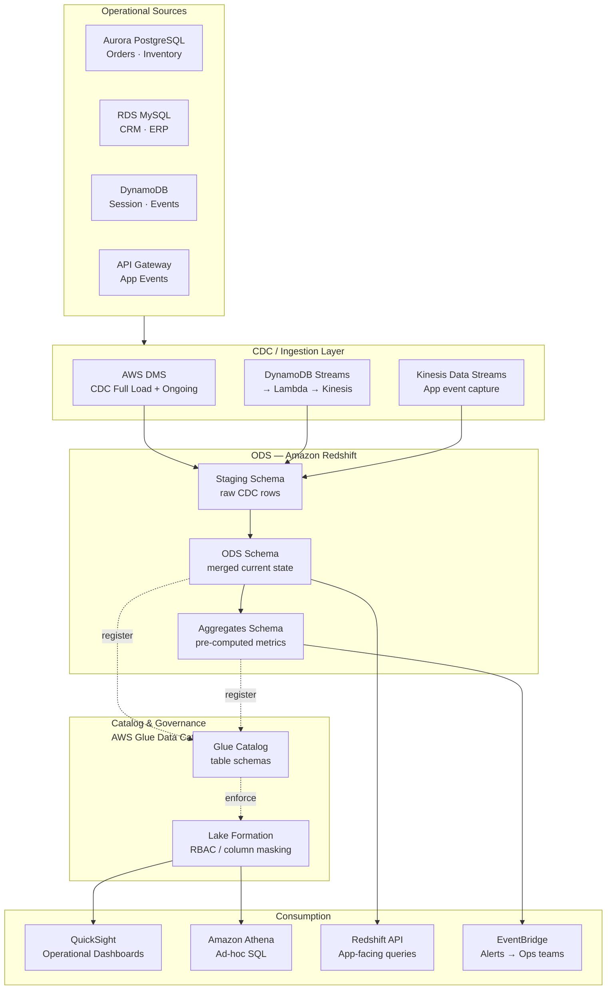
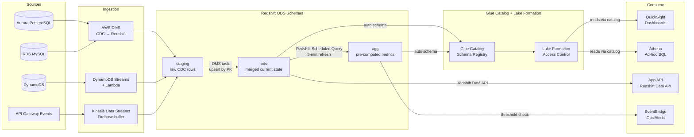
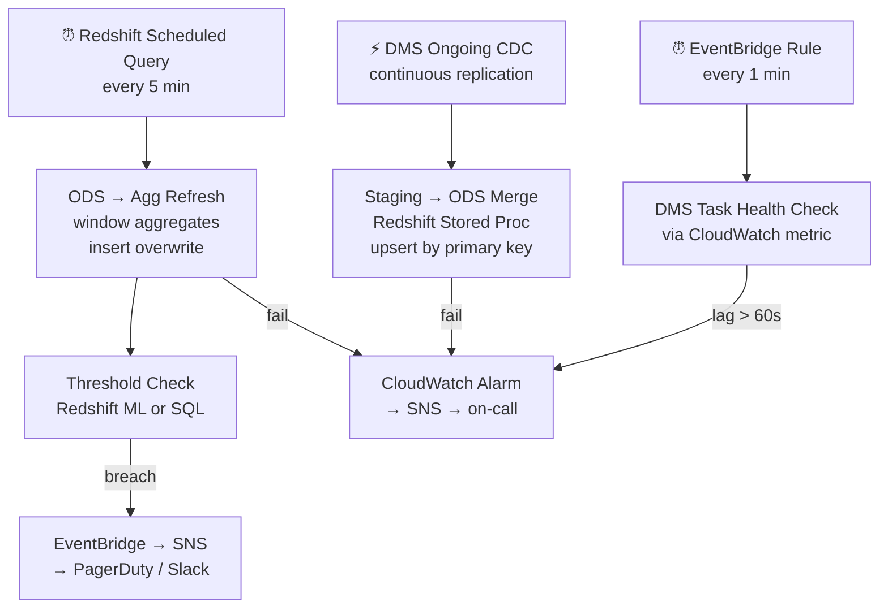

# 7.1 — Operational Analytics · AWS Fully Managed

**Stack:** Aurora · AWS DMS (CDC) · Redshift · QuickSight · Amazon EventBridge
**Processing:** Streaming / Near-Real-Time · ODS pattern
**Buy vs Build:** Buy (fully managed, no infra to operate)

---

## Architecture Overview



---

## Data Flow



---

## Zone Design

```
Redshift cluster: ops-analytics
│
├── staging (schema)
│   └── {source}_{table}          -- raw CDC rows, full + delta
│
├── ods (schema)
│   └── {domain}_{entity}         -- merged current state (UPSERT by PK)
│       Refresh: DMS ongoing CDC + stored procedure merge every 60s
│
└── agg (schema)
    └── {domain}_{metric}_{grain} -- pre-rolled hourly / 5-min aggregates
        Refresh: Redshift Scheduled Query every 5 min
```

---

## Security Model

```
┌──────────────────────────────────────────────────────┐
│          Lake Formation + Redshift RBAC               │
│                                                       │
│  IAM Role / DB User    Access Level    Schema         │
│  ──────────────────    ────────────    ──────────     │
│  dms-replication       Write only      staging        │
│  ops-engineer          Read + Write    All schemas    │
│  ops-analyst           Read only       ods · agg      │
│  app-service-account   Read only       ods (select cols) │
│  bi-consumer           Read only       agg            │
│  eventbridge-role      Invoke only     Lambda/alerts  │
│                                                       │
│  Column masking → PII (Lake Formation dynamic mask)   │
│  Row security   → region/team via Redshift RLS        │
│  Encryption     → KMS SSE on S3 + Redshift at-rest   │
└──────────────────────────────────────────────────────┘
```

---

## Orchestration



---

## Component Map

| Component | AWS Service | Notes |
|-----------|-------------|-------|
| OLTP Source | Aurora PostgreSQL / RDS MySQL | Binlog CDC enabled |
| Event Source | DynamoDB Streams | Change stream to Kinesis |
| App Events | Kinesis Data Streams + Firehose | Buffered to S3 or Redshift |
| CDC Engine | AWS DMS | Full load + ongoing; Redshift target with UPSERT |
| ODS Store | Amazon Redshift | Staging + ODS + Agg schemas; ra3 nodes |
| Merge Logic | Redshift Stored Procedures | PK-based merge every 60 s |
| Pre-aggregation | Redshift Scheduled Queries | 5-min grain; materialized views |
| Catalog | AWS Glue Data Catalog | Shared with Athena |
| Access Control | Lake Formation + Redshift RBAC | Column masking + RLS |
| BI / Dashboards | Amazon QuickSight (SPICE) | SPICE refresh every 15 min |
| Ad-hoc SQL | Amazon Athena | Federated query into Redshift ODS |
| App-facing API | Redshift Data API | Serverless HTTP query for applications |
| Alerting | EventBridge + SNS | Threshold breach → ops teams |
| Monitoring | CloudWatch + DMS metrics | Replication lag, latency SLAs |
| Encryption | AWS KMS | SSE-KMS on all storage |

---

## Comparison vs 7.2 (AWS OSS)

| Dimension | 7.1 AWS Fully Managed | 7.2 AWS OSS on Cloud |
|-----------|----------------------|----------------------|
| CDC Engine | AWS DMS | Debezium on EC2/ECS |
| Message Bus | None (DMS direct) | Kafka (MSK) |
| Stream Processor | DMS + Redshift SP | Apache Flink |
| ODS Store | Redshift | Apache Iceberg on S3 |
| Latency | ~60 s (DMS+merge) | ~5–15 s (Flink) |
| Ops Overhead | Low | High |
| Cost Model | Instance + DPU-hour | EC2 + MSK + EMR |
| SQL Flexibility | Redshift SQL | Flink SQL + Trino |
| Open Format | No | Yes (Iceberg) |

---

## When to Choose This Implementation

✅ AWS is primary cloud  
✅ Existing Aurora / RDS sources with binlog enabled  
✅ Sub-minute ODS latency is sufficient  
✅ BI team uses QuickSight  
✅ Want zero Kafka/Flink expertise overhead  

❌ Need sub-5-second latency → use 7.2 (Flink)  
❌ Need open table format (vendor-neutral) → use 7.2 (Iceberg)  
❌ Sources are non-AWS databases → use 7.8 (Debezium hybrid)
